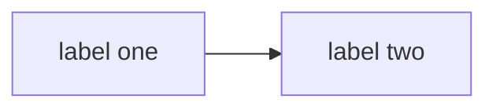

# Mermaid safe for Cursor chat

Cursor's chat Mermaid parser breaks on `%%{init: ...}%%`. Old RTW `document/*.md` diagrams still use init for other viewers — **never copy that pattern into chat or new docs**.

## Before every Mermaid block

1. No `%%{init`
2. No theme JSON
3. No prose inside the fence
4. Close the fence, then write explanation

## Allowed shape

## Forbidden

- `%%{init: { ... }}%%`
- `themeVariables` / `mainBkg` / `darkMode` in Mermaid
- ` ` inside nodes
- Explanatory text inside the fence

## Project rule

Also enforced by `.cursor/rules/mermaid-cursor-safe.mdc` (`alwaysApply: true`).
