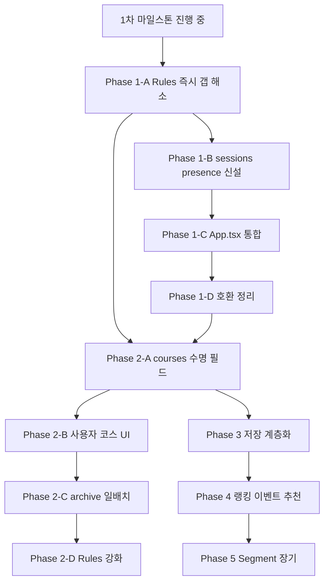

# RTW — Phase별 실행 체크리스트 (Course / Session / Presence)

| 항목 | 내용 |
|------|------|
| 문서 유형 | **execution** — 4개 architecture·product 결정의 코드 작업 단위 변환 |
| 최초 작성 | 2026-05-11 |
| 상태 | **초안** — 1차 마일스톤 직후부터 시작. Phase별 수락 기준 도달 시 본 문서 상단 갱신. |
| 연결 문서 | [RTW 마스터](260511-RTW-마스터-비전-및-종합계획.md), [코스 수명·UGC 품질 정책](260511-코스-수명-UGC-품질-정책.md), [경로 저장 계층화](260511-경로저장-계층화-Frozen-Route-Segment.md), [Firestore Rules 일반화](260511-Firestore-Rules-일반화-방안.md), [현재 단계·1차 마일스톤](260509-BOXCYCLE-현재단계-범위-스택-및-1차마일스톤.md), [app.js 분리 1차 리팩터링](260509-app-js-프론트백엔드-분리-1차리팩터링.md), [Firestore 스키마 초안](260509-Firestore-컬렉션-스키마-초안.md) |

---

## 0. 본 문서의 위치

- 본 문서는 **마스터·architecture 결정을 PR·이슈 단위로 분해한 실행 체크리스트**다.
- 각 Phase는 **수락 기준 + 영향받는 파일 + 대응 architecture 문서 §** 표 형식.
- Phase 간 의존성은 §6 의존성 그래프.
- 1차 마일스톤(현재 진행 중) 자체 범위는 [현재 단계 문서](260509-BOXCYCLE-현재단계-범위-스택-및-1차마일스톤.md)가 단일 진실. 본 Phase 1은 1차 마일스톤 **직후**에 시작한다.

---

## 1. Phase 1 — 분리 정착 (1차 마일스톤 직후 1~2주)

**목적:** Course / Session / Presence 3분할을 코드와 Rules에 정착시킨다 + Rules 1차 일반화.

### 1.1 Phase 1-A — Rules 즉시 갭 해소

| # | 작업 | 영향 파일 | 수락 기준 | 대응 § |
|---|------|-----------|-----------|--------|
| 1A-1 | 입문 허브 시드에 `presenceEnabled: true` 추가 | [`apps/web/src/lib/firestoreCourses.ts`](../apps/web/src/lib/firestoreCourses.ts) `BASIC_COURSES`, `ensureBasicCoursesSeeded` | 두 입문 허브 모두 필드 존재 | [Rules 일반화 §5.1](260511-Firestore-Rules-일반화-방안.md) |
| 1A-2 | Rules 하드코딩 제거 + `isCourseSharedPresenceAllowed()` 헬퍼 도입 | [`firestore.rules`](../firestore.rules) | 두 입문 허브 동시 주행 모두 정상 | [Rules 일반화 §2](260511-Firestore-Rules-일반화-방안.md) |
| 1A-3 | 회귀 테스트(T1·T2·T3) 통과 확인 | (Emulator 또는 콘솔) | T1·T2·T3 모두 통과 | [Rules 일반화 §6](260511-Firestore-Rules-일반화-방안.md) |

**진행 상태 (코드 반영):** 1A-1·1A-2 는 저장소에 반영됨(배포 시 `firebase deploy --only firestore`). 1A-3 은 수동 회귀.

### 1.2 Phase 1-B — sessions / presence 컬렉션 신설

| # | 작업 | 영향 파일 | 수락 기준 | 대응 § |
|---|------|-----------|-----------|--------|
| 1B-1 | `sessions/{sessionId}` 스키마 정의 + 초기 helper(생성·조회) | `apps/web/src/lib/firestoreSessions.ts`(신설) | createSession / joinSession 동작 | [Firestore 스키마 §3.6](260509-Firestore-컬렉션-스키마-초안.md) |
| 1B-2 | `presence/{sessionId}/members/{uid}` 신설 helper(`upsert`/`subscribe`/`delete`) | `apps/web/src/lib/firestorePresence.ts`(신설) — 기존 `firestoreCoursePresence.ts` 의 함수 시그니처 차용 | 멤버 join/leave snapshot 동작 | [Firestore 스키마 §3.7](260509-Firestore-컬렉션-스키마-초안.md) |
| 1B-3 | Rules: `sessions`, `presence` 매칭 추가 | [`firestore.rules`](../firestore.rules) | 본인만 자기 presence 쓰기, 세션 참여자만 읽기 | [Rules 일반화 §5.2](260511-Firestore-Rules-일반화-방안.md) |
| 1B-4 | 기존 `coursePresence` 컬렉션은 호환 유지 (Phase 1-D 까지) | — | 기존 입문 허브 동행 화면 회귀 없음 | — |

### 1.3 Phase 1-C — App.tsx 통합

| # | 작업 | 영향 파일 | 수락 기준 |
|---|------|-----------|-----------|
| 1C-1 | 입문 허브 진입 시 `coursePresence` 대신 임시 `sessionId = courseId` 로 새 helper 호출(이전 단계) | [`apps/web/src/App.tsx`](../apps/web/src/App.tsx) `enterBasicHub` / `leaveBasicHub`, [`apps/web/src/components/CourseSharedPresence.tsx`](../apps/web/src/components/CourseSharedPresence.tsx) | 입문 허브 동행 동작 동일, 데이터는 `presence/` 로 기록 |
| 1C-2 | 로비 `rooms/{roomId}/members` 는 **로비 전용**으로 잔존(이름 그대로) | [`apps/web/src/components/LobbyPresence.tsx`](../apps/web/src/components/LobbyPresence.tsx) | 변경 없음 |

### 1.4 Phase 1-D — 호환 코드 정리

| # | 작업 | 영향 파일 | 수락 기준 |
|---|------|-----------|-----------|
| 1D-1 | `firestoreCoursePresence.ts` 의 호출자를 모두 `firestorePresence.ts` 로 교체 | App.tsx, CourseSharedPresence.tsx 등 | 컴파일·동작 OK |
| 1D-2 | Rules `coursePresence` 매칭 제거 + 기존 데이터 cleanup 스크립트(1회) | firestore.rules + Cloud Function 1회 | 정리 후 Rules T7 통과 |

### 1.5 Phase 1 수락 기준 (전체)

- 입문 허브 1·2 모두 동시 주행 정상.
- 새 입문 허브를 Firestore에 직접 추가(`presenceEnabled: true`)할 때 Rules 변경 없이 동작.
- `sessions` / `presence` 컬렉션이 코드·Rules 양쪽에 정착.
- 회귀 테스트 T1~T3, T8(부분) 통과.

---

## 2. Phase 2 — UGC 토대

**목적:** 사용자 코스 생성·승격·archive 기반을 도입한다(저장 계층화는 Phase 3에서).

### 2.1 Phase 2-A — `courses` 수명 필드

| # | 작업 | 영향 파일 | 수락 기준 | 대응 § |
|---|------|-----------|-----------|--------|
| 2A-1 | `CourseDoc` 타입에 수명 필드 추가 (`lifecycleStage`, `lastActivityAt`, `score`, `ownerKind`, `visibility`, `presenceEnabled`, `isInConquestCollection`, `isPinnedByOwner`, `ridesCount`, `favoritesCount`, `likesCount`, `completionRate`, `reportsCount`) | [`apps/web/src/lib/firestoreCourses.ts`](../apps/web/src/lib/firestoreCourses.ts) | 타입 정의 통과 | [수명 정책 §7](260511-코스-수명-UGC-품질-정책.md) |
| 2A-2 | 입문 허브 시드에 적절한 기본값 (`lifecycleStage: "public_approved"`, `ownerKind: "public"`, `visibility: "public"`) | 같은 파일 | 시드 후 필드 존재 | [수명 정책 §3](260511-코스-수명-UGC-품질-정책.md) |
| 2A-3 | Firestore 인덱스 추가 (예: `lifecycleStage ASC, lastActivityAt ASC`) | [`firestore.indexes.json`](../firestore.indexes.json) | 인덱스 배포 OK | — |

### 2.2 Phase 2-B — 사용자 코스 생성 UI

| # | 작업 | 영향 파일 | 수락 기준 |
|---|------|-----------|-----------|
| 2B-1 | "내 코스 저장" 버튼 → `lifecycleStage: "temporary"`, `ownerKind: "personal"` 기본값으로 코스 생성 | App.tsx + 신설 컴포넌트 | 임시 코스 생성 동작 |
| 2B-2 | 「내 코스 → 보관함」 5개 탭 UI(활성/공개/비활성/보관함/정복) | 신설 컴포넌트 | 탭 전환 동작 |
| 2B-3 | 「공개 신청」 버튼 + 게이트(최소 거리·설명 필수) | 신설 컴포넌트 | 게이트 통과 시 `public_candidate` 전이 |

### 2.3 Phase 2-C — Cloud Function `archiveStaleCourses`

| # | 작업 | 영향 파일 | 수락 기준 |
|---|------|-----------|-----------|
| 2C-1 | 일배치 함수 신설 — Guest TTL, Free 30일, Premium 90일 + 정복 컬렉션 보호 | `functions/` (신설) | 매일 03:00 KST 실행 OK |
| 2C-2 | 상태 전이 로그 `courseLifecycleEvents/{eventId}` 기록 | 같은 함수 | 로그 누적 |
| 2C-3 | 사용자 알림(이메일·앱 내) 14일 전 통지(`deleted` 단계만) | 같은 함수 | 통지 발송 |

### 2.4 Phase 2-D — Rules visibility/lifecycle 게이트

| # | 작업 | 영향 파일 | 수락 기준 |
|---|------|-----------|-----------|
| 2D-1 | `isCoursePubliclyReadable()` visibility + lifecycleStage 조건 강화 | [`firestore.rules`](../firestore.rules) | T6·T7 통과 | [Rules 일반화 §5.3](260511-Firestore-Rules-일반화-방안.md) |
| 2D-2 | `courses` write를 Cloud Function 만 가능하게 변경 (client는 생성만, 수정·삭제 금지) | 같은 파일 | 클라이언트 직접 수정 거부 |

### 2.5 Phase 2 수락 기준

- 사용자 코스 생성·임시화·보관함·복원 동작.
- Guest TTL·Free archive 일배치 자동 실행.
- 프리미엄 정복 컬렉션 보호 동작.
- Rules 회귀 테스트 T4~T7 통과.

---

## 3. Phase 3 — 저장 계층화

**목적:** 사용자 코스 geometry를 Object Storage로 분리, IndexedDB 캐시 도입.

### 3.1 Phase 3-A — encoded polyline 모듈

| # | 작업 | 영향 파일 | 수락 기준 | 대응 § |
|---|------|-----------|-----------|--------|
| 3A-1 | `polyline.ts` (encode/decode polyline6) | `apps/web/src/lib/polyline.ts`(신설) | round-trip 테스트 통과 | [저장 계층화 §2.2](260511-경로저장-계층화-Frozen-Route-Segment.md) |
| 3A-2 | 라이브러리 추가: `@mapbox/polyline` | [`apps/web/package.json`](../apps/web/package.json) | install OK | — |

### 3.2 Phase 3-B — Object Storage 연동

| # | 작업 | 영향 파일 | 수락 기준 | 대응 § |
|---|------|-----------|-----------|--------|
| 3B-1 | Object Storage 선택 결정 ([RTW 마스터 §7 Q5](260511-RTW-마스터-비전-및-종합계획.md)) | (PM 결정) | 선택 기록 |
| 3B-2 | `storageGeometry.ts` (upload/download + geometryRef 갱신) | `apps/web/src/lib/storageGeometry.ts`(신설) | 업로드 후 다운로드 round-trip OK | [저장 계층화 §2.2](260511-경로저장-계층화-Frozen-Route-Segment.md) |
| 3B-3 | 사용자 코스 생성 시 geometry → Storage, Firestore에는 `geometryRef`만 | 위 파일 + App.tsx | Firestore 문서 크기 절감 확인 |
| 3B-4 | Storage Rules 게이트 (`courses/{routeId}.visibility == "public"` 또는 본인) | (Storage rules) | 권한 회귀 테스트 통과 | [Rules 일반화 §5.4](260511-Firestore-Rules-일반화-방안.md) |

### 3.3 Phase 3-C — IndexedDB 캐시

| # | 작업 | 영향 파일 | 수락 기준 | 대응 § |
|---|------|-----------|-----------|--------|
| 3C-1 | 라이브러리 추가: `idb` | [`apps/web/package.json`](../apps/web/package.json) | install OK |
| 3C-2 | `idbCache.ts` (geometry/elevation/thumbnail 캐시) | `apps/web/src/lib/idbCache.ts`(신설) | hit/miss 동작 |
| 3C-3 | 코스 로드 시 IndexedDB → Storage 순으로 fallback | App.tsx | 헤비 유저 시퀀스 ([저장 계층화 §7](260511-경로저장-계층화-Frozen-Route-Segment.md)) 동작 |

### 3.4 Phase 3-D — Frozen Route + Lazy Rebuild

| # | 작업 | 영향 파일 | 수락 기준 |
|---|------|-----------|-----------|
| 3D-1 | "재탐색" 버튼 + Cloud Function 트리거(`routes-rebuild`) | App.tsx + functions/ | 명시 트리거 시 재탐색·캐시 갱신 |
| 3D-2 | `geometryVersion` 운영자 일괄 트리거 (CLI 또는 admin) | functions/ | major upgrade 시뮬레이션 동작 |

### 3.5 Phase 3 수락 기준

- 사용자 코스 geometry가 Firestore가 아닌 Storage에 저장.
- IndexedDB 캐시 hit율 측정 가능.
- 헤비 유저 시퀀스(매일 50km 이어 달리기) 시 Mapbox API 호출 0.

---

## 4. Phase 4 — 랭킹·이벤트·중복 추천

**목적:** UGC 생태계의 발견·경쟁 층 도입.

### 4.1 Phase 4-A — `activities`, `rankings`, `events` 컬렉션

| # | 작업 | 영향 파일 | 수락 기준 |
|---|------|-----------|-----------|
| 4A-1 | `activities` 신설 — 기존 `rides` 불변 로그 강화(샘플 분리) | [`apps/web/src/lib/firestoreRides.ts`](../apps/web/src/lib/firestoreRides.ts) → `firestoreActivities.ts` | 기존 데이터 마이그레이션 표 1행 |
| 4A-2 | `rankings/{courseId}` 집계 컬렉션 + Cloud Function trigger | functions/ | top-N 표시 |
| 4A-3 | `events/{eventId}` 컬렉션 + 기간성 가입·완주 트래킹 | functions/ + UI | 이벤트 진행 표시 |

### 4.2 Phase 4-B — 중복 추천 UI

| # | 작업 | 영향 파일 | 수락 기준 | 대응 § |
|---|------|-----------|-----------|--------|
| 4B-1 | 코스 생성 시 시작·끝 좌표 + 거리(±10%) 기준 유사 코스 검색 | App.tsx + Cloud Function | 유사 코스 추천 표시 | [수명 정책 §2.3](260511-코스-수명-UGC-품질-정책.md) |
| 4B-2 | 「기존 코스 사용」 vs 「그래도 새로 만들기」 UI | App.tsx | 사용자 선택 동작(차단 X) |

### 4.3 Phase 4 수락 기준

- 코스 랭킹 표시.
- 이벤트 가입·진행·완주 동작.
- 중복 추천 UI 노출 + 사용자 선택 자유.

---

## 5. Phase 5 — Segment 추출 (장기)

**목적:** 인기 segment를 자동 추출 + Shared Geometry로 중복 비용 감소.

| # | 작업 | 영향 파일 | 수락 기준 | 대응 § |
|---|------|-----------|-----------|--------|
| 5-1 | 인기 segment 추출 알고리즘 (운영자 검수 + 반자동) | functions/ | 알프스·한강·로마-피렌체 segment 추출 | [저장 계층화 §4·§5](260511-경로저장-계층화-Frozen-Route-Segment.md) |
| 5-2 | `segments/{segmentId}/{version}.polyline` 저장 + `route.segments` 참조 | storage + Firestore | segment 공유 동작 |
| 5-3 | shape similarity 알고리즘 (Hausdorff/Frechet) | functions/ | 중복 추천 정확도 향상 |

### 5.1 Phase 5 수락 기준

- 인기 segment의 shared geometry 동작.
- 기존 단일 blob 코스도 호환 유지.

---

## 6. Phase 의존성 그래프



**병렬 가능:**

- Phase 1-A 와 Phase 2-A 일부는 병렬 가능(Phase 2-A 의 필드 정의만 먼저).
- Phase 3 와 Phase 4 일부도 병렬 가능(Phase 3-A 폴리라인 모듈 vs Phase 4-A 컬렉션 정의).

---

## 7. 진행 추적

각 Phase 완료 시 본 문서 상단 **상태**를 갱신한다.

```text
상태 예시:
- 초안
- Phase 1 진행 중
- Phase 1 완료(2026-MM-DD)
- Phase 2 진행 중
- ...
```

각 Phase의 PR 또는 이슈 번호도 본 문서 §1~§5 표 마지막 컬럼에 추가 가능.

---

## 8. 개정 이력

| 날짜 | 내용 |
|------|------|
| 2026-05-11 | 최초 작성 — 자문 13장 + 4개 architecture 문서 결정을 5개 Phase로 분해. |
