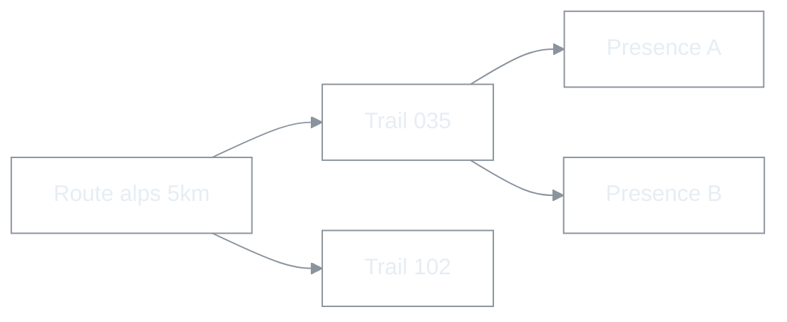

# RTW(Ride The World) — 마스터 비전 및 종합 개발 계획

| 항목 | 내용 |
|------|------|
| 문서 유형 | **product** — 서비스 비전·핵심 철학·도메인 분류·권한 체계의 **단일 진실** |
| 최초 작성 | 2026-05-11 |
| 상태 | **초안** — PM·시니어 자문 합의본. 세부 수치는 합의 후 갱신한다. |
| 연결 문서 | [Route·RTW Pro 전환 방안](260603-Route-용어-및-RTW-Pro-브랜딩-통합-전환-방안.md), [제품 용어](260517-제품-용어-Trailhead-Trail.md), [문서 지침](260509-BOXCYCLE-문서-생성-및-수정-지침.md), [현재 단계·1차 마일스톤](260509-BOXCYCLE-현재단계-범위-스택-및-1차마일스톤.md), [코스 수명·UGC 품질 정책](260511-코스-수명-UGC-품질-정책.md), [경로 저장 계층화](260511-경로저장-계층화-Frozen-Route-Segment.md), [Route·Publication](260518-Route-Publication-통합-모델-및-마이그레이션.md), [Phase별 실행 체크리스트](260511-Phase별-실행-체크리스트-Course-Session-Presence.md), [Firestore 스키마 초안](260509-Firestore-컬렉션-스키마-초안.md) |

---

## 0. 본 문서의 위치

- 본 문서는 **서비스 비전·핵심 도메인 분류·권한 체계**의 단일 진실(source of truth)이다.
- 코스 수명, 저장 계층, Rules 일반화, Phase 실행 등 **세부 결정**은 위 4개 자식 architecture·execution 문서가 단일 진실이며, 본 문서는 그 결론을 한 줄로 가리킨다(중복 기술 금지).
- **현재 단계 범위·1차 마일스톤**은 [260509-BOXCYCLE-현재단계-범위-스택-및-1차마일스톤.md](260509-BOXCYCLE-현재단계-범위-스택-및-1차마일스톤.md)가 우선한다. 본 문서는 그 다음 단계 이후를 포함하는 **장기 비전**이다.
- **명칭 규약 (2026-06-03):** 사용자·UI·신규 문서의 **공식 제품명은 RTW Pro** (`Ride The World` 제품군). **RTW Free**는 별 트랙(본 저장소 비범위). 저장소 slug·npm `boxcycle-web`·Firebase project id 등 **`BOXCYCLE` 은 엔지니어링 별칭(레거시)** — 화면·카피에 쓰지 않는다. 상세: [260603 전환 방안](260603-Route-용어-및-RTW-Pro-브랜딩-통합-전환-방안.md).
- **도메인 용어:** 신규 기획·코드·문서에서 엔티티명 **Course 사용 금지** → **Route** 단일 + official/public/intro **속성**. Firestore `courses`·`courseId` 는 레거시 경로(점진 rename).

---

## 1. 비전·정의

### 1.1 한 줄 정의

> 실내 자전거 사용자가 **실제 세계의 경로(Route)를 가상으로 주행**하며, 다른 사용자와 **함께 달리고·경쟁하고·탐험**할 수 있는 온라인 사이클 플랫폼 (**RTW Pro**).

### 1.2 단순 지도 뷰어와의 차이

다음 5요소를 결합한 **운영형 플랫폼**이다.

1. 실시간 멀티 라이딩 (presence)
2. 가상 경로 탐험 (Mapbox 기반)
3. 사용자 생성 경로 (UGC)
4. 챌린지 및 이벤트
5. 랭킹·기록·커뮤니티

### 1.3 무엇이 아닌가

- e스포츠급 속도·FTP 경쟁의 정면 경쟁자가 아니다(센서 없는 캐주얼 사용자가 코어).
- "지도를 잘 보여주는 앱"이 아니다(Route·Trail·경제·커뮤니티가 핵심 도메인).

---

## 2. 핵심 철학

### 2.1 Route / Trail / Presence **3분할**

가장 중요한 구조적 원칙. **정적 Route id ≠ Trail(라이브 판) id**. (구 문서의 Course/Session — [제품 용어](260517-제품-용어-Trailhead-Trail.md))

| 도메인 | 성격 | 예시 |
|--------|------|------|
| **Route** | 정적 콘텐츠(지도·LineString·카탈로그) | "알프스 입문 5km", "한강 Official Route" |
| **Trail** | 실시간 멀티플레이 **한 판**(같은 Route에서 여럿 가능) | "Trail 035", 입문 라이딩 그룹 |
| **Presence** | Trail·Route 허브 내부 실시간 위치·하트비트 | lat/lng, speed, updatedAt |

데이터 도메인 정의·필드 세부는 [Firestore 스키마 초안](260509-Firestore-컬렉션-스키마-초안.md), [장기 Postgres 참고](260509-아키텍쳐-DB설계.md) 가 담당한다.

### 2.2 운영형 플랫폼 구조

새 Route/Trail 추가 시 다음을 목표로 한다.

- 코드 수정 최소화
- Rules 수정 최소화
- **데이터 등록만으로** 운영 가능

→ 이를 위한 Rules 일반화는 [Firestore Rules 일반화 방안](260511-Firestore-Rules-일반화-방안.md)이 단일 진실.

### 2.3 "생성 ≠ 영구 저장"

UGC Route는 기본 **Disposable**. 활동·인기·재사용 점수에 따라 **승격(promotion)** 된 Route만 장기 보존한다.

→ 수명 단계·점수 공식·UX는 [코스 수명·UGC 품질 정책](260511-코스-수명-UGC-품질-정책.md)이 단일 진실.

### 2.4 "Personal ≠ Public"

| 영역 | 정책 |
|------|------|
| 개인 보관(정복 컬렉션) | 점수 무관 보존(프리미엄 보호) |
| 개인 기록(activities) | 중복 허용 |
| public 노출 | 품질 필터(승격 게이트) |
| 인기 추천 | curated |
| 장기 저장 | premium 우대 |

기술적으로는 중복인 geometry도 **사용자 감성적으로는 다른 Route**다. 강제 dedup ❌, 추천·공통 segment 공유 ✅.

### 2.5 "Route는 Asset이 아니라 Stream"

장거리·헤비 유저 데이터를 매번 재계산하지 않는다. **Frozen Route + Lazy Rebuild + Segment 분할**.

→ 저장 계층(Firestore/Object Storage/IndexedDB)·encoded polyline·segment·헤비 유저 시퀀스는 [경로 저장 계층화·Frozen Route·Segment](260511-경로저장-계층화-Frozen-Route-Segment.md)가 단일 진실.

---

## 3. 사용자 권한 체계

> **(2026-05-19)** tier·진입·Firestore 필드의 **단일 진실**은 [사용자 tier 및 진입 정책](260519-사용자-tier-및-진입-정책.md) 이다. 아래는 요약이며, 「비로그인」 표현은 폐기한다.

| tier | 제품 명칭 | 요약 |
|------|-----------|------|
| *(세션 없음)* | **비허용** | `user === null` — 서비스 기능 없음 |
| `anonymous` | **Guest** | Firebase 익명 인증 · 진입 문턱 최소화 |
| `registered_free` | **로그인 · 무료** | 계정 연동 + 닉네임 |
| `registered_paid` | **로그인 · 유료** | 구독 · 경로·이벤트 등 확장 권한(상세는 tier 문서) |
| `admin` | 운영 | 심사·관리 |

상세 가격·미션·배지·시즌은 (대체된) [기능 추가 계획](260509-기능-추가-계획-제품-및-아키텍처.md) 참고.  
유료 차별화 원칙(서버 자원·저장 중심): [기능 추가 계획 §7](260509-기능-추가-계획-제품-및-아키텍처.md).  
코스 TTL: [코스 수명 §2.1](260511-코스-수명-UGC-품질-정책.md).

---

## 4. 코스 분류 (Ownership × Type × Visibility)

세 축은 **독립**이며 곱집합으로 조합된다.

### 4.1 Ownership

| 값 | 의미 |
|----|------|
| `official` | 운영자 제작·관리 |
| `user` | 사용자 생성 |

### 4.2 Type

| 값 | 의미 |
|----|------|
| `intro` | 입문(온보딩 보너스 대상) |
| `public` | 일반 공개 |
| `challenge` | 기록 경쟁형 |
| `event` | 기간성 이벤트 |
| `private` | 비공개 |

### 4.3 Visibility

| 값 | 의미 |
|----|------|
| `public` | 검색·추천 노출 |
| `unlisted` | 링크로만 접근 |
| `private` | 본인만 |

### 4.4 수명 단계와의 관계

`visibility = public` 으로 가는 것은 **승격 게이트**를 통과해야 한다. 단계별 전이는 [코스 수명·UGC 품질 정책 §3](260511-코스-수명-UGC-품질-정책.md) 상태 머신을 본다.

---

## 5. 데이터 도메인 한 줄 정의

| 컬렉션 | 한 줄 역할 | 단일 진실 문서 |
|--------|------------|----------------|
| `users` | 사용자 프로필·권한 티어 | [Firestore 스키마](260509-Firestore-컬렉션-스키마-초안.md) §3.1 |
| `courses` (**legacy**, 목표 `routeCatalog`) | 정적 Route 카탈로그 + 수명 메타 | [Route·Publication](260518-Route-Publication-통합-모델-및-마이그레이션.md), [수명 정책](260511-코스-수명-UGC-품질-정책.md) |
| `trails` | 실시간 Trail(구 sessions/rooms) | [제품 용어](260517-제품-용어-Trailhead-Trail.md) |
| `presence` | 세션 내부 실시간 위치/속도/하트비트 | [Firestore 스키마](260509-Firestore-컬렉션-스키마-초안.md) §3.7 |
| `activities` | 사용자의 실제 주행 기록(불변 로그) | [Firestore 스키마](260509-Firestore-컬렉션-스키마-초안.md) §3.4 (`rides` 후속 명) |
| `rankings` | 코스 기반 경쟁 데이터 | (Phase 4) [실행 체크리스트](260511-Phase별-실행-체크리스트-Course-Session-Presence.md) Phase 4 |
| `events` | 기간성 이벤트 | (Phase 4) [실행 체크리스트](260511-Phase별-실행-체크리스트-Course-Session-Presence.md) Phase 4 |

> 명칭 주: 현재 코드는 `rides`(라이드 요약), `rooms/{roomId}/members`(로비), `coursePresence`(코스 동행 절반 분리)이다. 마이그레이션 표는 [Firestore 스키마 초안](260509-Firestore-컬렉션-스키마-초안.md) §3.6~§3.7 이관 표를 본다.

---

## 6. 비용·운영 전략(원칙)

세부 수치는 모니터링·트래픽 누적 후 결정. 본 절은 원칙만.

### 6.1 비용 핫스팟 우선순위

1. Realtime Presence 빈도 (위치 업데이트 초당 비용)
2. 장거리 경로 저장(geometry 비용 → [Storage 문서](260511-경로저장-계층화-Frozen-Route-Segment.md))
3. 대규모 세션(`maxPlayers` 정책)
4. 이미지·썸네일·GPX 업로드

### 6.2 단계별 전략

| 단계 | 전략 |
|------|------|
| 초기 | Firebase 단일 스택, 비용 모니터링 강화 |
| 중기 | Presence 최적화(샘플링 간격 조정), Session 샤딩 검토 |
| 장기 | Hybrid Backend 검토, Dedicated Realtime Server 가능성 |

장기 Postgres·PostGIS 전환 가이드는 [장기 아키텍처 참고](260509-아키텍쳐-DB설계.md), 가드레일은 [Firestore→Postgres 체크리스트](260509-Firestore-Postgres-이전-체크리스트.md)가 단일 진실.

---

## 7. Open Questions (미해결 결정 항목)

| # | 질문 | 결정 시기 |
|---|------|-----------|
| Q1 | ~~외부 노출 명칭~~ → **결정: RTW Pro** (앱 UI·문서). repo/Firebase id `boxcycle` 유지 가능 | **2026-06-03** [260603](260603-Route-용어-및-RTW-Pro-브랜딩-통합-전환-방안.md) |
| Q2 | 프리미엄 가격 모델(월정액 vs 코인 vs 하이브리드) | Phase 3 진입 전 |
| Q3 | 시즌(Season) 도입 시점 — Phase 2에 미니 시즌? Phase 4 정식? | UGC 토대 안정화 후 |
| Q4 | 게스트 임시 저장 위치(서버 vs 로컬) — 비용 vs 기기 변경 손실 트레이드오프 | Phase 2 게스트 흐름 설계 시 |
| Q5 | Object Storage 선택(Firebase Storage vs Cloudflare R2 vs S3) | Phase 3 진입 전 |
| Q6 | 중복 추천 알고리즘 깊이(시작·종료 좌표 + 거리만 vs shape similarity) | Phase 4 진입 전 |

---

## 8. Phase 매핑 (요약)

상세 수락 기준·영향 파일은 [Phase별 실행 체크리스트](260511-Phase별-실행-체크리스트-Course-Session-Presence.md)가 단일 진실.

| Phase | 한 줄 | 자문 13장 매핑 |
|-------|-------|----------------|
| Phase 1 | Route/Trail/Presence 분리 정착 + Rules 1차 일반화 | Phase 1 |
| Phase 2 | UGC 토대(수명 필드·승격 게이트·archive 배치) | Phase 1~2 |
| Phase 3 | 저장 계층화(Object Storage·IndexedDB·encoded polyline) | Phase 2 |
| Phase 4 | 랭킹·이벤트·중복 추천 | Phase 3 |
| Phase 5 | Segment 추출·Shared Geometry(장기) | Phase 4 |

---

## 9. 핵심 결론

이 프로젝트는 단순 지도 렌더링 앱이 아니라 **멀티플레이 가상 사이클 플랫폼**이다. 따라서 초기부터 다음 5개 도메인을 명확히 분리하는 것이 장기 유지보수·확장성의 핵심이다.

1. Route (정적 길·카탈로그)
2. Trail (함께 달리는 판)
3. Presence (현재 사용자 상태)
4. Activity (실제 주행 기록 — `rides`)
5. Ranking (경쟁 데이터)

> **"얼마나 많이 저장하느냐"** 가 아니라 **"어떤 Route를 살아남게 하느냐"** 가 핵심이다.

---

## 10. 개정 이력

| 날짜 | 내용 |
|------|------|
| 2026-05-11 | 최초 작성 — 자문 Q&A 5단계 결론 종합. 마스터(product) 단일 진실 확립, 4개 자식 architecture·execution 문서 분리. |
| 2026-06-03 | RTW Pro 공식명·Route 단일 엔티티·Trail 3분할 반영. Q1 결론. §2.1 Course/Session → Route/Trail. |
