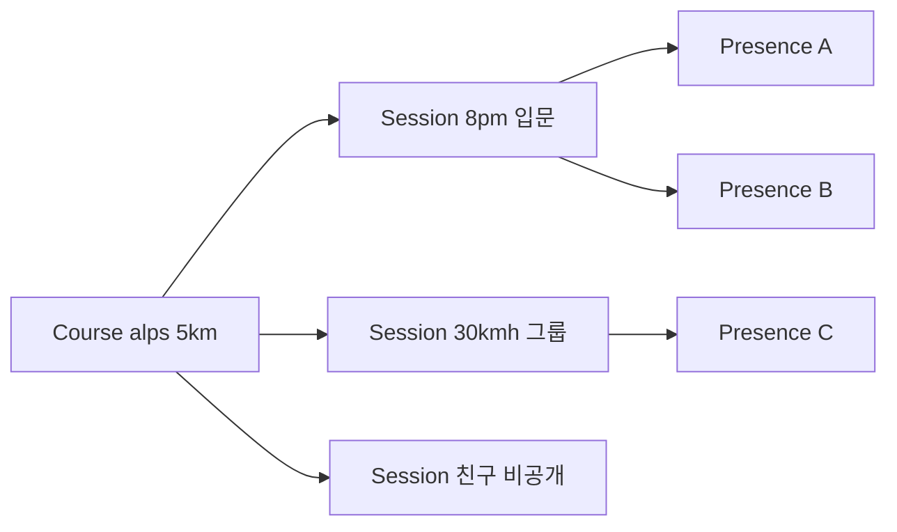

# RTW(Ride The World) — 마스터 비전 및 종합 개발 계획

| 항목 | 내용 |
|------|------|
| 문서 유형 | **product** — 서비스 비전·핵심 철학·도메인 분류·권한 체계의 **단일 진실** |
| 최초 작성 | 2026-05-11 |
| 상태 | **초안** — PM·시니어 자문 합의본. 세부 수치는 합의 후 갱신한다. |
| 연결 문서 | [문서 지침](260509-BOXCYCLE-문서-생성-및-수정-지침.md), [현재 단계·1차 마일스톤](260509-BOXCYCLE-현재단계-범위-스택-및-1차마일스톤.md), [코스 수명·UGC 품질 정책](archive/260511-코스-수명-UGC-품질-정책.md), [경로 저장 계층화·Frozen Route·Segment](archive/260511-경로저장-계층화-Frozen-Route-Segment.md), [Firestore Rules 일반화 방안](archive/260511-Firestore-Rules-일반화-방안.md), [Phase별 실행 체크리스트](archive/260511-Phase별-실행-체크리스트-Course-Session-Presence.md), [장기 Postgres 참고](archive/260509-아키텍쳐-DB설계.md), [Firestore 스키마 초안](archive/260509-Firestore-컬렉션-스키마-초안.md), [Conquest(정복) 레이어 설계](260703-Conquest-정복-레이어-설계.md) |

---

## 0. 본 문서의 위치

- 본 문서는 **서비스 비전·핵심 도메인 분류·권한 체계**의 단일 진실(source of truth)이다.
- 코스 수명, 저장 계층, Rules 일반화, Phase 실행 등 **세부 결정**은 위 4개 자식 architecture·execution 문서가 단일 진실이며, 본 문서는 그 결론을 한 줄로 가리킨다(중복 기술 금지).
- **현재 단계 범위·1차 마일스톤**은 [260509-BOXCYCLE-현재단계-범위-스택-및-1차마일스톤.md](260509-BOXCYCLE-현재단계-범위-스택-및-1차마일스톤.md)가 우선한다. 본 문서는 그 다음 단계 이후를 포함하는 **장기 비전**이다.
- **명칭 규약:** 코드·리포지토리는 `BOXCYCLE` 유지. 서비스 비전 명은 `Ride The World`(약칭 RTW). 외부 노출 명칭(앱 스토어·도메인) 결정은 §7 Open Questions로 미뤄 둔다.

---

## 1. 비전·정의

### 1.1 한 줄 정의

> 실내 자전거 사용자가 **실제 세계의 코스를 가상으로 주행**하며, 다른 사용자와 **함께 달리고·경쟁하고·탐험**할 수 있는 온라인 사이클 플랫폼.

### 1.2 단순 지도 뷰어와의 차이

다음 5요소를 결합한 **운영형 플랫폼**이다.

1. 실시간 멀티 라이딩 (presence)
2. 가상 코스 탐험 (Mapbox 기반)
3. 사용자 생성 코스 (UGC)
4. 챌린지 및 이벤트
5. 랭킹·기록·커뮤니티

### 1.3 무엇이 아닌가

- e스포츠급 속도·FTP 경쟁의 정면 경쟁자가 아니다 — 여전히 와트 경쟁이 아니다. **단, 타겟 재정의(2026-07-03):** ~~센서 없는 캐주얼 사용자가 코어~~ → **코어 = 센서(케이던스 이상) 보유 캐주얼 실내 라이더.** no-sensor(속도 슬라이더)는 체험 티어로, 정복(Conquest) 인정에 제한을 받는다([Conquest 설계 §3.2 Trust Tier](260703-Conquest-정복-레이어-설계.md)). 속도 슬라이더는 개발 편의 장치이지 제품의 코어 입력이 아니다.
- "지도를 잘 보여주는 앱"이 아니다(코스·세션·경제·커뮤니티가 핵심 도메인).
- **그래픽 충실도 경쟁자가 아니다**(2026-07-03) — Zwift·MyWhoosh(게임월드)·Rouvy·Kinomap(실사영상)의 전장은 자본 구조상 회피한다. 근거·전장 분석은 [Conquest 레이어 설계 §0](260703-Conquest-정복-레이어-설계.md).

### 1.4 핵심 판타지 — 「Ride = Claim」 (2026-07-03 개정)

> **실내에서 페달을 밟을수록, 현실 지구 위에 나의 영토가 영구히 늘어난다.**

- 영상·게임월드 기반 경쟁자는 콘텐츠 모델이 "미리 만든 것"에 묶여 **지구 전체를 제공할 수 없다**. 벡터 지도 기반인 RTW만 행성 규모를 한계비용 ~0으로 감당한다 — 이것이 유일한 구조적 해자이며, 이 해자를 게임으로 전환하는 장치가 **정복(Conquest) 레이어**다(**내 도로망**(달린 도로의 영구 축적) · **구간 챌린지**(교차로·IC~JC 최초 완주 = 개척) · 집단 페인트). *(2026-07-03 도로 전환 — 단위·근거는 [Conquest 설계 §3.1](260703-Conquest-정복-레이어-설계.md))*
- 판매 문장이 바뀐다: "경로를 만들 수 있다"(도구·창작자 1~5% 대상) → "달릴수록 가진다"(판타지·라이더 전체 대상). 경로 생성은 수단으로 내려간다.
- 세부 메커닉·데이터 모델·비용은 [Conquest 레이어 설계](260703-Conquest-정복-레이어-설계.md)가 단일 진실.

---

## 2. 핵심 철학

### 2.1 Course / Session / Presence **3분할**

가장 중요한 구조적 원칙. **`courseId != sessionId`**.

| 도메인 | 성격 | 예시 |
|--------|------|------|
| **Course** | 정적 콘텐츠(지도·경로 데이터 자체) | "알프스 입문 5km", "한강 야간 코스" |
| **Session** | 실시간 멀티플레이 공간(같은 코스에서 여럿 가능) | "오후 8시 입문 라이딩", "30km/h 그룹", "친구 비공개 라이딩" |
| **Presence** | 세션 내부의 실시간 위치·속도·하트비트 | 현재 lat/lng, speed, heading, updatedAt |

데이터 도메인 정의·필드 세부는 [Firestore 스키마 초안](archive/260509-Firestore-컬렉션-스키마-초안.md), [장기 Postgres 참고](archive/260509-아키텍쳐-DB설계.md) 가 담당한다.

### 2.2 운영형 플랫폼 구조

새 코스/세션 추가 시 다음을 목표로 한다.

- 코드 수정 최소화
- Rules 수정 최소화
- **데이터 등록만으로** 운영 가능

→ 이를 위한 Rules 일반화는 [Firestore Rules 일반화 방안](archive/260511-Firestore-Rules-일반화-방안.md)이 단일 진실.

### 2.3 "생성 ≠ 영구 저장"

UGC 코스는 기본 **Disposable**. 활동·인기·재사용 점수에 따라 **승격(promotion)** 된 코스만 장기 보존한다.

→ 수명 단계·점수 공식·UX는 [코스 수명·UGC 품질 정책](archive/260511-코스-수명-UGC-품질-정책.md)이 단일 진실.

### 2.4 "Personal ≠ Public"

| 영역 | 정책 |
|------|------|
| 개인 보관(정복 컬렉션) | 점수 무관 보존(프리미엄 보호) |
| 개인 기록(activities) | 중복 허용 |
| public 노출 | 품질 필터(승격 게이트) |
| 인기 추천 | curated |
| 장기 저장 | premium 우대 |

기술적으로는 중복인 경로도 **사용자 감성적으로는 다른 코스**다. 강제 dedup ❌, 추천·공통 segment 공유 ✅.

### 2.5 "Route는 Asset이 아니라 Stream"

장거리·헤비 유저 데이터를 매번 재계산하지 않는다. **Frozen Route + Lazy Rebuild + Segment 분할**.

→ 저장 계층(Firestore/Object Storage/IndexedDB)·encoded polyline·segment·헤비 유저 시퀀스는 [경로 저장 계층화·Frozen Route·Segment](archive/260511-경로저장-계층화-Frozen-Route-Segment.md)가 단일 진실.

### 2.6 "흔적은 자산이다" (Ride = Claim, 2026-07-03)

활동이 증발하면 러닝머신이고, 축적되면 게임이다. 24h 윈도우의 red dot(휘발성 presence, [presence 설계](260523-World-Activity-Presence-설계.md))과 **별개의 영구 레이어**로, 주행이 지나간 블록을 영구 정복 기록으로 쌓는다. 두 레이어는 보완 관계("지금 누가" vs "역사적으로 누가").

→ 판정 규칙·데이터 모델은 [Conquest 레이어 설계](260703-Conquest-정복-레이어-설계.md)가 단일 진실.

---

## 3. 사용자 권한 체계

> **(2026-05-19)** tier·진입·Firestore 필드의 **단일 진실**은 [사용자 tier 및 진입 정책](260519-사용자-tier-및-진입-정책.md) 이다. 아래는 요약이며, 「비로그인」 표현은 폐기한다.

| tier | 제품 명칭 | 요약 |
|------|-----------|------|
| *(세션 없음)* | **비허용** | `user === null` — 서비스 기능 없음 |
| `anonymous` | **Guest** | Firebase 익명 인증 · 진입 문턱 최소화 |
| `registered_free` | **로그인 · 무료** | 계정 연동 + 닉네임 |
| `registered_paid` | **로그인 · 유료** | 구독 · 경로·이벤트 등 확장 권한(상세는 tier 문서) |
| `admin` | 운영 | 심사·관리 |

상세 가격·미션·배지·시즌은 (대체된) [기능 추가 계획](archive/260509-기능-추가-계획-제품-및-아키텍처.md) 참고.  
유료 차별화 원칙(서버 자원·저장 중심): [기능 추가 계획 §7](archive/260509-기능-추가-계획-제품-및-아키텍처.md).  
코스 TTL: [코스 수명 §2.1](archive/260511-코스-수명-UGC-품질-정책.md).

---

## 4. 코스 분류 (Ownership × Type × Visibility)

세 축은 **독립**이며 곱집합으로 조합된다.

### 4.1 Ownership

| 값 | 의미 |
|----|------|
| `official` | 운영자 제작·관리 |
| `user` | 사용자 생성 |

### 4.2 Type

| 값 | 의미 |
|----|------|
| `intro` | 입문(온보딩 보너스 대상) |
| `public` | 일반 공개 |
| `challenge` | 기록 경쟁형 |
| `event` | 기간성 이벤트 |
| `private` | 비공개 |

### 4.3 Visibility

| 값 | 의미 |
|----|------|
| `public` | 검색·추천 노출 |
| `unlisted` | 링크로만 접근 |
| `private` | 본인만 |

### 4.4 수명 단계와의 관계

`visibility = public` 으로 가는 것은 **승격 게이트**를 통과해야 한다. 단계별 전이는 [코스 수명·UGC 품질 정책 §3](archive/260511-코스-수명-UGC-품질-정책.md) 상태 머신을 본다.

---

## 5. 데이터 도메인 한 줄 정의

| 컬렉션 | 한 줄 역할 | 단일 진실 문서 |
|--------|------------|----------------|
| `users` | 사용자 프로필·권한 티어 | [Firestore 스키마](archive/260509-Firestore-컬렉션-스키마-초안.md) §3.1 |
| `courses` | 정적 코스(지도·경로) + 수명 메타 | [Firestore 스키마](archive/260509-Firestore-컬렉션-스키마-초안.md) §3.5, [수명 정책](archive/260511-코스-수명-UGC-품질-정책.md) §7 |
| `sessions` | 실시간 멀티플레이 방(코스에 연결) | [Firestore 스키마](archive/260509-Firestore-컬렉션-스키마-초안.md) §3.6 |
| `presence` | 세션 내부 실시간 위치/속도/하트비트 | [Firestore 스키마](archive/260509-Firestore-컬렉션-스키마-초안.md) §3.7 |
| `activities` | 사용자의 실제 주행 기록(불변 로그) | [Firestore 스키마](archive/260509-Firestore-컬렉션-스키마-초안.md) §3.4 (`rides` 후속 명) |
| `rankings` | 코스 기반 경쟁 데이터 | (Phase 4) [실행 체크리스트](archive/260511-Phase별-실행-체크리스트-Course-Session-Presence.md) Phase 4 |
| `events` | 기간성 이벤트 | (Phase 4) [실행 체크리스트](archive/260511-Phase별-실행-체크리스트-Course-Session-Presence.md) Phase 4 |

> 명칭 주: 현재 코드는 `rides`(라이드 요약), `rooms/{roomId}/members`(로비), `coursePresence`(코스 동행 절반 분리)이다. 마이그레이션 표는 [Firestore 스키마 초안](archive/260509-Firestore-컬렉션-스키마-초안.md) §3.6~§3.7 이관 표를 본다.

---

## 6. 비용·운영 전략(원칙)

세부 수치는 모니터링·트래픽 누적 후 결정. 본 절은 원칙만.

### 6.1 비용 핫스팟 우선순위

1. Realtime Presence 빈도 (위치 업데이트 초당 비용)
2. 장거리 경로 저장(geometry 비용 → [Storage 문서](archive/260511-경로저장-계층화-Frozen-Route-Segment.md))
3. 대규모 세션(`maxPlayers` 정책)
4. 이미지·썸네일·GPX 업로드

### 6.2 단계별 전략

| 단계 | 전략 |
|------|------|
| 초기 | Firebase 단일 스택, 비용 모니터링 강화 |
| 중기 | Presence 최적화(샘플링 간격 조정), Session 샤딩 검토 |
| 장기 | Hybrid Backend 검토, Dedicated Realtime Server 가능성 |

장기 Postgres·PostGIS 전환 가이드는 [장기 아키텍처 참고](archive/260509-아키텍쳐-DB설계.md), 가드레일은 [Firestore→Postgres 체크리스트](archive/260509-Firestore-Postgres-이전-체크리스트.md)가 단일 진실.

---

## 7. Open Questions (미해결 결정 항목)

| # | 질문 | 결정 시기 |
|---|------|-----------|
| Q1 | ~~외부 노출 명칭을 BOXCYCLE 유지할지 Ride The World로 전환할지~~ | **결정(2026-07-03)** — UI 노출명 **RTW(Ride The World)** 전환 완료(2026-06-29 UI 5곳 반영, [진행 검토 §3.1](archive/260702-프로젝트-진행-종합-검토-보고서.md)). 코드·리포·Firebase projectId는 `boxcycle` 유지. 앱스토어·도메인 표기만 출시 시점 확정 |
| Q2 | 프리미엄 가격 모델(월정액 vs 코인 vs 하이브리드) — Conquest 유료 후보(커스텀 색·클럽 등)는 [Conquest 설계 §8](260703-Conquest-정복-레이어-설계.md) | Phase 3 진입 전 |
| Q3 | 시즌(Season) 도입 시점 — **「시즌 도시」가 Conquest 밀도 문제의 해법으로 승격**([Conquest 설계 §7](260703-Conquest-정복-레이어-설계.md) Phase B). 도입 시점은 Conquest Phase A 검증 후 | Conquest Phase A 후 |
| Q4 | 게스트 임시 저장 위치(서버 vs 로컬) — 비용 vs 기기 변경 손실 트레이드오프 | Phase 2 게스트 흐름 설계 시 |
| Q5 | Object Storage 선택(Firebase Storage vs Cloudflare R2 vs S3) | Phase 3 진입 전 |
| Q6 | 중복 추천 알고리즘 깊이(시작·종료 좌표 + 거리만 vs shape similarity) | Phase 4 진입 전 |

---

## 8. Phase 매핑 (요약)

상세 수락 기준·영향 파일은 [Phase별 실행 체크리스트](archive/260511-Phase별-실행-체크리스트-Course-Session-Presence.md)가 단일 진실.

| Phase | 한 줄 | 자문 13장 매핑 |
|-------|-------|----------------|
| Phase 1 | Course/Session/Presence 분리 정착 + Rules 1차 일반화 | Phase 1 |
| Phase 2 | UGC 토대(수명 필드·승격 게이트·archive 배치) | Phase 1~2 |
| Phase 3 | 저장 계층화(Object Storage·IndexedDB·encoded polyline) | Phase 2 |
| Phase 4 | 랭킹·이벤트·중복 추천 | Phase 3 |
| Phase 5 | Segment 추출·Shared Geometry(장기) | Phase 4 |

**Conquest 레이어(2026-07-03 추가)** 는 위 표와 독립 트랙으로 진행한다 — Phase A(개인 정복·개척자, 혼자 성립) → B(지역 뱃지·시즌 도시·이벤트 연동) → C(클럽 페인트·라이브 어스). 상세는 [Conquest 레이어 설계 §7](260703-Conquest-정복-레이어-설계.md)가 단일 진실.

---

## 9. 핵심 결론

이 프로젝트는 단순 지도 렌더링 앱이 아니라 **멀티플레이 가상 사이클 플랫폼**이다. 따라서 초기부터 다음 5개 도메인을 명확히 분리하는 것이 장기 유지보수·확장성의 핵심이다.

1. Course (정적 세계)
2. Session (함께 달리는 방)
3. Presence (현재 사용자 상태)
4. Activity (실제 주행 기록)
5. Ranking (경쟁 데이터)

> **"얼마나 많이 저장하느냐"** 가 아니라 **"어떤 코스를 살아남게 하느냐"** 가 핵심이다.
>
> 그리고(2026-07-03) **"주행을 어떻게 영구 자산으로 축적하느냐"** — 흔적이 증발하는 앱은 러닝머신이고, 쌓이는 앱은 게임이다.

---

## 10. 개정 이력

| 날짜 | 내용 |
|------|------|
| 2026-05-11 | 최초 작성 — 자문 Q&A 5단계 결론 종합. 마스터(product) 단일 진실 확립, 4개 자식 architecture·execution 문서 분리. |
| 2026-07-03 | **Conquest 개정** — §1.3 그래픽 전장 회피 명시, §1.4 핵심 판타지 「Ride = Claim」 추가, §2.6 "흔적은 자산이다" 추가, §7 Q1 결정(RTW)·Q2/Q3 Conquest 연동, §8 Conquest 트랙 추가. 자식 SoT: [Conquest 레이어 설계](260703-Conquest-정복-레이어-설계.md) |
| 2026-07-03 | **타겟 재정의** — 코어를 "센서 없는 캐주얼"에서 **센서 보유 캐주얼 실내 라이더**로 전환. no-sensor는 체험 티어(정복 제한). [Conquest 설계 §3.2 Trust Tier] 신설과 동시 |
