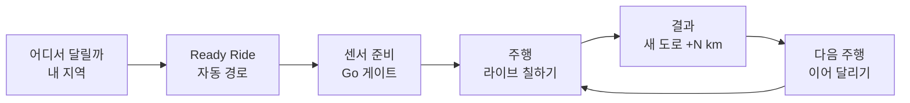

# RTW(Ride The World) — 마스터 비전

| 항목 | 내용 |
|------|------|
| 문서 유형 | **product** — 서비스 비전·핵심 원칙·로드맵의 **단일 진실** |
| 독자 | chief · AI |
| 최초 작성 | 2026-05-11 |
| 상태 | **SoT** — 2026-09-28 전면 개정(07-03 이후 결정 통합) |
| 연결 문서 | [현황판](260928-RTW-현황판.md) · [Conquest 설계](260703-Conquest-정복-레이어-설계.md) · [Ontology](260714-RTW-Ontology.md) · [상태보드](260707-RTW-기능-인벤토리-상태보드.md) · [결정 로그](260707-RTW-결정-로그.md) · [개정 전 원문(v1)](archive/260928-RTW-마스터-비전-v1-개정전.md) |

> **3줄 요약**
> 1. RTW는 실내 자전거로 **실제 지구의 도로**를 달리고, 달린 도로가 **내 도로망**으로 영구히 쌓이는 웹앱이다 — **Ride = Claim**.
> 2. 코어는 **혼자서도 성립하는 운동 + 수집**이다. 운동이 본체, 정복은 보너스, 함께 달리기는 오래 쓰게 만드는 장치다.
> 3. 코어 루프는 완성됐다(2026-09). 다음 과제는 **사람이 다시 오는지 재는 것**과 출시 준비다.

---

## 1. 정의

### 1.1 한 줄 정의

> 실내 자전거로 실제 지구의 도로를 달리고, **달린 만큼 내 도로망이 영구히 늘어나는** 웹앱.

### 1.2 핵심 판타지 — 「Ride = Claim」 (2026-07-03)

> **실내에서 페달을 밟을수록, 현실 지구 위에 나의 도로가 영구히 늘어난다.**

- 흔적이 증발하는 앱은 러닝머신이고, 쌓이는 앱은 게임이다. 주행한 도로는 **내 도로망**으로 영구 축적된다(휘발성 실시간 표시인 red dot 과는 별개의 레이어).
- 판매 문장은 「경로를 만들 수 있다」(창작 도구)가 아니라 **「달릴수록 가진다」**(수집 판타지)다. 경로 생성은 수단이다.
- 메커닉·수치의 SoT: [Conquest 설계](260703-Conquest-정복-레이어-설계.md).

### 1.3 해자 — 왜 이 싸움을 할 수 있나

- Zwift·MyWhoosh(게임 월드)·Rouvy·Kinomap(실사 영상)은 콘텐츠를 **미리 만들어야** 해서 지구 전체를 줄 수 없다.
- RTW는 벡터 지도 위에서 돌아가므로 **행성 규모를 한계비용 ~0** 으로 감당한다. 이것이 유일한 구조적 해자다.

### 1.4 타겟

- **코어 = 케이던스 이상 센서를 가진 캐주얼 실내 라이더.** 기록 경쟁보다 가벼운 반복 운동, 지도·여행·수집에 관심 있는 사람. (2026-07-03 재정의)
- 센서 없는 사용자(속도 슬라이더)는 **체험 티어** — 주행은 되지만 정복 인정에 제한이 있다(Trust Tier).

### 1.5 무엇이 아닌가

- **와트·FTP 경쟁 앱이 아니다.** 챌린지는 속도가 아니라 탐험(새 도로·완주·정복률)으로 설계한다.
- **그래픽 충실도 경쟁자가 아니다.** 3D 월드·실사 영상 전장은 회피한다. 거리뷰(Mapillary·구글)는 품질·비용 문제로 폐기했다.
- **「지도를 잘 보여주는 앱」이 아니다.** 지도는 무대이고, 제품은 축적과 다음 행동이다.

---

## 2. 제품 원칙 (결정된 지향)

각 줄은 결정 로그에 근거가 있다. 새 기능은 이 원칙과 충돌하는지부터 본다.

| # | 원칙 | 뜻 | 결정 |
|---|------|----|------|
| P1 | **운동이 본체, 정복은 보너스** | 거리·시간·마일리지는 항상 보이고 반복 주행도 전액 인정. 새 도로는 그 위에 얹히는 보상 | 2026-07-16 |
| P2 | **혼자 얻고, 함께 유지** | 획득(Claim)은 싱글플레이로 성립. 소셜은 동시 접속보다 **비동기**(흔적·「이 길을 달린 사람 N명」·Pioneer) 우선 | 2026-07-13 |
| P3 | **Local First** | 첫 경험 순서는 Recognition(알아보는 곳) → Ride → Claim → Explore → Choose. 첫 사용자에게 백지 자유 선택을 주지 않는다 | 2026-09-23 |
| P4 | **탐험 중심, 속도 경쟁 배제** | 챌린지·보상은 신규 도로·완주·정복률로. 속도 순위는 만들지 않는다 | 2026-07-07 |
| P5 | **검증된 페달링이 화폐** | 정복 인정은 센서 입력 기준. 슬라이더는 체험(T0) | 2026-07-03 |
| P6 | **폰 가로 실사용 우선** | 화면은 지도를 가리지 않는다. 공간 규칙은 [UI 공간밀도 원칙](260924-RTW-UI-공간밀도-원칙.md) | 2026-08-27 · 09-24 |
| P7 | **코어 루프는 무료** | 주행·정복·개척·랭킹은 무료. 유료(Supporter)는 편의·표현·분석(정복 지도 내보내기, 상세 통계, 아바타 등) | 2026-07-07 |

---

## 3. 코어 루프

```mermaid
flowchart LR
  A[어디서 달릴까<br/>내 지역] --> B[Ready Ride<br/>자동 경로]
  B --> C[센서 준비<br/>Go 게이트]
  C --> D[주행<br/>라이브 칠하기]
  D --> E[결과<br/>새 도로 +N km]
  E --> F[다음 주행<br/>이어 달리기]
  F --> D
```

2026-09-24 기준 전 구간 구현·배포. 각 단계의 상태는 [상태보드](260707-RTW-기능-인벤토리-상태보드.md).

---

## 4. 로드맵

| 단계 | 목표 | 내용 | 성립 조건 |
|------|------|------|-----------|
| **지금** | 출시 준비 | [출시 전 확인사항](출시%20전%20확인사항.md)의 완화값 복원, Route Token·저장 한도 정리, 동행 싱크 잔여 | — |
| **다음** | 다시 오는가를 잰다 | 첫 주행 완료율·72시간 내 두 번째 주행률 측정(`admin:ride-metrics`), 그 결과로 Ready Ride 2차·일일 챌린지(탐험형)·경로 통산 인원·온보딩의 순서를 정한다 | 실사용자 표본 |
| **Conquest B** | 혼자에서 소수로 | 구간 챌린지·Pioneer, 지역 뱃지, **시즌 도시**(밀도 집중), 도시 커버리지 %, 정복 지도 공유·내보내기 | 소수 유저 |
| **Conquest C** | 커뮤니티 | 클럽·국가 페인트 경쟁 | 커뮤니티 형성 |

- 상세 순서·수치는 [Conquest 설계 §7](260703-Conquest-정복-레이어-설계.md)이 SoT.
- 「Conquest C 의 라이브 어스(실시간 날씨·현지 밤낮)」는 2026-08-27 날씨 표시 폐기와 충돌한다 — §7 미결 Q3.

---

## 5. 장기 선택지 — 플랫폼 구상 (v1 비전에서 이관)

2026-05 v1 비전은 RTW를 「실시간 멀티플레이 + UGC + 랭킹의 운영형 플랫폼」으로 정의했다. 07-03 이후 코어가 바뀌었으므로 아래는 **지금의 목표가 아니라, 규모가 생겼을 때 꺼낼 선택지**다. 원문: [v1](archive/260928-RTW-마스터-비전-v1-개정전.md).

| 구상 | 지금의 위치 |
|------|-------------|
| Course / Session / Presence 3분할 | **구조 원칙으로 유지** — 코드에서는 Route·Publication / Trail / presence 로 구현됨. 용어는 [Ontology](260714-RTW-Ontology.md) |
| UGC 수명·승격(「생성 ≠ 영구 저장」) | 퍼블릭 경로 자동 심사로 1차 구현. 승격 점수·archive 배치는 미착수 |
| 저장 계층화(Frozen Route·Segment) | 미착수 — 장거리·헤비 유저가 생기면 |
| 랭킹·이벤트 | 랭킹은 「표시=행정구역·계산=타일」로 방향만 확정. 이벤트는 자리만 |
| Hybrid DB·전용 실시간 서버 | 비용 실측 후 |

---

## 6. 사용자 권한 체계

tier·진입·필드의 SoT는 [사용자 tier 및 진입 정책](260519-사용자-tier-및-진입-정책.md).

| tier | 제품 명칭 | 요약 |
|------|-----------|------|
| *(세션 없음)* | 인증 전 | 서비스 기능 없음 |
| `anonymous` | **Guest** | 익명 인증 — 진입 문턱 최소화 |
| `registered_free` | **로그인 · 무료** (Free) | 계정 연동 + 닉네임 |
| `registered_paid` | **로그인 · 유료** (Supporter) | 구독(Stripe). 회원 체계는 2단계로 확정(2026-07-07) |
| `admin` | 운영 | 심사·관리 |

---

## 7. 미결 질문

| # | 질문 | 막고 있는 것 |
|---|------|--------------|
| Q1 | Route Token 과 저장 한도(quota)를 하나로 합칠지, 역할을 나눠 명문화할지 | 토큰 무제한 해제 값, 챌린지 보상 통화 |
| Q2 | 「개척자」의 정의 — 퍼블릭 경로 등록자인가, 구간 최초 완주자(Pioneer)인가 | 구간 챌린지·일일 챌린지 설계 |
| Q3 | Conquest C 의 라이브 어스(날씨·밤낮)를 유지할지 — 08-27 날씨 표시 폐기와 충돌 | Phase C 정의 |
| Q4 | 비공개 Trail 을 유료로 돌릴지(지금 무료로 열려 있음) | Supporter 기능 목록 |
| Q5 | 위성지도 노출 유지 여부 | 지도 정책 |
| Q6 | 앱스토어·도메인 외부 표기(UI 는 RTW, 코드·Firebase 는 `boxcycle`) | 출시 |

---

## 8. 개정 이력

| 날짜 | 내용 |
|------|------|
| 2026-05-11 | 최초 작성 — 멀티플레이 사이클 플랫폼 비전(v1) |
| 2026-07-03 | Conquest 개정 — 「Ride = Claim」, 그래픽 전장 회피, 타겟 재정의 |
| 2026-09-28 | **전면 개정(v2)** — 07-03 이후 결정(P1~P7) 통합, 코어 루프·로드맵 갱신, 플랫폼 구상을 §5 장기 선택지로 이관, 미결 질문 재작성. v1 원문은 [archive](archive/260928-RTW-마스터-비전-v1-개정전.md) |
