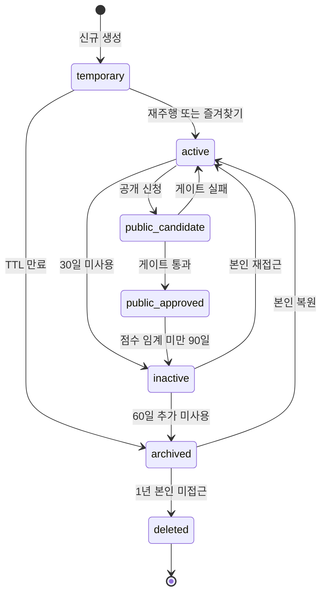

# RTW — 코스 수명 & UGC 품질 정책

| 항목 | 내용 |
|------|------|
| 문서 유형 | **architecture** — UGC 코스 수명·품질 게이트의 단일 진실 |
| 최초 작성 | 2026-05-11 |
| 상태 | **초안** — PM·시니어 자문 합의 기반. 점수 가중치는 운영 데이터 누적 후 갱신. |
| 연결 문서 | [RTW 마스터](260511-RTW-마스터-비전-및-종합계획.md), [경로 저장 계층화](260511-경로저장-계층화-Frozen-Route-Segment.md), [Firestore Rules 일반화](260511-Firestore-Rules-일반화-방안.md), [Phase별 실행 체크리스트](260511-Phase별-실행-체크리스트-Course-Session-Presence.md), [Firestore 스키마 초안](260509-Firestore-컬렉션-스키마-초안.md) |

---

## 0. 본 문서의 위치

- 본 문서는 **UGC 코스의 생성·승격·보존·삭제 규칙**의 단일 진실이다.
- 비전·권한 체계는 [RTW 마스터](260511-RTW-마스터-비전-및-종합계획.md)가, 데이터 저장 계층(geometry vs metadata)은 [경로 저장 계층화](260511-경로저장-계층화-Frozen-Route-Segment.md)가, Firestore 컬렉션 필드 정의는 [Firestore 스키마 초안](260509-Firestore-컬렉션-스키마-초안.md)이 단일 진실이다. 본 문서는 그 결정의 **수명 정책 측면만** 다룬다.

---

## 1. 문제 정의

### 1.1 UGC 콘텐츠 쓰레기장 시나리오

이 서비스의 데이터는 일반 텍스트 UGC보다 **저장·검색 비용이 크다**(좌표 + 경로 + 가능 시 elevation·thumbnail).

서비스 1년차 누적 시나리오:

- 무료 사용자 100명이 각각 "로마 → 피렌체" 코스 생성.
- 각자의 출발지·도착지가 2~21km 차이로 다름 → **기술적으로는 90% 중첩, 사용자 감성으로는 100개의 다른 코스**.
- 정리 정책이 없으면: 저장 비용 증가 / 검색 품질 악화 / 추천 시스템 붕괴 / 인기 코스 발견 어려움.

### 1.2 핵심 통찰

- **완벽한 중복 제거는 불가능하다.** 시작·종료 좌표가 같아도 우회·경유·라이딩 의도가 다를 수 있다.
- **경로는 기술적 객체이면서 동시에 감성적 객체**다. 강제 dedup ❌, 자연 정리 ✅.
- **개인 보관 ↔ 공개 발견을 분리하라.** 프리미엄 정복 컬렉션은 점수 무관 보존, 공개 노출만 품질 게이트.

---

## 2. 5대 정책 축

자문 핵심 결론. 5개를 **함께** 적용한다.

| # | 축 | 목적 |
|---|----|------|
| 1 | **임시화(Disposable by default)** | 불필요 저장 감소 |
| 2 | **승격 시스템(Promotion)** | 가치 있는 코스만 생존 |
| 3 | **중복 추천(Similarity advisory)** | 유사 코스 억제 — **차단 아님** |
| 4 | **활동 기반 생존(Activity-driven survival)** | 죽은 코스 자연 archive |
| 5 | **공개 제한(Public gate)** | 공개 코스 남발 방지 |

### 2.1 축 1 — 임시화

신규 생성 코스의 기본 상태는 `temporary` (= disposable).

| 사용자 | TTL 권장 |
|--------|----------|
| Guest | 마지막 접속 후 7일 |
| Free | 30~90일 inactive 시 archive |
| Premium | 90일 inactive 시 archive (정복 컬렉션 제외) |

→ TTL 만료는 즉시 삭제 ❌, **archive 단계 경유** (§5 UX).

### 2.2 축 2 — 승격(Promotion)

| 단계 | 검색 노출 | 진입 조건 |
|------|-----------|-----------|
| `temporary` | ❌ | 신규 생성 |
| `active` | 본인만 | 본인 재주행·즐겨찾기·재접속 |
| `public_candidate` | 본인만 | 본인이 "공개 신청" 버튼 + 게이트(최소 거리·설명 필수·썸네일) 통과 |
| `public_approved` | ✅ | 좋아요·완주율·신고 없음 등 자동 또는 수동 검증 통과 |

대부분 쓰레기 코스는 "생성만 하고 안 탐" → 자연 archive로 정리된다.

### 2.3 축 3 — 중복 추천 (advisory)

생성 시 **유사 공개 코스 추천**을 띄우지만 **완전 차단은 하지 않는다**.

| 단계 | 알고리즘 |
|------|----------|
| Phase A | 시작 좌표 + 종료 좌표 + 거리 ±10% |
| Phase B | + bbox 겹침 비율 |
| Phase C(장기) | + shape similarity (Hausdorff distance, Frechet distance) |

알고리즘 깊이는 [RTW 마스터 §7 Q6](260511-RTW-마스터-비전-및-종합계획.md)에서 단계 결정.

UI 안내(예시):

```
"이 경로와 유사한 공개 코스 3개가 이미 있습니다.
 - 로마-피렌체 클래식 라이딩 (이미 200회 주행)
 - 로마-피렌체 야간 코스
 - 로마-피렌체 관광 루트
 [기존 코스 사용]   [그래도 새로 만들기]"
```

### 2.4 축 4 — 활동 기반 생존

| 조건 | 결과 |
|------|------|
| 30일 미사용 AND 좋아요 0 AND 주행 0 | `inactive` 후보 |
| inactive 60일 추가 | `archived` (검색·추천에서 제외) |
| archived 1년 + 본인 미접근 | `deleted` (소프트 삭제, 메타만 보존) |

**프리미엄 정복 컬렉션 보호:** `ownerKind == "personal"` AND `course.isInUserConquestCollection == true` 인 경우 위 규칙을 **건너뛴다**(§5).

### 2.5 축 5 — 공개 제한

| 권한 | 공개 코스 한도 |
|------|----------------|
| Guest | 0 (공개 불가) |
| Free | 권장 1~3개, 주간 등록 제한, 최소 거리 요구 |
| Premium | 확장 허용, 단 일일 등록 상한 존재 |

---

## 3. 수명 상태 머신



**상태 전이 규칙:**

- 모든 전이는 **불변 이벤트 로그**(`courseLifecycleEvents/{eventId}`)에 기록한다(감사·복원·디버그).
- 자동 전이는 **Cloud Function 일배치**(매일 03:00 KST). 즉시 전이는 사용자 액션(공개 신청·복원)만.
- `deleted` 도 **소프트 삭제**다(컬렉션·필드만 비움, 메타·통계는 보존).

---

## 4. 점수 공식 초안

```text
courseScore = w1 * rides
            + w2 * favorites
            + w3 * likes
            + w4 * reuse
            + w5 * completionRate
            - w6 * reportRate
```

| 가중치 | 의미 | 초기 권장값(검토 필요) |
|--------|------|------------------------|
| `w1` | 총 주행 횟수 | 1.0 |
| `w2` | 즐겨찾기 수 | 2.0 |
| `w3` | 좋아요 수 | 1.5 |
| `w4` | 재주행 비율(unique riders 중 2회 이상) | 3.0 |
| `w5` | 완주율(완주/시작) | 2.0 |
| `w6` | 신고율 | 5.0 (감점) |

**임계값(초안):**

- `score < 0.5` → `inactive` 후보 (활동 0 + 좋아요 0 조건과 AND)
- `score >= 5.0` → `public_candidate` 승격 자동 추천 (사용자가 신청 버튼 클릭만 하면 통과 가능)

가중치는 **운영 데이터 누적 후** 갱신. 초기에는 단순 규칙(예: 주행 0 AND 좋아요 0)부터 시작해도 좋다(자문 권장).

---

## 5. 보존 vs 삭제 UX

### 5.1 핵심 원칙

> **사용자는 "내 코스가 삭제됐다"를 싫어한다.**
> 따라서 자동 정리는 **삭제(delete)** 가 아니라 **보관(archive)** 으로 표현한다.

### 5.2 메시지 가이드

| 시점 | 권장 문구 |
|------|-----------|
| inactive 전환 시 | "최근 사용되지 않아 비활성 상태로 전환되었습니다. 다시 주행하면 활성화됩니다." |
| archived 전환 시 | "최근 사용되지 않아 **보관 상태**로 전환되었습니다. 보관된 코스는 검색에 노출되지 않지만 「내 코스」 → 「보관함」에서 언제든 복원할 수 있습니다." |
| deleted 전환 시(1년+) | 사전 이메일 통지 14일 전. 본인 동의 또는 무응답 시 소프트 삭제. |

### 5.3 프리미엄 정복 컬렉션 보호

다음 조건 중 하나라도 만족하면 **위 자동 정리 규칙을 건너뛴다**:

- `ownerKind == "personal"` AND `course.user.role == "premium"` AND `course.isInConquestCollection == true`
- 또는 `course.isPinnedByOwner == true` (사용자 명시 핀)

프리미엄 사용자는 매일 저녁 자신이 달려온 루트를 확인하고 다음 50km를 이어가는 **헤비 유저** ([RTW 마스터 §1.1](260511-RTW-마스터-비전-및-종합계획.md))이므로, 본 보호는 **서비스 핵심 가치**다.

### 5.4 「내 코스 → 보관함」 UI

archive 단계는 **숨김이지 삭제가 아니다.** 사용자에게는 항상 다음 5탭이 보여야 한다.

1. 활성 (active + temporary)
2. 공개 (public_candidate + public_approved)
3. 비활성 (inactive)
4. 보관함 (archived)
5. 정복 컬렉션 (premium)

---

## 6. 단계별 적용

본 정책은 한 번에 도입하지 않는다. [Phase별 실행 체크리스트](260511-Phase별-실행-체크리스트-Course-Session-Presence.md) Phase 2~4와 정렬한다.

| Phase | 도입 항목 |
|-------|-----------|
| **A** (Phase 2) | `lifecycleStage` 필드 + `temporary` 기본값 + Guest TTL 일배치만 |
| **B** (Phase 2 후반) | 승격 게이트 UI + 점수 단순 규칙(주행 횟수 + 좋아요만) |
| **C** (Phase 4) | 중복 추천 UI(시작·종료 좌표 + 거리 알고리즘) + archive 일배치 |
| **D** (Phase 5) | shape similarity + segment 추출(인기 구간만) |

**원칙:** 각 단계에서 운영 데이터(저장 비용·코스 분포·완주율)가 다음 단계 조정의 근거가 된다.

---

## 7. Firestore `courses` 영향 필드

스키마 본문은 [Firestore 스키마 초안 §3.5](260509-Firestore-컬렉션-스키마-초안.md)가 단일 진실이며, 본 절은 **수명 정책이 요구하는 필드 목록만** 나열한다.

| 필드 | 타입 | 의미 |
|------|------|------|
| `lifecycleStage` | `"temporary" \| "active" \| "public_candidate" \| "public_approved" \| "inactive" \| "archived" \| "deleted"` | 상태 머신 현재 상태 |
| `lastActivityAt` | `Timestamp` | 마지막 주행·즐겨찾기·재접속 시각 |
| `score` | `number` | §4 점수 공식 결과(일배치 갱신) |
| `ownerKind` | `"personal" \| "public"` | 개인 보관 vs 공개 후보 구분 |
| `visibility` | `"public" \| "unlisted" \| "private"` | 4 코스 분류 §4.3과 일관 |
| `isInConquestCollection` | `boolean` | 프리미엄 보호 플래그 (§5.3) |
| `isPinnedByOwner` | `boolean` | 사용자 명시 핀 |
| `presenceEnabled` | `boolean` | Rules 일반화용 ([Rules 문서 §2](260511-Firestore-Rules-일반화-방안.md)) |
| `ridesCount` | `number` | 점수 입력값(집계 캐시) |
| `favoritesCount` | `number` | 점수 입력값(집계 캐시) |
| `likesCount` | `number` | 점수 입력값(집계 캐시) |
| `completionRate` | `number` | 점수 입력값(집계 캐시) |
| `reportsCount` | `number` | 감점 입력값 |

**원칙:** 집계 캐시 필드는 **단일 문서에 고빈도 패치 ❌** ([Firestore→Postgres 체크리스트](260509-Firestore-Postgres-이전-체크리스트.md) "쓰기 패턴" 절). Cloud Function 일배치 또는 트리거로 갱신.

---

## 8. 핵심 결론

- 강제 dedup ❌, 5축 정책으로 **자연 정리** ✅.
- 사용자 정의 코스의 **기본 상태는 `temporary`**.
- **개인 보관 ↔ 공개 발견 분리** — 프리미엄 정복 컬렉션은 점수 무관 보존.
- **삭제가 아니라 보관(archive)** — UX 표현의 핵심.

---

## 9. 개정 이력

| 날짜 | 내용 |
|------|------|
| 2026-05-11 | 최초 작성 — 자문 Q&A 2·3단계 결론(쓰레기 코스 폭증 방지) 종합. |
