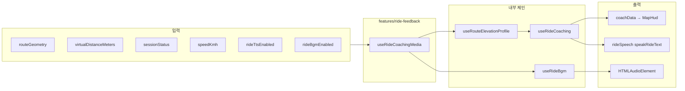

# (cycle) 음악 · 메시지 · TTS 상세 분석 보고서

> **(cycle) 스냅샷:** **2026-05-14** 코드 기준 기록. 현재 제품·Firestore 용어는 [제품 용어 Trailhead·Trail](260517-제품-용어-Trailhead-Trail.md) 우선.

**작성 기준일:** 2026-05-14  
**대상 앱:** `apps/web` (BOXCYCLE 가상 주행)  
**목적:** 주행 중 **배경음악(BGM)**, **화면 메시지(코칭 UI)**, **TTS(Web Speech)** 의 데이터 흐름·트리거·설정을 코드 기준으로 정리한다.

---

## 1. 범위와 용어

| 용어 | 이 문서에서의 의미 |
|------|---------------------|
| **음악** | 주행 세션 중 `<audio>` 로 재생되는 BGM. `useRideBgm`. |
| **메시지** | 코칭 **텍스트**를 HUD에 표시하는 영역(배너) 및 메뉴 패널의 안내 문구. TTS와 별도로 `coachData` 상태로 전달된다. |
| **TTS** | Web Speech API(`speechSynthesis`)로 코칭·브리핑 문장을 읽는 기능. `rideSpeech.ts` + `useRideCoaching` 에서 호출. |

**문서에서 다루지 않는 것(참고만):** `routeSummary`·에러 토스트·Firebase 동기 메시지 등 “주행 코칭 파이프라인”과 무관한 일반 UI 문자열.

---

## 2. 전체 아키텍처



- **`App.tsx`** 는 주행 세션·경로·저장 등 핵심 상태를 들고, 부가 기능은 **`useRideCoachingMedia`** 한 덩어리로 묶어 호출한다.
- **BGM** 과 **TTS** 는 서로 다른 브라우저 API이며 코드상으로도 **교차 제어 없음**(동시 재생 가능. 다만 사용자 기기 볼륨·포커스는 공유).

---

## 3. 배경음악(BGM)

### 3.1 관련 파일

| 경로 | 역할 |
|------|------|
| `src/hooks/useRideBgm.ts` | 단일 `Audio` 인스턴스로 플레이리스트 순환·페이드·예외 처리 |
| `src/lib/rideBgmConstants.ts` | 타이밍 상수, 내장 URL 목록, `VITE_RIDE_BGM_PLAYLIST_JSON` 파싱 |

### 3.2 플레이리스트 소스

1. 환경 변수 **`VITE_RIDE_BGM_PLAYLIST_JSON`** 에 JSON 배열 문자열이 있고, 파싱 후 **비어 있지 않은 문자열 URL이 1개 이상**이면 → 그 목록만 사용.
2. 그 외(미설정·파싱 실패·빈 배열) → **`RIDE_BGM_BUILTIN_PLAYLIST`** (Dropbox `dl=1` 링크 다수).

`rideBgmCatalogConfigured` 는 `RIDE_BGM_PLAYLIST.length > 0` 이며, 내장 목록이 있으므로 기본 빌드에서는 패널에서 BGM 토글이 비활성화되지 않는다.

### 3.3 재생 조건

- `sessionActive === true` : `useRideCoachingMedia` 에서 `sessionStatus !== "idle"` 일 때.
- `musicEnabled === true` : 사용자가 메뉴에서 「주행 BGM」 체크.
- `playlist.length > 0`.

위가 모두 만족될 때 `useEffect` 본문이 활성화되고, 곡 로드·재생이 시작된다.

### 3.4 곡 선택 알고리즘

- **`nextShuffleIndex(len, avoid)`** : `0 .. len-1` 중 무작위. 가능하면 **직전 인덱스와 다르게** 최대 8번 재시도.
- **세션 진입 시**·**곡 종료 시**·**미디어 `error` 시** 모두 랜덤 다음 곡으로 진행(종료·에러 모두 `advance()` 경로).

### 3.5 볼륨·전환

- 새 곡: `volume = 0` 으로 `play()` 성공 후 **`fadeVolume`** 으로 `BG_MUSIC_FADE_IN_TARGET`(0.3)까지 `BG_MUSIC_FADE_MS`(2000ms) 선형 보간.
- 세션 종료·BGM 끔: 페이드 아웃(최대 800ms 캡) 후 `pause`, `src` 제거, `load()`.

### 3.6 WebView / 끊김 보완

| 상수 | 값 | 의미 |
|------|-----|------|
| `BG_MUSIC_NEAR_END_SEC` | 0.38 | `timeupdate` 로 남은 시간이 이 값 이하이면 `ended` 와 유사하게 **다음 곡 예약** |
| `BG_MUSIC_WATCHDOG_MS` | 480 | 주기적으로 버퍼 끝과 `currentTime` 간격을 보고, 끝에서 멈춘 것처럼 보이면 **`ended` 이벤트를 수동 dispatch** |
| `BG_MUSIC_ADVANCE_DEBOUNCE_MS` | 420 | 연속 `advance` 완충 |
| `BG_MUSIC_ERROR_SUPPRESS_MS` | 400 | `play()` 실패·`error` 연속 스팸 완화 |

### 3.7 탭 가시성

`visibilitychange` 로 `document.hidden` 이면 일시 정지, 다시 보이면 세션·음악이 켜져 있으면 `play()` 재시도(자동재생 정책으로 실패할 수 있음).

### 3.8 CORS 정책

외부 호스트 MP3(Dropbox 등)에서 **`crossOrigin = "anonymous"`** 를 쓰면 CORS 미충족 시 재생이 막히는 경우가 있어, **현재는 `crossOrigin` 을 설정하지 않는다**(Web Audio 분석 없음).

---

## 4. 화면 메시지(코칭 “메시지”)

### 4.1 데이터 모델: `CoachingData`

`src/lib/coachTypes.ts`:

- `tip`: 사용자에게 보이는 **한 줄 팁**(영문 문구 + `(R{n})` 형태가 `aiCoach` 에서 붙는 경우 있음).
- `resistance`: 예) `"Resistance 5"` 문자열.
- `intensity`: `LOW` | `MODERATE` | `HIGH` | `MAX`.
- `action`: `SIT` | `STAND` | `TUCK` | `PEDAL`.

### 4.2 생성 파이프라인

1. **`useRouteElevationProfile(routeGeometry)`**  
   Open-Meteo 등으로 샘플링된 고도·좌표를 얻는다. 로딩 중이면 코칭 틱이 고도 준비를 기다린다(`elevationReadyForCoach`).

2. **`buildCoachElevationPoints` → `sliceCoachPointsAhead`**  
   현재 가상 거리 기준 **앞쪽 구간**의 고도 포인트를 잘라 `getPredictiveCoaching` 에 넘긴다.

3. **`services/aiCoach.ts`**  
   - `estimateRoadSlope`(`roadElevationCoach`)로 경사 후보를 잡고 **저항 1~8** 을 산출.  
   - `phraseManifest` 의 `FALLBACK_TIPS` 에서 밴드별 문구를 고른 뒤 `tip` 문자열을 만든다.  
   - **`validUntilDistanceM`** : 현재 위치부터 약 120~480m 구간까지 동일 세그먼트로 본다.

4. **`useRideCoaching`** 가 `setCoachData(coaching)` 으로 React 상태를 갱신한다.

### 4.3 HUD 표시: `MapHud`

- Props: `coachData`, `coachLineEnabled`(메뉴 「코칭 배너 표시」).
- **표시 조건:** `coachLineEnabled && coachData !== null && (riding || paused)` (`useRideUiStage` 의 `stage` 기준).
- **표시 내용:**  
  - 팁 줄: `coachData.tip` 에서 **끝의 `(R숫자)` 를 정규식으로 제거**해 짧게 보여 준다.  
  - 저항 칩: `Resistance N` → `RN` 축약.

접근성: `role="status"`, `aria-live="polite"`.

### 4.4 메뉴 패널: `RideRoutePanel`

- 「코칭 배너 표시」「코칭 음성(TTS)」「주행 BGM」 체크박스와 **고도 프로필 로드 중** 안내.
- `arrivalToastVisible` 등 일부 토스트는 **현재 `App` 에서 `false` 로 고정**되어 있어, 완료 알림은 주로 **`RideSummarySheet`** 쪽 흐름과 연동된다(패널 내 “완료” 토스트는 비활성 경로).

---

## 5. TTS(Web Speech)

### 5.1 모듈: `src/lib/rideSpeech.ts`

| API | 동작 |
|-----|------|
| `setRideTtsEnabled(enabled)` | 모듈 전역 `ttsEnabledRef` 갱신. `false` 이면 즉시 `safeRideSpeechCancel()`. |
| `getRideTtsEnabled()` | 현재 플래그 조회. |
| `safeRideSpeechCancel()` | 예약된 50ms 지연 시작 타이머 제거 + `speechSynthesis.cancel()`. |
| `speakRideText(text)` | 공백 트림 후, 요청 ID 증가·이전 음성 취소·**50ms 후** `SpeechSynthesisUtterance` 생성 및 `speak`. |
| `installRideSpeechVoicesListener()` | `voiceschanged` 로 목록 프리로드. `useRideCoaching` 마운트 시 1회 등록. |

**언어:** `u.lang = "en-US"` 고정.  
**보이스:** `pickEnVoice` — 영어(`en` 접두) 우선, 이름에 `female` / `google us english` / `samantha` 선호. 없으면 첫 영어 보이스.

즉 **코칭 문구는 영문**이며 TTS도 **미국 영어** 쪽에 맞춰져 있다.

### 5.2 `useRideCoaching` 이 TTS 를 부르는 시점

| 이벤트 | 조건 / 내용 |
|--------|-------------|
| **idle → running** | `getCourseBriefingMessage(kmTotal)` — 총 거리(km) 브리핑 한 문장. 이 직후 첫 **`getPredictiveCoaching`** 결과의 저항 팁은 **`skipResistanceSpeakOnceRef`** 로 TTS 한 번 건너뜀(브리핑과 겹침 방지). |
| **running / paused → idle** (종료) | `getRideEncouragementMessage(km)` — 주행 거리 기준 격려 한 문장. |
| **주행 중 500ms 틱** | 세그먼트 유효 구간 안에서 같은 저항이 **30초 이상** 지속되면 `pickFreshTipForResistance` 로 팁만 바꾸고 TTS(옵션). |
| **새 세그먼트** | 저항 밴드가 바뀌면 `coaching.tip` TTS. 같은 밴드인데 30초 이상이면 위와 동일. |

`ttsEnabled` 는 ref 로 읽히며, UI 토글은 `setRideTtsEnabled` 로 전역과 동기화된다.

### 5.3 BGM 과의 관계

- 같은 브라우저에서 **동시에** 재생될 수 있다.  
- 주행 **수동 종료** 시 `App.tsx` 의 `handleEndRide` 에서 **`safeRideSpeechCancel()`** 을 호출해, 종료 직후 격려 TTS 와 겹치거나 남은 큐를 끊는 용도로 쓰인다(종료 처리 순서상).

---

## 6. 설정 요약

| 항목 | 위치 / 방법 |
|------|-------------|
| BGM URL 목록 | `VITE_RIDE_BGM_PLAYLIST_JSON` JSON 배열 또는 내장 `RIDE_BGM_BUILTIN_PLAYLIST` |
| 코칭 TTS 켜기 | 메뉴 「코칭 음성(TTS)」→ `rideTtsEnabled` → `setRideTtsEnabled` |
| BGM 켜기 | 메뉴 「주행 BGM」→ `useRideBgm` 의 `musicEnabled` |
| HUD 코칭 줄 | 「코칭 배너 표시」→ `coachLineEnabled` |

---

## 7. 제한 사항 및 개선 여지(참고)

1. **TTS 언어**가 `en-US` 고정이라, 한국어 UI와 음성 언어가 다르다. 다국어 시 `utterance.lang`·문구 소스를 분리할 여지가 있다.  
2. **코칭 문구·브리핑** 모두 영어(`aiCoach`, `phraseManifest`). HUD 표시는 동일 문자열 기반.  
3. **Dropbox URL** 의 쿼리(`st` 등)는 만료될 수 있어, BGM 은 `error` 시 다음 곡으로 넘어가도록 되어 있다.  
4. **자동재생 정책**: 사용자 제스처 전에는 `audio.play()` / speech 가 막힐 수 있다. 주행 시작 버튼이 그 완화에 기여한다.  
5. **분리 재생(팁·저항 각각 파일)** 은 `phraseManifest` 주석에 “레거시/확장” 아이디어로만 언급되어 있고, 현재 구현은 **한 utterance 에 팁(+R표기)** 이다.

---

## 8. 파일 빠른 색인

```
apps/web/src/
  hooks/useRideBgm.ts
  hooks/useRideCoaching.ts
  hooks/useRouteElevationProfile.ts
  lib/rideBgmConstants.ts
  lib/rideSpeech.ts
  lib/coachTypes.ts
  features/ride-feedback/useRideCoachingMedia.ts
  features/ride-feedback/useRideFeedbackPreferences.ts
  services/aiCoach.ts
  services/phraseManifest.ts
  services/roadElevationCoach.ts
  components/maphud/MapHud.tsx
  components/RideRoutePanel.tsx
  App.tsx
```

---

*본 문서는 해당 시점의 소스 트리를 기준으로 작성되었으며, 리팩터링 시 경로·함수명이 바뀔 수 있다.*
