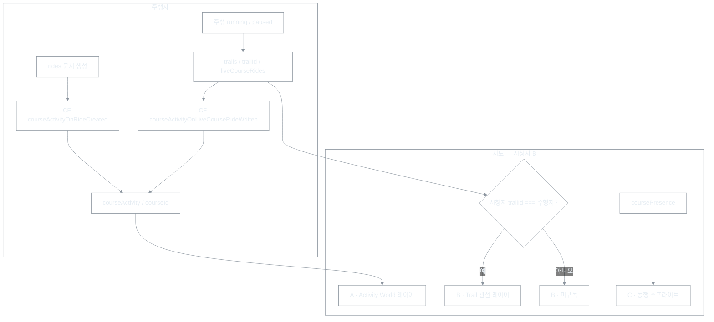

# Activity World — 지도 LOD 설계 (멀리 점 · 가까이 라인)

| 항목 | 내용 |
|------|------|
| 문서 유형 | **product** + **architecture** (지도 UX·**줌 LOD 렌더**) |
| 작성일 | 2026-05-17 |
| 상태 | **v1+v2(anchor) 구현 완료** — **데이터·presence 키는 [World Activity Presence](260523-World-Activity-Presence-설계.md)로 이전 예정** |
| **Presence 단일 진실** | [World Activity Presence](260523-World-Activity-Presence-설계.md) — `publicationId` 1 dot, distance midpoint, heartbeat 분리 |
| 백로그 | [경로 표시 우선순위](260518-Activity-World-경로표시-우선순위-백로그.md) P0~P3 |
| 상위 | [Firestore 트래픽·Activity World](260516-Firestore-트래픽-저감-상세-수정-계획.md) §4 |
| 구분 | [제품 용어 Trailhead·Trail](260517-제품-용어-Trailhead-Trail.md), [같은 Trail 관전](260514-(cycle)로비_코스주행자_맵관전_구현_보고서.md), [Route Token 경제](260518-Route-Token-경제-설계.md) §6.3 (토큰 드롭 v2) |

> **2026-05-23:** 월드 맵 **무엇을·왜** 표시할지(`courseId` aggregate → **`routePublicationId` presence dot**)는 [260523-World-Activity-Presence-설계.md](260523-World-Activity-Presence-설계.md)가 우선한다. 본 문서는 **점↔선 LOD·Mapbox 레이어·줌 임계값**을 담는다.

---

## 1. 문제 정의 (무엇을 만들 것인가)

**목표:** 로그인 사용자가 맵을 볼 때, **다른 사람들이 이 서비스에서 지금 활동 중**임을 느낀다.

**대표 UX (제품 이미지):**

- 줌 아웃·Trailhead(월드 뷰): *「캐나다 앨버타 근처에서 누가 달리고 있나 보다」* → **라이브 코스 위치를 점**으로 표시.
- **줌 ≥ 13** + geometry ready → **라인** (가능할 때만).
- **그 외** → **점** (`showDots:false` 없음 — 라인 불가 시 DOT 폴백, blank 금지).
- **span은 LOD에 미사용** (화면비·위도로 오동작).

**본 설계의 범위 밖 (이미 구현·별도 유지):**

| 기능 | 범위 | 문서 |
|------|------|------|
| 같은 **Trail** 안 주행자 진행 점 + 빨간 노선 | `trails/.../liveCourseRides` | 260514 관전 보고서 |
| 입문 허브 **동행 스프라이트** | `coursePresence` | UX·IA |
| 코스 패널 **「지금 N명」** 배지 | `courseActivity` 1문서 읽기 | 260516 §4.1 |

---

## 2. 세 가지 “다른 사람” 표현 (혼동 방지)

| 층 | 사용자 질문 | 데이터 | 지도 표현 |
|----|-------------|--------|-----------|
| **A. Activity World (본 문서)** | 전 세계/멀리서 누가 활동 중? | `courseActivity` + `courses.bounds` | **멀리: 점** · **가까이: 라인** |
| **B. 같은 Trail 관전** | 이 Trail에서 지금 누가 어느 코스를 얼마나 탔나? | `trails/.../liveCourseRides` | 빨간 점 + 빨간 노선 (진행률) |
| **C. 같은 코스 동행** | 이 코스에 같이 입장한 사람 GPS? | `coursePresence` | 라이더 스프라이트 |

**Trailhead** = 기본 Trail **`trails/default`** 의 제품 이름이다. 「지금 어느 Trail에 있는가」에는 **Trailhead와 Trail 3 등이 같은 범주**에 들어간다. ([용어집 §2](260517-제품-용어-Trailhead-Trail.md))

| 데이터 층 | Trail 범위 |
|-----------|------------|
| **A. Activity World** | **Trail 무관** — Trailhead·다른 Trail 어디서나 **동일** `courseActivity` (「다른 Trail의 aggregate」가 아님) |
| **B. 같은 Trail 관전** | **시청자 `trailId` === 주행자 `trailId`** — Trailhead면 둘 다 `default` |
| **C. 코스 동행** | **코스** 단위 (`coursePresence`) |

A는 **전역 aggregate**, B는 **Trail 인스턴스 realtime** 이다.

### 2.1 데이터 흐름 (주행 → 지도)

다이어그램은 **배경 없음**(다크·라이트 문서 모두). Mermaid 미리보기가 흰 박스로 보이면 뷰어 테마 이슈이며, `themeVariables.background`·`mainBkg` 는 `transparent` 로 맞춰 두었다.



### 2.2 「맵에 안 보임」 점검 (혼동 방지)

| 증상 | 흔한 원인 | 확인 |
|------|-----------|------|
| **다른 Trail** URL 인데 상대 진행 없음 | **B층** — `trailId` 불일치(주행·시청 각각 `?trail=` 확인) | 동일 `trailId`·§J-2 |
| 같은 Trail 인데 진행 없음 | `liveCourseRides` 미갱신·stale(240s)·Rules·비주행 | Firestore `trails/{id}/liveCourseRides` |
| 멀리서도 **코스 빨간 점** 없음 | **A층** — `courseActivity` 없음·CF 미배포·비공식 코스 주행·뷰포트가 코스 bounds 밖 | Console `courseActivity` · §J-4 |
| 같은 코스 입장했는데 **캐릭터** 없음 | **C층** — `coursePresence` · Rules `presenceEnabled` | 입문 허브 동행 UI |

주행·시청 모두 **같은 `trailId`**(Trailhead `default` 포함)이면 **B(관전)** 가 켜진다. 입문 허브 동행 중인 상대는 **C** 스프라이트로 보이며 B 점과 uid 중복 제거된다.

---

## 3. LOD 규칙 (점 ↔ 라인)

### 3.1 렌더 우선순위 (코드: `resolveActivityWorldRender`)

**원칙:** loader는 dots·lines **항상 생성**. 표시는 `resolveActivityWorldRender` 한 곳.

1. LINE 가능? (`mapZoom ≥ 13`, geometry ready) — MapView는 **`map.getZoom()`** 으로 판정(span 미사용)
2. 가능하면 **LINE만** (점 배열 비움 — `showDots:false` 모드 없음)
3. 불가하면 **DOT만** — 라인 배열 비움
4. 둘 다 비면 반대 채널 폴백 (**blank 금지**)

**코스별 적용:** zoom≥13 이어도 **geometry 가 로드된 코스만** LINE; 다른 코스는 DOT 유지 (전역 LINE 모드로 타 대륙 점이 꺼지지 않음).

| 채널 | 조건 | 지도 |
|------|------|------|
| **LINE** | zoom **≥ 13** + **해당 코스** LineString 준비 | pulse·heat 라인 (§3.3) |
| **DOT** | 그 외 또는 해당 코스 geometry 미준비 | 앵커 점 |

```text
MAP_ZOOM_ACTIVITY_WORLD_LINE_MIN = 13
```

- **span은 LOD 판정에 쓰지 않음** (화면비·위도 오동작). `viewportSpanKm` 은 HUD·디버그용만.
- **DOT:** 라이브·heat 앵커는 뷰포트 클립만 Mapbox 적용.

### 3.2 앵커 점 위치 (DOT)

| 우선순위 | 소스 | 설명 |
|----------|------|------|
| 1 | `courses.bounds` 중심 | 이미 카탈로그에 있음. **v1 권장** |
| 2 | `courseActivity.liveAnchorLngLat` (신규, 선택) | CF가 `liveCourseRides` 진행률로 코스 위 대략 위치 갱신 — **v2** |
| 3 | 코스 geometry 첫 좌표 | bounds 없을 때 fallback |

**v1 의도:** 전역 맵에서는 **“이 코스(이 길)에서 지금 라이브”** 를 지역으로 알려 주고, **정확한 주행자 GPS는 같은 Trail 관전(B)** 에만 둔다. 260516 철학(전역 GPS fan-out 지양)과 일치.

### 3.3 시각 (구현 기준)

| 레이어 | DOT | LINE |
|--------|-----|------|
| 라이브 (`liveNow`) | red 계열 원 + 흰 글로우 (`traceStrength=1`) | `activity-pulse-*` — red, 실선 |
| 완료·최근 활동 heat (`recentRideCount7d`, live 아님) | red 계열 점 (`traceStrength` 구간별) | `activity-heat-*` — red, **dash** |
| 펄스·인기 | `pulseLevel` / `recentRideCount7d` → 반경·opacity | glow 두께·`traceStrength` (0.3~1) |

**색상 (`activityWorldTraceStyle.ts`, MapView):**

- 공통 hue: **`#dc2626`** (`ACTIVITY_TRACE_RED`) — 사용자 탐색 경로(`route` 레이어)·Trail 관전 빨간 톤과 **맵 전역 red 계열** 정렬.
- **라이브 vs 완료 heat** 구분: hue가 아니라 **`traceStrength`**(라이브 1.0, heat는 `updatedAt` 기준 0.8 / 0.5 / 0.3)와 heat 라인 **점선**.
- **회색 heat를 쓰지 않은 이유:** Strava·맵 앱 등에서 흔한 「완료 흔적=회색」 컨셉이 본 서비스 **지도 베이스·UI 회색**과 겹쳐 흔적이 안 보이거나 배경과 구분되지 않음 → **의도적으로 red 계열**로 통일.

DOT·LINE **동시에 같은 코스를 이중 표시하지 않음** — 모드에 따라 하나만.

---

## 4. 데이터 설계

### 4.1 v1 — `courseActivity` + `courses` 만 (권장 1차)

**읽기 (클라이언트, 저빈도):**

1. `worldActivity/global` — `highlightedCourses[]`, `livePulseCount` (기존, 90s 폴링).
2. `courseActivity/{courseId}` — 배치 `getDoc` (기존 `fetchCourseActivitiesBatch`, 90s).
3. **DOT/LINE 공통:** live·heat 대상 `courseId`에 대해 `courses` 에서 `bounds` + (LINE일 때만) `geometryCoordsJson` 로드 — **최대 N건**(기존 16) 유지.

**쓰기 (서버, 기존 유지):**

- `courseActivityOnLiveCourseRideWritten` → `liveNow`, `activeRiderCount`, `pulseLevel`.
- `courseActivityOnRideCreated` → `recentRideCount7d`.
- `refreshWorldHighlightedCourses` → `highlightedCourses`.

**추가 Firestore 필드 없음.**

### 4.2 v2 — 라이브 앵커 점 (선택, “더 살아 있는” DOT)

`courseActivity/{courseId}` 에 선택 필드:

```typescript
liveAnchorLngLat: [lng, lat]  // 소수 3~4자리 (rideSyncPolicy LIVE_SHARE_COORD_DECIMALS 와 동일)
liveAnchorProgressRatio?: number  // 0..1, UI 툴팁용
```

- CF `touchCourseLiveProgress` 시 `liveCourseRides.progressRatio` + 코스 geometry 로 **한 점** 계산 후 merge.
- 클라이언트 DOT 모드는 `liveAnchorLngLat` 우선, 없으면 bounds 중심.
- **전역 구독 없음** — aggregate 문서만 읽음.

### 4.3 하지 않을 것 (명시)

| 안 함 | 이유 |
|-------|------|
| 전역 `liveCourseRides` collectionGroup 구독 | 비용·Rules·프라이버시 |
| Trail 무관 실시간 GPS 점 전부 표시 | B·C와 중복, MMO 느낌 |
| DOT 모드에서 전체 geometry 항상 로드 | 트래픽·메모리 |

---

## 5. 클라이언트 구조 (구현 시)

### 5.1 훅·레이어 분리

| 현재 | 지향 |
|------|------|
| `usePublishedCoursesActivityMapOverlay` → pulse/heat **항상 Line** | `useActivityWorldMapOverlay` |
| `MapView` `syncCourseActivityLayers` (line only) | `syncActivityWorldLayers(map, { dots, pulseLines, heatLines })` |

**출력 타입 (초안):**

```typescript
type ActivityWorldMapOverlay = {
  liveDots: { courseId: string; lngLat: LngLat; pulseLevel: number }[];
  pulseLines: LineStringGeometry[];  // LINE 모드·뷰포트 내 live
  heatDots: { courseId: string; lngLat: LngLat }[];
  heatLines: LineStringGeometry[];
};
```

**모드 계산:** `MapView` 또는 훅에서 `map.getBounds()` → `viewportSpanKm(bounds)` → DOT vs LINE.

### 5.2 후보 코스 ID (기존과 동일)

```text
BASIC_SHARED_HUB_IDS
∪ publishedPublicCourses[].id
∪ worldActivity.global.highlightedCourses[]
```

현재 로드한 코스(`trackedCourseId`)는 LINE 쪽만 중복 제거, DOT는 bounds만 있으면 표시 가능.

### 5.3 App 연동

- `activityPulseRoutes` / `activityHeatRoutes` 를 위 출력에 맞게 분리하거나 단일 `activityWorldOverlay` prop 으로 `MapView` 에 전달.
- `worldActivityHint` (줌 ≤ 9) 는 **유지** — 텍스트 요약은 LOD와 독립.

---

## 6. 구현 순서

| 단계 | 내용 | 상태 |
|------|------|------|
| **1** | `activityWorldLod.ts` — `viewportSpanKm`, `VIEWPORT_SPAN_LINE_MAX_KM` | **완료** |
| **2** | `fetchCourseBounds` / `boundsCenterLngLat` | **완료** |
| **3** | Mapbox `boxcycle-activity-pulse-dots` / `activity-heat-dots` | **완료** |
| **4** | LINE 모드에서만 pulse/heat 라인 (`usePublishedCoursesActivityMapOverlay`) | **완료** |
| **5** | CF + `liveAnchorLngLat` (`courseGeometryAnchor`, `touchCourseLiveProgress`) | **완료** |
| **6** | (후순) `worldActivity/{tileId}` | **잔여** |

**스모크 (수동):**

1. 계정 A: 입문/퍼블릭 코스 주행(running) → CF로 `courseActivity.liveNow`.
2. 계정 B: 같은 Trail 아님, **멀리 줌** → 앨버타(해당 bounds) 근처 **녹색 점** 1개 이상.
3. B: 해당 지역 **확대(화면 span ≤ 20km, zoom 충분)** → **녹색 라인**으로 코스 형상 표시.
4. A: 주행 종료 → 점/라인 사라짐(또는 heat만 red 점·약한 red 라인).

---

## 7. 260516 계획과의 관계

| 260516 (기존) | 본 설계 (보강) |
|---------------|----------------|
| activityOverlay = 코스 **라인** 펄스/heat | **LOD**: 멀리 **점**, 가까이 **라인** |
| 전역 GPS 추적 지양 | 유지 — DOT는 **코스 앵커**, Trail B만 진행 점 |
| `highlightedCourses` + 카탈로그 16건 geometry | 유지 — LINE 로드 상한 동일 |
| 타일 `worldActivity/{tileId}` 미착수 | §6 단계 6으로 유지 |
| 토큰 드롭 POI (v2) | [Route Token 설계](260518-Route-Token-경제-설계.md) §6.3 — Activity World DOT와 별 레이어·저빈도 |

§4.2 Mapbox 레이어 (현재 구현):

- **줌 &lt; 13** 또는 코스 geometry 미로드: `activity-pulse-dots`, `activity-heat-dots`.
- **줌 ≥ 13** + 해당 코스 geometry 로드: `activity-pulse-routes-line`, `activity-heat-routes-line` (동시에 다른 코스는 DOT 가능 — **mixed**).

---

## 8. 리스크·트레이드오프

| 항목 | 내용 |
|------|------|
| DOT가 bounds 중심 | 실제 주행 위치와 수 km 차이 가능 → v2 `liveAnchor` 또는 툴팁「라이브 코스 · N명」 |
| zoom **≥ 13** (코스별) | `MAP_ZOOM_ACTIVITY_WORLD_LINE_ENTER_MIN` — 한 곳에서 조정 |
| zoom 히스테리시스 | LINE 유지 `≥ 12.5` (`EXIT_MIN`) · DOT 전환 `≥ 13` (`ENTER_MIN`) — MapView ref |
| heat 7일 | CF `courseActivityHeatReconcile` 일 1회 재집계 — [백로그 P1-1](260518-Activity-World-경로표시-우선순위-백로그.md) |
| geometry·후보 상한 | 카탈로그 **라이브 10 + heat 10** (`MAX_*_MAP_OVERLAY`). 멀리서 **DOT**는 `liveNow` 쿼리·highlighted로 더 많을 수 있음. **LINE**은 후보 20건 중 geometry 로드된 코스만(z≥13·코스별 MIX). 화면 밖 코스도 bounds·앵커는 표시될 수 있음 |
| 카탈로그 화이트리스트 | 퍼블릭·highlighted·`fetchLiveCourseActivityIds`·Trail `liveCourseIds` 합집 — 문서에 없는 코스 ID는 aggregate 미조회 |
| `anchorMissing` | `courses/{id}`·bounds 없으면 후보인데 점 0 — DEV `anchorMiss` |
| CF 미배포 시 | `liveNow` 없으면 점/라인 없음 — 배포·스모크 필수 |

---

## 9. 개정 이력

| 날짜 | 내용 |
|------|------|
| 2026-05-17 | 초안 — Activity World DOT/LINE LOD, v1/v2 데이터, 260516 정렬 |
| 2026-05-17 | v1 클라이언트 구현 완료 — `activityWorldLod`, MapView dots, 스모크 §J-4 |
| 2026-05-17 | v2 `liveAnchorLngLat` — CF geometry 보간 + 클라이언트 DOT 우선 사용 |
| 2026-05-18 | [Route Token 경제](260518-Route-Token-경제-설계.md) §6.3 토큰 드롭 — 메타·§7 링크 |
| 2026-05-18 | §3.3 heat 시각 — 와이어 「회색」→ 구현 **red 계열** (`#dc2626`, `traceStrength`·dash로 라이브/heat 구분), 지도 회색 UI 혼동 방지 rationale |
| 2026-05-23 | §2.1 데이터 흐름 Mermaid(배경 transparent) · §2.2 Trailhead 관전 OFF·A/B/C 점검 표 |
| 2026-05-23 | B층 — Trailhead(`default`) 포함 동일 `trailId` 관전 재활성 (`App.tsx` `onDedicatedTrail` 제거) |
| 2026-05-23 | [World Activity Presence](260523-World-Activity-Presence-설계.md) — presence·데이터 키 단일 진실 분리, 본 문서는 LOD 렌더 보조 |
| 2026-05-23 | LOD — span null·고줌 라인 누락 수정, lines-only 점 폴백, `traceStrength` 최소 opacity(MapView) |
