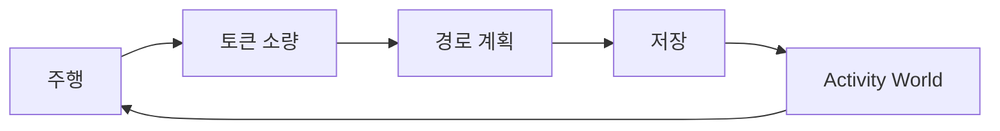

# Route Token — 경제·온보딩 설계

| 항목 | 내용 |
|------|------|
| 문서 유형 | **product** + **architecture** (경제 루프·Firestore·Functions 경계) |
| 작성일 | 2026-05-18 |
| 상태 | **검토 중** — M1 인프라 코드 반영됨. **제품 정의는 자문(2026-05-18) 기준으로 보완** · 소비처·마일리지 분리는 후속 스프린트 |
| 상위 | [Firestore 트래픽·Activity World](archive/260516-Firestore-트래픽-저감-상세-수정-계획.md) §1.5, [RTW 마스터 비전](260511-RTW-마스터-비전-및-종합계획.md) §3 |
| 연결 | [Activity World 지도 LOD](archive/260517-Activity-World-지도-LOD-설계.md), [기능 추가 계획(원전)](archive/260509-기능-추가-계획-제품-및-아키텍처.md), [아키텍처·DB 장기안](archive/260509-아키텍쳐-DB설계.md), [코스 수명·UGC](archive/260511-코스-수명-UGC-품질-정책.md), [보안 분석](archive/260516-보안-분석-보고서.md), [제품 용어 Trailhead·Trail](260517-제품-용어-Trailhead-Trail.md) |

> **용어:** 본 문서의 **Route Token(경로 토큰)** 은 Mapbox/Firebase **API 토큰**과 무관하다.

---

## 0. 제품 원칙 (자문 반영 — 2026-05-18)

> 아래는 **실내 사이클 운동 지속성**을 중심에 둔 자문 정리다. 본 문서는 이를 **참고**해 방향을 맞추되, 기술·비용 제약과 이미 반영된 M1 코드와의 **균형**을 §0.4·§7에서 명시한다.

### 0.1 한 줄

**운동이 주인공, 게임 요소는 조연.**  
보상·랜덤·성장은 모두 **「오늘도 타게 만드는」운동 행동 강화**를 위한 장치여야 한다.

### 0.2 피해야 할 방향

| 지양 | 이유 |
|------|------|
| 토큰·경제가 **운동을 방해** (생성·플레이 전 과도한 잠금) | 실내 반복 운동에서 마찰이 이탈로 이어짐 |
| **게임이 앞서는** 구조 (파밍·강화·MMO 경제·전투) | 운동 집중이 깨짐 — 운동앱 실패 패턴 중 하나 |
| 「세계 조작 자원」·**UGC 창작 RPG** 톤 | BOXCYCLE 강점은 지도·경로·**라이딩 흐름·시각화**이지 경제 시뮬이 아님 |

### 0.3 권장 비중 (자문)

| 요소 | 비중 | 본 서비스에의 대응 |
|------|------|-------------------|
| **운동 데이터** | ~60% | `rides`, 완주·거리·시간, **마일리지(누적 이력)**, 연속일·월간 요약 |
| **시각 경험** | ~20% | 맵 테마, HUD·속도계 스킨, 라이딩 분위기 |
| **가벼운 게임화** | ~15% | 소량 토큰, 배지, 약한 보너스, 스트릭 |
| **경쟁·경제** | ~5% | 랭킹·UGC 인기는 **비속도·비파밍** 중심 |

앱은 끝까지 **「운동앱」**처럼 느껴져야 한다.

### 0.4 M1 코드와 제품 정의의 관계 (중요)

| 층 | 내용 |
|----|------|
| **제품(목표)** | 토큰 = **운동 활동 보상 포인트** → **동기·시각·개인화·성취**에 소비 (§3.4) |
| **M1(현재 코드)** | 토큰 **획득**은 운동(완주) 연동 ✓. **소비**는 `getMapboxDirections` 1회 = **서버 비용·남용 방지** 게이트로만 연결됨 |
| **정렬 방향** | 경로 생성 차감은 **기술적 쿼터**로 유지 가능하되, UX 카피·우선 소비처는 **「운동 보상으로 꾸미기」** 로 전환. 장기적으로 **일일 무료 생성 N회** + 토큰은 **테마·코치·리포트** 등에 쓰는 **이중 트랙** 검토 (§7.2) |

자문을 **무조건** 따른다는 뜻이 아니다. M1은 **원장·서버 검증·적립 루프**를 먼저 깔아 두고, **소비 의미**는 아래 제품 정의에 맞춰 단계적으로 옮긴다.

---

## 1. 문제 정의

### 1.1 무엇을 만들 것인가

**핵심 목표:** 사용자가 **실내에서 꾸준히 라이딩**하게 만든다.  
지도·경로·Activity World는 **운동 리듬을 유지**하는 맥락(어디를 달렸는지, 세계가 비어 있지 않음)이지, 게임 자체가 아니다.

**보조 목표 (약한 동기):**

- 운동 후 **소량의 토큰** → 부담 없는 **시각·동기 보상**
- **마일리지**로 「얼마나 꾸준히 했는가」가 보이게
- (선택) 입문·공개 코스·발견 — **창작·탐험**은 운동을 **막지 않는** 옵션

**260516 「창작 루프」와의 관계:** 운동 → 토큰 → 경로 → 공개 → 발견 → 재운동은 **가능한 부가 루프**로 두되, **1차 루프는 운동 → 기록·마일리지 → (소량) 토큰 → 동기 보상 → 재운동** 이다 (§2).

### 1.2 현재 코드 (2026-05-18, M1)

| 항목 | 상태 |
|------|------|
| `routeTokenLedger` / `users.routeTokenBalance` | **구현** |
| 온보딩 +3, 완주 적립, 일일 상한(KST) | **구현** (`routeTokenOnRideCreated` 등) — 온보딩 수치는 **Guest 10 · 로그인 15** 로 갱신(2026-09-02, [3G](ops/route-relay/260902-거리방향-자동Route-3G-병합푸시-Token온보딩기본값-작업지시서.md)) |
| `getMapboxDirections` 선차감·환불 | **구현** (기술·비용 게이트) |
| UI MENU 「경로 토큰 N」 | **구현** |
| 마일리지(누적 이력) | **미구현** — §4 |
| 토큰 소비 → 테마·배지 등 | **미구현** — §3.4, §7.2 |

### 1.3 본 설계의 범위

| 포함 | 제외(별도 문서·후속) |
|------|----------------------|
| Route Token·마일리지 **역할 분리** (제품) | 결제·Premium SKU |
| 원장·Rules·CF 패턴 | 미션·시즌 전체 스펙 |
| M1 연동(경로 생성 쿼터) | 공개 승격·UGC 품질 게이트 |
| 약한 보너스·드롭 **원칙** | 확률형 장비·강화·MMO 경제 |

---

## 2. 핵심 루프 (재정의)

### 2.1 1차 루프 — 운동 지속 (권장)

| 단계 | 의미 | 재화 |
|------|------|------|
| 라이딩·완주 | **주인공 행동** | — |
| 기록·통계 | 거리·시간·칼로리·연속일 | **마일리지**(§4) |
| 보상 지급 | 「잘 탔다」 즉각 피드백 | **토큰**(소량) |
| 보상 사용 | 분위기·성취·개인화 | 토큰 **소비** |
| (선택) 커스텀 경로 | 지도 강점 활용 | 생성 **쿼터**(§0.4) |

### 2.2 2차 루프 — 창작·발견 (부가, 약하게)

- **공개·승격**은 토큰이 아니라 [코스 수명 정책](archive/260511-코스-수명-UGC-품질-정책.md).
- Activity World는 **「다른 사람도 탄다」** 느낌 — MMO가 아닌 **발견·동기**.

### 2.3 행동 유도 우선순위 (자문)

복잡한 RPG보다 **짧은 보상·즉각 피드백·부담 없는 목표·꾸준함**이 우선이다.

| 강함 | 약함·후순 |
|------|-----------|
| N일 **연속 라이딩** 스트릭 | 희귀 드랍 파밍 |
| 이번 달 거리·지난달 대비 | 강화·전투 |
| 「오늘 보너스 +3 토큰」 | 경제가 운동 시작을 막음 |

---

## 3. Route Token 정의

### 3.1 한 줄 정의 (제품)

> **Route Token** — **운동 활동 보상 포인트**. 완주·습관에 따라 **소량** 지급되고, **운동 동기·시각 변화·개인화·가벼운 성취**에 쓴다.

이전 초안의 「세계 조작·경로 생성 권한」 표현은 **기술 게이트**로만 한정하고, 사용자에게 보이는 가치는 **운동 보상** 쪽으로 맞춘다.

### 3.2 다른 「토큰」·축과의 구분

| 이름 | 의미 | 관계 |
|------|------|------|
| API **token** | Mapbox·Firebase 인증 | 무관 |
| **마일리지** | **운동 이력**(누적 거리·시간·칼로리·연속일) — **줄지 않음** | §4 — 토큰과 **분리** |
| **Route Token** | 소비 가능 **보상 포인트** | 본 문서 |
| **스트릭·배지** | 꾸준함·성취 **표시** (토큰 없이도 가능) | 토큰과 병행, 토큰에만 묶지 않음 |

### 3.3 획득 (Earn) — 운동 연동

원칙: **운동이 끝나면 부담 없이 조금** — 하루 과다 적립은 상한으로 막는다.

| 소스 | 강도 | 비고 |
|------|------|------|
| 완주 거리 기반 | **기본** | `earnPerKm` 소량 (§5.4) |
| 입문 코스 완주 | **소보너스** | 온보딩·첫 습관 |
| 온보딩 1회 | **시작 토큰** | Guest **10** · 로그인 **15** — **잠금 해제용이 아니라 환영** 톤 |
| **약한 랜덤** (§3.5) | **작은惊喜** | 「오늘 +3」「주말 보너스」 수준 |
| 연속 N일 라이딩 | **스트릭 보너스** (후속) | RPG보다 **행동 유도**에 가깝 |

**하지 않음:** 맵 위 희귀 아이템 파밍, 실시간 드랍 추적, 운동 중 뽑기 UI.

### 3.4 소비 (Spend) — 제품 우선순위

| 사용처 | 적절성 | 단계 |
|--------|--------|------|
| 라이딩 **테마**·맵 스타일 | ◎ | M2+ |
| HUD·속도계 **스킨** | ◎ | M2+ |
| **배지**·프로필 장식 | ◎ | M2+ |
| AI **코치 음성** 스타일 | ◎ | 후속 |
| 운동 **리포트** 강화 | ◎ | 후속 |
| 배경·시네마틱 (가벼운) | ○ | 후속 |
| **경로 생성** (`Directions`) | △ **기술 쿼터** | **M1** (§0.4) — UX 문구는 「서버 경로 계산」이지 「세계 확장권」이 아님 |
| 게임 전투·MMO 거래 | ✗ | 하지 않음 |

### 3.5 약한 랜덤 보상 (원칙)

「작은 예상 밖의 즐거움」만 허용한다.

| 허용 예 | 지양 |
|---------|------|
| 오늘 첫 라이딩 +1 토큰 | 확률형 장비 |
| 10km 달성 시 **배지** (고정) | 강화 시스템 |
| 주말·새벽 **소보너스** (운영 config) | 드랍률 farm |

v2 `tokenDrops`는 **고정 메타 + 완주 1회 클레임** — 지도에 파밍 POI를 깔지 않는다 ([260517 LOD](archive/260517-Activity-World-지도-LOD-설계.md)와 동일 철학).

### 3.6 M1 기술 소비 (현재 코드 — 유지·조정 가능)

| 액션 | M1 | 제품 카피 방향 |
|------|-----|----------------|
| `getMapboxDirections` 1회 | 1 토큰 차감 | 「경로 계산」쿼터 — **운동을 막지 않도록** 일일 **무료 N회** 검토 (§8 OQ-8) |
| 저장·주행·입문 코스 | 무료 | 유지 |
| `VITE_DIRECTIONS_DIRECT=1` | 토큰 우회 | 개발 전용 — 프로덕션 비권장 |

---

## 4. 마일리지 (별도 축 — 후속 설계)

자문: 마일리지 ≈ **「내가 얼마나 꾸준히 운동했는가」** 기록. **절대 줄어들지 않는다.**

| 항목 | 마일리지 | Route Token |
|------|----------|-------------|
| 성격 | **누적 이력** | **소비 가능 포인트** |
| 예시 | 총 km, 총 시간, 연속일, 월간 합 | 테마 해금, 스킨 |
| 감소 | **없음** (통계만) | 소비 시 감소 |
| UI | 프로필·리포트·성장 피드백 **중심** | MENU 소량 표시 + 상점(후속) |

**데이터(권장):** `mileage_ledger` 또는 `users` 집계 캐시 + `rides` 파생 — [기능 추가 계획 §9.2](archive/260509-기능-추가-계획-제품-및-아키텍처.md), [DB 장기안](archive/260509-아키텍쳐-DB설계.md).  
**M1 범위 밖.** 토큰 원장(`routeTokenLedger`)과 **혼합하지 않는다.**

---

## 5. 획득·소비 규칙 (수치 — config)

> 수치는 `config/routeTokenEconomy` · [시드 JSON](config-routeTokenEconomy.seed.json). **Firestore `config/routeTokenEconomy` 문서가 존재하면 문서 필드가 코드 기본값보다 우선**한다(필드 누락 시에만 코드·시드 fallback). PM 합의 시 config만 갱신.

### 5.1 소비 (M1 — 기술 게이트)

| 규칙 ID | 초안값 |
|---------|--------|
| `generateCostBase` | **1** |
| 부족 시 | Directions 호출 전 거부 |
| Mapbox 실패 | **환불** (`directions_refund`) — 채택 |

### 5.2 획득

| 소스 | `reason` | 초안 |
|------|----------|------|
| 온보딩 | `onboarding` | Guest **+10** · 로그인 **+15** (1회, `guestOnboardingGrant` / `onboardingGrant`) |
| 완주 | `ride_complete` | `floor(km × 0.15)` |
| 입문 | `ride_complete_intro` | **+2** |
| 약한 보너스 | `daily_bonus` 등 | **후속** — reason 추가 |
| 드롭 | `drop_claim` | v2, 고정 보상만 |

**가드:** 최소 1km·3분, 일일 적립 상한(KST), `ride_complete:{rideId}` 멱등.

### 5.3 티어

Guest cap 강화 · Premium은 **생성 무제한**보다 **시각·리포트** 우대를 우선 검토 (자문 §0.3).

---

## 6. 데이터 설계 (Firestore v1)

M1 스키마는 **유지** (`routeTokenLedger`, `users.routeTokenBalance`, `config/routeTokenEconomy`).  
마일리지 추가 시 **별 컬렉션** — §4.

`RouteTokenReason` (현재):  
`onboarding` | `ride_complete` | `ride_complete_intro` | `route_generate` | `directions_refund` | `drop_claim` | `admin_adjust`  
후속: `streak_bonus` | `daily_bonus` | `unlock_theme` (소비) 등.

---

## 7. 구현 단계 (재정렬)

### 7.1 완료·진행

| 단계 | 내용 | 제품 정합 |
|------|------|-----------|
| **M0–M1** | 원장·적립·Directions 쿼터·UI 잔액 | 인프라 ✓ · 소비 의미는 §0.4 |

### 7.2 권장 로드맵 (자문 정렬)

| 단계 | 내용 |
|------|------|
| **M1.5** | UX: 「경로 토큰」→ **「운동 보상」** 카피, 완주 시 +N 피드백, **무료 생성 N회/일** 검토 |
| **M2** | **마일리지** 누적(비감소)·프로필/월간 요약 |
| **M3** | 토큰 **소비** 1차: 테마·HUD 스킨 1~2종 |
| **M4** | 스트릭·약한 일일 보너스 (`daily_bonus`) |
| **M5** | 고정 `tokenDrops`/배지 — **파밍 없음** |
| **보류** | MMO·경매·강화·전투 |

[260516](archive/260516-Firestore-트래픽-저감-상세-수정-계획.md) Activity World·aggregate는 **운동 맥락** 유지, 토큰 드롭은 §3.5 수준.

### 7.3 M1 스모크 (기술)

1. 신규 Guest → 잔액 10 · 신규 로그인 → 잔액 15.  
2. Guest 경로 생성 10회(또는 harness seed 3회) → 0 → 거부.  
3. 완주 → 적립·ledger.  
4. Mapbox 실패 → 환불.

---

## 8. 열린 질문 (PM 합의)

| ID | 질문 | 자문 쪽향 |
|----|------|-----------|
| OQ-1 | 마일리지 vs 토큰 | **분리** — 마일리지 M2 |
| OQ-2 | 재생성 비용 | **0** + 일일 생성 캡 |
| OQ-8 | **일일 무료 경로 생성 N회** | 토큰은 **보상 상점**, 생성은 쿼터 분리 검토 |
| OQ-9 | MENU 잔액 노출 | 유지하되 **「운동 보상」** 라벨 |
| OQ-5~7 | 환불·KST·Premium | M1 채택·검토 중 |

---

## 9. 관련 문서

| 주제 | 단일 진실 |
|------|-----------|
| **제품 원칙·토큰/마일리지 역할** | **본 문서 §0~§4** |
| 원장·CF·M1 API | 본 문서 §5~§6 + 코드 |
| Activity World 표현 | [260517 LOD](archive/260517-Activity-World-지도-LOD-설계.md) |
| 260516 토큰 한 줄 | [260516 §1.5](archive/260516-Firestore-트래픽-저감-상세-수정-계획.md) — **본 문서가 제품 정의 우선** |

---

## 10. 개정 이력

| 날짜 | 내용 |
|------|------|
| 2026-05-18 | 초안 — Route Token, Directions 연동, MVP |
| 2026-05-18 | 260516·260517·260509 링크 |
| 2026-05-18 | **자문 반영** — 운동 주인공·토큰=보상 포인트·마일리지 분리·약한 랜덤·M1 기술/제품 이중 트랙·로드맵 재정렬 |
