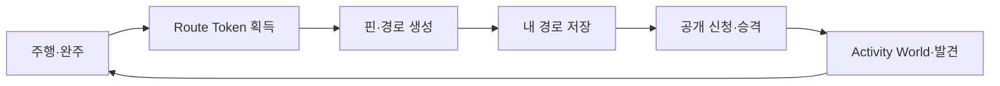

# Route Token — 경제·온보딩 설계 (초안)

| 항목 | 내용 |
|------|------|
| 문서 유형 | **product** + **architecture** (경제 루프·Firestore·Functions 경계) |
| 작성일 | 2026-05-18 |
| 상태 | **코드 반영 중(2026-05-18)** — M0·M1(원장·Directions 차감·완주 적립·온보딩·UI 잔액) 반영. 배포·콘솔 시드 후 스모크 |
| 상위 | [Firestore 트래픽·Activity World](260516-Firestore-트래픽-저감-상세-수정-계획.md) §1.5, [RTW 마스터 비전](260511-RTW-마스터-비전-및-종합계획.md) §3 |
| 연결 | [Activity World 지도 LOD](260517-Activity-World-지도-LOD-설계.md), [기능 추가 계획(원전)](260509-기능-추가-계획-제품-및-아키텍처.md), [아키텍처·DB 장기안](260509-아키텍쳐-DB설계.md), [코스 수명·UGC](260511-코스-수명-UGC-품질-정책.md), [보안 분석](260516-보안-분석-보고서.md), [제품 용어 Trailhead·Trail](260517-제품-용어-Trailhead-Trail.md) |

> **용어:** 본 문서의 **Route Token(경로 토큰)** 은 Mapbox/Firebase **API 토큰**과 무관하다. API 인증·프록시는 [로그인·인증 흐름](260515-로그인-인증-코드-위치-및-흐름-보고서.md), `getMapboxDirections` 를 본다.

---

## 1. 문제 정의

### 1.1 무엇을 만들 것인가

**목표:** 사용자가 **운동(주행)** 으로 얻은 보상으로 **새 길(커스텀 경로)** 을 만들고, 그 길을 **저장·공개**해 세계에 남기며, **다른 사람의 활동(Activity World)** 을 보고 다시 달리게 하는 **창작·탐험 루프**를 닫는다.

**토큰의 역할:** Mapbox Directions 등 **서버 비용이 나는 「경로 생성」** 에 대한 **소비 권한**. 무제한 생성은 비용·남용(익명 계정 다발 생성)에 취약하다([보안 분석 H1](260516-보안-분석-보고서.md)).

### 1.2 현재 코드 (2026-05-18 기준)

| 항목 | 상태 |
|------|------|
| 경로 생성 | 로그인(게스트 포함)만 필요 — **잔액·차감 없음** |
| `getMapboxDirections` | ID 토큰 검증 후 Mapbox 호출 (`functions/src/index.ts`) |
| 주행 완주 | `rides` 저장 — **토큰 지급 없음** |
| 경제 컬렉션 | `routeTokenLedger` 등 **미구현** |

### 1.3 본 설계의 범위

| 포함 | 제외(별도 문서·후속) |
|------|----------------------|
| Route Token 정의·획득·소비·원장 | 마일리지·XP·레벨 상세 수치 |
| `getMapboxDirections` 연동·멱등 차감 | 결제·구독(Premium) SKU |
| 완주 기반 적립·온보딩 지급 | 미션·배지·시즌 전체 스펙 |
| 토큰 드롭(개념·데이터 경계) | 공개 승격·품질 게이트(UGC 수명 정책이 담당) |

---

## 2. 핵심 루프



| 단계 | 제품 의미 | 토큰 관여 |
|------|-----------|-----------|
| 주행·완주 | 습관·거리·완주감 | **획득** |
| 경로 생성 | Mapbox Directions 1회 | **소비** |
| 저장 | `savedRoutes` 개인 자산 | 기본: **소비 없음**(생성 시만) |
| 공개 | UGC 승격 게이트 | 토큰 **아님** — [코스 수명 정책](260511-코스-수명-UGC-품질-정책.md) |
| 발견 | `courseActivity`·월드 맵 | 동기 부여; v2 **토큰 드롭** POI |

**철학 정렬:** [260516 §1.5](260516-Firestore-트래픽-저감-상세-수정-계획.md) — 토큰 = 경로 생성 권한 · 세계 확장. Firestore 읽기 패턴과 **분리**하되 aggregate·이벤트 메타와 **정렬**한다.

---

## 3. Route Token 정의

### 3.1 한 줄 정의

> **Route Token** — 사용자가 **커스텀 경로를 새로 계산할 때** 소비하는 정수 단위 재화. 서버 원장으로만 증감한다.

### 3.2 다른 「토큰」·화폐와의 구분

| 이름 | 의미 | 본 문서 |
|------|------|---------|
| Mapbox / Mapillary / Firebase ID **token** | API·인증 | **무관** |
| **Route Token** | 경로 생성 권한 | **본 문서** |
| **마일리지** (legacy 기획) | 레벨·미션·광의 진행도 | **별도** — [기능 추가 계획 §4](260509-기능-추가-계획-제품-및-아키텍처.md). MVP에서는 Route Token만 구현해도 됨 |
| **coin** (DB 장기안) | Postgres 설계상 `coins_ledger` | Firestore v1에서는 **`routeTokenLedger`** 로 명명 통일. Postgres 이전 시 테이블명 매핑 문서에 기록 |

### 3.3 소비 대상 (과금 액션)

| 액션 | 과금 | 근거 |
|------|------|------|
| MENU·지도 **「경로 생성」** → `getMapboxDirections` 1회 | **예** (기본 1 토큰) | Directions API 1 call ≈ 1 단위 |
| 입문·퍼블릭·저장 경로 **로드** 후 주행 | 아니오 | 소비(플레이)는 무료 |
| **내 경로로 저장** | 아니오 (권장) | 이미 생성 비용 지불; 저장 슬롯은 티어·수명 정책 |
| 프로필만 변경 후 **재생성** (같은 핀) | **정책 선택** — §8 OQ-2 | UX vs 남용 trade-off |
| 역지오코딩·지도 타일 | 아니오 | 별도 레이트 리밋·URL 제한 |

---

## 4. 획득·소비 규칙 (초안 수치)

> 아래 수치는 **placeholder**. PM 합의 후 `config/routeTokenEconomy` 만 갱신하고 본 절 표를 확정한다.

### 4.1 소비 (Spend)

| 규칙 ID | 설명 | 초안값 |
|---------|------|--------|
| `generateCostBase` | 경로 생성 1회 기본 비용 | **1** |
| `generateCostPer50km` | 거리 가산(선택) | **+1 per 50km** 예상 거리 구간 — 요청 전 추정 불가 시 **사후 가산 금지**, 생성 **전** 핀 간 직선·이전 결과로 상한만 표시 |
| `insufficientBalance` | 잔액 < 비용 | Directions **호출 전** 거부, HTTP `resource-exhausted` 또는 앱 정의 코드 |

**차감 시점:** Mapbox `fetch` **직전**. 실패 시 Directions 미호출.

**환불:** Mapbox 5xx·타임아웃 시 **역분개 ledger** (`reason: directions_refund`) — §8 OQ-5.

### 4.2 획득 (Earn)

| 소스 | `reason` | 초안 규칙 |
|------|----------|-----------|
| 온보딩 | `onboarding` | 계정 최초 `users` 생성 시 **+3** (1회) |
| 완주 | `ride_complete` | `floor(distanceKm × earnPerKm)` — **`earnPerKm = 0.15`** (15km 완주 ≈ 2 토큰) |
| 입문 코스 완주 보너스 | `ride_complete_intro` | 위에 **+2** (코스 `type=intro` 또는 allowlist) |
| 토큰 드롭 | `drop_claim` | 드롭별 고정 (v2) |
| 운영·보상 | `admin_adjust` | Functions Admin only |

**공통 가드 (어뷰징):**

| 가드 | 초안 |
|------|------|
| 최소 완주 거리 | **1 km** 미만 완주 → 적립 0 |
| 최소 주행 시간 | **3분** 미만 → 적립 0 |
| 일일 적립 상한 | **`dailyEarnCap = 10`** (UTC 또는 KST — 구현 시 하나로 고정) |
| 멱등 키 | `ride_complete:{rideId}` — 동일 ride 중복 지급 방지 |
| Basic/입문 가중치 | 통계 버킷 분리는 [기능 추가 계획 §2.2](260509-기능-추가-계획-제품-및-아키텍처.md) — 토큰은 입문 **보너스**만 |

### 4.3 사용자 티어 ([RTW §3](260511-RTW-마스터-비전-및-종합계획.md))

| 티어 | 토큰 정책 방향 |
|------|----------------|
| **Guest** | 적립·생성 **일일 캡 강함** (예: earn cap 3, generate cap 2) — uid ledger 유지 |
| **Free** | §4.2 기본 |
| **Premium** | 월간 지급 또는 생성 캡 완화 / **무제한 생성**(구독 = 서버 비용 대체) — SKU 합의 후 |

티어 필드는 `users/{uid}.tier` 또는 Auth custom claims — **구현 스프린트에서 확정**.

---

## 5. 데이터 설계 (Firestore v1)

### 5.1 컬렉션·문서

```
users/{uid}
  routeTokenBalance: number              // UI·Rules 읽기용 캐시
  routeTokenBalanceUpdatedAt: Timestamp
  routeTokenOnboardingGranted?: boolean  // 온보딩 1회 지급 플래그

routeTokenLedger/{entryId}               // 불변 원장 (정합성의 단일 진실)
  userId: string
  delta: number                          // + 적립, - 소비
  balanceAfter: number
  reason: RouteTokenReason               // §5.2
  refType: 'ride' | 'directions' | 'drop' | 'admin' | null
  refId: string | null
  idempotencyKey: string                 // 유니크 (트랜잭션 전 검사)
  createdAt: Timestamp

config/routeTokenEconomy                 // 수치·상한 (클라이언트 읽기 가능, 쓰기 Admin)
  generateCostBase, earnPerKm, dailyEarnCap, guestDailyEarnCap, ...

config/tokenDrops/{dropId}               // v2 — §6.3
  title, courseId?, anchorLngLat, rewardTokens, activeFrom, activeUntil
```

### 5.2 `RouteTokenReason` (열거)

`onboarding` | `ride_complete` | `ride_complete_intro` | `route_generate` | `directions_refund` | `drop_claim` | `admin_adjust`

### 5.3 원장·잔액 불변식

- **진실:** `routeTokenLedger` 합 = 사용자별 순잔액. `routeTokenBalance`는 **캐시**.
- **쓰기:** Cloud Functions **전용**. 클라이언트 `set`/`update` on ledger **deny**.
- **트랜잭션:** ledger append + `users.routeTokenBalance` 갱신을 **단일 Firestore transaction**.
- Postgres 이전 시: [아키텍처 DB §2](260509-아키텍쳐-DB설계.md) `coins_ledger` / `coin_balances` 와 1:1 매핑 표를 [이전 체크리스트](260509-Firestore-Postgres-이전-체크리스트.md)에 추가.

### 5.4 인덱스

- `routeTokenLedger`: `(userId, createdAt desc)` — 내역 UI
- `routeTokenLedger`: `idempotencyKey` **유니크** (collection group 또는 항목별 선조회)

---

## 6. 시스템 연동

### 6.1 경로 생성 — `getMapboxDirections`

**흐름:**

1. `verifyIdToken` → `uid`
2. (선택) 클라이언트 `requestId` UUID — 멱등 키 `route_generate:{requestId}`
3. 비용 계산 → `routeTokenBalance` 확인
4. 부족 시 **4xx** + 메시지 `경로 토큰이 부족합니다. 주행을 완료하면 토큰을 받을 수 있습니다.`
5. ledger 차감 (`reason: route_generate`)
6. Mapbox Directions 호출
7. 실패 시 §4.1 환불 정책
8. 응답 JSON에 `routeTokenBalance` (선택) 포함

**클라이언트:** [useRoutePlanning](apps/web/src/hooks/useRoutePlanning.ts) `generateRoute` — `resource-exhausted` 처리, MENU 잔액 표시.

### 6.2 완주 적립

**트리거 후보 (하나 선택):**

| 방식 | 장점 | 단점 |
|------|------|------|
| `rides` **onCreate** CF | 단순 | 완주 필드 검증 필요 |
| `rides` **onUpdate** (`isCompleted`) | 완주 시점 정확 | 이중 호출 주의 |
| Callable `finalizeRide` | 검증 일원화 | 클라이언트 호출 추가 |

**권장:** `rides` 문서에 `completedAt`·`distanceM`·`durationSec` 확정 후 CF — [useRideEndAndPersistence](apps/web/src/hooks/useRideEndAndPersistence.ts) 와 계약 정리.

### 6.3 토큰 드롭 (v2, Activity World 연동)

[260516 §4.5](260516-Firestore-트래픽-저감-상세-수정-계획.md):

- **고정 메타** `config/tokenDrops` + (선택) `worldActivity` / 지도 **DOT** 레이어
- **완주 시 보상:** 해당 `courseId`·구간 조건 충족 시 `drop_claim:{dropId}:{uid}` 멱등 지급
- **하지 않음:** GPS 스트리밍, 실시간 드롭 위치 갱신

[Activity World LOD](260517-Activity-World-지도-LOD-설계.md) — 탐험 POI는 live aggregate와 **별 소스**, 저빈도 `getDoc`만.

### 6.4 UI 터치포인트 (초안)

| 위치 | 내용 |
|------|------|
| MENU / `RideRoutePanel` | 잔액 `🪙 N` · 토큰 부족 시 생성 버튼 비활성 + 안내 |
| 경로 생성 성공 | `-1` 토스트 (선택) |
| 주행 종료 | `+N` 토큰 획득 (완주 시) |
| 온보딩 | 첫 로그인 「시작 토큰 3개」 카드 |

---

## 7. 구현 단계 (MVP)

| 단계 | 내용 | Activity World |
|------|------|----------------|
| **M0** | 스키마·Rules·`config/routeTokenEconomy` 시드 | — |
| **M1** | 생성 차감 + 완주 적립 + 온보딩 + UI 잔액 | 루프 닫힘 |
| **M2** | 일일 상한·게스트 캡·장거리 가산(선택) | — |
| **M3** | `tokenDrops` + 지도 POI + 클레임 | §6.3 |
| **M4** | 미션·마일리지 연동 | 기능 계획 Phase B~C |

[260516 구현 순서](260516-Firestore-트래픽-저감-상세-수정-계획.md) 「토큰·첫 경로 생성 온보딩」= **M1**.

### 7.1 M1 수용 기준 (스모크)

1. 신규 로그인 → 잔액 3.
2. 경로 생성 3회 성공 → 잔액 0 → 4회째 거부.
3. 입문/커스텀 코스 완주(가드 통과) → 잔액 증가, ledger `ride_complete` 1건.
4. 동일 `rideId`로 CF 재실행 → 적립 중복 없음.
5. Mapbox 실패 시 잔액 복구(환불 정책 채택 시).

---

## 8. 열린 질문 (PM 합의)

| ID | 질문 | 권장 초안 |
|----|------|-----------|
| OQ-1 | 마일리지와 Route Token **이중 화폐** 여부 | MVP: **Token만** |
| OQ-2 | 같은 핀·**프로필만 변경** 재생성 비용 | **0 토큰** (일일 N회 캡으로 남용 방지) |
| OQ-3 | **저장** 시 추가 과금 | **없음** |
| OQ-4 | Guest ledger **영구 vs 로그인 유도** | Guest uid 유지, cap만 강하게 |
| OQ-5 | Directions 실패 **환불** | **환불함** |
| OQ-6 | 일일 상한 **UTC vs KST** | **KST** (운영·이벤트와 정렬) |
| OQ-7 | Premium **무제한 생성** vs 월간 지급 | 구독 SKU 확정 후 |

합의 결과는 본 절·§4 표·`config/routeTokenEconomy` 에 반영하고 상태를 `검토됨`으로 올린다.

---

## 9. 관련 문서 역할 (중복 방지)

| 주제 | 단일 진실 |
|------|-----------|
| Route Token 경제·원장·Directions 연동 | **본 문서** |
| Activity World 지도 표현 | [260517 LOD](260517-Activity-World-지도-LOD-설계.md) |
| 공개·수명·품질 | [260511 코스 수명](260511-코스-수명-UGC-품질-정책.md) |
| Firestore 읽기·aggregate | [260516 트래픽](260516-Firestore-트래픽-저감-상세-수정-계획.md) |
| 마일리지·미션·배지 원전 | [260509 기능 추가](260509-기능-추가-계획-제품-및-아키텍처.md) (갱신 중단, 신규는 본 문서·마스터) |

---

## 10. 개정 이력

| 날짜 | 내용 |
|------|------|
| 2026-05-18 | 초안 — Route Token 정의, 루프, 원장, Directions·완주 연동, MVP 단계, OQ |
| 2026-05-18 | 260516·260517·260509(기능·DB) 상호 링크 반영 |
