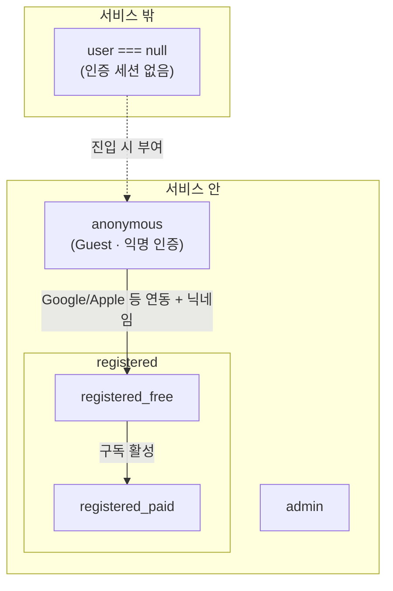

# 사용자 tier · 진입 정책

| 항목 | 내용 |
|------|------|
| 문서 유형 | **product** + **architecture** — identity·tier·Firestore의 **단일 진실** |
| 작성일 | 2026-05-19 |
| 상태 | **채택(제품)** — 코드·RTW §3 정합 작업은 §6 로드맵 |
| 상위 | [RTW 마스터 비전](260511-RTW-마스터-비전-및-종합계획.md), [Route Token 경제](260518-Route-Token-경제-설계.md) |
| 연결 | [로그인·인증 흐름](260515-로그인-인증-코드-위치-및-흐름-보고서.md), [Firestore 스키마 초안](260509-Firestore-컬렉션-스키마-초안.md), [코스 수명·UGC](260511-코스-수명-UGC-품질-정책.md) |

---

## 1. 제품 원칙 (PM + 자문 정렬)

### 1.1 한 줄

> **앱의 사용은 인증(identity)에서 출발한다.**  
> `uid` 없는 상태에서는 **서비스 기능을 제공하지 않는다.**

### 1.2 「비로그인」 용어 금지

| 허용하지 않음 | 대신 쓸 말 |
|---------------|------------|
| 비로그인 사용자가 앱을 **사용**한다 | **인증 전** · **세션 없음** (기능 불가) |
| Guest = 비로그인 (RTW 구 표현) | **Guest = 익명 인증 완료** (`Firebase Anonymous Auth`) |

PM 방침 「비로그인 개념을 허락하지 않는다」와 자문 「즉시 익명 진입」은 **모순이 아니다.**

- **금지하는 것:** Mapbox·Firestore·주행·토큰 등 **제품 기능을 `user === null` 에서 돌리는 것**
- **허용하는 것:** 진입 시 **자동 또는 1탭으로** `signInAnonymously` → **Guest tier** 부여

### 1.3 자문과 PM의 합의점

| 주제 | PM | 자문 | 본 문서 |
|------|-----|------|---------|
| identity 필수 | ✓ | ✓ | 모든 활동 `uid` |
| Guest = anonymous auth | ✓ (진입 문턱) | ✓ | `tier: anonymous` |
| Free / Paid | ✓ (추후 권한) | quota·기능 제한 형태 | `registered_free` / `registered_paid` |
| 진입 마찰 | 익명 미수락 시 차단 | **마찰 최소화** 권장 | §2.2 UX |
| MMO·월드·토큰 | — | identity 필요 | Rules·CF 단순화 |

---

## 2. tier 체계 (정립)

### 2.1 계층 구조



### 2.2 tier 열거 (Firestore `users.tier`)

| `tier` 값 | 제품 명칭 | Firebase Auth | 닉네임 | 유료 |
|-----------|-----------|---------------|--------|------|
| `anonymous` | **Guest User** | `isAnonymous === true` | 없음(표시명만) | — |
| `registered_free` | **로그인 · 무료** | 연동 계정 | **필수** (`nicknames/`) | 아니오 |
| `registered_paid` | **로그인 · 유료** | 연동 계정 | 필수 | 예 |
| `admin` | 운영·심사 | 연동 | — | — |

**초기 구현은 위 4값만.** 세부 플랜명·SKU는 `subscription` 문서로 분리.

### 2.3 Auth ↔ tier 매핑 (단일 진실)

| Auth 상태 | `users.tier` (권장) | 비고 |
|-----------|---------------------|------|
| 세션 없음 | *(문서 없음)* | 앱 **기능 불가** |
| Anonymous | `anonymous` | Guest |
| Google 등 + 닉네임 완료 | `registered_free` | 기본 |
| 구독 active | `registered_paid` | CF/Webhook이 갱신 |
| `config/routeReviewers.uids` | `admin` (선택) | 또는 별도 admin claim |

**규칙:** `tier`는 **서버(Functions) 또는 최초 프로필 생성 시** 설정. 클라이언트가 `registered_paid` 로 올리지 못하게 Rules.

### 2.4 승격 경로

| From | To | 트리거 |
|------|-----|--------|
| (없음) | `anonymous` | 앱 진입 · 익명 인증 성공 |
| `anonymous` | `registered_free` | `linkWithPopup` / 계정 연동 + 닉네임 확정 |
| `registered_free` | `registered_paid` | 결제·구독 Webhook |
| `registered_paid` | `registered_free` | 구독 만료 |

Firebase **uid 유지** (`linkWithPopup`) → `rides`·`routeTokenLedger`·마일리지 연속.

### 2.5 권한 차별 (제품 — 상세 수치는 후속)

**Guest (`anonymous`)** — 체험·습관

- 입문·퍼블릭 코스 **주행**
- 제한적 경로 생성·저장 (quota)
- 공개 UGC·이벤트 생성·랭킹 **불가** (또는 강한 제한)
- TTL·저장 정책: [코스 수명 §2.1](260511-코스-수명-UGC-품질-정책.md) Guest 행

**로그인 · 무료 (`registered_free`)**

- 주행·`rides`·Trail presence·기본 통계
- 경로 생성·저장 **월간 quota** (자문: 기능보다 quota 운영이 쉬움)
- 이벤트 **참여** (생성은 paid 또는 제한)

**로그인 · 유료 (`registered_paid`)**

- 경로 생성·**이벤트 생성**·확장 저장·고급 분석·AI assist 등 (PM: 경로·이벤트 권한 차이)
- 정복 컬렉션 보호 등 [RTW §3.3](260511-RTW-마스터-비전-및-종합계획.md)

**차별화 축 (자문 권장):** 잠금보다 **생성량 · 저장량 · 공개 범위 · AI · 월간 quota**.

---

## 3. 진입 UX (자문 반영)

### 3.1 목표

- PM: 익명 미동의 시 **진입 불가**
- 자문: 「로그인 강제」가 아니라 **「익명 진입 마찰 최소화」**

### 3.2 권장 플로우 (프로덕션)

```text
앱 실행
  → (최초 1회) 「임시 라이더 ID를 만들어 세계에 참가합니다. 나중에 계정 전환 가능」 + [시작]
  → signInAnonymously (자동 또는 1탭)
  → tier = anonymous · 지도 즉시
  → (나중) 저장·공개·결제 시점에 Google + 닉네임 → registered_free
```

**하지 않을 것 (프로덕션):**

- `user === null` 인 채 지도·주행·Firestore 읽기 ([현재] `postSignoutMapSession` 맵 유지)
- localStorage만으로 주행·경로 **영속** (인증 없이 서버 동기화)

### 3.3 개발·테스트 예외

| 환경 | 정책 |
|------|------|
| 로컬 / `VITE_*` 미설정 | 기존처럼 Firebase 미설정 안내 |
| 내부 QA | `VITE_ALLOW_UNAUTH_MAP=1` 등 **명시적 플래그**로만 `null` 허용 (선택) |

웹도 **프로덕션 빌드**에서는 §3.2와 동일.

---

## 4. DB · Rules 관점

### 4.1 `users/{uid}` 필드 (확장)

```typescript
{
  // 기존
  displayName, email, photoURL, isAnonymous,
  nickname?, nicknameKey?,
  routeTokenBalance, ...

  // 신규
  tier: 'anonymous' | 'registered_free' | 'registered_paid' | 'admin',
  tierUpdatedAt: Timestamp,
  subscriptionStatus?: 'none' | 'active' | 'past_due' | 'canceled',
  subscriptionExpiresAt?: Timestamp | null,
}
```

- **Guest 생성 시:** CF 또는 클라이언트(허용 필드만) `tier: 'anonymous'`, `isAnonymous: true`
- **닉네임 확정 시:** CF가 `tier: 'registered_free'` 로 승격
- **결제:** CF/Webhook만 `registered_paid`

### 4.2 Rules 원칙

- `request.auth != null` — **모든** 제품 컬렉션 read/write 기본
- `get(/users/$(uid)).data.tier` — 이벤트 생성·공개 신청 등 **기능별** (Functions 병행)
- `tier`·`subscription*`·`routeToken*` — 클라이언트 **직접 수정 금지**

### 4.3 Functions

- `getMapboxDirections` · Route Token · `rides` — **`uid` 필수** (현행과 동일)
- quota·tier 검증은 **CF에서** (클라이언트만 신뢰하지 않음)

### 4.4 localStorage

| 데이터 | `user === null` | Guest | Registered |
|--------|-----------------|-------|------------|
| 주행 임시 | **금지(신규)** | Firestore 우선 | Firestore |
| 저장 경로 | **금지(신규)** | 마이그레이션 후 FS | Firestore |

기존 로컬 데이터: Guest 인증 후 **1회 마이그레이션**(현재 savedRoutes 패턴 유지).

---

## 5. 현재 체계와의 차이

| 항목 | 현재 (코드·구 RTW) | 목표 (본 문서) |
|------|-------------------|----------------|
| Guest 정의 | RTW 「비로그인」 혼용 | Guest = **anonymous auth** |
| `user === null` | 게이트·로그아웃 후 **맵 사용 가능** | **기능 불가** · 재인증 필수 |
| 진입 | 사용자가 「게스트」**수동 클릭** | **자동/1탭** 익명 인증 권장 |
| Free / Paid | `isAnonymous` 만 구분 | **`users.tier`** |
| 유료 | 미구현 | `registered_paid` + subscription |
| 권한 표현 | 산재 | tier + **quota 표** (후속 문서) |

---

## 6. 수정 로드맵

| 단계 | 작업 | 산출 |
|------|------|------|
| **D0** | 본 문서 채택 · [RTW §3](260511-RTW-마스터-비전-및-종합계획.md) 용어 수정 | 문서 정합 |
| **D1** | Auth: `needsAuthCard` 시 **익명 자동/1탭** · `postSignoutMapSession` 프로덕션 제거 | `useAppAuth` · `App.tsx` |
| **D2** | `!user` 시 주행·경로·presence **하드 차단** · local-only 신규 쓰기 제거 | hooks |
| **D3** | `users.tier` 필드 · 온보딩/닉네임/연동 CF에서 설정 | Functions |
| **D4** | Rules: `tier` 클라 쓰기 금지 · 기능별 read 조건 | `firestore.rules` |
| **D5** | quota 표(경로 생성·이벤트) + CF 검증 | 별도 product 문서 |
| **D6** | 결제·`registered_paid` | Stripe 등 후속 |

**우선순위:** D0 → D1 → D2 (진입·null 제거) → D3 → D4. D5·D6는 PM quota 합의 후.

---

## 7. 시니어 의견 요약 (본 설계에 대한 평가)

**동의하는 점**

- Activity World·토큰·`rides`·UGC로 가면 **identity 없는 설계는 기술 부채**가 된다. PM 방향이 맞다.
- Guest를 **Firebase anonymous**와 동일시하면 Auth·Rules·이전(migration)이 단순해진다.
- Free/Paid를 **기능 잠금**보다 **quota**로 풀면 운영·튜닝이 쉽다 (자문과 일치).
- tier 4값 + subscription 메타면 **1차 마일스톤에 충분**하다.

**조정을 권하는 점**

1. **「익명 미수락 = 진입 차단」** 은 **기능 차단**으로 구현하고, UX는 「임시 라이더 ID」로 **1탭·자동 anonymous** — 거부 시 앱이 꺼지는 느낌을 피한다.  
2. **로그아웃 후 맵만 보기**(`postSignoutMapSession`)는 프로덕션에서 제거 — `null` 상태를 다시 허용하는 가장 큰 구멍.  
3. **`tier`는 Auth만 믿지 말 것** — `users.tier`를 Firestore에 두고 CF가 갱신 (결제·승격). `isAnonymous`는 **캐시/표시**용으로만 병행.  
4. **admin**은 `tier` 또는 `config/routeReviewers` **한 곳**으로 통일.

**리스크**

- 자동 anonymous 직후 **닉네임·Google 강요 없음** — Guest에 과도한 권한을 주지 않도록 D5 quota를 빠르게.  
- Guest→Registered 전환율은 **저장·공개·기기 이전** 타이밍에 CTA — tier 설계와 별도 UX 이슈.

---

## 8. 개정 이력

| 날짜 | 내용 |
|------|------|
| 2026-05-19 | 초안 — PM tier 정립 + 자문(즉시 익명·quota) 반영, 현재 코드 갭·로드맵 |
