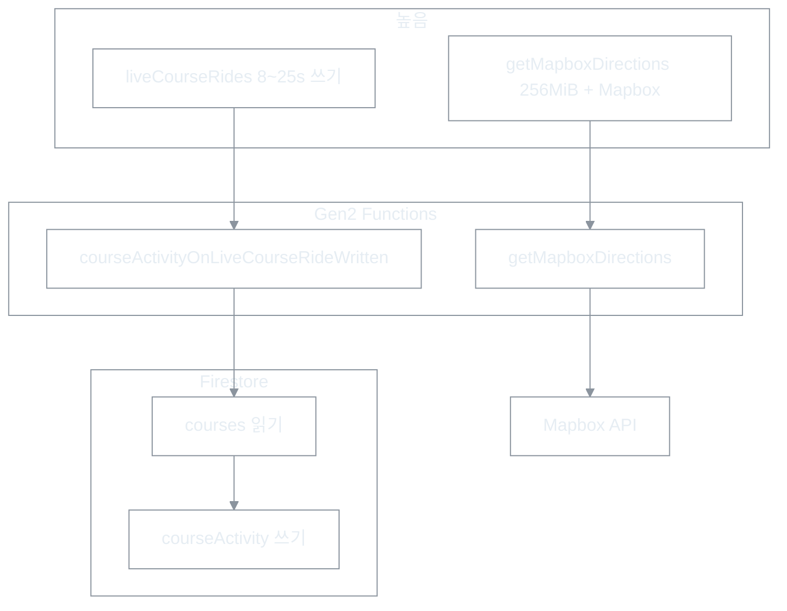

# Firebase·GCP 비용 운영 체크리스트

| 항목 | 내용 |
|------|------|
| 문서 유형 | **execution** — Blaze 비용 관측·예산·Functions/Firestore/Storage 대응 체크리스트 |
| 최초 작성 | 2026-05-23 |
| 상태 | **검토됨** |
| 연결 문서 | [보안 분석 보고서](260516-보안-분석-보고서.md), [Firestore 트래픽 저감 계획](260516-Firestore-트래픽-저감-상세-수정-계획.md), [Firestore 부하 1차 조치 종합](260515-(cycle)Firestore-부하-경감-조치-종합보고서.md), [Activity World LOD](260517-Activity-World-지도-LOD-설계.md), [문서 생성·수정 지침](260509-BOXCYCLE-문서-생성-및-수정-지침.md) |

---

## 1. 요약 (2026-05-23 기준 관측)

| 항목 | 관측 | 해석 |
|------|------|------|
| 월 청구(테스트 규모) | Functions ₩30, Firestore ₩5, 합 ₩35 | 호출 수(3,300/월)만으로는 Functions ₩30이 나오기 **어렵다** |
| Functions 호출 | 3,300회 (월 200만 무료의 0.2%) | **CPU·메모리·GB-초·네트워크** 과금 가능성 큼 |
| Firestore | 읽기 230, 쓰기 76/일 | 현재는 미미. **트리거 증폭** 시 Functions보다 먼저 커질 수 있음 |
| Storage | 저장 1GB·대역폭 10GB **무료 초과** 표시 | Hosting(71MB)과 별도 SKU — GCS·업로드 자산 확인 필요 |
| `minInstances` | 코드·배포 설정 **없음** | 현재 원인 아님. **추가 시 유휴 비용 급증** — 금지 |

**단일 진실(비용 원인 가설):** Gen2 Functions(Cloud Run) **실행 시간·메모리·함수 수** + `liveCourseRides` **Firestore 트리거 연쇄** + (잠재) **`getMapboxDirections` 남용**.

---

## 2. 비용이 커지는 경로 (코드 기준)

| 위험 | 트리거·코드 | 스케일 시 |
|------|-------------|-----------|
| **높음** | `trails/.../liveCourseRides` 쓰기 → `courseActivityOnLiveCourseRideWritten` → `touchCourseLiveProgress`(매번 `courses` 읽기) | 동시 주행 N명 ≈ CF·FS 읽기/쓰기 **N배** |
| **높음** | `getMapboxDirections` — 토큰 ledger·Mapbox 외부 호출, `invoker: public` | 봇·익명 남용 → CF + Mapbox 동시 증가 ([보안 H1·H5](260516-보안-분석-보고서.md)) |
| **중** | Gen2 함수 **약 19개** — 함수마다 Cloud Run 서비스 | cold start·기본 256MiB 누적 |
| **중** | `rides` 생성 시 `routeTokenOnRideCreated` + `courseActivityOnRideCreated` **2트리거** | 완주 1건당 CF 2회 |
| **중~높** | `courseActivityScheduledReconcile` — `collectionGroup(liveCourseRides).get()` 6시간마다 | live 문서 수만 건 시 **읽기 폭증** |
| **중** | `courseActivityHeatReconcile` — 7일 `rides` 전수 페이지 | ride 누적 시 실행 시간·읽기 증가 |
| **낮음(현재)** | `minInstances` | 설정 시 **호출 0에도 유휴 과금** |

---

## 3. 배포 Functions 인벤토리

리전 기본: **`asia-northeast3`**. 소스: `functions/src/index.ts` 및 export 모듈.

### 3.1 HTTP (`onRequest`)

| 함수명 | 메모리·기타 | 용도 | 비용·보안 메모 |
|--------|-------------|------|----------------|
| `getMapboxDirections` | **256MiB**, 30s, secret, `invoker: public` | Mapbox Directions 프록시 | **최우선 모니터링** · App Check·레이트 리밋 |
| `getSubscriptionMeHttp` | 기본 | 구독 상태 | |
| `createSubscriptionCheckoutHttp` | Stripe secret | Checkout | |
| `createSubscriptionPortalHttp` | Stripe secret | Portal | |
| `stripeSubscriptionWebhookHttp` | Stripe | Webhook | 공개 URL — 서명 검증 필수 |
| `ensureRouteTokenOnboardingHttp` | public | 토큰 온보딩 | |
| `assertTierQuotaHttp` | public | tier 쿼터 | |
| `adminPromoteSavedRoute` | **256MiB** | 관리자 승격 | |
| `backfillRoutePublicationsHttp` | public | 백필 | **프로덕션 배포 제외 권장** |
| `subscriptionDevApplyHttp` | public | 개발용 구독 | **프로덕션 배포 제외 권장** |

### 3.2 Firestore 트리거

| 함수명 | 트리거 | 비용 메모 |
|--------|--------|-----------|
| `courseActivityOnLiveCourseRideWritten` | `liveCourseRides` write | **주행 중 호출 밀집** |
| `courseActivityOnRideCreated` | `rides` create | `routeTokenOnRideCreated`와 **중복 가능** |
| `routeTokenOnRideCreated` | `rides` create | 위와 합쳐 2회/완주 |
| `savedRoutesTierQuotaGuard` | `savedRoutes` create | |
| `publicRouteRequestsTierQuotaGuard` | `publicRouteRequests` create | |

### 3.3 스케줄 (`onSchedule`)

| 함수명 | 주기 | 비용 메모 |
|--------|------|-----------|
| `courseActivityScheduledReconcile` | 6시간 | **collectionGroup 전체 스캔** |
| `courseActivityHeatReconcile` | 매일 04:00 | 7일 `rides` 페이지 |
| `trailInstanceLifecycle` | 12시간 | closed/archived 정리 |
| `subscriptionExpireSweep` | 매일 19:00 | 구독 만료 |

### 3.4 클라이언트 쓰기 주기 (트리거 입력)

| 상수 | 값 | 파일 |
|------|-----|------|
| `TRAIL_LIVE_PROGRESS_MIN_WRITE_MS` | 8s | `apps/web/src/lib/rideSyncPolicy.ts` |
| `TRAIL_LIVE_PROGRESS_MAX_WRITE_MS` | 25s | 동일 |
| `PROGRESS_POLL_MS` | 3.5s | `useTrailLiveCourseRidePublisher.ts` |

---

## 4. 관측·알림 체크리스트

### 4.1 주 1회 (또는 배포 후 48시간)

- [ ] [Firebase Console](https://console.firebase.google.com) → Usage and billing → **Functions / Firestore / Storage** 탭
- [ ] [Google Cloud Console](https://console.cloud.google.com) → Billing → **Reports** → SKU 필터:
  - Cloud Run / Cloud Functions: **CPU seconds**, **Memory GiB-seconds**, **Requests**, **Networking**
  - Firestore: **Read**, **Write**, **Delete**
- [ ] Cloud Logging → Functions → 실행 시간 상위:
  - `getMapboxDirections`
  - `courseActivityOnLiveCourseRideWritten`
- [ ] Functions 목록에서 **`minInstances` ≠ 0** 인 서비스 없음 (콘솔·`gcloud run services list`)

### 4.2 월 1회

- [ ] Storage: 버킷별 용량·대역폭 (1GB/10GB 초과 원인 파일)
- [ ] Hosting 다운로드(360MB/일 한도 대비)
- [ ] Mapbox 대시보드 — Directions API 사용량 (Functions와 별도)
- [ ] Stripe 테스트 모드 webhook만 프로덕션에 연결되지 않았는지

### 4.3 예산·알림 (최초 1회 설정)

| 단계 | 작업 |
|------|------|
| GCP Budget | Billing → Budgets → 예: **월 ₩30,000**, **일 ₩1,000** (팀 합의액으로 조정) |
| 알림 | 50% / 90% / 100% 이메일 (Slack 연동 시 webhook 추가) |
| Firebase | Project settings → Usage and billing → 예산 알림(가능 시 GCP Budget과 동일 프로젝트) |

---

## 5. 대응 체크리스트 (우선순위)

### P0 — 즉시 (비용·보안)

- [ ] **`minInstances` 추가 금지** — 코드 리뷰·배포 전 grep: `minInstances`
- [ ] `getMapboxDirections`: **App Check** + UID/IP **레이트 리밋** ([보안 보고서](260516-보안-분석-보고서.md) H1·H5)
- [ ] GCP **Budget 알림** 활성화 (§4.3)
- [ ] 프로덕션에서 **`subscriptionDevApplyHttp`**, **`backfillRoutePublicationsHttp`** 미배포 또는 invoker 제한

### P1 — 단기 (아키텍처)

- [ ] `touchCourseLiveProgress`: 진행률만 갱신 시 **`courses` 읽기 생략** (anchor는 세션 시작 1회 캐시)
- [ ] `refreshWorldHighlightedCourses`: **시작/종료·N분 1회**로 제한 (매 progress write X)
- [ ] `rides` 트리거 **`routeTokenOnRideCreated` + `courseActivityOnRideCreated` → 단일 함수** 통합
- [ ] HTTP 단순 조회 함수 메모리 **128MiB** 시험 (`getMapboxDirections`만 256MiB 유지)

### P2 — 중기 (스케줄·스케일)

- [ ] `courseActivityScheduledReconcile`: `collectionGroup().get()` → **`lastSeenAt` 조건 쿼리** 또는 집계 샤드
- [ ] Mapbox **fingerprint 캐시** (동일 출발·도착·waypoints)
- [ ] Storage lifecycle·대용량 geometry **GCS + 메타만 Firestore**

### P3 — 장기

- [ ] 라이브 presence: Firestore heartbeat 대안 검토 (RTDB / Pub-Sub + 배치) — [트래픽 저감 계획](260516-Firestore-트래픽-저감-상세-수정-계획.md) §1.3
- [ ] Postgres 이전 시 읽기 패턴 재설계 — [이전 체크리스트](260509-Firestore-Postgres-이전-체크리스트.md)

---

## 6. 정량 감각 (계획·용량 산정)

| 시나리오 | 대략 |
|----------|------|
| 라이브 1명 × 1시간 | `liveCourseRides` 쓰기 ~150~450 → CF 트리거 동일 + FS 읽기/쓰기 증폭 |
| 라이브 50명 × 1시간 | CF **7,500~22,500회** 추가 (호출만; GB-초는 별도) |
| `minInstances: 1` × 함수 5개 | 호출 0이어도 **월 수만~수십만 원** 가능 |
| live 문서 10만 + 6h reconcile | reconcile 1회 **10만+ 읽기** |

---

## 7. 배포·개발 시 습관

- [ ] 로컬·CI에서 **에뮬레이터** 우선 (`firebase emulators`) — Blaze 실과금 테스트 최소화
- [ ] E2E·수동 테스트 후 Functions 호출 수·Logging **스파이크** 확인
- [ ] `.env` / secret / `.firebase/` 캐시는 **커밋·배포 산출물 제외**
- [ ] PR에 “Functions/Firestore Rules 변경” 시 **본 체크리스트 P0~P1** 해당 항목 표시

---

## 8. 관련 코드 위치 (빠른 링크)

| 주제 | 경로 |
|------|------|
| Functions 진입·Mapbox | `functions/src/index.ts` |
| 라이브 트리거 | `functions/src/courseActivityOnLiveCourseRideWritten.ts` |
| 집계 코어 | `functions/src/courseActivityAggregateCore.ts` |
| 6h reconcile | `functions/src/courseActivityScheduledReconcile.ts` |
| 클라이언트 라이브 publisher | `apps/web/src/hooks/useTrailLiveCourseRidePublisher.ts` |
| 쓰기 간격 정책 | `apps/web/src/lib/rideSyncPolicy.ts` |
| Mapbox 클라이언트 | `apps/web/src/services/mapboxDirections.ts` |

---

## 9. 개정 이력

| 날짜 | 내용 |
|------|------|
| 2026-05-23 | 최초 작성 — Blaze ₩35 관측·자문단 분석·코드베이스 대조 반영 |
