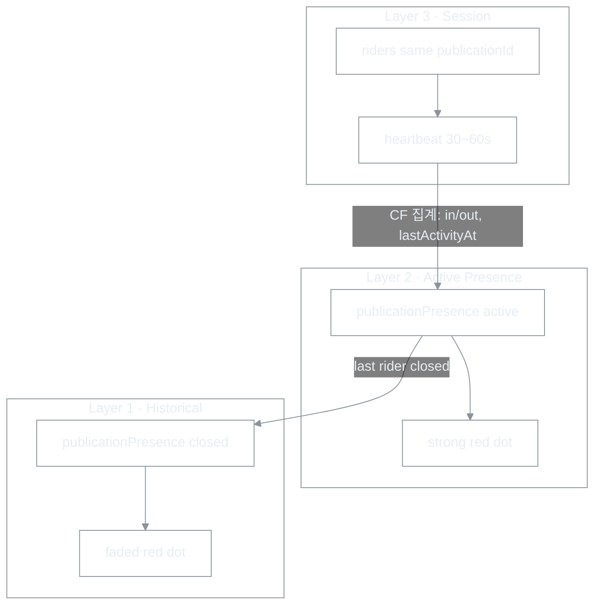

# World Activity Presence — publication dot · 세션 heartbeat 분리

| 항목 | 내용 |
|------|------|
| 문서 유형 | **product** + **architecture** — 월드 맵 activity event·presence·비용 경계의 **단일 진실** |
| 최초 작성 | 2026-05-23 |
| 상태 | **코드 반영 중** — M1~M3 클라이언트·CF 집계 (2026-05-23) |
| 연결 문서 | [Route Publication 모델](260518-Route-Publication-통합-모델-및-마이그레이션.md), [Activity World LOD](260517-Activity-World-지도-LOD-설계.md)(렌더·줌), [Firestore 트래픽 계획](260516-Firestore-트래픽-저감-상세-수정-계획.md), [Firebase 비용 체크리스트](260523-Firebase-비용-운영-체크리스트.md), [경로 표시 백로그](260518-Activity-World-경로표시-우선순위-백로그.md) |

---

## 1. 한 줄 정의

BOXCYCLE 월드 맵은 **실시간 GPS 트래커**가 아니라, **`routePublicationId` 단위 activity event**를 전역에 보여 주는 **World Cycling Activity Layer**다.

- **전역(모든 접속자):** publication당 **Red Dot 1개** — active는 진한 red, closed는 **경과일 fade**
- **대표 좌표:** publication 스냅샷 polyline의 **누적 거리 50% 지점**(distance midpoint), **1회 계산·고정**
- **heartbeat:** **동일 publication 세션 참가자만** — 전역 맵용 heartbeat **없음**

---

## 2. PM 확정 원칙

| # | 원칙 |
|---|------|
| P1 | 월드 맵 = **존재 표시(Presence)**, rider 아이콘이 지도 위를 초단위로 이동하는 모델 아님 |
| P2 | **1 dot = 1 `routePublicationId`** — route 정의가 아니라 **지금·최근의 activity instance** |
| P3 | `representativePoint` = **distance midpoint**(인덱스 중앙·시작점만 사용 금지) |
| P4 | v1 가시성 taxonomy = **`public` \| `private`만** — 주제·카테고리는 데이터 축적 후 |
| P5 | active dot 유지 = `activeRiderCount ≥ 1`; **마지막 rider 종료** 시 active 해제 → historical fade |
| P6 | 전역 읽기 = **저빈도 폴링·bounded query**; per-rider **실시간 listener fan-out 금지** |
| P7 | **줌 인 전체 노선 스트리밍**은 v1 필수 아님(v1.5: frozen publication geometry 선, heartbeat 없음) |

---

## 3. 세 층 모델 (260516 정렬)

| 층 | 이름 | 대상 | 데이터 | 지도 |
|----|------|------|--------|------|
| **Layer 1** | Historical Activity | 모든 접속자(`public`만) | closed publication + `closedAt` | **Faded red dot**, age decay opacity |
| **Layer 2** | Active Presence | 모든 접속자(`public`만) | active publication presence | **Strong red dot** @ `representativePoint` |
| **Layer 3** | Same-publication Session | 해당 publication 참가자만 | session riders | heartbeat, 진행 점·(선택) 노선 — [Trail 관전](260514-(cycle)로비_코스주행자_맵관전_구현_보고서.md) 계열 |

**Trailhead / Trail:** Layer 2·1은 **Trail 무관**. Layer 3·B층 관전은 **동일 `trailId`**(Trailhead = `default` 포함).



---

## 4. `representativePoint` — distance midpoint

### 4.1 왜 시작점·인덱스 중앙이 아닌가

| 방식 | 문제 |
|------|------|
| 시작점만 | 장거리·관광 출발지 **dot cluster**; activity가 출발 지역에 몰려 보임 |
| 좌표 인덱스 중앙 | 굴곡·우회 구간에서 **체감 중심(footprint)** 과 어긋남 |

### 4.2 계산 규칙

1. 입력: `routePublications/{publicationId}.geometryCoordsJson` **불변 스냅샷** LineString
2. 각 세그먼트 haversine(또는 동일 정책) **누적 거리** 계산
3. **총 거리의 50%** 지점 보간 → `[lng, lat]`
4. **publication presence 문서에 1회 저장** — 주행 중 GPS로 dot **이동하지 않음**
5. geometry revision(새 publication revision) 시 **새 publicationId** — 기존 dot와 분리

---

## 5. 가시성 · dot 렌더 (v1)

### 5.1 Visibility

| 값 | 월드 맵 Layer 1·2 |
|----|-------------------|
| `public` | 표시 |
| `private` | **미표시** (소유자 전용 뷰 등은 v2) |

### 5.2 상태 · 시각

| `status` | 조건 | dot |
|----------|------|-----|
| `active` | `activeRiderCount ≥ 1` | **Strong red** (`#dc2626`, full opacity) |
| `closed` | 마지막 rider 종료 | **Faded red** — `opacity = f(age)` |

**Age decay (v1 초안, 튜닝 가능):**

| 경과( `closedAt` 기준) | opacity |
|------------------------|---------|
| 0~1일 | 0.85 |
| 1~7일 | 0.55 |
| 7~30일 | 0.30 |
| 30일+ | 0.10 또는 미조회 |

줌·LOD(점 vs publication geometry 선)는 [Activity World LOD](260517-Activity-World-지도-LOD-설계.md)를 따르되, **데이터 키는 `publicationId`** 로 통일한다.

### 5.3 v2 이후 확장(지금 설계만)

| 입력 | 표현 | 시기 |
|------|------|------|
| `activeRiderCount` | dot **크기** | 사용 데이터 후 |
| 최근 activity volume | subtle **pulse** (heartbeat 아님) | 후순위 |
| taxonomy | **hue** 변화 | taxonomy 검증 후 |

---

## 6. 데이터 설계 (개념)

### 6.1 `publicationPresence/{publicationId}` (신규, 가칭)

Layer 1·2의 **단일 진실**. `publicationId` === `routePublications` 문서 ID.

| 필드 | 타입 | 설명 |
|------|------|------|
| `publicationId` | string | PK |
| `routeId` | string | 원본 `savedRoutes` / `routes` |
| `visibility` | `"public" \| "private"` | v1 taxonomy |
| `status` | `"active" \| "closed"` | |
| `representativePoint` | `[lng, lat]` | distance midpoint, 고정 |
| `startedAt` | timestamp | 첫 rider session start |
| `lastActivityAt` | timestamp | Layer 3 heartbeat·CF timeout |
| `closedAt` | timestamp? | 마지막 rider 종료 |
| `activeRiderCount` | number | active 동안 ≥1 |

**쓰기 빈도(목표):** session open · rider join/leave · session close · (선택) reconcile — **초당 GPS write 아님**.

### 6.2 Layer 3 — session riders

기존 `trails/{trailId}/liveCourseRides/{uid}` 또는 후속 `publicationSessions/...` — **세션 스코프만** heartbeat.

| 항목 | 규칙 |
|------|------|
| heartbeat 주기 | **30~60s** — still-alive + (필요 시) progress |
| 전역 집계 | CF가 **미미한 progress마다** `publicationPresence` 갱신 **금지** — in/out·close·timeout만 |
| timeout | `lastActivityAt` > **5분**(튜닝) → inactive 처리 + scheduled reconcile |

### 6.3 기존 `courseActivity` 와의 관계

| 문서 | 역할 (조정 후) |
|------|----------------|
| **`publicationPresence`** | 월드 맵 dot **1차 진실** |
| **`courseActivity/{courseId}`** | 레거시 카탈로그·패널 배지·마이그레이션 기간 **듀얼 라이트** → 점진 퇴역 |
| **`worldActivity/global`** | highlighted 목록 등 **보조 발견** (선택) |

[Route Publication](260518-Route-Publication-통합-모델-및-마이그레이션.md): `publicationId` ↔ `courseId` 동일 ID 단순화는 **유지** 가능 — presence 키는 **`publicationId`**.

---

## 7. 읽기 · 비용 가드레일

[Firebase 비용 체크리스트](260523-Firebase-비용-운영-체크리스트.md) §1.1: `liveCourseRides` 잦은 쓰기 → `courseActivityOnLiveCourseRideWritten` 폭증이 **현재 1위 비용 경로**.

| 금지 | 권장 |
|------|------|
| 전 사용자 × `liveCourseRides` **collectionGroup realtime listener** | `publicationPresence` **query/get + 60~90s 폴링** |
| Layer 3 write마다 world 문서·CF 전체 갱신 | **이벤트성** 집계만 |
| 전역 GPS stream | distance midpoint **고정 dot** |

---

## 8. 이벤트 흐름 (수용 기준)

| # | Given | When | Then |
|---|--------|------|------|
| AC-1 | A가 **public** publication으로 주행 시작 | B가 월드 맵(로그인·foreground) | 해당 **strong red dot** 1개 (`representativePoint` = distance midpoint) |
| AC-2 | A·C 동시 주행(같은 publication) | B 월드 뷰 | dot **1개** 유지, `activeRiderCount ≥ 2` (툴팁 등) |
| AC-3 | 마지막 rider 종료 | ≤90s + CF | active dot 제거 → **faded dot** (Layer 1) |
| AC-4 | **private** publication 주행 | 임의 시청자 | 월드 맵 **dot 없음** |
| AC-5 | A·B **같은 publication·Trail** 세션 | B 맵 | Layer 3 **진행 표시**(B층); 전역과 **혼동하지 않음** |
| AC-6 | 앱 강제 종료 | timeout 경과 | 유령 active **제거** (reconcile) |

---

## 9. 구현 마일스톤 (코드 작업 순서)

| 단계 | 범위 | PM 체감 |
|------|------|---------|
| **M1** | `publicationPresence` + Layer 2 active dot + Layer 3 heartbeat **집계 분리** | “지금 세계 각지에서 activity event” + **비용 안정** |
| **M2** | Layer 1 closed + age fade | “예전에도 달렸다” |
| **M3** | zoom≥13 publication geometry **선** — `useWorldPublicationPresenceOverlay` | **코드 반영** (2026-05-23) |

**M1 전제:** CF 배포·Rules·midpoint 계산(서버 또는 publication 승인 시 1회).

### 9.1 배포 (PowerShell — **저장소 루트**에서)

| 단계 | 명령 | 비고 |
|------|------|------|
| 1 | `cd C:\20.HDev\boxcycle` | **`functions\` 안에서 workspace·firebase 필터 오동작** |
| 2 | `firebase deploy --only firestore:indexes,firestore:rules` | ✅ 완료 시 생략 |
| 3 | `firebase deploy --only "functions:courseActivityOnLiveCourseRideWritten,functions:courseActivityScheduledReconcile"` | **`--only` 값은 반드시 따옴표** (PowerShell 쉼표=배열) |
| 4 | `npm run build` | 루트 script → `boxcycle-web` 빌드 |
| 5 | `firebase deploy --only hosting` | 또는 `npm run deploy:hosting` |

**Functions 배포가 `STRIPE_PRICE_ID` 등으로 막히면:** 코드베이스 전체가 Secret Manager를 검사한다. 구독 미사용이어도 **placeholder 시크릿 1회 등록** 후 3번 재시도:

```powershell
firebase functions:secrets:set STRIPE_SECRET_KEY
firebase functions:secrets:set STRIPE_PRICE_ID
firebase functions:secrets:set STRIPE_WEBHOOK_SECRET
```

**`No function matches given --only filters`:** (1) 루트가 아닌 CWD (2) `--only` 미인용 (PowerShell).

---

## 10. [Activity World LOD](260517-Activity-World-지도-LOD-설계.md) 와의 역할 분담

| 주제 | 본 문서 (Presence) | LOD 문서 |
|------|-------------------|----------|
| **무엇을** 표시할지 | publication activity event, dot 키, visibility | — |
| **어떻게** 그릴지 (줌) | dot 항상; line은 v1.5 | zoom≥13 line, dot fallback, hysteresis |
| **데이터 키** | **`publicationId`** | 기존 **`courseId`** (구현) → **본 문서 우선으로 이전** |

LOD 문서의 A층 `courseActivity` 중심 서술은 **레거시 구현 기준**. 신규·리팩터링은 **본 문서**를 따른다.

---

## 11. 장기: activity geography

publication 단위 dot·closed fade가 쌓이면:

- 주간/월간 **인기 publication**
- 지역별 **activity heat memory**
- “이번 주 세계에서 많이 달린 route”

등 **GPS 트래커가 아닌 activity geography**로 확장 가능 — [RTW 마스터 비전](260511-RTW-마스터-비전-및-종합계획.md)과 정합.

---

## 12. 개정 이력

| 날짜 | 내용 |
|------|------|
| 2026-05-23 | PM 확정 — publication 1 dot, distance midpoint, public/private, 3-layer·heartbeat 분리 |
| 2026-05-23 | M1·M2 코드 — `publicationPresence` CF·클라이언트 폴링·월드 dot |
| 2026-05-23 | M3 — publication geometry line, catalog `worldMapRenderEnabled` skip |
