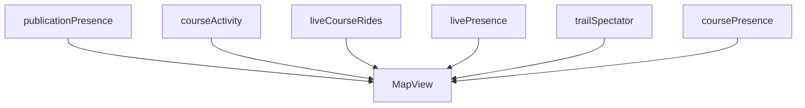
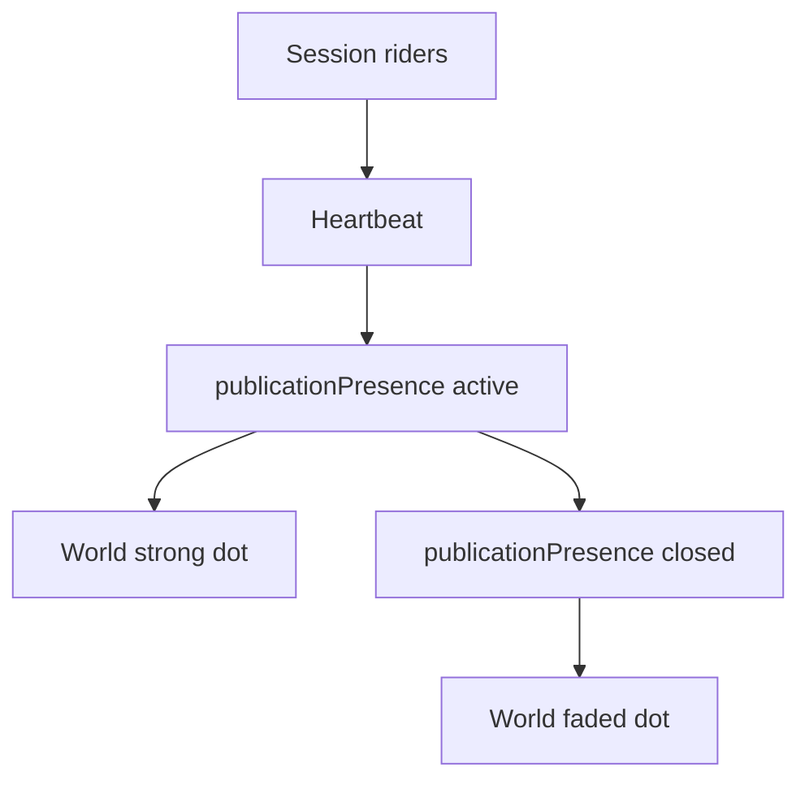
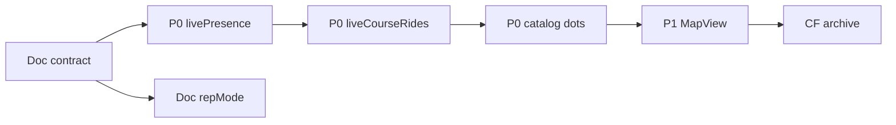

# World Activity Presence — 자문단 정렬 보고

| 항목 | 내용 |
|------|------|
| 문서 유형 | **product** + **architecture** — 자문 검토·문서 대비 코드 갭·정렬 로드맵 |
| 작성일 | 2026-05-26 |
| 상태 | **반영 중** — P0·P0-B 맵·구독 경계 (2026-05-26) |
| 연결 문서 | [World Activity Presence 설계](260523-World-Activity-Presence-설계.md), [Activity World LOD](260517-Activity-World-지도-LOD-설계.md), [Firestore 트래픽 계획](260516-Firestore-트래픽-저감-상세-수정-계획.md) |

---

## 1. 한 줄 결론

문서 철학(publication event, world vs session 분리, bounded query)은 **유지**한다. 코드는 MapView·overlay merge에서 **Layer 3·디버그가 월드 primary로 다시 올라온 상태**이므로, 신기능보다 **overlay 끄기·경계 복원(P0)** 이 먼저다.

---

## 2. 자문단과 문서 정합 (유지할 것)

| 철학 | BOXCYCLE 장기 방향 |
|------|-------------------|
| GPS 추적기가 아닌 activity geography | RTW·월드 맵 비전과 일치 |
| rider realtime이 아닌 publication event | `publicationPresence` 1 dot |
| world layer vs session layer 분리 | L1·L2 vs L3 |
| 비용 bounded architecture | 폴링·이벤트 집계 |
| 전역 fan-out 금지 | per-uid listener 금지 |
| geometry frozen snapshot | midpoint 1회 고정 |
| publication 중심 모델 | M1~M3 진행 중 |

---

## 3. 문서 vs 코드 갭

| 영역 | 문서 | 코드 현재 | 위험 |
|------|------|-----------|------|
| publication 1 dot | P2, L2 | `useWorldPublicationPresenceOverlay` | 낮음 |
| L2 vs L3 | 전역 presence vs 세션 | MapView 4계열 동시 렌더 | **높음** |
| activity geography | §11 장기 | catalog + liveCourseRides + livePresence 병행 | 중~높음 |
| midpoint | P3 고정 | distance midpoint 구현 | 낮음 |
| retention | opacity fade | Firestore 누적 정책 없음 | 중 |

### 3.1 MapView에 겹치는 소스 (코드 근거)

- `resolveWorldMapOverlay` — publication + catalog + `liveCourseRides` merge (`useAppMapOverlays.ts`)
- `useWorldLiveCourseRideMapOverlay` — 주석: per-user dot은 global livePresence
- ~~`useGlobalLivePresence` — 로그인 시 항상 구독~~ → 코스·debug 스코프만 (P0-B1)
- `MapView.syncLiveOverlayLayersOnMap` — trail spectator + global livePresence 동시, global 레이어 top

**제품 테스트:** 이 픽셀이 **누구의 GPS인가** → 예면 L3·debug, 아니면 L1·L2.

의도: **MV로 들어가는 월드 primary는 PP만**. CAT·LCR·GLP·TS·CP는 마이그레이션·관전·디버그로 격하.

---

## 4. 자문 5건 — 정렬 방안

### 4.1 publication dot 폭증 vs activity density

**문제:** 인기·장기·반복 route에서 dot이 누적 → dot cemetery. 문서 §11 heat memory 힌트만 있고 **줌별 bridge 없음**.

**원칙:** `1 publication = 1 dot`는 **이벤트 아카이브**로 유지. **가독성**은 별 계층.

| 줌 | 표현 | 데이터 |
|----|------|--------|
| z 6 이하 | regional heat cluster | `regionalActivity` pre-agg |
| z 7~11 | route rollup optional | `routeActivityRollup` |
| z 8 이상 | publication dot | `publicationPresence` |

**지금:** Layer 0 CF 스켈레톤만. 클라이언트는 bbox + limit 쿼리.

**문서 패치:** [260523](260523-World-Activity-Presence-설계.md)에 § Layer 0 Regional Aggregate 추가.

---

### 4.2 representativePoint = midpoint

**문제:** midpoint는 기술적으로 공정하나 순환·왕복·랜드마크 문화와 **의미 중심**이 어긋날 수 있음.

**v1:** distance midpoint 고정 유지.

**v2 예약 필드:** `representativeMode` — `distance_midpoint` | `centroid` | `landmark` | `authorPinned`

**지금:** 문서에 v1 고정 + future extensible 한 절만 추가. 코드 변경 없음.

---

### 4.3 Layer 2 vs Layer 3 경계 (최우선 P0)

**문제:** spectator, global livePresence, trail routes, publication, courseActivity가 MapView에서 재결합. `includeSelf: true`는 월드 철학과 충돌.

| 레이어 ID | 데이터 | 월드 기본 | 허용 컨텍스트 |
|-----------|--------|-----------|----------------|
| world.publicationPresence | L1 L2 | ON | Trailhead, world idle |
| world.catalogLegacy | courseActivity | OFF | 마이그레이션 |
| session.trailSpectator | liveCourseRides | OFF | 동일 trail 관전 |
| debug.globalLivePresence | livePresence | OFF | env debug flag |
| session.coursePeer | coursePresence | 고줌만 | 동일 코스 |

| 순서 | 작업 | 상태 |
|------|------|------|
| P0-1 | `globalPresenceDots` MapView 기본 미전달. `includeSelf` 기본 false | ✅ |
| P0-2 | world idle에서 `useWorldLiveCourseRideMapOverlay` disabled | ✅ |
| P0-3 | publication ON 시 catalog dot gap-fill OFF | ✅ |
| P0-4 | publication ON 시 catalog route gap-fill·liveCourseRides merge OFF | ✅ |
| P0-B1 | `useGlobalLivePresence` 코스·debug 스코프만 구독 | ✅ |
| P0-B2 | publication ON → `catalogOverlayEnabled` false (N×getDoc 생략) | ✅ |
| P0-B3 | Trailhead idle → trail spectator OFF | ✅ |
| P0-B4 | `globalEnabled` = 주행 중·코스 있을 때만 publish | ✅ |
| P1 | MapView `syncWorldLayers` / `syncSessionLayers` / `syncDebugLayers` 분리 | ⬜ |

**AC 추가**

- AC-7: Trailhead idle — publication dot만, livePresence 0
- AC-8: trail 관전 — L3만 추가, L2 dot과 시각 구분

---

### 4.4 closed fade vs data lifecycle

**문제:** opacity fade만으로 Firestore read·index·GeoJSON는 계속 증가.

| 단계 | 기간 | 저장 | 클라이언트 |
|------|------|------|------------|
| Hot | closed 30일 | `publicationPresence` full | fade query |
| Warm | 30일~6개월 | 동일 coll, 쿼리 제한 | z 9 미만 미조회 |
| Cold | 6개월~1년 | archive coll 또는 export | aggregate만 |
| Archive | 1년+ | BigQuery | 미표시 |

**지금:** poll `closedAt >= now-30d`, scheduled archive CF 설계.

---

### 4.5 geography vs tracking UX

| geography OK | tracking NG |
|--------------|-------------|
| publication red dot midpoint | global livePresence |
| closed fade | trail spectator moving dot |
| zoom 13 frozen line | course peer sprite |

PR 체크: **월드 맵에 uid 단위 좌표를 그리는가**

---

## 5. 설계 3층 (문서 정렬)

- L3: R, HB — 동일 publicationId 참가자만
- L2: AP, RD — 전역 public
- L1: CL, FD — historical fade

---

## 6. 실행 순서

| 기간 | 산출 |
|------|------|
| 2주 | P0-1~4 — 월드 맵이 activity 지도로 복귀 |
| 다음 MS | M4 Layer 0 rollup, cold storage |

---

## 7. 문서 패치 체크리스트

| 문서 | 추가 |
|------|------|
| [260523-World-Activity-Presence-설계](260523-World-Activity-Presence-설계.md) | Map 렌더 계약, 데이터 수명, Layer 0, representativeMode |
| [260517-Activity-World-지도-LOD-설계](260517-Activity-World-지도-LOD-설계.md) | A층 = publication; livePresence 범위 밖 |
| [260516-Firestore-트래픽-...](260516-Firestore-트래픽-저감-상세-수정-계획.md) | livePresence 월드 구독 금지 |
| `.cursor/rules/hook-layers.mdc` | MapView props ↔ Layer 매핑 |

---

## 8. Mermaid 작성 규칙 (본 보고서)

Cursor·VS Code 내장 렌더러 안정성을 위해 **본 문서 다이어그램은 init theme 미사용**, 노드 라벨은 **짧은 ASCII만**, 설명은 표·본문에 둔다. 제품 SoT 문서의 transparent init 정책과 별도로, **기획·갭 보고서**는 이 규칙을 따른다.

---

## 9. 개정 이력

| 날짜 | 내용 |
|------|------|
| 2026-05-26 | 자문단 검토 반영 — 코드 갭, P0 로드맵, 안정 Mermaid |
