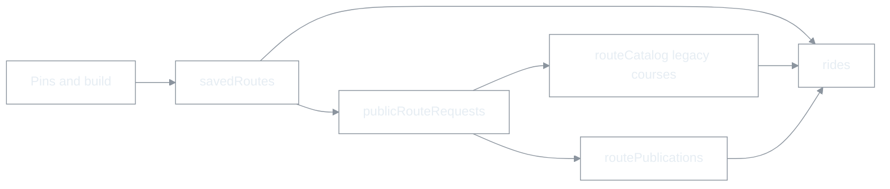

# Route 용어 통일 · RTW Pro 브랜딩 전환 — 통합 방안 (P0)

| 항목 | 내용 |
|------|------|
| 문서 유형 | **product** + **architecture** — 도메인·브랜딩 의사결정 및 단계별 전환 (코드 구현 본문 없음) |
| 작성 | 2026-06-03 |
| 상태 | **채택** — P0·P1 반영(2026-06-03). P2~P4는 본 문서 로드맵 따름. |
| 연결 | [RTW 마스터](260511-RTW-마스터-비전-및-종합계획.md), [Route·Publication](260518-Route-Publication-통합-모델-및-마이그레이션.md), [제품 용어 Trailhead·Trail](260517-제품-용어-Trailhead-Trail.md), [문서 지침](260509-BOXCYCLE-문서-생성-및-수정-지침.md) |

---

## 0. 한 줄 결정

1. **도메인:** `course` 를 신규 도메인 용어에서 **배제**하고 **Route 단일 엔티티**로 통일한다. 공식·퍼블릭·입문·이벤트 차이는 **속성**(official, visibility, routeKind)이다.
2. **브랜딩:** 사용자·문서·AI 지시의 **공식 제품명은 RTW Pro** (`Ride The World Pro`). 개발 중 혼동 방지용 **`BOXCYCLE` 은 엔지니어링 별칭(레거시)** 로만 남기고 점진 퇴출한다.
3. **제품군:** **RTW Free** = 미완·별 트랙(본 저장소 범위 밖). **RTW Pro** = 본 `apps/web` 및 현재 Firestore/Hosting 스택.

---

## 1. 배경 — 왜 지금 같이 하는가

| 문제 | 원인 | 통합 처리 이유 |
|------|------|----------------|
| route / course 혼용 | 한국어 「경로」를 영어 두 단어에 무의식 매핑 | 용어 SoT·AI 프롬프트를 **한 번만** 고침 |
| BOXCYCLE / RTW 혼용 | Free 미완 상태에서 Pro 개발용 **임시 별칭** | 마스터 §7 Q1(외부 명칭)과 **동시에 닫음** |
| 문서·UI·코드 불일치 | 단계적 기능 추가, rename 미완 | Trailhead/Trail, Route·Publication과 **같은 “언어 개정” 릴리스**로 묶기 쉬움 |

자문 결론(요약): BoxCycle 성격상 핵심 객체는 **Course가 아니라 Route**; 영어권에서도 앱은 **Route 통일 + 속성**이 관리 비용이 낮다. → 본 방안과 동일.

---

## 2. 명칭 계층 (통일 후)

### 2.1 브랜딩·제품군

| 층위 | 명칭 | 사용처 |
|------|------|--------|
| **법·스토어·랜딩** | **RTW Pro** | 앱 타이틀, 로그인 카드, Hosting `<title>`, 마케팅, Obsidian 제품 문서 |
| **시리즈** | **Ride The World** (RTW) | 장기 비전, tier, “RTW 생태계” |
| **형제 SKU** | **RTW Free** | 본 repo **비범위**; 문서에 “별 제품·미완” 한 줄만 |
| **엔지니어링 별칭 (퇴출 중)** | BOXCYCLE | repo 폴더 `boxcycle`, npm `boxcycle-web`, Firebase project id, Mapbox layer prefix `boxcycle-*` — **사용자 노출 금지** |

### 2.2 도메인 (Route 단일)

| 층위 | 명칭 | 사용처 |
|------|------|--------|
| **엔티티** | **Route** | 기획·API·타입·Firestore 장기 모델 |
| **개인 작업본** | Personal / My Route | `savedRoutes`, `owner_library` |
| **카탈로그·공개** | Public Route, Official Route, Intro Route | 구 `courses` + `routePublications` |
| **출판 스냅샷** | Publication (유지) | `routePublications` — 이름 이미 route 중심 |
| **실시간 판** | Trail (유지) | [제품 용어](260517-제품-용어-Trailhead-Trail.md) |
| **레거시 (금지)** | course, Course, 코스(엔티티명) | 문서·코드·지시에서 신규 사용 금지 |

### 2.3 RTW 마스터 3분할 (이름만 조정)

| 구 (RTW §2.1) | 통일 후 | 비고 |
|---------------|---------|------|
| Course (정적) | **Route** (정적 geometry·카탈로그) | Session/Presence 철학 유지 |
| Session | **Trail** | 이미 제품 용어로 대체됨 |
| Presence | **Presence** | Trail·Route presence로 부연 |

---

## 3. 현재 저장소 스냅샷 (갭)

### 3.1 브랜딩

| 위치 | 현재 | 목표 |
|------|------|------|
| `apps/web/index.html` `<title>` | BOXCYCLE | RTW Pro |
| `MapHud`, `AuthGateCard`, `GuestEntryCard` | BOXCYCLE | RTW Pro (또는 RTW + Pro 서브) |
| 루트·`apps/web` README | BOXCYCLE | RTW Pro 링크, BOXCYCLE=레거시 각주 |
| `document/*` 제목 다수 | BOXCYCLE | 본문·메타는 RTW Pro, **파일명 접두어는 유지**(지침 §3.1) |
| [RTW 마스터 §0](260511-RTW-마스터-비전-및-종합계획.md) | repo=BOXCYCLE, Q1 미결 | **§0·§7 Q1 갱신** — Pro 공식, BOXCYCLE=dev alias |

### 3.2 도메인 course

| 레이어 | 규모 감 | 비고 |
|--------|---------|------|
| Firestore | `courses`, `courseActivity`, `coursePresence`, `liveCourseRides` | path rename은 최후 |
| `apps/web` | `firestoreCourses`, `courseId`, `useOfficialCoursesHub` 등 | alias 단계 |
| Functions | `courseActivityOn*` | 트리거 경로 의존 |
| 문서 SoT | 코스 수명, Phase 체크리스트 제목 | 제목·본문 점진 |

---

## 4. 전환 원칙 (4층 — Route · 브랜딩 공통)

| Layer | 내용 | Route | RTW Pro |
|-------|------|-------|---------|
| **L1 거버넌스** | 사람·AI·신규 문서 | Course 금지, Route+속성 | RTW Pro 공식, BOXCYCLE=alias 각주 |
| **L2 표면** | UI·export 이름·주석 | TS rename + re-export | `<title>`, HUD, auth 카피 |
| **L3 데이터 의미** | 필드 병기·dual-read | `catalogRouteId` ↔ `courseId` | (해당 없음) |
| **L4 인프라** | rename 비용 큼 | Firestore 컬렉션 path | repo·Firebase project·npm scope — **별 결정** |

**금지:** L1 없이 L4(컬렉션·repo rename)부터 시작.

---

## 5. 통합 로드맵

### Phase P0 — 결정·SoT (코드 최소)

| # | 산출물 | Route | RTW Pro |
|---|--------|-------|---------|
| P0-1 | 본 문서 팀 합의 | ✅ | ✅ |
| P0-2 | [제품 용어](260517-제품-용어-Trailhead-Trail.md) § “Route 단일·브랜드” 추가 | ✅ | ✅ |
| P0-3 | [RTW 마스터](260511-RTW-마스터-비전-및-종합계획.md) §0 명칭·§7 Q1 결론·§2.1 Route/Trail/Presence | ✅ | ✅ |
| P0-4 | Obsidian / 용어집 — Route + RTW Pro 판 | ✅ | ✅ |
| P0-5 | `.cursor/rules` 초안: `domain: Route only`; `product: RTW Pro`; `alias: BOXCYCLE internal` | ✅ | ✅ |

**완료 기준:** 신규 PR·Cursor 지시에 course(도메인)·BOXCYCLE(사용자-facing) 0건.

### Phase P1 — 언어·문서·UI 카피

| # | 작업 |
|---|------|
| P1-1 | UI: `index.html`, MapHud, Auth, RotateOverlay → **RTW Pro** |
| P1-2 | 한국어: 「코스」→ 「공식 경로」「입문 경로」「퍼블릭 경로」 (엔티티 설명 시) |
| P1-3 | 영어 UI: Course → Route (Official / Public / Intro) |
| P1-4 | [Route·Publication](260518-Route-Publication-통합-모델-및-마이그레이션.md), [ux 주행 IA](260515-ux-주행-여정-및-패널-IA.md) — `courseId` = legacy 필드 각주 |
| P1-5 | 루트 README 첫 줄 — **RTW Pro** + BOXCYCLE 레거시 설명 |
| P1-6 | [document/README](README.md) — 본 문서 SoT 링크 |

### Phase P2 — 코드 표면 (동작 동일)

| Route (예) | RTW Pro (예) |
|------------|----------------|
| `firestoreCourses` → `firestoreRouteCatalog` (re-export) | `BOXCYCLE_*` 상수 → `RTW_ROUTE_LAYER_ID` 등 (선택·일괄) |
| `courseId` → `catalogRouteId` (변수·타입) | 사용자 문자열만 우선 |
| `useOfficialCoursesHub` → `useOfficialRouteCatalog` | |
| `PublishedPublicCourseSummary` → `PublishedPublicRouteSummary` | |

**완료 기준:** `apps/web` 공개 export에 `Course` 0 (deprecated re-export 기한 문서화).

### Phase P3 — 데이터 필드 dual-write

- `rides`: `catalogRouteId` = `courseId` (신규 쓰기는 신규 필드 우선).
- `routePublications`: `catalogRouteId` 병기 (값 동일).
- CF·클라이언트: read fallback `courseId` → `catalogRouteId`.

### Phase P4 — Firestore path · 인프라 (별 프로젝트)

| 항목 | Route | RTW Pro |
|------|-------|---------|
| 컬렉션 | `courses` → `routeCatalog` 등 | — |
| 서브컬렉션 | `liveCourseRides` → `liveRouteRides` | — |
| CF 트리거 | rename + dual trigger 기간 | — |
| Hosting URL / Firebase project id | — | `boxcycle-dc2df` 유지 가능(비용). **표시명만** Pro로 충분할 수 있음 |
| repo `boxcycle` rename | — | **비권장(초기)** — Git·CI·로컬 경로 파급. 문서에 “repo slug = legacy” 고정 |

---

## 6. UI·카피 표 (목표)

### 6.1 제품명

| 상황 | 문구 |
|------|------|
| 앱 타이틀 | **RTW Pro** |
| 짧은 설명 | Ride The World — virtual cycling |
| 개발 문서 헤더 | RTW Pro (`BOXCYCLE` repo — legacy alias) |

### 6.2 경로 (Route)

| 구분 | 한국어 | English |
|------|--------|---------|
| 탭 | 경로 / 내 경로 | Routes / My Routes |
| 입문 | 입문 경로 | Intro Routes |
| UGC 공개 | 퍼블릭 경로 | Public Routes |
| 운영 | 공식 경로 | Official Routes |
| 지양 | (공식) 코스, Course | Course |

**Trail 병기 예:** `한강 Official Route · Trail 035`

---

## 7. RTW Free 와의 관계 (문서 고정 문장)

> **RTW Free** 는 Ride The World 제품군의 별 트랙이며, 본 저장소(**RTW Pro**)와 코드·Firestore를 공유하지 않는다. Free 미완 상태에서 Pro 개발 시 내부적으로 **BOXCYCLE** 별칭을 썼으며, 이제 사용자 대면 명칭은 **RTW Pro** 로 통일한다.

---

## 8. 리스크·완화

| 리스크 | 완화 |
|--------|------|
| 문서·코드 대량 rename PR 폭발 | L1→L2 슬라이스; 파일명은 유지, 본문만 |
| Firebase/URL에 boxcycle 잔존 | 사용자는 RTW Pro만 봄; 엔지니어는 “project id ≠ product name” |
| `courseActivity` CF 중단 | path rename은 P4; P3까지 필드만 병기 |
| RTW 마스터 §9 “5 domains Course…” 구 문단 | P0-3에서 Route/Trail/Presence/Activity/Ranking 으로 개정 |
| AI 혼선 재발 | P0-5 rule + PR 템플릿 한 줄 |

---

## 9. 성공 지표

| # | 지표 |
|---|------|
| S1 | 사용자 visible 문자열: **RTW Pro**, **Course/BOXCYCLE** 0 |
| S2 | 신규 architecture 문서: domain **Route** only, `course` = legacy 각주만 |
| S3 | `rides` 신규 문서: `catalogRouteId` (또는 단일 `routeId` 정책) |
| S4 | 스모크: 입문·퍼블릭 **경로** 로드, 주행, Activity World, Trail — [수동 스모크](260516-수동-스모크-체크리스트.md) 갱신 |
| S5 | RTW 마스터 §7 Q1 **결론 기록** (Pro 공식) |

---

## 10. 데이터 흐름 (Route · Publication — course 없음)

---

## 11. 다음 액션 (구현 전)

1. P0 문서 팀 리뷰·**채택** 날짜 기록.
2. [RTW 마스터](260511-RTW-마스터-비전-및-종합계획.md) §0·§7·§2.1·§9 — P0-3 초안 PR (문서만).
3. [제품 용어](260517-제품-용어-Trailhead-Trail.md) — 브랜드·Route 절 추가.
4. P1 UI 카피 PR (소규모, 스모크 5분).
5. P2 이후 — [Phase 체크리스트](260511-Phase별-실행-체크리스트-Course-Session-Presence.md) **제목·Phase 표**를 Route·RTW Pro 기준으로 개정(파일명 유지).

---

## 12. 개정 이력

| 날짜 | 내용 |
|------|------|
| 2026-06-03 | 최초 작성 — 자문 Route 통일 + RTW Pro 공식명·BOXCYCLE alias 퇴출 통합 방안 |
| 2026-06-03 | **P0·P1 반영** — RTW 마스터·제품 용어·Route-Publication·README, UI RTW Pro, RideRoutePanel 경로 카피, `.cursor/rules/domain-terminology-rtw-pro.mdc` |
