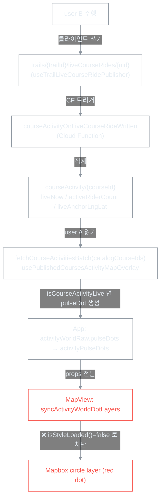

# Red dot 문제 해결 보고서 (260614)

| 항목 | 내용 |
|------|------|
| 문서 유형 | **postmortem** — 장기 미해결 버그 근본 원인·해결·재발 방지 기록 |
| 작성일 | 2026-06-14 |
| 문제 기간 | 2026-05 중순 ~ 2026-06-14 (약 1개월) |
| 상태 | **해결됨** |
| 해결 브랜치 | `rescue/red-dot-from-0519` (baseline `b462326`, 5/19) |
| 보존 브랜치 | `backup/red-dot-swamp-20260614` (시도 누적 전체), `main` |

---

## 0. 한 줄 결론

> **`map.isStyleLoaded()`를 렌더 가드로 사용한 것이 원인이다.** 위성 + 3D terrain 스타일에서 (그리고 mapbox-gl 버전이 올라가면서) 이 값이 **영구히 `false`** 를 반환했고, 그 결과 Activity World dot 레이어를 만드는 `syncActivityWorldDotLayers`가 매번 즉시 `return` 되어 **dot 레이어 자체가 생성되지 않았다.** 가드를 제거(`if (!map.style) return` + `try/catch` + `style.load`/`idle` 재시도)하자 즉시 해결되었다.

**중요:** 데이터(liveCourseRides → CF → courseActivity → catalog → App)는 **처음부터 정상**이었다. 문제는 오직 **마지막 렌더 한 칸**이었다.

---

## 1. 증상

- 다른 라이더가 공식/입문/퍼블릭 경로를 주행해도, 지도(Activity World)에 그 활동을 나타내는 **빨간 dot(red dot)이 보이지 않음**.
- 원래 의도: "다른 사람도 같은 경로를 타고 있다 / 이 앱을 쓰고 있다"는 느낌을 주기 위해, 주행 중인 라이더의 **경로(polyline)를 dot으로** + 최근 1주일 주행 흔적을 heat dot으로 표시. (트래픽 문제로 라이더의 *실시간 위치* 자체는 표시하지 않고 경로 단위 aggregate dot만 사용)
- "보였다 안 보였다" 간헐적으로 나타남 → 원인 분리를 어렵게 만든 핵심 요소.

---

## 2. 근본 원인 (Root Cause)

### 2.1 직접 원인
`apps/web/src/components/MapView.tsx`의 dot 동기화 함수:

```ts
function syncActivityWorldDotLayers(map, pulseDots, heatDots) {
  if (!map.isStyleLoaded()) return;   // ← 이 가드가 영구히 막음
  // addSource / addLayer / setData ...
}
```

그리고 호출부 `syncActivity()`도 동일하게 `if (!map.isStyleLoaded()) return`로 감싸져 있었다.

### 2.2 왜 `isStyleLoaded()`가 false였나
- `map.isStyleLoaded()`는 스타일 JSON뿐 아니라 **모든 소스/스프라이트/타일이 로드 완료**되어야 `true`를 반환한다.
- **위성 스타일 + 3D terrain(DEM 소스)** 환경에서는 동적 소스가 지속적으로 로딩 상태이므로, 이 값이 **사실상 영구히 `false`** 가 될 수 있다.
- 결정적으로, **코드는 5/19 그대로인데 설치된 `mapbox-gl` 버전이 올라가면서 `isStyleLoaded()`의 엄격도/동작이 바뀌었다.** → "예전엔 됐는데 지금은 안 되는" 환경적 회귀.

### 2.3 결과
- `syncActivityWorldDotLayers`가 매 호출마다 즉시 `return` → `addSource`/`addLayer` 미실행 → `boxcycle-activity-pulse-dots-layer` 레이어가 **존재하지 않음** → dot 0.
- 진단 로그에서 `[MapView] dot sync called { pulse: 1, styleLoaded: false }` 가 반복 확인됨.

---

## 3. 데이터 사슬 (전부 정상이었음)

red dot이 화면에 뜨기까지의 전체 파이프라인. 진단 결과 **마지막 단계(렌더)를 제외하고 모두 정상**이었다.



각 단계 진단 증거:

| 단계 | 확인 방법 | 결과 |
|------|-----------|------|
| liveCourseRides 쓰기 | `[LiveRidePub] wrote { courseId, ratio }` | ✅ 정상 |
| CF 집계 | Firestore `courseActivity/basic-alps-grindelwald-5km` → `liveNow:true, activeRiderCount:2` | ✅ 정상 |
| catalog 포함 | `[ActivityRead] catalogCourseIds` 에 해당 courseId 존재 | ✅ 정상 |
| App pulseDot 생성 | `[ActivityRead] liveRows: 4, pulseDotCourseIds: 4` | ✅ 정상 |
| **MapView 렌더** | `[MapView] dot sync called { styleLoaded: false }` (끝 로그 안 뜸) | ❌ **차단 지점** |

---

## 4. 진단 과정 (사슬 거꾸로 추적)

핵심 전략은 **"데이터냐 렌더냐"를 분리**하고, 파이프라인의 각 단계에 임시 진단 로그를 넣어 **끊긴 한 곳을 특정**한 것이다.

1. **렌더 경로 단순화 시도** → 데이터(`rawPulse: 0`)부터 의심. publication 경로가 아니라 liveCourseRides 기반임을 코드로 확인.
2. **liveCourseRides 쓰기 확인** (`[LiveRidePub]`) → `wrote` 확인. 쓰기는 정상.
3. **CF/courseActivity 확인** (Firestore 콘솔) → `liveNow:true, activeRiderCount:2`. CF 정상.
4. **user A 읽기 확인** (`[ActivityRead]`) → `catalogCourseIds`에 포함, `liveRows`/`pulseDotCourseIds` 채워짐. 읽기·dot 생성 정상.
5. **MapView 진단** (`[MapView] dot sync called`) → 함수는 호출되나 `styleLoaded: false`로 즉시 빠짐. **범인 확정.**

---

## 5. 왜 한 달이나 걸렸나 (교훈)

1. **렌더 계층만 반복 수정.** 증상이 "dot이 안 보인다"였기에 클라이언트 렌더(paint, z-order, expression)만 수십 번 고쳤다. 정작 데이터 사슬·환경(mapbox 버전)은 분리 진단하지 않았다.
2. **국소 수정의 누적.** 수정마다 새 변수(디버그 분기, fallback, Phase 스캐폴딩)가 추가되어 **신호와 잡음을 구분할 수 없는 상태**가 되었다. (`Phase A–E kill switch`, `DebugWorldLightMap`, `DebugMapStage` 등)
3. **다른 작업이 별개 문제를 유발.** 복잡도를 줄이려던 `course → route` 용어 통일 + `routeCatalog` 마이그레이션(P2–P4)이 **퍼블릭 경로 사라짐 / 입문 경로 직선화**라는 *별개의* 증상을 만들어 혼란을 키웠다.
4. **`isStyleLoaded()`가 참일 것이라는 암묵적 가정.** 지도 타일이 보이므로 스타일은 로드됐다고 믿었다. 그러나 위성+terrain+신버전 mapbox에서는 그렇지 않았다.

---

## 6. 해결 (적용된 변경)

`apps/web/src/components/MapView.tsx`

```ts
// syncActivityWorldDotLayers 내부
- if (!map.isStyleLoaded()) return;
+ // 위성+3D terrain + 최신 mapbox-gl 에서 isStyleLoaded()가 영구 false 가능.
+ // 스타일 미준비 시 addSource/addLayer 는 try/catch 가 안전 처리.
+ if (!map.style) return;
```

```ts
// 호출부 syncActivity()
- const syncActivity = () => {
-   if (!map.isStyleLoaded()) return;
-   syncCourseActivityLayers(...);
-   syncActivityWorldDotLayers(...);
- };
- syncActivity();
- if (!map.isStyleLoaded()) { map.once("style.load", syncActivity); map.once("idle", syncActivity); }
+ const syncActivity = () => {
+   syncCourseActivityLayers(...);
+   syncActivityWorldDotLayers(...);
+ };
+ syncActivity();
+ map.once("style.load", syncActivity);  // 스타일 전환 후 재적용
+ map.once("idle", syncActivity);
```

**원칙:** mapbox 레이어 동기화의 가드는 `isStyleLoaded()`(완료 폴링)가 아니라, **`style.load`/`idle` 이벤트 + `try/catch`** 로 한다.

---

## 7. 함께 발견·수정한 부수 문제

### 7.1 `mergeRideCompletedOptimistic` 결함 (firestoreCourseActivity.ts)
- "내가 주행을 종료한 직후 서버 반영 전 heat 유지"용 낙관 로직이, **서버가 다시 live가 되어도(다른 라이더가 그 코스 주행) optimistic이 풀리지 않아 `liveNow`를 계속 `false`로 덮는** 결함.
- 수정: 서버가 `liveNow && activeRiderCount > 0` 이면 optimistic을 **즉시 폐기**하도록 변경.

### 7.2 P2–P4 routeCatalog 개편 → 경로 손실 (별개 원인)
- `course → route` 용어 통일 + Firestore `courses → routeCatalog` 경로 전환(커밋 `b9c6a68`, `2c076c9`, `d33363a`)이 **퍼블릭 경로 사라짐 / 입문 경로 직선화**를 유발.
- 로컬 코드 revert로 복구. (배포된 Firestore rules/indexes/데이터는 코드 revert로 되돌릴 수 없으므로 별도 관리 필요 — `firebase deploy` 상태 확인 항목 참고)

---

## 8. 재발 방지 체크리스트

- [ ] **`isStyleLoaded()`를 레이어 추가/갱신의 차단 가드로 쓰지 말 것.** `style.load`/`idle` 이벤트 + `try/catch`로 처리.
- [ ] **source와 layer는 독립적으로 `ensure`** 할 것. "source 존재 여부"로 layer 생성을 묶으면, layer만 유실됐을 때 영구 복구 불가.
- [ ] **`mapbox-gl` 버전 업 시** Activity World dot/line 렌더 회귀를 반드시 확인.
- [ ] **"데이터냐 렌더냐"를 먼저 분리.** 파이프라인 각 단계(쓰기 → CF → 읽기 → 생성 → 렌더)에 임시 로그를 넣어 끊긴 칸을 특정한 뒤, 그 한 칸만 고친다.
- [ ] 디버그 스캐폴딩은 **검증 후 즉시 제거**하여 잡음을 남기지 않는다.
- [ ] 백엔드(CF, Firestore rules/indexes)는 코드 revert로 되돌릴 수 없음을 기억. 배포 상태를 별도 확인.

---

## 9. 재발 시 빠른 진단 절차

1. user A 콘솔 필터 `LiveRidePub` → user B 주행 시 `wrote` 뜨는가? (쓰기 단계)
2. Firestore `courseActivity/{courseId}` → `liveNow:true, activeRiderCount>0, liveAnchorLngLat` 있는가? (CF 단계)
3. 콘솔 필터 `ActivityRead` → `catalogCourseIds`에 해당 courseId 있고 `liveRows`/`pulseDotCourseIds` 채워지는가? (읽기/생성 단계)
4. 콘솔 필터 `MapView` → `dot sync called` 의 `styleLoaded`, 이어서 `dot sync { hasLayer }`, `dot rendered { queryRenderedCount }` 확인. (렌더 단계)
5. 끊긴 단계만 수정.

---

## 10. 남은 정리 작업 (후속)

- [ ] 임시 진단 로그 정리: `[LiveRidePub]`, `[ActivityRead]`, `[MapView] dot sync/called/rendered`, `[CourseActivity] optimistic cleared`.
- [ ] 본 수정(`isStyleLoaded` 가드 제거, optimistic 수정)을 `main`에 정식 반영하는 전략 결정 (rescue 브랜치 기준 재정비 vs main에 체리픽).
- [ ] 디버그 스캐폴딩(Phase A–E, DebugWorldLightMap, DebugMapStage) 최종 제거 여부 결정.
- [ ] 배포된 Firestore rules/indexes/데이터 정합성 점검.

---

## 11. 관련 커밋·브랜치 요약

| 구분 | 식별자 | 비고 |
|------|--------|------|
| 문제 발생 기능 도입 | `38a7dd6`/`4e9fafe` (5/23) | World Activity Presence(publication) 도입 |
| red dot 기능 정상 시기(추정) | `b462326` (5/19) | **rescue baseline** |
| 늪 시작 | `af753fd` (5/26) | "publicationPresence only (P0)" 디버깅 시작 |
| 별개 문제 유발 | `b9c6a68`/`2c076c9`/`d33363a` (6/3~6/4) | routeCatalog 개편 → 경로 손실 |
| 시도 누적 보존 | `backup/red-dot-swamp-20260614` | |
| **해결 브랜치** | `rescue/red-dot-from-0519` | isStyleLoaded 가드 제거 |
