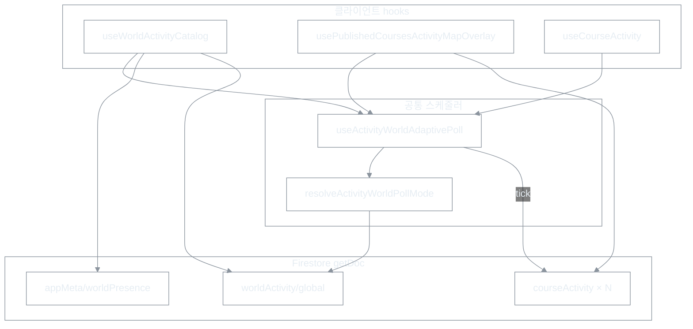

# Activity World Adaptive Polling (C안) 적용 계획

| 항목 | 내용 |
|------|------|
| 문서 유형 | **execution** + **architecture** — 월드 맵 activity 폴링 정책·구현 WO |
| 최초 작성 | 2026-06-15 |
| 상태 | **반영중** — WO-A (2026-06-15) |
| 결정 | **C안 WO-A** 채택 (Probe 없음). E·F는 사용자 증가 시 재검토 |
| 연결 문서 | [Activity World LOD](260517-Activity-World-지도-LOD-설계.md), [Firebase 비용 체크리스트](260523-Firebase-비용-운영-체크리스트.md), [Red dot 해결 보고서](260614-Red-dot-문제-해결-보고서.md), [World Activity Presence](260523-World-Activity-Presence-설계.md) |

---

## 1. 한 줄 정의

**전 세계 live activity가 없으면 5분, 있으면 30초** 간격으로 기존 `getDoc` 폴링을 유지한다.  
`onSnapshot`·새 집계 문서·클라이언트 publish/unpublish는 **도입하지 않는다**.

---

## 2. 배경 · 왜 C인가

| 항목 | 현행 (90s flat) | C안 |
|------|-----------------|-----|
| Idle (주행 0) | 90s마다 N코스 batch | **5분** |
| Active (주행 ≥1) | 90s | **30s** |
| 구현 복잡도 | — | **낮음** (interval만 변경) |
| E/F 대비 | — | onSnapshot·스키마 확장 **없음** |

**트래픽 (N=30, 혼합 idle 90% / active 10%, 100 동시 1h):**  
현행 ~134K reads/h → C ~79K reads/h (**~41% 절감**).  
(E안 ~25K — 향후 사용자 증가 시 재검토)

---

## 3. 적용 범위

### 3.1 C안에 포함 (interval adaptive)

| Hook / 모듈 | 현재 interval | 역할 |
|-------------|---------------|------|
| `usePublishedCoursesActivityMapOverlay` | `COURSE_ACTIVITY_POLL_MS` (90s) | **핵심** — N×`courseActivity` batch + overlay |
| `useWorldActivityCatalog` | `WORLD_PRESENCE_POLL_MS` (90s) | HUD + `liveActivityCourseIds` + highlighted |
| `useCourseActivity` | 90s | 추적 중인 단일 코스 HUD (맵/패널) |

→ **동일한 adaptive 정책**을 공유한다 (한 곳에서 interval 결정).

### 3.2 이번 WO에서 제외

| 항목 | 이유 |
|------|------|
| `useWorldPublicationPresenceOverlay` | `publicationPresenceWorldMapEnabled=false` — 비활성. 상수만 deprecated alias 유지 |
| `MapView` 2.5s layer resync | Mapbox 레이어 유지용, Firestore 아님 |
| CF / `worldActivity` 스키마 | E/F 영역 |
| Heat 전용 10분 분리 | 2차 WO (C 안정화 후 선택) |

### 3.3 유지 (변경 없음)

- `pageVisible=false` → 폴링 **완전 중단** (기존)
- `refreshNonce` → **즉시 1회 fetch** (기존)
- `fetchCourseActivitiesBatch` N batch 구조 (기존)
- red dot / heat MapView 렌더 경로 (기존)

---

## 4. Adaptive 정책 (상수 · SoT)

**파일:** `apps/web/src/lib/rideSyncPolicy.ts` (또는 `activityWorldPollPolicy.ts` 분리)

```text
ACTIVITY_WORLD_POLL_IDLE_MS   = 300_000   // 5분
ACTIVITY_WORLD_POLL_ACTIVE_MS =  30_000   // 30초

// deprecated (호환 alias, DEV warn)
COURSE_ACTIVITY_POLL_MS  → ACTIVE (마이그레이션 기간)
WORLD_PRESENCE_POLL_MS   → ACTIVE
```

### 4.1 Active / Idle 판정

**전역 live activity가 1건이라도 있으면 Active.**

판정 입력 (우선순위):

1. **`worldActivity/global.livePulseCount > 0`** — CF가 start/stop 시 갱신 (가장 가벼운 1 read)
2. **보조:** 직전 batch 결과에 `isCourseActivityLive(row)` 1건 이상
3. **로컬 override:** 현재 사용자 `rideStatus === running|paused` → **무조건 Active** (본인 주행 중 HUD·맵)

```text
resolveActivityWorldPollMode(ctx) → "idle" | "active"

active if:
  ctx.selfRideActive
  OR worldLivePulseCount > 0
  OR lastBatchLiveCount > 0
else idle
```

### 4.2 Interval 선택

| mode | interval | 용도 |
|------|----------|------|
| `idle` | 5분 | 전 세계 주행 없음 |
| `active` | 30초 | live dot 갱신 |

**향후 (C+):** active 6코스 이상 15초 — 이번 WO **범위 외**.

---

## 5. 아키텍처



### 5.1 핵심: `setInterval` → 가변 `setTimeout` 체인

고정 `setInterval(90_000)`은 mode 전환 시 interval을 바꿀 수 없다.  
**매 tick 종료 후** 다음 delay를 `resolveActivityWorldPollMode` 결과로 계산한다.

```text
tick() {
  1. (선택) fetchWorldActivityGlobal() — mode 판정용 1 read
  2. 본 fetch (batch / catalog load)
  3. mode ← resolve(..., batchResult, selfRideActive)
  4. scheduleNext(mode === active ? 30s : 5min)
}
```

마운트 시 **즉시 1회 tick** (기존과 동일).

### 5.2 Mode 판정용 lightweight probe (C안 내 허용)

Idle 5분만 쓰면 **타 사용자 주행 시작 → 최대 5분** 후 dot 표시 가능.

C안 WO에서 **허용하는 최소 완화** (E 아님 — onSnapshot 없음):

| tick 종류 | idle 시 | active 시 |
|-----------|---------|-----------|
| **Full** (N batch + catalog) | 5분마다 | 30초마다 |
| **Probe** (`worldActivity/global` 1 read) | **30초마다** | 생략 (full에 포함) |

- Probe에서 `livePulseCount: 0 → >0` 감지 시 **즉시 Full tick** + Active mode 전환.
- **추가 idle 비용:** 30s마다 1 read = **120 reads/h/user** (N=30 batch 444/h 대비 소량).
- UX: idle→active 전환 **≤30s** (5분 대기 제거).

> PM·시니어 합의 포인트: **Probe 포함 여부**.  
> - **WO-A (순수 C):** Probe 없음, 전환 최대 5분 수용.  
> - **WO-B (C+Probe, 권장):** 위 표. E/F 없이 idle→active 지연만 개선.

**본 계획 기본값: WO-B (C+Probe).**

---

## 6. 구현 단계 (WO)

### Phase 1 — 정책 · 스케줄러 (0.5d)

| # | 작업 | 파일 |
|---|------|------|
| 1.1 | 상수 `IDLE_MS` / `ACTIVE_MS` / `PROBE_MS`(30s) | `rideSyncPolicy.ts` |
| 1.2 | `resolveActivityWorldPollMode()` + 단위 테스트 | `activityWorldPollPolicy.ts` |
| 1.3 | `useActivityWorldAdaptivePoll({ enabled, onTick, onProbe?, selfRideActive })` | `hooks/useActivityWorldAdaptivePoll.ts` |

**Acceptance**

- mode 전환 시 timer 재스케줄, leak 없음 (unmount clear)
- `enabled=false` → tick/probe 모두 중단

### Phase 2 — World catalog hook (0.5d)

| # | 작업 | 파일 |
|---|------|------|
| 2.1 | `setInterval` 제거 → adaptive poll | `useWorldActivityCatalog.ts` |
| 2.2 | tick: presence + worldActivity + liveIds (기존 load 본문) | 동일 |
| 2.3 | probe: `fetchWorldActivityGlobal()` only, mode 갱신 | 동일 |

**Acceptance**

- idle: 5분마다 full, 그 사이 30s probe
- `livePulseCount` 0→1: 30s 이내 full tick

### Phase 3 — Catalog overlay hook (0.5d)

| # | 작업 | 파일 |
|---|------|------|
| 3.1 | `setInterval` 제거 → adaptive poll | `usePublishedCoursesActivityMapOverlay.ts` |
| 3.2 | **공유 mode state** — catalog와 overlay가 같은 mode 사용 | `useAppMapOverlays` 또는 React context |

**Mode 공유 방안 (택 1):**

- **(권장) A:** `useAppMapOverlays`에서 `activityWorldPollMode` ref/state 1개, 두 hook에 `getPollMode()` 전달
- **B:** module-level `activityWorldPollModeStore` (간단 subscribe)

**Acceptance**

- 두 hook이 **동일 tick phase**에서 full fetch (중복 batch 2회/주기 방지 — 아래 §7)
- `refreshNonce` 변경 시 즉시 full + Active mode

### Phase 4 — Tracked course activity (0.25d)

| # | 작업 | 파일 |
|---|------|------|
| 4.1 | `useCourseActivity` adaptive 적용 | `useCourseActivity.ts` |
| 4.2 | `selfRideActive` 전달 | `useAppMapOverlays` → opts |

**Acceptance**

- 본인 주행 중 단일 코스 HUD ≤30s 갱신
- 주행 종료 후 전역 idle이면 5분으로 완화

### Phase 5 — 관측 · 문서 (0.25d)

| # | 작업 |
|---|------|
| 5.1 | DEV `[ActivityWorldPoll]` log: mode, interval, livePulseCount, batchLiveCount |
| 5.2 | [수동 스모크](260516-수동-스모크-체크리스트.md) 항목 추가 (§8) |
| 5.3 | 본 문서 상태 → **반영중** |

---

## 7. 중복 fetch 방지

현재 `useWorldActivityCatalog`와 `usePublishedCoursesActivityMapOverlay`가 **각각 90s interval** → C 적용 시 **같은 주기에 2×N reads** 가능.

**WO 목표 (Phase 3):**

```text
useAppMapOverlays
  └── useActivityWorldPollCoordinator()
        ├── single adaptive scheduler
        ├── onFullTick:
        │     1. fetchWorldActivityGlobal + worldPresence + liveIds
        │     2. fetchCourseActivitiesBatch(catalogCourseIds)
        │     3. fan-out state → catalog + overlay
        └── onProbeTick: worldActivity only
```

**최소 변경 (Phase 3 fallback):** coordinator 미도입 시 두 hook이 **같은 `useActivityWorldAdaptivePoll` 인스턴스**를 공유하지 못하면, overlay tick을 catalog tick **직후 callback**으로 연결.

---

## 8. 검증 · 스모크

| # | 시나리오 | 기대 |
|---|----------|------|
| S1 | 맵만 열림, 전 세계 주행 0 | DEV log `mode=idle`, full ~5분 간격 |
| S2 | B 주행 시작, A 맵 idle | **≤30s** (probe) 내 A에 live dot |
| S3 | 마지막 라이더 종료 | **≤5min** 내 idle 전환, dot 제거 |
| S4 | A 본인 주행 시작 | 즉시 refreshNonce + active 30s |
| S5 | 탭 숨김 | polling 0 |
| S6 | 탭 복귀 | 즉시 1 full tick |
| S7 | red dot / heat 회귀 | [260614 보고서](260614-Red-dot-문제-해결-보고서.md) §회귀 없음 |

---

## 9. 리스크 · 완화

| 리스크 | 완화 |
|--------|------|
| stale `liveNow` → idle인데 dot 유지 | 기존 reconcile(6h)·`isCourseActivityLive` (activeRiderCount>0) 유지 |
| idle 5분 → heat 흔적 갱신 느림 | 수용 (heat는 저빈도 OK). 필요 시 heat 10min **고정** side channel (2차 WO) |
| 두 hook duplicate batch | §7 coordinator |
| mode 오진 (livePulseCount drift) | probe + 5min full batch가 교정 |
| N 증가 시 idle 비용 재상승 | E안 재검토 트리거: 동시 500+ **또는** N>50 |

---

## 10. E/F 전환 트리거 (향후)

| 조건 | 다음 단계 |
|------|-----------|
| 동시 맵 접속 **500+** 지속 | E (onSnapshot gate + highlighted-only) 검토 |
| N batch reads/일 **Firestore 예산 초과** | E 우선 |
| live dot **≤5s** SLA 필요 | F (snapshot payload) 검토 |

---

## 11. 작업 순서 요약

```text
Phase 1  policy + useActivityWorldAdaptivePoll
    ↓
Phase 2  useWorldActivityCatalog
    ↓
Phase 3  coordinator + usePublishedCoursesActivityMapOverlay
    ↓
Phase 4  useCourseActivity
    ↓
Phase 5  DEV log + smoke + doc
```

**예상 공수:** 2~2.5 dev-day (coordinator 포함).

---

## 12. 변경 파일 목록 (예상)

| 파일 | 변경 |
|------|------|
| `apps/web/src/lib/rideSyncPolicy.ts` | 상수 추가, 90s deprecated |
| `apps/web/src/lib/activityWorldPollPolicy.ts` | **신규** — mode resolve + tests |
| `apps/web/src/hooks/useActivityWorldAdaptivePoll.ts` | **신규** |
| `apps/web/src/features/map-overlays/useActivityWorldPollCoordinator.ts` | **신규** (권장) |
| `apps/web/src/features/map-overlays/useWorldActivityCatalog.ts` | adaptive |
| `apps/web/src/hooks/usePublishedCoursesActivityMapOverlay.ts` | adaptive / coordinator 연동 |
| `apps/web/src/hooks/useCourseActivity.ts` | adaptive |
| `apps/web/src/features/map-overlays/useAppMapOverlays.ts` | coordinator wiring, selfRideActive |
| `document/260516-수동-스모크-체크리스트.md` | S1–S7 추가 |

**CF / Firestore rules / MapView:** 변경 없음.
