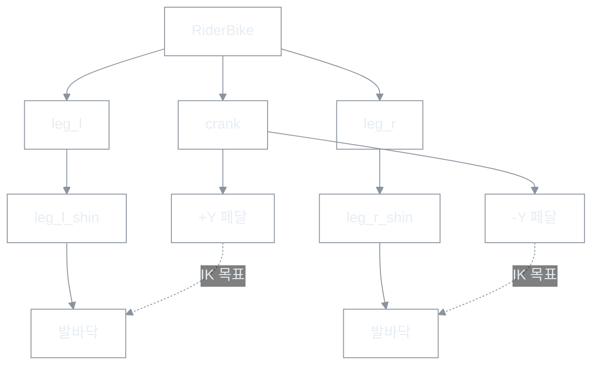
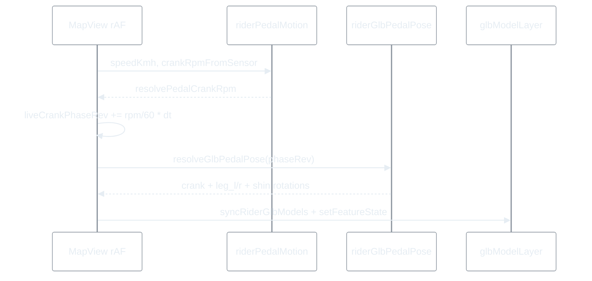

# GLB 라이더 형상·색상·다리 페달링 보고서 (260616)

| 항목 | 내용 |
|------|------|
| 문서 유형 | **기술 보고서** — GLB 프로토타입 라이더의 형태, 컬러, 페달·다리 모션 설계·튜닝 |
| 작성일 | 2026-06-16 |
| 상태 | **프로토타입 완료** (추가 아트·물리 튜닝 가능) |
| 관련 커밋 | `8267aed`, `758402c`, `046e356`, `57ee516`, `1cba0bf`, `5e62230`, `736007c` |
| 연결 문서 | [Rider 프로토타입 비교 가이드](260616-Rider-Prototype-비교-가이드.md), [화면 끊김 해결 보고서](260616-화면-끊김-문제-해결-보고서.md) |

---

## 0. 한 줄 결론

> **저폴리 GLB + Mapbox `nodeOverride` + 2-bone IK**로 레거시 16프레임 스프라이트 수준의 **속도 연동 페달링**을 구현했다.  
> 형상은 실린더·박스 조립, 컬러는 **블루 유니폼 + 밝은 헬멧 + 슬레이트 프레임**으로 구분했고, 다리는 **페달 좌표에 발을 고정**하는 IK로 크랭크·허벅지·정강이 방향을 일치시켰다.

---

## 1. 범위

| 포함 | 미포함 |
|------|--------|
| `VITE_RIDER_PROTOTYPE=glb` 모드 | legacy / iso2d 스프라이트 |
| 본인·동행 GLB 표시 | 스켈레톤 리깅·Blender 수동 애니 |
| 페달·다리 런타임 pose | 상체·팔 스윙, 바퀴 회전 |
| 코스 진행 방향(yaw) | 카메라 팔로우 bearing (별도 모듈) |

---

## 2. 캐릭터 형태

### 2.1 좌표계

```
+X  진행(동)   +Y  위   +Z  좌우(바퀴·크랭크 축)
지면 y = 0, 그림자 원 y ≈ 0.015
```

Mapbox model `orientation` 3번째 값(요) = `bearing - 90°` (`bearingToModelYawDeg`).

### 2.2 메시 구성 (`generate-rider-prototype-glb.mjs`)

| 파트 | 형태 | 비고 |
|------|------|------|
| 지면 그림자 | Circle r≈0.62, α≈0.26 | |
| 바퀴×2 | Torus (타이어+림) | hub y = 바퀴 반경 0.26 |
| 프레임 | Tube + box (BB·시트·헤드튜브·핸들) | |
| 크랭크 | Group `crank` — 팔 0.14m + 페달 box | **nodeOverride** |
| 상체 | Tube (골반→어깨) | 고정 |
| 팔×2 | Tube (어깨→핸들) | 고정, 좌우 z 오프셋 |
| 다리×2 | Group `leg_l` / `leg_r` + `leg_*_shin` | **nodeOverride** |
| 머리 | Sphere r=0.1 | 피부색 |
| 헬멧 | Shell + visor + stripe + rear | 로드형 실루엣 |

### 2.3 본 계층 (다리·페달)



### 2.4 치수 (현재, IK·GLB 동기)

| 항목 | 값 (m) |
|------|--------|
| 크랭크 팔 | 0.14 |
| 허벅지 (hip→knee) | **0.212** (로컬 `(0.04, -0.208)`, 기존 대비 −20%) |
| 정강이 (knee→발바닥) | **0.243** (로컬 `(0.065, -0.234)`) |
| 최대 도달 | ≈ 0.455 |
| 골반 hip | `(-0.10, 0.72)` + bob |

---

## 3. 컬러 구성

### 3.1 팔레트

| 토큰 | HEX | 용도 |
|------|-----|------|
| `jersey` | `#1d4ed8` | 상체·팔 (본인 톤) |
| `jerseyDark` | `#1e40af` | 팔 한쪽 음영 |
| `short` | `#1e3a8a` | 하의·다리 실린더 |
| `skin` | `#fde68a` | 머리·발 |
| `helmetShell` | `#f1f5f9` | 헬멧 쉘 (밝은 회백) |
| `helmetVisor` | `#334155` | 헬멧 바이저 |
| `helmetStripe` | `#1d4ed8` | 헬멧 스트라이프 (유니폼 연계) |
| `frame` | `#334155` | 프레임 메인 |
| `frameDark` | `#1e293b` | 크랭크·포크 |
| `bar` | `#0f172a` | 핸들바 |
| `tire` | `#1e293b` | 타이어 |
| `rim` | `#64748b` | 림·페달 plate |
| `shadow` | `#000000` α0.26 | 지면 |

### 3.2 디자인 의도

- **유니폼**: 단일 블루 계열 — 지도 위에서 본인·동행 식별 (동행은 동일 GLB, id만 분리).
- **헬멧**: 유니폼과 분리되는 **밝은 쉘 + 짙은 바이저** — 초기 짙은 파란 반구형은 유니폼과 구분 불가였음 (`736007c`에서 개선).
- **프레임·바퀴**: 중성 슬레이트 — 건물·도로와 충돌 최소화.
- **재질**: `MeshBasicMaterial` (조명 비의존) — Mapbox model 레이어에서 일관된 flat look.

---

## 4. 다리·페달 모션

### 4.1 진화 요약

| 단계 | 문제 | 해결 |
|------|------|------|
| 1 | 정적 GLB, 미끄러짐 | `crank` nodeOverride + 속도→RPM |
| 2 | 코너 직전 자전거 yaw 선행 꺾임 | `headingOnRouteAtPoint` (별도 보고) |
| 3 | 페달 역회전 | `crankRotationDeg = -phase × 360` |
| 4 | 허벅지·정강이 독립 sin/cos, 무릎 고정 | **2-bone IK** (`riderGlbPedalPose.ts`) |
| 5 | IK sin 부호 ≠ Mapbox Z회전 → 발·페달 분리 | `pedalWorld`를 회전 행렬과 동기 (`57ee516`) |
| 6 | 허벅지 과장·무릎 과굴곡 | 허벅지 −20%, bob·scoring 조정 (`5e62230`) |

### 4.2 런타임 파이프라인



### 4.3 IK 알고리즘 (요지)

1. `phaseRev` (0~1) → `crankRad = -phase × 2π`
2. `pedalWorld(l|r, crankRad)` — THREE/Mapbox right-hand Z 회전과 동일  
   - 오른(+Y arm): `(bb.x - R·sin θ, bb.y + R·cos θ)`  
   - 왼(-Y arm): `(bb.x + R·sin θ, bb.y - R·cos θ)`
3. `hipWorld(crankRad)` — 골반 bob `(0.016·cos θ, 0.036·sin θ)` 추가
4. `solveLegIk(hip, pedal)` — cosine law 2-bone, 두 무릎 후보 중 score 최대
5. 정강이 Z = `(shinDir - thighDir) - restShinRel` (**허벅지 대비 상대각**)

### 4.4 IK scoring (무릎 자연스러움)

| 항목 | 값 |
|------|-----|
| 무릎 목표 중심 | 138° |
| 95° 미만 과굴곡 패널티 | ×0.28 |
| 172° 초과 패널티 | ×0.18 |
| 무릎 전방·하방 가중 | ×6, ×1.4 |

### 4.5 검증 (수학)

- 전 stroke 32샘플: **발바닥–페달 오차 0mm** (IK 목표 = 페달 중심)
- 무릎 내각: 대략 **95°~172°** (stroke·bob에 따라 변동)

---

## 5. Mapbox 연동

| node | feature-state key | 회전 |
|------|-------------------|------|
| `crank` | `crank-rotation` | Z |
| `leg_l` | `leg-l-rotation` | Z |
| `leg_l_shin` | `leg-l-shin-rotation` | Z |
| `leg_r` | `leg-r-rotation` | Z |
| `leg_r_shin` | `leg-r-shin-rotation` | Z |

- 레이어: `model-rotation` paint expression → `match part → feature-state`
- 본인: `liveCrankPhaseRevRef` + `resolvePedalCrankRpm`
- 동행: `peerRidersDrive.phaseRev` → 동일 `resolveGlbPedalPose`

---

## 6. 관련 파일

| 경로 | 역할 |
|------|------|
| `apps/web/scripts/generate-rider-prototype-glb.mjs` | GLB 생성 |
| `apps/web/public/rider/prototype/rider-lowpoly.glb` | 출력 에셋 |
| `apps/web/src/lib/riderGlbPedalPose.ts` | IK·pose |
| `apps/web/src/lib/riderPedalMotion.ts` | RPM 해석 |
| `apps/web/src/lib/riderPrototype/glbModelLayer.ts` | Mapbox layer |
| `apps/web/src/lib/riderPrototype/config.ts` | env·node 키 |
| `apps/web/src/components/map/MapView.tsx` | rAF tick |

재생성:

```bash
cd apps/web
npm run gen:rider-glb
```

---

## 7. 알려진 한계·다음 단계

| 한계 | 후보 개선 |
|------|-----------|
| 저폴리 실린더 인체 | Blender/Meshy 리깅·LOD |
| 상체·팔 고정 | handlebar lean, shoulder bob |
| 바퀴 미회전 | wheel nodeOverride |
| TDC 근처 한쪽 다리 무릎 각 큼 | seat height·hip bob 추가 튜닝 |
| 동행 전원 동일 GLB | peer 색 variant 또는 uniform tint |
| BasicMaterial only | PBR·조명 (Mapbox 지원 범위 확인) |

---

## 8. 튜닝 가이드 (빠른 참조)

**허벅지 길이** — `KNEE_LOCAL` + GLB `knee` 좌표 **동시** 수정 후 `gen:rider-glb`.

**무릎 덜 굽히기** — `evaluateIkSolution`의 `flexMid` 중심(138)↑, `flexPenalty` 임계(95)↑.

**페달–발 어긋남** — `pedalWorld` sin/cos 부호와 `crankRotationDeg` 부호를 **함께** 바꾸지 말 것 (한쪽만 틀리면 재분리).

**골반 bob** — `hipWorld`의 `bobY` / `bobX` — BDC 도달 vs 상체 흔들림 trade-off.
