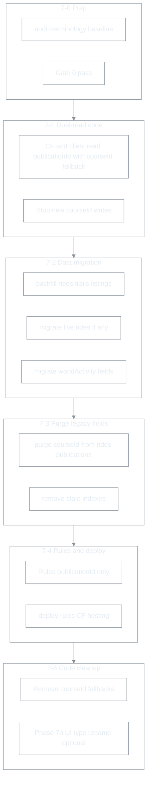

# Phase 7 — Firestore 필드·terminology 정리 (착수 전 체크리스트)

| 항목 | 내용 |
|------|------|
| 문서 유형 | **execution** — Phase 5–6 코드 rename 이후 DB 필드·Rules·CF 잔여 `course*` 정리 |
| 작성 | 2026-06-16 |
| 상태 | **착수 전** — baseline audit 필요 |
| 선행 | Phase 5 (`courses` 퇴역·`livePublicationRides`) · Phase 6 (코드·Rules shim) **완료** |
| 연결 | [Route·Publication 통합](260518-Route-Publication-통합-모델-및-마이그레이션.md), [Phase 0–1 terminology](260511-Phase별-실행-체크리스트-Course-Session-Presence.md) |

---

## 0. 목표

- Firestore **문서 필드**와 **집계 필드**에서 `courseId` / `course*` 명칭을 `publicationId` / `publication*` 로 단일화한다.
- CF·클라이언트의 `publicationId \|\| courseId` **이중 read**와 승인 시 **듀얼 write**를 제거한다.
- **문서 ID** (`routePublications/{publicationId}`, `routeActivity/{publicationId}`)는 이미 canonical — 필드 중복만 정리.

### 0.1 Phase 7 범위 밖 (별 트랙)

| 항목 | 이유 |
|------|------|
| 입문 허브 `BASIC_COURSES` / `firestoreCourses.ts` | 제품상 “공식 코스” — DB 키만 publication이면 충분 |
| UI 카피 (“코스 선택”) | 용어 정책·로컬라이즈 별도 |
| `ActivityWorldMapRoute.courseId` 등 **메모리 전용** 타입 | Phase 7b — DB 정리 후 코드 rename (shim 유지 가능) |
| `savedRoutes` → `routes` 장기 rename | RTW Phase E |

---

## 1. 착수 전 baseline (Gate 0)

로컬 또는 CI에서 **Admin SDK** 로 아래를 실행하고 JSON 결과를 이 문서 §8에 기록한다.

```powershell
cd c:\20.HDev\boxcycle\functions
npm run admin:audit-terminology
npm run admin:backfill-rides-terminology -- --dry-run
npm run admin:purge-ride-legacy-fields -- --dry-run
npm run admin:migrate-live-publication-rides -- --dry-run
```

### 1.1 Gate 0 통과 기준

| # | 확인 | 기대 |
|---|------|------|
| G0-1 | `collections.courses` | **0** (Console 삭제 완료) |
| G0-2 | `ridesFields.courseIdOnly` | dry-run backfill 후 **0** 또는 backfill 실행 계획 확정 |
| G0-3 | `ridesFields.courseIdPublicationIdMismatch` | **0** (불일치 있으면 수동 조사) |
| G0-4 | `migrate-live-publication-rides` `scanned` | **0** (레거시 `liveCourseRides`/`courseId` 필드 없음) |
| G0-5 | Hosting 배포 버전 | Phase 6 최신 (`publicationId` write on rides·live rides) |

### 1.2 audit에 없는 항목 — Phase 7에서 audit 확장 필요

| 컬렉션/필드 | 현재 audit | Phase 7 추가 |
|-------------|------------|--------------|
| `routePublications.courseId` | ❌ | 필드 존재·`doc.id` 동일 여부 |
| `trails.courseId` | ❌ | `publicationId` 없음 건수 |
| `openTrailListings.courseId` | ❌ | 동일 |
| `worldActivity/global.highlightedCourses` | ❌ | 필드 존재 |
| `worldActivity/global.activeCourseCount` | ❌ | → `activePublicationCount` |
| `publicRouteRequests.createdCourseId` | ❌ | `createdPublicationId` only 전환 |

---

## 2. Firestore 필드 inventory

### 2.1 컬렉션별 — 변경 대상

| 컬렉션 | 현재 필드 | 목표 | 신규 write | 레거시 read |
|--------|-----------|------|------------|-------------|
| `rides/{id}` | `courseId` | **삭제** (`publicationId` only) | ✅ 이미 `courseId: null` | `rideDocFields.resolvePublicationIdFromRide` |
| `routePublications/{id}` | `courseId` (= doc id mirror) | **삭제** | 승인 시 듀얼 write 중 | parse 시 doc.id fallback |
| `trails/{id}` | `courseId` | → `publicationId` | `createTrailInstance` | CF listing projection |
| `openTrailListings/{id}` | `courseId` | → `publicationId` | listing upsert | Rules create 검증 |
| `trails/.../livePublicationRides/{uid}` | `courseId` (레거시) | **삭제** | `publicationId` only (Rules) | `readPublicationIdFromDoc` |
| `worldActivity/global` | `highlightedCourses` | → `highlightedPublications` | CF reconcile | 클라 dual-read 기간 |
| `worldActivity/global` | `activeCourseCount` | → `activePublicationCount` | CF scheduled | `firestoreWorldActivity.ts` |
| `publicRouteRequests/{id}` | `createdCourseId` | **삭제** (`createdPublicationId` only) | approve batch | parse fallback |

### 2.2 이미 canonical (변경 없음)

| 경로 | 비고 |
|------|------|
| `routePublications/{publicationId}` doc id | publication 정체성 |
| `routeActivity/{publicationId}` | Phase 5 rename 완료 |
| `publicationPresence/{publicationId}` | |
| `publicationSessions/{publicationId}/members` | Phase 6 |
| `livePublicationRides.publicationId` | Rules 필수 |

### 2.3 삭제된 컬렉션 — index·Rules 잔재

| 항목 | 위치 | Phase 7 작업 |
|------|------|--------------|
| `courses` indexes (4건) | `firestore.indexes.json` | **제거** (컬렉션 없음) |
| `courseActivity` index (1건) | `firestore.indexes.json` | **제거** → `routeActivity` 확인 |
| `routePublications` where `courseId` index | `firestore.indexes.json` L138 | 쿼리 폐기 후 **제거** |

---

## 3. Rules 변경 inventory

| # | 위치 | 현재 | Phase 7 |
|---|------|------|---------|
| R1 | `trailHasCourseId()` | `courseId` 필드 검사 | `trailHasPublicationId()` |
| R2 | `openTrailListings` create | `courseId` 필수 | `publicationId` 필수 |
| R3 | `publicRouteRequests` approve | `createdCourseId` 허용 | `createdPublicationId` only |
| R4 | `livePublicationRides` | ✅ `publicationId` only | 유지 |
| R5 | `routePublications` | `courseId` Rules 없음 | `courseId` write 금지(선택) |

**배포 순서:** dual-read 코드 배포 → backfill → Rules 강화 → legacy field purge CLI.

---

## 4. Cloud Functions 변경 inventory

| # | 파일 | `course*` 사용 | Phase 7 |
|---|------|----------------|---------|
| CF1 | `routeActivityOnRideCreated.ts` | `publicationId \|\| courseId` | `publicationId` only read |
| CF2 | `routeActivityHeatReconcile.ts` | rides `courseId` fallback | `publicationId` only |
| CF3 | `routeActivityAggregateCore.ts` | `highlightedCourses`, `activeCourseCount` | rename + dual-write 전환기 |
| CF4 | `routeActivityScheduledReconcile.ts` | 동일 | 동일 |
| CF5 | `openTrailListingCore.ts` | `trail.courseId` → listing | `publicationId` |
| CF6 | `routeTokenOnRideCreated.ts` | ride `courseId` | `publicationId` (+ intro hub id는 semantic 유지) |
| CF7 | `trailPaths.ts` | live ride `courseId` legacy read | 유지 until migrate CLI = 0 |

---

## 5. 클라이언트 write path inventory

| # | 파일 | write 필드 | Phase 7 |
|---|------|------------|---------|
| W1 | `firestoreRides.ts` | `courseId: null` | `courseId` 필드 제거 from type |
| W2 | `firestoreRoutePublications.ts` | `courseId` on approve | **stop write** |
| W3 | `publicRouteRequests.ts` | `createdCourseId` | **stop write** |
| W4 | `firestoreTrailInstance.ts` | `courseId` on create | → `publicationId` |
| W5 | `firestoreOpenTrailListings.ts` | `courseId` | → `publicationId` |
| W6 | `firestoreTrailLivePublicationRides.ts` | ✅ `publicationId` | 유지 |

### 5.1 read path (dual-read 기간)

| # | 파일 | 패턴 |
|---|------|------|
| RD1 | `rideDocFields.ts` | `publicationId ?? courseId` |
| RD2 | `firestoreRoutePublications.ts` | parse requires `courseId` field | → doc.id sufficient |
| RD3 | `firestoreWorldActivity.ts` | `highlightedCourses` | + `highlightedPublications` fallback |
| RD4 | `firestoreTrailLivePublicationRides.ts` | `publicationId ?? courseId` in doc |

---

## 6. CLI·신규 스크립트

### 6.1 기존 CLI (Phase 7에서 사용)

| npm script | 용도 | Phase 7 |
|------------|------|---------|
| `admin:audit-terminology` | baseline·회귀 | §1 Gate 0 |
| `admin:backfill-rides-terminology` | `courseId`→`publicationId` copy | backfill |
| `admin:purge-ride-legacy-fields` | `roomId`/`userRouteId` delete | **확장:** `courseId` delete |
| `admin:migrate-live-publication-rides` | live ride field rename | §1 G0-4 |
| `admin:backfill-route-publications` | courses→publications | courses=0 이면 skip |

### 6.2 Phase 7 CLI

| script | 대상 | 동작 |
|--------|------|------|
| `admin:phase7-terminology-purge` | trails·listings·rides·routePublications·publicRouteRequests·worldActivity | 일괄 backfill + purge (2026-06-16 적용) |

---

## 7. Phase 7 실행 순서 (권장)



### 7.1 Sub-phase 수락 기준

| Sub | 작업 | 수락 기준 |
|-----|------|-----------|
| **7-0** | Baseline audit | §1.1 전항목 기록·이상 없음 확인 |
| **7-1** | Dual-read + stop write | 신규 publication/trail/ride에 `courseId` 미기록; 구버전 read 동작 |
| **7-2** | Backfill CLI | audit 재실행 시 `*Only` 카운트 0 |
| **7-3** | Field purge | Firestore Console spot-check 10건 |
| **7-4** | Rules + index | `firebase deploy --only firestore`; 구 index 삭제 |
| **7-5** | Fallback 제거 | `grep courseId` — Firestore path만 shim/허브 잔존 |

---

## 8. Baseline 기록 (2026-06-16)

환경: `functions/` 로컬, Firebase CLI ADC (`initAdminForCli`).

```json
{
  "recordedAt": "2026-06-16",
  "collections": {
    "rooms": 0,
    "trails": 172,
    "rides": 507,
    "courses": 0,
    "routePublications": 25,
    "routeActivity": 20,
    "publicationPresence": 14
  },
  "ridesFields": {
    "withRoomId": 0,
    "withTrailId": 507,
    "userRouteIdOnly": 0,
    "routeIdOnly": 121,
    "userRouteIdRouteIdMismatch": 0,
    "courseIdOnly": 0,
    "publicationIdOnly": 0,
    "courseIdPublicationIdMismatch": 0,
    "bothPublicationIdsMatch": 64
  },
  "purgeRideLegacyFieldsDryRun": { "scanned": 507, "matched": 0 },
  "backfillRidesTerminologyDryRun": { "scanned": 507, "matched": 0 },
  "migrateLivePublicationRidesDryRun": "2026-06-16 scanned 14 → apply copied 14 → delete-legacy deletedLegacy 14",
  "phase7PurgeApplied": "2026-06-16 — trails 144 publicationId, rides 64 courseId removed, routePublications 25, requests 22, worldActivity migrated"
}
```

### 8.1 Gate 0 판정

| # | 항목 | 결과 |
|---|------|------|
| G0-1 | `courses` = 0 | ✅ |
| G0-2 | `courseIdOnly` = 0 | ✅ |
| G0-3 | `courseIdPublicationIdMismatch` = 0 | ✅ |
| G0-4 | migrate live rides | ✅ copied 14 + `--delete-legacy` 14 (2026-06-16) |
| G0-5 | rides backfill/purge | ✅ matched 0 (추가 copy·roomId/userRouteId purge 불필요) |

### 8.2 해석

- **507 rides** 중 **64건만** `courseId`+`publicationId` 동시 보유(값 일치). 나머지 ~443건은 publication 미연결 주행(입문·ad-hoc) — Phase 7 purge 대상은 **64건의 `courseId` 필드 삭제**.
- **`publicationsWithoutCourseDoc`: 25** — `courses` 삭제 후 정상. Phase 7에서 `routePublications.courseId` **필드** 제거.
- **`routeIdOnly`: 121** — `userRouteId` 없이 `routeId`만 있는 rides. purge legacy matched 0 → 이미 정리됨 또는 dual 필드 없음.

---

## 9. 회귀 테스트 (수동)

| # | 시나리오 | 확인 |
|---|----------|------|
| T1 | UGC 승인 → `routePublications` 조회·지도 geometry | publication id로 카탈로그 표시 |
| T2 | 퍼블릭 탭 주행 종료 → `rides.publicationId` | `routeActivity.recentRideCount7d` increment |
| T3 | Trail 개설 (공개 + publication) → listing | Trailhead 목록 노출 |
| T4 | 동행 presence join | `publicationSessions` write |
| T5 | Activity World HUD | `highlightedPublications` 반영 |
| T6 | 구 Hosting 캐시 (선택) | dual-read 기간 중 구버전 앱 crash 없음 |

---

## 10. 리스크·완화

| 리스크 | 완화 |
|--------|------|
| Rules 먼저 강화 → 구 클라 write 거부 | **7-1 Hosting 선배포** |
| `routePublications` parse가 `courseId` 필드 필수 | parse를 doc.id 기준으로 변경 후 purge |
| index 삭제 후 쿼리 실패 | `where('courseId')` 호출 제거 확인 (`firestoreRoutePublications.ts` L180) |
| `activeCourseCount` HUD 깨짐 | dual-read `activePublicationCount ?? activeCourseCount` |

---

## 11. 완료 정의 (Phase 7 Done)

- [ ] Firestore 문서에 **`courseId` 필드 write 없음** (rides, routePublications, trails, listings, live rides)
- [ ] 레거시 `courseId` 필드 **purge CLI 완료** 또는 audit 0
- [ ] `worldActivity/global` **`highlightedPublications`** canonical
- [ ] `firestore.indexes.json` 에 **`courses` / `courseActivity` index 없음**
- [ ] CF rides/live aggregate **`publicationId` only**
- [ ] §8 baseline + post-migration audit 첨부
- [ ] §9 회귀 T1–T5 통과

---

## 12. Phase 7b (선택 — 코드-only)

DB 정리 완료 후 별 PR:

- `ActivityWorldMapDot.courseId` → `publicationId`
- `trackedCourseId` / `courseIds` props rename
- `firestoreRouteActivity.RouteActivitySnapshot.courseId` deprecated alias 제거
