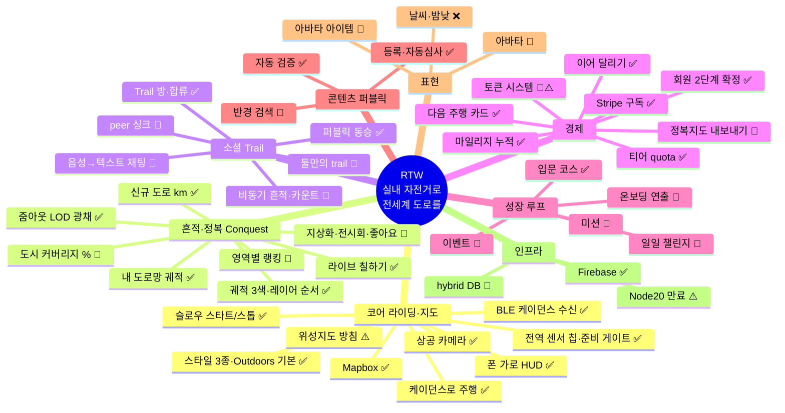

# RTW 기능 인벤토리 · 상태 보드

| 항목 | 내용 |
|------|------|
| 문서 유형 | **메타** — 전 기능·구상 단일 인덱스(상태 딱지). 상세 설계는 각 SoT 링크 |
| 최초 작성 | 2026-07-07 |
| 상태 | **반영중** — 코드와 대조하여 상태 검증됨(최근 대조 2026-08-29) |
| 연결 문서 | [마스터 비전](260511-RTW-마스터-비전-및-종합계획.md) · [Conquest 설계](260703-Conquest-정복-레이어-설계.md) · [출시 전 확인사항](출시%20전%20확인사항.md) |

> **이 문서의 사용법 (유지 규칙 — 이것 하나만 지키면 됨)**
> 1. 아이디어가 떠오르면 → 해당 영역 표에 **한 줄 추가**(상태 💭). 길어지면 별도 문서로 빼고 여기엔 링크만.
> 2. 구현·폐기되면 상태 기호만 갱신. Claude에게 "인벤토리 갱신해"라고 하면 코드와 대조해 갱신함.
> 3. 상태 기호: **✅ 구현** · **🔶 부분/미진** · **💭 구상** · **⚠️ 충돌/재검토** · **❌ 폐기**

---

## 1. 한눈 지도

---

## 2. 코어 정체성 (한 문단)

**"실내 자전거로 실제 지구의 도로를 달리고, 달린 만큼 영구 자산(내 도로망)이 쌓인다."** 즈위프트류 대비 저비용(장비·구독), 그래픽 전장 회피, 해자는 "지구 전체"(벡터 지도, 한계비용 ~0). 판매 문장: **Ride = Claim** — 페달을 밟으며 도시를 정복한다. → 상세: [마스터 비전 §1](260511-RTW-마스터-비전-및-종합계획.md), [Conquest 설계](260703-Conquest-정복-레이어-설계.md)

---

## 3. 인벤토리

### 3.1 코어 라이딩·지도

| 기능 | 상태 | 현재 상태 / 근거 | 다음 액션 |
|---|---|---|---|
| Mapbox 채택 (구글 대비 자유도) | ✅ | 결정·전면 사용 중 | — |
| 지도 스타일 3종 + **Outdoors 기본**, 주행 **상공(topDown)·줌 17.5** | ✅ | **(08-27 변경)** `appSessionKeys.ts` MAP_STYLE_OPTIONS = RTW Dark / Outdoors / Satellite, `DEFAULT_MAP_STYLE`=Outdoors. `mapGlobeView.ts` `RIDE_FOLLOW_CAMERA_MODE`=`topDown`, `RIDE_START_ZOOM`=17.5. 폰 실주행에서 RTW Dark 는 도로 판독이 어려웠다 | — |
| **상공(topDown) 카메라 프리셋** | ✅ | **신설(08-27)** — pitch 0, bearing=진행 방향(북향 고정 아님), 라이더 화면 중앙. 맵 뷰 시트 카메라 메뉴에 「상공」으로 노출. 주행 시작 기본값. 실측 확인 pitch 0 · zoom 17.3 | 줌 기본값 실주행 튜닝 |
| **계정 패널(마지막·일일·기간 통계)** | ✅ | **정비(09-15)** — 블록 12→7. 「Free/미구독」·「Free 플랜」·「유료 플랜 구독」 3중복 → 상태+행동 한 줄. **일일 주행을 기간 탭으로 흡수**(`RideStatsPeriod` 에 `day` 추가) → 종전 두 벌이던 통계 타일이 한 벌. 거리 히어로 + 시간·평속·칼로리 3타일. 마지막 주행 카드가 최근 주행 목록 입구(별도 행 제거). 터치 타깃 44px. 죽은 CSS 21규칙 제거. 계약 e2e + 단위 시험 PASS(215건 fail 0) | 자산 블록은 실데이터 육안 확인 필요 |
| **주행 중 RouteDock 자동 접힘** | ✅ | **수정(09-15)** — 의도는 「지도 가림 최소화」이지 정보 삭제가 아니다. `44ebce5`(PR #17)가 `ridingDiet` 로 경유지 목록까지 숨겨 **펼친 패널이 빈 껍데기**가 되던 것을 바로잡았다. 정책을 둘로 분리: `autoCollapse`=주행 시작 시 접기(유지) · `ridingDiet`=**편집** UI(저장·삭제)만 제거. 경유지·주소는 펼치면 보이고, 삭제 ✕ 만 `lockStopEditing` 으로 잠근다(주행 중 경로 변형 방지). 계약 e2e `route-dock-riding-content.spec.ts` 3항목(접힘·내용 표시·삭제 잠금) PASS | — |
| **경로 목록 정렬 — 세 목록 공용** | ✅ | **확장(09-16)** — 「내 경로」에만 있던 정렬을 입문·퍼블릭에도. 비교 규칙 `lib/routeListSort`(단일 진실) + 컨트롤 `RouteSortSelect` 하나를 세 목록이 공유하고, **기본값은 모두 `최근순`**. 「최근순」의 시계가 목록마다 다르다 — 내 경로 `updatedAt`, 퍼블릭 **등록 시각**(`routePublications.createdAt` → 요약에 `publishedAtMs` 신설). 입문 허브는 등록 개념이 없어 시각이 `null` 이고, 그때 최근순은 원래 순서로 물러나 Basic 1·2·3 난이도 순서가 지켜진다. 항목 2개 이하면 정렬 바 미표시. 계약 `route-list-sort-contract.test.ts`(거리순 방향·안정성·원본 불변·시각 부재 시 물러남) | 「최근 주행순」(`routeActivity.lastCompletedRideAtMs`)은 별개 축 — 미결 |
| **MENU 정리 — B단계(내 경로 모달)** | ✅ | **이전(09-16)** — 「내 경로」가 MENU 안 좁은 탭에서 스크롤되던 것을 공식 코스와 **같은 껍데기**(`RouteListModalShell` — `OfficialCourseListModal` 에서 추출)로 옮겼다. 목록·검색·정렬·필터는 `SavedRoutesPanel`(602줄)이 그대로 소유 — 자리만 옮긴 이동. 목록 가용 높이 **61 → 184px**. MENU 안 인패널 목록·죽은 CSS 3규칙 제거. 쿼터 초과 유도(`openSavedTabSignal`)도 모달 열기로 이어진다 | — |
| **MENU 정리 — A단계(계층 축소)** | ✅ | **정리(09-16)** — 폰 가로 계측에서 MENU 크롬이 패널 275px 중 214px(78%)를 먹고 「내 경로」 목록에 61px 만 남던 것(스크롤러 clientH 117 / scrollH 221)을 고쳤다. 섹션 라벨 2줄(TRAIL·경로)·탭 계층(공식경로/내 경로)·「이벤트」(준비 중 한 줄짜리 빈 껍데기)·「공식」 키커·중복 「경로로」 버튼 제거, 경로 출처를 칩 한 줄(`입문 · 퍼블릭 N · 내 경로 N`)로 통합. 실측 크롬 **214 → 131.9px**, 목록 가용 61 → 약 143px. 계약 `menu-declutter-a.spec.ts` | — |
| **지점 팝업 제목 행** | ✅ | **신설(09-16)** — 첫 줄 「경로 생성」(핀 후 「경로 생성 잔여 토큰 N개」), 주소는 둘째 줄. 종전에는 긴 주소가 첫 줄이라 닫기 ✕ 를 덮었고 제목 구실을 하는 행이 없었다. 토큰 줄은 제목이 되면서 **잔액 미확정에도 표시**(`setRouteStartPinned`), 상자 대신 아래 hairline. ✕ 자리는 제목 행이 `padding-right` 로 비우고, drag handle 전체 여백은 걷어 **주소·좌표가 폭을 다 쓴다**. 완성 문구 `경로 생성 잔여 토큰 N개` 는 불변 — 기존 토큰 e2e 그대로 통과. 검증: 1280×900·690×275 × 핀 전/후, ✕ 겹침 **면적 0** 계측 | — |
| **지도 롱프레스로 지점 선택** | 💭 | 「메뉴 누르려는데 지도 팝업이 뜬다」의 3안. 1·2안(표고 통과 + 터치 44px, 09-17)을 적용했고 **Chief 가 실기기로 필요 여부를 판단**하기로 함. 설계 논점(데스크톱 클릭 유지·발견 가능성 토스트·400~500ms/이동 10px·contextmenu 억제)은 [인수인계 §4.3](260917-UI-UX-개선-작업-인수인계.md) | 판단 대기 |
| **맵 뷰 시트 「내 도로망 표시」 토글** | 💭 | 끄고 싶다는 요구가 있었으나 실제 원인은 레이어 순서였고 그건 해결됨(09-16). 토글 자체의 유용성은 별건 | 미착수 |
| **RouteDock caret 터치 타깃** | 🔶 | **부분 수정(09-17)** — 세로 텍스트 「경로」를 빼면서(Chief) 높이가 37px 로 줄어 `min-height: 44px` 로 복구. `::after` 투명 히트 영역은 **여기서 못 쓴다** — 부모 `.route-dock__shell { overflow: hidden }` 이 caret 테두리 1px 바깥에서 잘라내 `elementFromPoint` 에 안 잡힌다(`getComputedStyle` 은 44px 를 보고하는 축퇴 함정). 배경이 transparent 라 **실제 높이**를 키우는 쪽이 시각 비용 0. 실측 h=44·위아래 끝 히트 OK·옆 센서 칩 도둑질 없음. 계약 `touch-targets-44.spec.ts` | **폭 20.9px 은 여전히 미달** — 「경로」와 무관하게 원래부터. 넓히면 접힌 dock 의 가로 footprint 가 커져 Chief 판단 대기 |
| **표고 그래프 시각 잠식** | 🔶 | 터치는 완전히 통과(09-17, 2차 — 아래 항목) 하지만 `min-width: 320px`·높이 120px 로 폰 가로에서 폭의 46% 를 차지 | 미착수 |
| **주행 결과 시트 컴팩트화** | ✅ | **수정(09-17)** — 11줄 → **4줄**(직계 자식 5). 설명문 2종·「끝점에서 새 경로」 CTA 제거, 완주/진행률을 배지로, 새 도로+오늘 2열, 저장 폼 한 줄. 실측 690×275 에서 `scrollHeight === clientHeight`(158=158). 기능은 남기고 진입점만 옮겼으므로 관련 계약은 **살아 있는 진입점으로 재조준**(사용자 정보 → 마지막 주행 → 「여기서 새 경로」). 계약 `ride-summary-compact.spec.ts` | `RideEndResult.sessionPathLngLat` 소비자 없음(별건) |
| **e2e 체험 속도 누락** | ✅ | **수정(09-17)** — RC 스펙들은 `prepareManualRideInput(page, 50)` 으로 상한 속도를 걸어 시간을 줄이는데, 신규 스펙 2종만 그 설정이 없어 기본 ~5km/h 로 달렸다(100m 넘기는 데만 80초). 같은 방식 적용 → `ride-summary` 1.6분 → **35초**. `SESSION_SPEED_MAX_KMH = 50` 이 상한이라 더는 못 올린다 | — |
| **계기판 자리·표현 재설계** | ✅ | **수정(09-17)** — ① 상단 중앙 → **좌상단 첫 줄**(진행 방향 지도를 가리던 것). RTW 메뉴는 둘째 줄로, `.map-hud__tl-metrics` 가 비어도 높이를 예약해 **세 상태 모두 y=41.375 고정**. ② 검은 패널 폐기 — 배경·테두리·그림자·블러·구분선 없이 지도 위에 글자만, 대비는 8방향 1px 키라인이 만든다(작은 라벨은 헤일로로 분리). ③ 셀 **고정 폭** — `tabular-nums` 로는 자릿수 변화를 못 막아 「9.9→10.0」에 오른쪽이 통째로 밀렸다. ④ 간격 절반(25→12.5px) — 고정 폭 셀의 좌우 패딩은 글자를 안 옮기고 상자만 넓혀 간격으로만 나타난다. ⑤ 지명검색은 HUD → **MENU 헤더 칩** | — |
| **터치 계약의 축퇴 구멍** | ✅ | **수정(09-17)** — `touch-targets-44.spec.ts` 의 타깃 루프가 `if (!el) continue` 로 **선언한 대상이 사라져도 통과**했다(가드 `length >= 3` 은 4개 중 1개가 빠져도 통과). 실제로 지명검색 버튼이 MENU 로 옮겨가 사라졌는데 계약은 초록이었다 → 누락 셀렉터를 모아 `missing === []` 과 `잰 수 === 선언 수` 를 단언 | — |
| **표고 그래프 면 전체 터치 통과** | ✅ | **수정(09-17, 2차)** — 1차(`pointer-events: none`)로도 Chief 는 계속 막힌다고 했다. 실측하니 **오버레이는 이미 통과하고 있었고** 그 위 `.map-hud__bc`(코치 토스트 슬롯, `role="status"` 하나만 담음)가 같은 자리에서 덮고 있었다. 주행 중 하단 절반 격자 95 차단 지점 중 코치 토스트 계열 27·축척 바 6·내 위치 4 — 나머지는 정당한 버튼·dock. 넷을 표시 전용으로 전환. 1차 계약이 초록이던 이유는 **오버레이 정중앙 한 점·주행 전(idle)** 만 봤기 때문(코치 토스트는 주행 중에만 뜬다). 이제 계약이 **주행 중 면 960 지점**을 훑어 차단 0 을 단언 | `.map-hud > * { auto }` 가 첫머리 주석의 계약(「슬롯은 none」)과 반대인 것은 그대로 — 우하단 버튼 뭉치 빈 공간 2 지점 잔여 |
| **터치 타깃 44px · 표고 그래프 통과** | ✅ | **수정(09-17)** — ① 표고 그래프 `pointer-events: none`. 배경이 투명한데 터치만 삼켜 폰 가로에서 **화면의 24.4%(386×120px, 하단 중앙)** 가 지도 조작 불가였다. `.map-hud` 가 이미 쓰던 규칙(슬롯은 none, 내부 위젯만 auto)에서 이 오버레이만 빠져 있었다. ② HUD 터치 타깃 44px — 보이는 크기는 유지하고 `::after` 투명 히트 영역만 넓힌다. 글자 알약은 세로만(가로는 이미 44px 초과, 넓히면 옆 버튼 탭을 가로챈다), 정사각 아이콘은 두 축. 실측 28.3~32.4px → 히트 44px, 경계 2px 바깥이 지도→버튼으로 바뀜 | 롱프레스(3안)는 ①②의 효과를 보고 판단 — 대기. Mapbox 자체 컨트롤 버튼은 24px 이나 그룹 상자가 근접 오터치를 흡수 |
| **내 도로망 ↔ 경로선 강조(단계별)** | ✅ | **수정(09-16)** — 내 도로망이 z16 에서 7px·0.95 로 4px 경로선 위를 덮어 이미 달린 도로에서 빨간 경로선이 통째로 사라지던 문제. `lib/conquestLayerEmphasis` 단일 판정으로 단계마다 주인공을 바꾼다: 주행 중=궤적 위(0.95) · 경로 설정·확인 중=경로선 위, 내 도로망 0.6 + 폭 하한 7px(지우지 않고 배경으로) · 경로 없는 화면=종전 그대로. 둘을 **동시에** 읽히게 하는 일은 색이 아니라 **폭 차이**가 맡는다 — 설정 중 내 도로망 폭 하한 7px 로 경로선(4px) 양옆에 1.5px 띠가 남는다(모든 줌). 흰 테두리(casing) 1차 시도는 **폐기** — 테두리가 내 도로망보다 굵어 경로선은 살고 내 도로망이 죽었다 | 맵 뷰 시트의 「내 도로망 표시」 토글은 별건 — 미착수 |
| **우상단 센서 폴백 제거 — dock 이 `idle` 까지** | ✅ | **완결(09-16)** — `isRouteDockVisible` 이 `idle` 을 포함(숨기는 곳은 `gate`·`gate-nickname`·`summary` 뿐). 칩이 항상 dock 에 살게 되어 `sensorChipSlot` 에서 `map-hud-tr` 슬롯과 MapHud 의 `CadenceHudChip`·`cadence` prop 을 통째로 삭제. **우상단은 모든 stage 에서 계정·맵 둘.** 좌하단은 `MapBottomLeftStack` 신설 — dock·「다음 주행」 카드·입문 CTA 가 같은 좌표에 절대 배치돼 있던 것을 세로 스택으로 묶었다(종전엔 서로 배타적이라 안 겹쳤을 뿐). `idle` 에서는 접힌 채로 뜬다. 실측: 좌하단 상자 2개 겹침 **면적 0**, 스택 높이 142px | 미병합 `fix/ui-declutter-6a`(6A-R2)의 아이디어 — 그 브랜치는 카드 겹침을 재지 않았다 |
| **센서 칩 자리 — RouteDock 통합** | ✅ | **이전(09-16, `UI-DECLUTTER-SENSOR-6A`)** — 우상단 3개(센서·계정·맵) → 2개. 칩은 RouteDock **첫 행 좌측**(`route-dock__top` — 헤더 행을 접히는 본문 밖으로 hoist)이라 주행 중 접어도 rpm·연결 상태가 남는다. 자리는 `lib/sensorChipSlot.ts` 단일 판정 — dock 이 보이는 `setup`·`ready-to-start`·`riding`·`paused` 는 dock, **dock 이 없는 `idle` 은 우상단 폴백**(센서 시트가 Go 의 사전조건 입구라 소실 금지). 칩 기능·aria·rpm 표기 불변, 위치만 이동. 폰 가로(690×275) 실측: **dock 243×83.53px 로 칩 유무와 무관**(main2 치수와 동일), 칩 19.27px < 행 22.27px, Go 폭·높이·헤더 줄바꿈 0. e2e 8조합 표시 PASS | `idle` 우상단 3개는 그대로 — 후속 판단 |
| **폰 가로 HUD 컴팩트** | ✅ | **구현(08-27)** — 690×275 격자 계측 기준 지도 잠식 **41.8% → 23.4%**. 접속·동행 패널·Trail 배지 숨김, 지표 높이 44→31px, RouteDock 폭·하단 여백 축소, 맵 뷰 트리거를 하단 중앙→우상단 계정 칩 아래, 맵 뷰 시트를 우측 좁은 패널로, 루트 폰트 16→13.5px. 전부 `@media (max-height:560px)` — 데스크톱 미변경. 주요 조작 8종 겹침 0px² | — |
| 위성지도 노출 방침 | ⚠️ | 노트: "해상도·누운 건물 때문에 못 보여줄 것" ↔ 현재 Satellite 옵션 **노출 중** | 숨길지 결정 |
| 3D 측면 카메라 건물 가림 | 🔶 | 알려진 문제. 주행 기본 2D로 완화 | 3D 유지 여부 결정 |
| 슬로우 스타트/스톱 (고정속도 가감속) | ✅ | **구현(07-14)** — `rideSpeedRamp.ts`(고정 가속 +3/감속 -5 km/h/s) + `useVirtualRideSession`의 `appliedSpeedRef` 램핑. 시작(0→목표)·슬라이더 조작(상향/하향 모두) 시 서서히 수렴, 일시정지·종료는 즉시 정지(감속 연출 없음 — 반응성·기록 정확성 우선). HUD 속도·페달 애니메이션도 동일 곡선 동기화. Playwright 실측 검증(0→20km/h ~7초 선형 가속, 20→5 선형 감속, pause 즉시 정지) | — |
| BLE 케이던스 **프로토콜 수신** (CSC `0x1816`) | ✅ | `useBleCrankRpm` + `lib/bleCscCadence.ts`(파서·rollover·정지 판정 순수 모듈, Node 시험 25건). Chromium·HTTPS/localhost | — |
| ~~**HUD 거리 이중 표기 (오늘 + 누적·진행률)**~~ → **HUD 거리 「누적 / 전체」 한 줄** | ✅ | **구현(08-29, U4)** — 주행 중 거리 셀에 「오늘 N km」(세션)와 「누적 M / 전체 km (P%)」(경로 위치)를 함께 표시. 인정 축(운동·칼로리·Claim·기록)은 그대로 세션 구간. `aria-label="오늘 거리"`·`"누적 진행"` 으로 계약 고정, e2e C1 이 재개 직후 「누적 ≥ offset · 오늘 ≈ 0」 단언. 증거 `document/archive/ride-verify-evidence/u4-hud-resume-dual.png` **뒤집음(09-17, Chief)** — 세션 거리와 누적 거리의 차이는 **이어 달리기 offset 뿐**이라 처음부터 달리면 주행 내내 같은 숫자였다(2줄·히어로 자리를 중복이 점유). 이제 **`누적 / 전체 km` 한 줄**만 두고 전체거리는 흰색 볼드(목표), **진행률 %는 표고 그래프 마커로 이전**(`NN% covered`) + 종점 빨간 깃발. `routeProgressPct` 는 삭제. 실측 거리 셀 높이 20.6px(시간 셀 18.75px 의 1.10배 = 1줄). 계약 `hud-distance-elevation-shots.spec.ts` | — |
| **케이던스로 가상 주행 속도 직접 제어** | ✅ | **구현·실물 검증(08-27~28)** — 입력 모드 `manual`/`cadence` 분리, `cadence` 목표 속도 `min(30, rpm × 0.32)`(deadzone 8rpm), 단절·정지 시 목표 0(자동 manual fallback 없음). CYCPLUS C3 실주행 통과: P1~P7·P9·P10(연결·RPM 표시·페달링 전진·정지 감속·재개·일시정지). **미확인 P8·P11·P12**(주행 중 전원 차단·종료 후 연결 유지·명시적 체험 전환) | P8·P11·P12 단절 시나리오 |
| **HUD 전역 센서 상태 칩** (계정 칩 왼쪽) | ✅ | **코드 반영(08-27, SENSOR-2)** — `CadenceHudChip` + `lib/cadenceSensorUi.ts`(흰/초록 LED 2색만, 주행 전 `CAD`·주행 중 `N rpm`, 장치명은 칩에 넣지 않음). 칩 클릭 → 전용 `CadenceSensorSheet`(장치 전체명·연결/해제·모드 전환·체험 속도). RouteDock·주행 설정·MENU 의 중복 센서 UI 제거. 표시 계약 Node 시험 17건. **실물 통과 H1~H6·H9·H13·H14**(칩 표시·상세 열림·chooser·장치명 분리·RPM 갱신·계정 버튼 충돌 없음·좁은/가로 화면). **미확인 H11·H12**(단절 후 재연결·manual 주행 중 센서 열기) | H11·H12 |
| **주행 입력 준비 게이트 (Go 사전조건)** | ✅ | **코드 반영(08-27, SENSOR-2)** — `RideInputReadiness` 5상태. 기본 `manual` 초기값은 선택이 아니며, 「체험 속도로 준비」 명시 선택 또는 cadence 연결+**유효 RPM 1회 확인**이 있어야 Go 가능. Go 전 단절 시 준비 해제. `ride-entry` e2e 6건이 잠김·해제를 고정. **실물 통과(H5~H8)** — 준비 전 Go 잠김을 폰에서 실제로 겪고 해소 확인 | — |
| 센서 연결이 주행 세션과 분리 (주행 전 확인·주행 후 재사용) | ✅ | `useBleCrankRpm` 이 앱 생명주기에만 묶임(08-27, 이전 `sessionActive` 강제 해제 제거) | — |
| 허용된 센서 자동 복원·재연결 | 🔶 | **코드 반영(08-27)** — 최초 chooser 허용 뒤 같은 문서는 장치 참조를 보존하고, 페이지 복귀는 `getDevices()`의 명확한 단일 후보를 복원. 단절 시 광고 감지 + 0.5~10초 백오프로 GATT·CSC notification 재구성. 명시적 해제·백그라운드에서는 중단. 연결 복구 시 cadence 입력 모드도 복원 | CYCPLUS C3 유휴 단절→페달 wake 물리 검증. 최초 권한·브라우저/OS 한계 안내 유지 |
| 고정속도 상한 15~18km/h | 🔶⚠️ | T0 정책 15 설계 ↔ **개발완화 50 적용 중** | [출시 전 복원](출시%20전%20확인사항.md) |
| **「다음 주행」 카드 (지도 위 다음 행동 주 표면)** | ✅ | **구현(08-29, RIDE-CONTINUE-1) + 2단계(09-13, RIDE-NEXT-VISIT-2, PR #16)** — 파생 후보·CTA·재개 미리보기 유지. idle 시 재개 앵커 **1회** 프레이밍(`nextRideFramedRideIdRef`), 카드 가독성, 후보 null 시 `FirstRideIntroCard`→입문 허브, 카드/입문 CTA 중 idle 「MENU → 입문」 힌트 숨김. Hosting 스모크: 입문 CTA→Basic 1 로드. `test:next-ride` 191 pass | — |
| **주행 종료 후 idle 복귀** | ✅ | **수정(08-29, 실주행 수용 1차 실패 대응)** — 결과 시트를 닫으면 방금 달린 Route·핀·재개 후보를 비워 `stage` 를 idle 로 되돌린다. 이전에는 `ready-to-start` 로 머물러 RouteDock 이 Go 를 다시 띄우고 「다음 주행」 카드가 숨었다(reload 해야 보임). 종료 시 진행률 낙관 반영으로 Firestore 왕복 전에도 재개 지점이 정확하다. e2e C1 이 reload 없는 노출을 단언, 증거 `document/archive/ride-verify-evidence/c1-next-ride-card-no-reload.png` | — |
| **실제 세션 시작·종료 anchor** | ✅ | **구현(08-29, RIDE-CONTINUE-1 단계 B)** — `rides` 에 `sessionStart/EndLngLat`·`RouteMeters`·`ProgressRatio`·실제 세션 지명 저장. 계획된 `endLngLat` 이 아니라 **실제 종료 누적 거리 지점**이 다음 출발점이 된다. `liveForMap` 과 같은 경계 함수(`routeProgressMath.ts`)를 공유하고, geometry 가 없으면 좌표는 null(추측 금지·legacy backfill 없음) | — |
| **모든 유효 Ride 결과 시트** | ✅ | **구현(08-29, RIDE-CONTINUE-1 단계 C)** — 도착·ad-hoc 여부로 노출을 제한하던 조건을 폐기하고 `isDiscardableRideRecord` 를 통과한 모든 Ride 가 결과를 연다. 미완주는 「전체 진행 31% → 43%」, 완주는 「경로를 완주했습니다」, 공통으로 「다음 출발점이 저장되었습니다」 + 새 경로 연결 CTA. ad-hoc 저장은 보조 액션이 되고 「저장 안 하면 잃는다」 경고는 제거 | — |
| **최근 주행 행 액션** | ✅ | **구현(08-29, RIDE-CONTINUE-1 단계 F)** — 읽기 전용 목록에 지도에서 보기·이어 달리기·여기서 새 경로를 붙였다(중첩 button 없는 row action 구조). 실제 종료점이 없는 legacy Ride 는 기록만 표시하고 CTA 를 만들지 않는다(e2e C5) | — |
| 완주 표시 단일 정책 (98%) | ✅ | **정리(08-29)** — `UserInfoSheet`·`RideHistoryPanel` 이 반올림 95% 로 따로 판정하던 것을 `isRouteCompletion`(98%) 하나로 통일. 95~97% Ride 가 목록에서만 「완주」로 보이던 불일치 제거 | — |
| 코칭 TTS·배너·BGM | ✅ | 주행 중 문구(R1~R4) 동작 확인 | — |

### 3.2 흔적·정복 (Conquest) — SoT: [260703](260703-Conquest-정복-레이어-설계.md)

| 기능 | 상태 | 현재 상태 / 근거 | 다음 액션 |
|---|---|---|---|
| 내 도로망 영구 궤적 (z20 셀·traces) | ✅ | v2 파이프라인 (`conquestOnRideCreated`) | — |
| **지도 궤적 색·레이어 순서** | ✅ | **확정(08-28)** — 빨강 `#ef4444` 아직 안 간 길(루트) / **BlueViolet `#8A2BE2`** 내가 달린 길(이번 주행 궤적 + 내 도로망 공통, glow·굵기로만 구별). 색은 Outdoors 색상환(35·50~60·98·194·205·224°)과 앱 오브젝트(0·142°)를 실측해 **비어 있는 260~340°**에서 선택(271°). 마젠타 330° 는 빨강과 30° 이웃이라 기각, Indigo `#4B0082` 는 명도 25% 로 밝은 지도에서 검게 읽혀 기각. 순서 `route < 누적 < live glow < live` 를 `orderConquestLayersAboveRoute()` 가 매 적용마다 재정렬 — 이전엔 누적 궤적이 `beforeId:"route"` 로 경로선 아래에 깔려 어떤 색도 빨강에 죽었다 | — |
| **내 도로망 줌아웃 LOD** | ✅ | **구현(09-14)** — 원거리에서 궤적이 실오라기로 사라지던 문제. 누적 궤적 **아래**에 같은 색 광채 레이어(`boxcycle-conquest-traces-halo`) 한 겹 — 굵고 흐려 가까운 궤적끼리 자연히 뭉쳐 덩어리로 읽힌다. **z13에서 0**(근거리 렌더 바이트 단위 무변경 확인). 측정(주행 3건 합성): z5 0→127px · z8 372→1,037px(2.8배) · z11 +7% · z14 동일. 경계 없는 광채 — 윤곽이 생기면 「채워야 할 영역」=분모가 되어 [§3.4](260703-Conquest-정복-레이어-설계.md) 금지와 충돌. 대조 하네스 `e2e/conquest-lod-shots.spec.ts` | **타일 채우기 집계는 Phase B** |
| **비동기 흔적 시각 위계** | ✅ | **조정(08-28)** — 내 궤적 > 설정된 경로 > 비동기 흔적. 흔적은 red 계열(`#dc2626`) 유지하되 강도만 낮춤: pulse 불투명도 0.92→**0.45**·굵기 5→3, heat 0.78→**0.28**·굵기 4→2.5. 이전엔 흔적(w5)이 경로(w4)보다 굵어 배경 정보가 더 강했다 | 실데이터 밀도에서 재조정 |
| **지나온 구간 렌더 회귀 수정** | ✅ | **수정(08-28)** — `isStyleLoaded()` 게이트 때문에 주행 중 「지나온 구간」이 아예 안 그려지고 있었다(계측 `liveCoords 0`). 주행 중엔 카메라가 매 프레임 움직여 `idle` 폴백도 오지 않는다. 누적 궤적 레이어도 같은 함정 | — |
| 신규 도로 km 지표 (「새 도로 +N km」) | ✅ | 주행 결과·계정 화면 | — |
| 라이브 칠하기 + 🏴 칩 | ✅ | `useLiveConquestPaint`, 라인 폭 통일(07-06) | — |
| Trust Tier (T0 체험 / T1 케이던스) | 🔶 | CF 구현, **개발완화 수치** | 출시 전 복원 |
| 도시 정복률 (도로 커버리지 %) | 💭 | "온 도시를 빈틈없이" — 분모(도시 총 도로) 필요 | OSM 그래프 검토 |
| 지상화·글자 그리기 (나스카·LIKE) | 💭 | 궤적 데이터는 이미 있음 — 뷰·공유 UX 필요 | Phase B+ |
| 작품 전시회 + 좋아요 + 기간별 뱃지 | 💭 | 미착수 | 지상화 이후 |
| 영역별 랭킹 (world/country/province/city/sub-city) | 💭 | **방향 확정(07-07 자문·[결정 로그](260707-RTW-결정-로그.md))**: 표시=행정구역·계산=타일. 달린 z12청크/z20셀에 행정코드 lazy 1회 판정·캐시(런타임 역지오코딩 금지). sub-city는 OSM 품질 편차로 후순위 | 프로토타입 스파이크 |
| 구간 챌린지 (교차로~교차로 완주) | 💭 | Conquest §3.4, Phase B (OQ-13 ID 체계 선행) | Phase B |
| 마이크로 이벤트 (주행 중 교차로 확보·구간 XP 팝업) | 💭⚠️ | 07-12 자문 제안([요약](archive/260712-자문-문답-홀로-함께-역할분담-이어달리기.md)). **주의**: Conquest §3.3(중독 방지)·코어 몰입 원칙과 충돌 검토 선행. 단기 도파민은 이미 라이브 칠하기가 담당 | 2.0+ 보류 |
| 발견 이벤트 (첫 터널·해안도로·500m 업힐 등) | 💭 | 07-12 자문 제안. 지도 태그 분석 필요 — 보기보다 무거움 | 2.0+ |
| 정복 카피 v2 통일 (「새 영토」→도로 언어) | ✅🔶 | 카피 다이어트(07-16 `550aa0c`)로 코드 내 **「새 영토」 문자열·주석 제거 완료**(현재 UI=「새 도로 +N km」·🏴). 문서 잔존 여부만 확인 과제 — [Ontology §4](260714-RTW-Ontology.md) | 문서 카피 최종 점검 |

### 3.3 소셜 (Trail·동행)

| 기능 | 상태 | 현재 상태 / 근거 | 다음 액션 |
|---|---|---|---|
| Trail 방 자동 생성·합류·추월 | ✅ | 주행 시작=Trail 개설, MENU 합류 | — |
| 퍼블릭 코스 동승 (같은 Trail) | ✅ | presence 격리 v2(07-12 `6dc179b`): 입문 허브만 cross-Trail, 그 외 Trail 단위 격리(`isolateByTrail`) | 재검증 |
| peer 위치·속도 싱크 | 🔶 | 발행 수명주기 WARNING 채택(route S4-1R2 + motion S4-M1R · F-2). **남음:** 읽기 증폭(S4-2)·heartbeat(S4-3)·목록 시계(F-1) — 위치 동기화 전체 종결 아님 | [REPORT](ops/sync-relay/REPORT.md) |
| 접속/동행 중복 표시 | ✅ | 동행 블록에서 활성 접속자 제외(07-12 `6dc179b`). 빈 문장·인원수는 Trail 실시간 구독 한 소스(`companionHudCopy`, 4D). aggregate 인원수는 쓰지 않음(heat 절만 유지). 폴링 60초 불변 | 이탈 즉시 1명·접속 목록 정리 2창 확인 |
| 경로 통산 카운트 ("이 길을 달린 사람 N명·진행 중 M명") | 💭 | **07-13 역할 분담 결정([결정 로그](260707-RTW-결정-로그.md)) — 비동기 사회성 최소 단위, 1.0 후보.** 유동성(동시접속) 불필요 | 데이터 소스 검토(rides 집계) |
| 비동기 흔적·고스트 ("어제 Anna가 여기까지"·앞뒤 거리 비교) | 💭 | 07-12 자문 — "같은 시간이 아니라 같은 길을 공유". Journey 진행자 간 위치 비교 | 통산 카운트 이후 Phase B |
| 둘만의 trail (private 초대) | 💭 | 프리미엄 장기 플랜 | 궤도 후 |
| 음성→텍스트 대화 (주행 중 채팅) | 💭 | 프리미엄 장기. "감정 한 템포 조절" 의도 | 궤도 후 |

### 3.4 경제 (토큰·티어·수익화)

| 기능 | 상태 | 현재 상태 / 근거 | 다음 액션 |
|---|---|---|---|
| 티어 quota (익명 3/5 · 무료 5/30 · 유료 50/100) | ✅ | `tierQuotaCore` + 2단 방어. 월5 적용 확인(07-06) | — |
| Route 진행률·이어 달리기·미완료 쿼터 | ✅ | **§9.5 전 단위(1~7) 완료(07-13 `6e5647a`)**: 완주 ≥98% 게이트·`lastProgressRatio`·TTL 90일·미완료 쿼터 서버검사·초과 유도·진행률 바·**이어 달리기 재개**(위치는 누적·인정은 세션, Playwright 실주행 E2E 검증). 설계 SoT=[Conquest §9.5](260703-Conquest-정복-레이어-설계.md) | — |
| **진행률 단조 보존 (서버 transaction)** | ✅ | **구현(08-29, RIDE-CONTINUE-1 단계 A)** — `updateSavedRouteProgressInFirestore` 를 `runTransaction` 으로 바꿔 서버 문서 기준 `max(server, requested)` 보장. 완주 문서는 미완주로 되돌리지 않고, stale(더 낮은) write 는 `lastRideId` 도 덮지 않는다. 규칙은 순수 모듈 `savedRouteProgressPolicy.ts` 하나로 로컬 저장·중복 갱신과 공유. 중복(dedupe) 저장이 `completed`·`lastProgressRatio` 를 0 으로 합성하던 결함도 제거. 시험: `test:next-ride` + e2e C2(43% 뒤 늦은 31% → 43% 유지) | — |
| Stripe 구독 → tier 승격·강등 | ✅ | webhook + 만료 스윕 | — |
| 경로 생성 토큰 | 🔶 | `routeTokenBalance`·온보딩 지급 CF·생성 게이트 **구현**. 온보딩 **Guest 10 · 로그인 15**(2026-09-02, [3G](ops/route-relay/260902-거리방향-자동Route-3G-병합푸시-Token온보딩기본값-작업지시서.md)). `config/routeTokenEconomy` 문서 우선. ↔ 노트 구상과 **불일치** | **§4-1 정리 필요** |
| **거리·방향 자동 Route** (popup 통합·3F-C-R1) | ✅ | **main2 병합(2026-09-02)** — Stage 0→1→2, `offered`/`exact`/`detoured`, 도넛 폐기·참고 원·offered UI·거리 조정 재탐색. 사용자 6클릭 **6/6** Route 반환. `algorithmVersion: 3F-C-R1-reach-offer` | [3F-C-R1](ops/route-relay/260902-거리방향-자동Route-실패없는-도달제안-3F-C-R1-작업지시서.md) · 3F-D 후속 |
| 토큰 획득 루프 (퍼블릭 주행→토큰) | 💭 | 미구현 | 토큰 정리 후 |
| 회원 체계 | ✅결정 | **2단계(Free/Supporter) 확정(07-07)** — 3단계 폐기. 코어 루프(주행·정복·개척·랭킹) 전부 무료, 유료=편의·표현·분석(상세 통계·아바타·비공개 Trail·음성→텍스트·지도 내보내기·Creator Dashboard) | 유료 기능 목록 확정 |
| 마일리지 (절대 안 줄어드는 누적 운동 이력: 거리·시간·횟수) | ✅ | **구현(07-16)** — 서버 집계 `mileageOnRideCreated`(rides 생성 시 `users/{uid}.mileageTotalMeters·mileageTotalSec·mileageRideCount` 증가, `mileageApplied` 멱등), 과거 backfill(`backfillMileageCore`/CLI), `useUserTier` 구독, 계정 시트 「누적 N km·H시간 M분·N회」 블록 + 시작 전 HUD 「누적 N km」 힌트. conquest와 달리 재주행 전액 인정. SoT: [Token 경제 §4](260518-Route-Token-경제-설계.md)·[Ontology §2.5](260714-RTW-Ontology.md) | — |
| 정복 지도 내보내기 (8K PNG·연간 포스터) | 💭 | 07-07 자문 채택 — "축적을 판다" 철학의 직접 수익화. 유료 후보 1순위 | Supporter 설계에 포함 |
| Mapillary 주행 중 거리뷰 | 🔶 | **기본 off(08-27)** — 맵 뷰 시트 「거리뷰」 토글로 켠다. 꺼져 있으면 Graph API 조회 자체를 하지 않는다. 폰 가로에서 창이 상단 버튼을 덮던 위치도 수정 | 실사용 빈도 관찰 |
| 구글 스트리트뷰 프리미엄 | ❌ | **폐기(07-07)** — pre-version 비용 사망 전례 + Mapillary 무료 내장과 중복 | — |

### 3.5 성장 루프 (온보딩·미션·이벤트)

| 기능 | 상태 | 현재 상태 / 근거 | 다음 액션 |
|---|---|---|---|
| 입문 공식 코스 | ✅ | 실도로 3경로(남산공원길 413m·퐁뇌프 448m·West Drive 453m, 전부 cycling). web·functions ID 정합, 검증기 45검사·e2e 5건 통과. **프로덕션 반영 완료**(2026-08-16, created 3·archived 5) — 실 Firebase 앱에서 입문 목록이 정확히 새 3개임을 확인 | 레거시 부수 문서(presence·activity) 잔존 관찰 |
| 온보딩 흐름 (첫 로그인→입문 인도→센서 확인→토큰 연출) | 💭 | 토큰 온보딩 지급 CF만 존재. 인도·연출("땡그랑") 없음 | 온보딩 설계 |
| 미션: 1회 주행 거리 (10km~120km, 평속 조건) | 💭 | 미구현. 하단 미션 리스트 참조 | — |
| 미션: 경로 생성 (2~120km) | 💭 | 미구현 | — |
| 미션: 누적 거리 (50~10,000km) | 💭 | 미구현 (누적 데이터는 Conquest에 있음) | — |
| 이벤트 (주간/월간/분기/반기/연간) | 💭 | `createEventPerMonth` quota 자리만 | — |
| 일일 챌린지 | 💭 | **탐험 중심 확정(07-07)** — 속도 배제. 실행 사다리: ①탐험형(오늘 신규 도로 Nkm — **daily 집계 기구현**) ②Featured Route/Today's Creator ③오늘의 도시(=Conquest M3 시즌 도시) ④City Completion(OSM 분모 선행) ⑤예술 이벤트(지상화 UX 후). 보상 통화는 §4-1 선행 | ①부터 착수 가능 |
| Featured Route · Today's Creator | 💭 | 07-07 자문 채택 — 매일 퍼블릭 루트 1개 운영 선정+Creator 뱃지. 퍼블릭 등록 시스템 기구현이라 비용 최소 | 챌린지 ②단계 |
| Journey/원정 표면 명명 (SavedRoute→여정 프로젝트) | 💭 | 07-12 자문 — 새 모델 아님(그릇=SavedRoute+진행률 **기구현**). 이름·표면(진행 카드·"다음 목적지까지 Nkm" 마일스톤)의 문제 | 단위3 이후 UI 네이밍 |
| 목표 계층화 표면 원칙 (오늘→프로젝트→세계) | 💭 | 07-12 자문 채택 — 첫 화면은 "오늘의 작은 목표"(=일일 챌린지①와 동일 답), 세계 점령률은 뒤로. 표면 설계 원칙 | 온보딩·홈 설계에 반영 |
| 운동/정복 이중 축 표면 원칙 (운동=본체·정복=보너스) | 🔶 | **결정 07-16 → 리디자인 1차 구현(07-16 `550aa0c`)**: HUD 거리 칩 히어로 승격(오늘 세션 거리) + 칩 순서 Trail→거리→시간→평속→속도→🏴, 🏴 새 도로 50m 미만 미표시(0 노출 차단), 요약 시트 「오늘 N km」 히어로 재구성, 마일리지 표면(계정 시트 누적 블록·시작 전 「누적 N km」 힌트). 데이터 그릇=마일리지 **구현**([§3.4](#34-경제-토큰티어수익화)). 주행 중 「진행 / 주행경로 전체거리」 병기 추가(07-17, 워킹트리) | 리디자인 2차(홈·온보딩 표면) |

### 3.6 콘텐츠 (퍼블릭 경로)

| 기능 | 상태 | 현재 상태 / 근거 | 다음 액션 |
|---|---|---|---|
| 퍼블릭 등록 **자동 심사·즉시 등록** | ✅ | **09-14 게이트 수정** — 좌표수·bbox 하한이 연장 하한(dev 100m)과 어긋나 짧은 정상 경로가 영구 거부되던 결함. 두 하한을 연장 하한에서 파생시키고, 파싱·좌표수·밀도가 공유하던 단일 거부 문구를 원인별로 분리(수치 포함). 진단 도구 `admin:diag-public-route-request` 추가. | **07-17 수동 검수·완주 조건 폐기** — CF `autoReviewPublicRouteRequest`가 조건 통과 시 즉시 publication 생성, 탈락은 rejected+사유. 선점 방지=미완주 출판 상한(free 3/paid 5). [정책 SoT](260717-퍼블릭-경로-자동등록-정책.md) | CF·rules 배포 |
| 리뷰어 수동 심사 큐 | ✅ | 안전망으로 유지(CF 장애 시 pending 처리·신고·회수) — `AdminPublicRouteQueue` + `config/routeReviewers` | — |
| 자동 검증: 거리·유사도·금칙어·개인정보·중복 | ✅🔶 | 서버 이식 완료(`publicRouteAutoReviewCore`) — 최소 연장 **dev 완화 100m 유지 중**(운영값 5km, 출시 전 복원), 최대 120km, 금칙어·bbox·포인트 게이트 신설 | 출시 전 MIN 5km 복원 |
| 등록자 아이디 표시 ("이 도로의 개척자") | ✅ | 퍼블릭 경로에 등록자 표시 | — |
| 기본 퍼블릭 12개 | 🔶 | basic 코스 있음 — 12개 구성인지 미확인 | 콘텐츠 채우기 |
| 텍스트 검색 | 🔶 | 지명 검색 있음. 퍼블릭 경로 전용 검색은 리스트뿐 | 검색 설계 |
| 반경 검색 (우클릭→원 그리기→파란 점, 최대 50km) | 💭 | 명시적 미구현 | UX 설계 |

### 3.7 표현 (아바타·날씨·그래픽)

| 기능 | 상태 | 현재 상태 / 근거 | 다음 액션 |
|---|---|---|---|
| 날씨·밤낮 실시간 (Open-Meteo) | ❌ | **표시 제거(08-27)** — HUD 한 줄·화면 비주얼(밤 틴트·비·눈…)·Open-Meteo 30분 폴링 모두 제거. 실내 가상 주행에서 현재 날씨는 판단에 쓰이지 않고 밤 틴트가 지도 판독을 해쳤다. `lib/openMeteoWeather.ts`·`WeatherOverlay` 는 남아 있어 되살리기는 한 줄 | — |
| 라이더 아바타 | 🔶 | 07-07 에어로 자세 2차 적용: 전경사 ~32°+전방 주시+**골반 덮개(빕숏) 추가**로 1차 롤백 원인(다리 분리 시각) 보완. 다리 IK·케이던스 불변. 전면 재제작은 여전히 과제 | 검증 후 디자인 재작업 |
| 라이더 거인 스케일 (giant) | ❌ | **최종 미채택(09-03)** — 라이더는 현재 크기(계수 1). 20배는 뷰포트의 1.66배를 차지해 지도를 가린다(G-3·G-4 실측). **카메라 범위를 라이더 전고에서 유도하는 구조는 채택**해 남겼다 — 계수만 바꾸면 다른 크기 캐릭터에 재사용 가능 | [G-5 REPORT](ops/giant-relay/REPORT-G5.md) |
| 3D 라이더 캐릭터 | 💭 | Mapbox 자유도 미검증 | 스파이크 |
| 아바타 아이템 (자전거/헬멧/수트) | 💭 | 미착수 — 수익화 후보 | 프리미엄 연계 |
| 디자인 토큰·패널 톤 (RTW 골드/뉴트럴 다크) | ✅🔶 | **RTW 디자인 토큰 도입(07-17 `5f7a7e2`)** — 라이트 오버라이드 `panel-light.css` **제거**, `tokens.css` 단일 진실로 전환. 주행 설정·지명 검색·계정 팝업의 하드코딩 slate/하늘색을 `--rtw-*` 참조로 정정. "메뉴 배치 불만" 잔존 | 반복 개선 |

### 3.8 인프라

| 기능 | 상태 | 현재 상태 / 근거 | 다음 액션 |
|---|---|---|---|
| Firebase (Auth·Firestore·RTDB·Functions) | ✅ | asia-northeast3 | — |
| peer sync 비용·지연 튜닝 | 🔶 | 지연·쓰기 폭주는 S4-1 수준 유지. **남음:** 읽기 증폭(S4-2) · touch/heartbeat(S4-3) | [REPORT](ops/sync-relay/REPORT.md) |
| hybrid DB (Oracle/Cloudflare) — 동기화 비용 절감 | 💭 | 구상만 | 비용 실측 후 |
| Node.js 20 deprecation | ⚠️ | **2026-10-30 만료** — Functions 런타임 업그레이드 필요 | 10월 전 |

---

## 4. ⚠️ 충돌·재검토 (노트 구상 ↔ 현재 구현)

| # | 충돌 | 내용 | 정리 방향(제안) |
|---|---|---|---|
| 1 | **토큰 vs 티어 quota** | 저장 제한이 이중 체계: 노트 "1km 저장=1토큰" ↔ 구현 "월 5건·총 30건 quota" + 별도의 경로 **생성** 토큰 | 하나로 통일하거나 역할 분리 명문화(토큰=생성 화폐, quota=보유 상한 등) |
| 2 | **개척자 개념 두 갈래** | 노트: 퍼블릭 등록자=개척자, 일일 챌린지 보상 ↔ Conquest v2: 셀 pioneer 폐기→구간 챌린지(Phase B) | 챌린지 설계 시 한 체계로 통합 (보상 기준: 속도 아닌 완주+정지시간) |
| 3 | **위성지도** | 노트 "못 보여줄 것" ↔ Satellite 옵션 현재 노출 | 노출 유지/제거 결정 |
| 4 | **속도 상한** | 노트 15~18 ↔ T0 정책 15 ↔ 개발완화 50 | 출시 전 확인사항에 이미 등재 — 복원만 |
| 5 | **비동기 흔적 줌 LOD 미적용** | 설계(§10) "zoom≥13 line, dot fallback, hysteresis" ↔ 현재 **줌 무관하게 line 상시 + dot 동시 표시**. `activityWorldLod.ts` 는 정상이나 `1b65847`(06-13) 이후 결과가 지도에 전달되지 않는다(디버그 패널만 소비). `nextActivityWorldLodState`·`canRenderActivityWorldLines` 호출처 0 | [MAP-LOD-1 지시서](ops/map-relay/260828-Activity-World-줌-LOD-복구-작업지시서.md) — 배선 복구 + 히스테리시스 |
| 6 | **흔적 fade 소실** | 설계 age decay 30일 4단계(0.85→0.55→0.30→0.10) ↔ 현재 **24h 이진·fade 없음**(`bdd9c09` 06-19) | MAP-LOD-1 §8 B-2 로 분리 — 24h 안에서라도 되살릴지 결정 |
| 7 | **「주행 흔적」의 데이터 정체** | 이름은 주행 흔적 ↔ 실제로는 publication 의 **등록 Route geometry**(라이더 실주행 좌표 미사용) | MAP-LOD-1 §8 B-3 — 실주행 궤적을 남기려면 별도 데이터 설계 |

## 5. 미결정 질문 (Open Questions)

~~영역별 랭킹 기술 방식~~ · ~~회원 3단계 여부~~ · ~~챌린지 축(속도 vs 탐험)~~ → **07-07 자문으로 결정** ([결정 로그](260707-RTW-결정-로그.md))

- 챌린지 **보상 통화**: 토큰인가 뱃지인가 — §4-1(토큰 vs quota) 정리가 선행
- 비공개 Trail 유료 전환 여부 — 자문은 유료 전용 제안이나 **현재 무료로 이미 열려 있음**(회수 결정이라 신중)
- sub-city 랭킹: OSM 행정경계 품질이 나라별 편차 — 어느 나라까지 지원?
- hybrid DB 전환 시점·기준 (Firestore 비용 임계)
- 음성→텍스트: 브라우저 Web Speech로 충분한가?

## 6. 문서 인덱스 (상세는 여기로)

| 주제 | 문서 |
|---|---|
| 비전·전략·타겟 | [260511 마스터 비전](260511-RTW-마스터-비전-및-종합계획.md) **SoT** |
| 정복 레이어 설계 | [260703 Conquest](260703-Conquest-정복-레이어-설계.md) **SoT** |
| 티어·quota·구독 | [260519 사용자 tier·진입](260519-사용자-tier-및-진입-정책.md) **SoT** |
| 출시 전 복원 목록 | [출시 전 확인사항](출시%20전%20확인사항.md) |
| **결정 로그** — 왜 이렇게 갔더라? | [260707 결정 로그](260707-RTW-결정-로그.md) |
| 자문 문답 원문 (지식구조·랭킹·챌린지·회원) | [archive](archive/260707-자문-문답-지식구조-랭킹-챌린지-회원구분.md) (기록) |
| 진행 스냅샷 | [260702 종합 검토 보고서](archive/260702-프로젝트-진행-종합-검토-보고서.md) (기록) |
