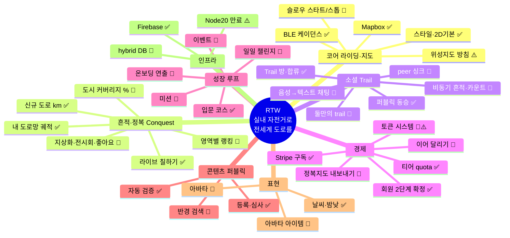

# RTW 기능 인벤토리 · 상태 보드

| 항목 | 내용 |
|------|------|
| 문서 유형 | **메타** — 전 기능·구상 단일 인덱스(상태 딱지). 상세 설계는 각 SoT 링크 |
| 최초 작성 | 2026-07-07 |
| 상태 | **반영중** — 코드와 대조하여 상태 검증됨(작성 시점) |
| 연결 문서 | [마스터 비전](260511-RTW-마스터-비전-및-종합계획.md) · [Conquest 설계](260703-Conquest-정복-레이어-설계.md) · [출시 전 확인사항](출시%20전%20확인사항.md) |

> **이 문서의 사용법 (유지 규칙 — 이것 하나만 지키면 됨)**
> 1. 아이디어가 떠오르면 → 해당 영역 표에 **한 줄 추가**(상태 💭). 길어지면 별도 문서로 빼고 여기엔 링크만.
> 2. 구현·폐기되면 상태 기호만 갱신. Claude에게 "인벤토리 갱신해"라고 하면 코드와 대조해 갱신함.
> 3. 상태 기호: **✅ 구현** · **🔶 부분/미진** · **💭 구상** · **⚠️ 충돌/재검토** · **❌ 폐기**

---

## 1. 한눈 지도

---

## 2. 코어 정체성 (한 문단)

**"실내 자전거로 실제 지구의 도로를 달리고, 달린 만큼 영구 자산(내 도로망)이 쌓인다."** 즈위프트류 대비 저비용(장비·구독), 그래픽 전장 회피, 해자는 "지구 전체"(벡터 지도, 한계비용 ~0). 판매 문장: **Ride = Claim** — 페달을 밟으며 도시를 정복한다. → 상세: [마스터 비전 §1](260511-RTW-마스터-비전-및-종합계획.md), [Conquest 설계](260703-Conquest-정복-레이어-설계.md)

---

## 3. 인벤토리

### 3.1 코어 라이딩·지도

| 기능 | 상태 | 현재 상태 / 근거 | 다음 액션 |
|---|---|---|---|
| Mapbox 채택 (구글 대비 자유도) | ✅ | 결정·전면 사용 중 | — |
| 지도 스타일 4종 + Light 기본, 주행 2D·줌16 | ✅ | `appSessionKeys.ts`, 주행 카메라 기본값 | — |
| 위성지도 노출 방침 | ⚠️ | 노트: "해상도·누운 건물 때문에 못 보여줄 것" ↔ 현재 Satellite 옵션 **노출 중** | 숨길지 결정 |
| 3D 측면 카메라 건물 가림 | 🔶 | 알려진 문제. 주행 기본 2D로 완화 | 3D 유지 여부 결정 |
| 슬로우 스타트/스톱 (고정속도 가감속) | 💭 | 미구현 — 현재 슬라이더 즉시 반영 | 알고리즘 설계 |
| BLE 케이던스 센서 | ✅ | `useBleCrankRpm` (Chromium) | — |
| 센서 자동 감지 → 모드 자동 전환 | 💭 | 수동 연결만 있음 | 온보딩과 연계 설계 |
| 고정속도 상한 15~18km/h | 🔶⚠️ | T0 정책 15 설계 ↔ **개발완화 50 적용 중** | [출시 전 복원](출시%20전%20확인사항.md) |
| 코칭 TTS·배너·BGM | ✅ | 주행 중 문구(R1~R4) 동작 확인 | — |

### 3.2 흔적·정복 (Conquest) — SoT: [260703](260703-Conquest-정복-레이어-설계.md)

| 기능 | 상태 | 현재 상태 / 근거 | 다음 액션 |
|---|---|---|---|
| 내 도로망 영구 궤적 (z20 셀·traces) | ✅ | v2 파이프라인 (`conquestOnRideCreated`) | — |
| 신규 도로 km 지표 (「새 도로 +N km」) | ✅ | 주행 결과·계정 화면 | — |
| 라이브 칠하기 + 🏴 칩 | ✅ | `useLiveConquestPaint`, 라인 폭 통일(07-06) | — |
| Trust Tier (T0 체험 / T1 케이던스) | 🔶 | CF 구현, **개발완화 수치** | 출시 전 복원 |
| 도시 정복률 (도로 커버리지 %) | 💭 | "온 도시를 빈틈없이" — 분모(도시 총 도로) 필요 | OSM 그래프 검토 |
| 지상화·글자 그리기 (나스카·LIKE) | 💭 | 궤적 데이터는 이미 있음 — 뷰·공유 UX 필요 | Phase B+ |
| 작품 전시회 + 좋아요 + 기간별 뱃지 | 💭 | 미착수 | 지상화 이후 |
| 영역별 랭킹 (world/country/province/city/sub-city) | 💭 | **방향 확정(07-07 자문·[결정 로그](260707-RTW-결정-로그.md))**: 표시=행정구역·계산=타일. 달린 z12청크/z20셀에 행정코드 lazy 1회 판정·캐시(런타임 역지오코딩 금지). sub-city는 OSM 품질 편차로 후순위 | 프로토타입 스파이크 |
| 구간 챌린지 (교차로~교차로 완주) | 💭 | Conquest §3.4, Phase B (OQ-13 ID 체계 선행) | Phase B |
| 마이크로 이벤트 (주행 중 교차로 확보·구간 XP 팝업) | 💭⚠️ | 07-12 자문 제안([요약](archive/260712-자문-문답-홀로-함께-역할분담-이어달리기.md)). **주의**: Conquest §3.3(중독 방지)·코어 몰입 원칙과 충돌 검토 선행. 단기 도파민은 이미 라이브 칠하기가 담당 | 2.0+ 보류 |
| 발견 이벤트 (첫 터널·해안도로·500m 업힐 등) | 💭 | 07-12 자문 제안. 지도 태그 분석 필요 — 보기보다 무거움 | 2.0+ |

### 3.3 소셜 (Trail·동행)

| 기능 | 상태 | 현재 상태 / 근거 | 다음 액션 |
|---|---|---|---|
| Trail 방 자동 생성·합류·추월 | ✅ | 주행 시작=Trail 개설, MENU 합류 | — |
| 퍼블릭 코스 동승 (같은 Trail) | ✅ | presence 격리 v2(07-12 `6dc179b`): 입문 허브만 cross-Trail, 그 외 Trail 단위 격리(`isolateByTrail`) | 재검증 |
| peer 위치·속도 싱크 | 🔶 | **간격 문제 미해결**(사용자 보고 07-06). 지연 절반(300→160ms)+jitter 제거(`4c1582c`) 후 재확인 필요 | 재현 스크린샷 후 진단 |
| 접속/동행 중복 표시 | ✅ | 동행 블록에서 활성 접속자 제외(07-12 `6dc179b`) | — |
| 경로 통산 카운트 ("이 길을 달린 사람 N명·진행 중 M명") | 💭 | **07-13 역할 분담 결정([결정 로그](260707-RTW-결정-로그.md)) — 비동기 사회성 최소 단위, 1.0 후보.** 유동성(동시접속) 불필요 | 데이터 소스 검토(rides 집계) |
| 비동기 흔적·고스트 ("어제 Anna가 여기까지"·앞뒤 거리 비교) | 💭 | 07-12 자문 — "같은 시간이 아니라 같은 길을 공유". Journey 진행자 간 위치 비교 | 통산 카운트 이후 Phase B |
| 둘만의 trail (private 초대) | 💭 | 프리미엄 장기 플랜 | 궤도 후 |
| 음성→텍스트 대화 (주행 중 채팅) | 💭 | 프리미엄 장기. "감정 한 템포 조절" 의도 | 궤도 후 |

### 3.4 경제 (토큰·티어·수익화)

| 기능 | 상태 | 현재 상태 / 근거 | 다음 액션 |
|---|---|---|---|
| 티어 quota (익명 3/5 · 무료 5/30 · 유료 50/100) | ✅ | `tierQuotaCore` + 2단 방어. 월5 적용 확인(07-06) | — |
| Route 진행률·이어 달리기·미완료 쿼터 | 🔶 | **단위1·2·4·5·6 구현·배포 완료(07-12 `ce3d006`·`957159e`)**: 완주 ≥98% 게이트·`lastProgressRatio`·TTL 90일·미완료 쿼터 서버검사(무료5/유료10)·초과 시 대기 탭 유도·진행률 바. 설계 SoT=[Conquest §9.5](260703-Conquest-정복-레이어-설계.md) | **잔여 = 단위7(재개) — 설계 확정(07-13, §9.5.5)**: 위치는 누적·인정은 세션. 구현 착수 가능 |
| Stripe 구독 → tier 승격·강등 | ✅ | webhook + 만료 스윕 | — |
| 경로 생성 토큰 | 🔶⚠️ | `routeTokenBalance`·온보딩 지급 CF·생성 게이트 **구현** ↔ 노트 구상("1km 저장=1토큰, 입문 보상 땡그랑")과 **불일치**. quota와 이중 체계 | **§4-1 정리 필요** |
| 토큰 획득 루프 (퍼블릭 주행→토큰) | 💭 | 미구현 | 토큰 정리 후 |
| 회원 체계 | ✅결정 | **2단계(Free/Supporter) 확정(07-07)** — 3단계 폐기. 코어 루프(주행·정복·개척·랭킹) 전부 무료, 유료=편의·표현·분석(상세 통계·아바타·비공개 Trail·음성→텍스트·지도 내보내기·Creator Dashboard) | 유료 기능 목록 확정 |
| 정복 지도 내보내기 (8K PNG·연간 포스터) | 💭 | 07-07 자문 채택 — "축적을 판다" 철학의 직접 수익화. 유료 후보 1순위 | Supporter 설계에 포함 |
| 구글 스트리트뷰 프리미엄 | ❌ | **폐기(07-07)** — pre-version 비용 사망 전례 + Mapillary 무료 내장과 중복 | — |

### 3.5 성장 루프 (온보딩·미션·이벤트)

| 기능 | 상태 | 현재 상태 / 근거 | 다음 액션 |
|---|---|---|---|
| 입문 공식 코스 | ✅ | basic 코스 존재 (`basic-alps-grind` 등) | 개수·구성 점검 |
| 온보딩 흐름 (첫 로그인→입문 인도→센서 확인→토큰 연출) | 💭 | 토큰 온보딩 지급 CF만 존재. 인도·연출("땡그랑") 없음 | 온보딩 설계 |
| 미션: 1회 주행 거리 (10km~120km, 평속 조건) | 💭 | 미구현. 하단 미션 리스트 참조 | — |
| 미션: 경로 생성 (2~120km) | 💭 | 미구현 | — |
| 미션: 누적 거리 (50~10,000km) | 💭 | 미구현 (누적 데이터는 Conquest에 있음) | — |
| 이벤트 (주간/월간/분기/반기/연간) | 💭 | `createEventPerMonth` quota 자리만 | — |
| 일일 챌린지 | 💭 | **탐험 중심 확정(07-07)** — 속도 배제. 실행 사다리: ①탐험형(오늘 신규 도로 Nkm — **daily 집계 기구현**) ②Featured Route/Today's Creator ③오늘의 도시(=Conquest M3 시즌 도시) ④City Completion(OSM 분모 선행) ⑤예술 이벤트(지상화 UX 후). 보상 통화는 §4-1 선행 | ①부터 착수 가능 |
| Featured Route · Today's Creator | 💭 | 07-07 자문 채택 — 매일 퍼블릭 루트 1개 운영 선정+Creator 뱃지. 퍼블릭 등록 시스템 기구현이라 비용 최소 | 챌린지 ②단계 |
| Journey/원정 표면 명명 (SavedRoute→여정 프로젝트) | 💭 | 07-12 자문 — 새 모델 아님(그릇=SavedRoute+진행률 **기구현**). 이름·표면(진행 카드·"다음 목적지까지 Nkm" 마일스톤)의 문제 | 단위3 이후 UI 네이밍 |
| 목표 계층화 표면 원칙 (오늘→프로젝트→세계) | 💭 | 07-12 자문 채택 — 첫 화면은 "오늘의 작은 목표"(=일일 챌린지①와 동일 답), 세계 점령률은 뒤로. 표면 설계 원칙 | 온보딩·홈 설계에 반영 |

### 3.6 콘텐츠 (퍼블릭 경로)

| 기능 | 상태 | 현재 상태 / 근거 | 다음 액션 |
|---|---|---|---|
| 퍼블릭 등록 신청·리뷰어 심사 | ✅ | 신청 modal + 심사 큐 + 승격 | — |
| 자동 검증: 최소 연장 + 유사도 상한 | ✅🔶 | `publicRouteAutoReview` — 운영 5km 권장인데 **dev 0.1km 완화 중** | 출시 전 복원 |
| 등록자 아이디 표시 ("이 도로의 개척자") | ✅ | 퍼블릭 경로에 등록자 표시 | — |
| 기본 퍼블릭 12개 | 🔶 | basic 코스 있음 — 12개 구성인지 미확인 | 콘텐츠 채우기 |
| 텍스트 검색 | 🔶 | 지명 검색 있음. 퍼블릭 경로 전용 검색은 리스트뿐 | 검색 설계 |
| 반경 검색 (우클릭→원 그리기→파란 점, 최대 50km) | 💭 | 명시적 미구현 | UX 설계 |

### 3.7 표현 (아바타·날씨·그래픽)

| 기능 | 상태 | 현재 상태 / 근거 | 다음 액션 |
|---|---|---|---|
| 날씨·밤낮 실시간 (Open-Meteo) | ✅ | HUD 한 줄 + **화면 비주얼**(비·눈·우박·번개·안개·태풍·눈보라·밤 틴트, 07-07). `?weather=rain` 강제 검증 | 사용자 검증 대기 |
| 라이더 아바타 | 🔶 | 07-07 에어로 자세 2차 적용: 전경사 ~32°+전방 주시+**골반 덮개(빕숏) 추가**로 1차 롤백 원인(다리 분리 시각) 보완. 다리 IK·케이던스 불변. 전면 재제작은 여전히 과제 | 검증 후 디자인 재작업 |
| 3D 라이더 캐릭터 | 💭 | Mapbox 자유도 미검증 | 스파이크 |
| 아바타 아이템 (자전거/헬멧/수트) | 💭 | 미착수 — 수익화 후보 | 프리미엄 연계 |
| 라이트 테마·패널 | ✅🔶 | panel-light.css 적용. "메뉴 배치 불만" 잔존 | 반복 개선 |

### 3.8 인프라

| 기능 | 상태 | 현재 상태 / 근거 | 다음 액션 |
|---|---|---|---|
| Firebase (Auth·Firestore·RTDB·Functions) | ✅ | asia-northeast3 | — |
| peer sync 비용·지연 튜닝 | 🔶 | 160ms 지연 등 개선했으나 계속 과제 | 간격 문제와 함께 |
| hybrid DB (Oracle/Cloudflare) — 동기화 비용 절감 | 💭 | 구상만 | 비용 실측 후 |
| Node.js 20 deprecation | ⚠️ | **2026-10-30 만료** — Functions 런타임 업그레이드 필요 | 10월 전 |

---

## 4. ⚠️ 충돌·재검토 (노트 구상 ↔ 현재 구현)

| # | 충돌 | 내용 | 정리 방향(제안) |
|---|---|---|---|
| 1 | **토큰 vs 티어 quota** | 저장 제한이 이중 체계: 노트 "1km 저장=1토큰" ↔ 구현 "월 5건·총 30건 quota" + 별도의 경로 **생성** 토큰 | 하나로 통일하거나 역할 분리 명문화(토큰=생성 화폐, quota=보유 상한 등) |
| 2 | **개척자 개념 두 갈래** | 노트: 퍼블릭 등록자=개척자, 일일 챌린지 보상 ↔ Conquest v2: 셀 pioneer 폐기→구간 챌린지(Phase B) | 챌린지 설계 시 한 체계로 통합 (보상 기준: 속도 아닌 완주+정지시간) |
| 3 | **위성지도** | 노트 "못 보여줄 것" ↔ Satellite 옵션 현재 노출 | 노출 유지/제거 결정 |
| 4 | **속도 상한** | 노트 15~18 ↔ T0 정책 15 ↔ 개발완화 50 | 출시 전 확인사항에 이미 등재 — 복원만 |

## 5. 미결정 질문 (Open Questions)

~~영역별 랭킹 기술 방식~~ · ~~회원 3단계 여부~~ · ~~챌린지 축(속도 vs 탐험)~~ → **07-07 자문으로 결정** ([결정 로그](260707-RTW-결정-로그.md))

- 챌린지 **보상 통화**: 토큰인가 뱃지인가 — §4-1(토큰 vs quota) 정리가 선행
- 비공개 Trail 유료 전환 여부 — 자문은 유료 전용 제안이나 **현재 무료로 이미 열려 있음**(회수 결정이라 신중)
- sub-city 랭킹: OSM 행정경계 품질이 나라별 편차 — 어느 나라까지 지원?
- hybrid DB 전환 시점·기준 (Firestore 비용 임계)
- 음성→텍스트: 브라우저 Web Speech로 충분한가?

## 6. 문서 인덱스 (상세는 여기로)

| 주제 | 문서 |
|---|---|
| 비전·전략·타겟 | [260511 마스터 비전](260511-RTW-마스터-비전-및-종합계획.md) **SoT** |
| 정복 레이어 설계 | [260703 Conquest](260703-Conquest-정복-레이어-설계.md) **SoT** |
| 티어·quota·구독 | [260519 사용자 tier·진입](260519-사용자-tier-및-진입-정책.md) **SoT** |
| 출시 전 복원 목록 | [출시 전 확인사항](출시%20전%20확인사항.md) |
| **결정 로그** — 왜 이렇게 갔더라? | [260707 결정 로그](260707-RTW-결정-로그.md) |
| 자문 문답 원문 (지식구조·랭킹·챌린지·회원) | [archive](archive/260707-자문-문답-지식구조-랭킹-챌린지-회원구분.md) (기록) |
| 진행 스냅샷 | [260702 종합 검토 보고서](archive/260702-프로젝트-진행-종합-검토-보고서.md) (기록) |
