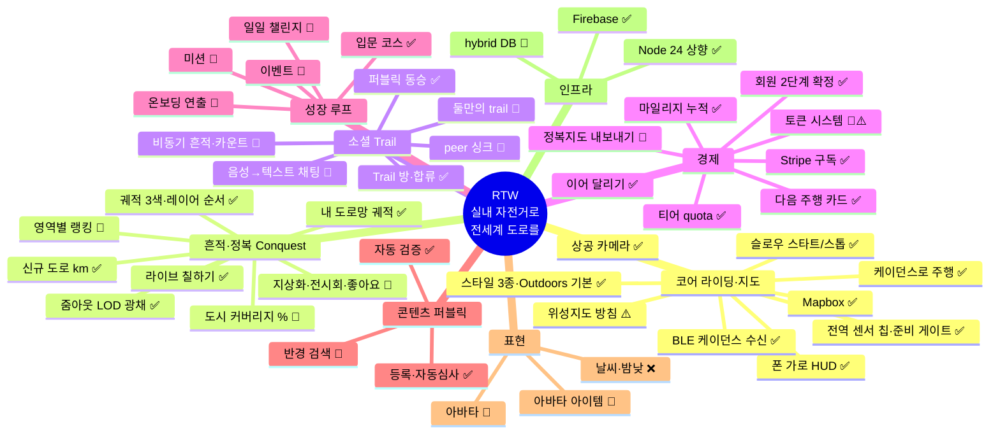

# RTW 기능 인벤토리 · 상태 보드

| 항목 | 내용 |
|------|------|
| 문서 유형 | **메타** — 전 기능·구상 단일 인덱스(상태 딱지). 상세 설계는 각 SoT 링크 |
| 최초 작성 | 2026-07-07 |
| 상태 | **반영중** — 코드와 대조하여 상태 검증됨(최근 대조 2026-09-28) |
| 연결 문서 | [마스터 비전](260511-RTW-마스터-비전-및-종합계획.md) · [Conquest 설계](260703-Conquest-정복-레이어-설계.md) · [출시 전 확인사항](출시%20전%20확인사항.md) · [2026-09-22 중간 점검](archive/260922-RTW-개발중간점검-보고서.md) |

> **중간 점검(2026-09-22):** 제품 개요·진전·`main`/`main2`·배포 분기 요약 → [archive/260922-RTW-개발중간점검-보고서.md](archive/260922-RTW-개발중간점검-보고서.md)

> **이 문서의 사용법 (유지 규칙 — 이것 하나만 지키면 됨)**
> 1. 아이디어가 떠오르면 → 해당 영역 표에 **한 줄 추가**(상태 💭). 길어지면 별도 문서로 빼고 여기엔 링크만.
> 2. 구현·폐기되면 상태 기호만 갱신. Claude에게 "인벤토리 갱신해"라고 하면 코드와 대조해 갱신함.
> 3. 상태 기호: **✅ 구현** · **🔶 부분/미진** · **💭 구상** · **⚠️ 충돌/재검토** · **❌ 폐기**
> 4. 칸은 짧게 — 현재 상태 약 150자·다음 액션 약 60자. 경위·실측·교훈은 결정 로그나 작업 문서에 쓰고 여기엔 쓰지 않는다. 2026-09-28 이전 긴 원문: [archive/260928-RTW-상태보드-스냅샷-다이어트전.md](archive/260928-RTW-상태보드-스냅샷-다이어트전.md)

---

## 1. 한눈 지도

```mermaid
mindmap
  root((RTW<br/>실내 자전거로<br/>전세계 도로를))
    코어 라이딩·지도
      Mapbox ✅
      스타일 3종·Outdoors 기본 ✅
      상공 카메라 ✅
      폰 가로 HUD ✅
      위성지도 방침 ⚠️
      슬로우 스타트/스톱 ✅
      BLE 케이던스 수신 ✅
      케이던스로 주행 ✅
      전역 센서 칩·준비 게이트 ✅
    흔적·정복 Conquest
      내 도로망 궤적 ✅
      궤적 3색·레이어 순서 ✅
      줌아웃 LOD 광채 ✅
      신규 도로 km ✅
      라이브 칠하기 ✅
      도시 커버리지 % 💭
      지상화·전시회·좋아요 💭
      영역별 랭킹 💭
    소셜 Trail
      Trail 방·합류 ✅
      퍼블릭 동승 ✅
      peer 싱크 🔶
      비동기 흔적·카운트 💭
      둘만의 trail 💭
      음성→텍스트 채팅 💭
    경제
      티어 quota ✅
      이어 달리기 ✅
      다음 주행 카드 ✅
      Stripe 구독 ✅
      마일리지 누적 ✅
      토큰 시스템 🔶⚠️
      회원 2단계 확정 ✅
      정복지도 내보내기 💭
    성장 루프
      입문 코스 ✅
      온보딩 연출 💭
      미션 💭
      이벤트 💭
      일일 챌린지 💭
    콘텐츠 퍼블릭
      등록·자동심사 ✅
      자동 검증 ✅
      반경 검색 💭
    표현
      날씨·밤낮 ❌
      아바타 🔶
      아바타 아이템 💭
    인프라
      Firebase ✅
      hybrid DB 💭
      Node 24 상향 ✅
```

---

## 2. 코어 정체성 (한 문단)

**"실내 자전거로 실제 지구의 도로를 달리고, 달린 만큼 영구 자산(내 도로망)이 쌓인다."** 즈위프트류 대비 저비용(장비·구독), 그래픽 전장 회피, 해자는 "지구 전체"(벡터 지도, 한계비용 ~0). 판매 문장: **Ride = Claim** — 페달을 밟으며 도시를 정복한다. → 상세: [마스터 비전 §1](260511-RTW-마스터-비전-및-종합계획.md), [Conquest 설계](260703-Conquest-정복-레이어-설계.md)

---

## 3. 인벤토리

### 3.1 코어 라이딩·지도

| 기능 | 상태 | 현재 상태 / 근거 | 다음 액션 |
|---|---|---|---|
| Mapbox 채택 (구글 대비 자유도) | ✅ | 결정·전면 사용 중 | — |
| 지도 스타일 3종 + **Outdoors 기본**, 주행 **상공(topDown)·줌 17.5** | ✅ | (08-27) 기본 스타일 Outdoors, 상공(topDown) 카메라·줌 17.5. RTW Dark 는 폰 실주행에서 도로 판독이 어려워 기본에서 제외 | — |
| **상공(topDown) 카메라 프리셋** | ✅ | (08-27 신설) pitch 0, bearing=진행 방향, 라이더 화면 중앙. 맵 뷰 시트 카메라 메뉴 「상공」, 주행 시작 기본값 | 줌 기본값 실주행 튜닝 |
| **주행 중 미니맵(좌측)** | 🔶 | (09-23 v1 병합) 주행 중 좌측에 경로 전체+현재 위치 SVG 표시, 폭 29.4%, RouteDock 위. 탭·터치 없음 | 배경 검음 — 실지도 미적용, 폰 시각검증 미완. [HANDOFF](ops/20260923-minimap/HANDOFF.md) |
| **HUD 좌상단 한 행 재배치 · 접힘 센서 LED** | ✅ | (09-23) RTW 최상단+계기판 우측, 블록 높이 67→34px. 접힌 RouteDock 캐럿 자리에 센서 LED 표시 | — |
| **Quick Camera 1~6 · 밀착 pitch·거리** | ✅ | (09-23) Account 좌측 QC 1~6, 거리 상한60·기본40·하한6m, pitch 80° 확정(67°는 지평선 소실로 폐기) | Hosting 배포는 Chief |
| **계정 패널(마지막·일일·기간 통계)** | ✅ | (09-15) 정비 — 블록 12→7, 일일 주행을 기간 탭에 흡수, 거리 히어로+시간·평속·칼로리 3타일. 계약 e2e+단위 215건 pass | 자산 블록은 실데이터 육안 확인 필요 |
| **주행 중 RouteDock 자동 접힘** | ✅ | (09-15) `44ebce5`가 경유지 목록까지 숨기던 버그 수정 — 접힘은 유지, 편집 UI만 제거. 경유지·주소는 펼치면 보임. 계약 e2e 3항목 PASS | — |
| **경로 목록 정렬 — 세 목록 공용** | ✅ | (09-16) 입문·퍼블릭·내 경로 세 목록이 `lib/routeListSort` 공용, 기본 최근순. 최근순 기준 시각은 목록마다 다름 | 「최근 주행순」은 별개 축 — 미결 |
| **MENU 정리 — B단계(내 경로 모달)** | ✅ | (09-16) 「내 경로」를 공식 코스와 같은 껍데기(`RouteListModalShell`)로 이전, 목록 가용 높이 61→184px | — |
| **MENU 정리 — A단계(계층 축소)** | ✅ | (09-16) MENU 크롬이 패널의 78%를 먹던 문제 정리 — 라벨·탭 계층·빈 섹션 제거, 크롬 214→131.9px | — |
| **지점 팝업 제목 행** | ✅ | (09-16) 첫 줄 「경로 생성」, 주소는 둘째 줄로 — 종전엔 긴 주소가 ✕ 를 덮었다. 토큰 문구 불변, ✕ 겹침 면적 0 확인 | — |
| **지도 롱프레스로 지점 선택** | 💭 | 지도 팝업이 메뉴를 가리는 문제의 3안. 1·2안 적용 완료, 필요 여부는 Chief 실기기 판단 대기. [인수인계 §4.3](archive/260917-UI-UX-개선-작업-인수인계.md) | 판단 대기 |
| **맵 뷰 시트 「내 도로망 표시」 토글** | 💭 | 끄고 싶다는 요구의 실제 원인(레이어 순서)은 해결됨(09-16). 토글 자체 유용성은 별건 | 미착수 |
| **RouteDock caret 터치 타깃** | 🔶 | (09-17) 세로 텍스트 제거로 줄었던 높이 44px 복구. `::after` 히트영역은 부모 overflow:hidden 에 막혀 실제 높이로 대응 | 폭 20.9px 미달 — 넓히면 dock footprint 커짐, Chief 판단 대기 |
| **표고 그래프 시각 잠식** | 🔶 | 터치는 통과(09-17)하지만 min-width 320px·높이 120px 로 폰 가로 폭의 46% 를 차지 | 미착수 |
| **주행 결과 시트 컴팩트화** | ✅ | (09-17) 11줄→4줄로 압축, 완주 배지·새도로+오늘 2열·저장 폼 한 줄. 690×275 실측 scrollHeight=clientHeight | `RideEndResult.sessionPathLngLat` 소비자 없음(별건) |
| **e2e 체험 속도 누락** | ✅ | (09-17) 신규 스펙 2종에 속도 상한(50km/h) 설정 누락 — 적용 후 ride-summary 1.6분→35초 | — |
| **계기판 자리·표현 재설계** | ✅ | (09-17) 좌상단 첫 줄로 이동, 검은 패널 폐기(키라인 대비), 셀 고정폭으로 자릿수 밀림 방지, 지명검색은 MENU 헤더 칩으로 | — |
| **터치 계약의 축퇴 구멍** | ✅ | (09-17) 대상이 사라져도 통과하던 `if(!el) continue` 축퇴 함정 수정 — 누락 셀렉터와 수량 불일치를 단언 | — |
| **표고 그래프 면 전체 터치 통과** | ✅ | (09-17, 2차) 오버레이는 이미 통과했으나 코치 토스트 슬롯이 같은 자리를 덮고 있었다 — 표시 전용 전환, 주행 중 차단 0 | 우하단 버튼 뭉치 빈 공간 2지점 잔여, 계약 주석과 불일치 그대로 |
| **터치 타깃 44px · 표고 그래프 통과** | ✅ | (09-17) 표고 그래프 pointer-events:none(화면 24.4% 터치 불가 해소), HUD 히트영역 28~32px→44px 확대 | 롱프레스(3안)는 효과 보고 판단 대기 |
| **내 도로망 ↔ 경로선 강조(단계별)** | ✅ | (09-16) 내 도로망이 z16 경로선을 덮던 문제 — 단계별 주인공 전환(주행중=궤적/설정중=경로선+도로망 폭하한 7px). 흰 테두리안은 폐기 | 맵 뷰 시트 「내 도로망 표시」 토글은 별건 — 미착수 |
| **우상단 센서 폴백 제거 — dock 이 `idle` 까지** | ✅ | (09-16) RouteDock 이 idle 포함 모든 stage에 표시, 좌하단 스택(MapBottomLeftStack) 신설로 카드 겹침 면적 0 | 미병합 브랜치(6A-R2)의 아이디어, 카드 겹침 미측정 |
| **센서 칩 자리 — RouteDock 통합** | ✅ | (09-16) 우상단 3개→2개, 칩은 RouteDock 첫 행으로. 자리는 `lib/sensorChipSlot.ts` 단일 판정, e2e 8조합 PASS | idle 우상단 3개는 그대로 — 후속 판단 |
| **폰 가로 HUD 컴팩트** | ✅ | (08-27) 지도 잠식 41.8%→23.4%. 접속·동행 패널 숨김, 지표 축소, 루트 폰트 16→13.5px. 주요 조작 겹침 0 | — |
| 위성지도 노출 방침 | ⚠️ | 노트: "해상도·누운 건물 때문에 못 보여줄 것" ↔ 현재 Satellite 옵션 **노출 중** | 숨길지 결정 |
| 3D 측면 카메라 건물 가림 | 🔶 | 알려진 문제. 주행 기본 2D로 완화 | 3D 유지 여부 결정 |
| 슬로우 스타트/스톱 (고정속도 가감속) | ✅ | (07-14) `rideSpeedRamp.ts` 고정 가속+3/감속-5km/h/s로 서서히 수렴, 일시정지·종료는 즉시 정지. Playwright 실측 검증 | — |
| BLE 케이던스 **프로토콜 수신** (CSC `0x1816`) | ✅ | `useBleCrankRpm` + `lib/bleCscCadence.ts`(파서·rollover·정지 판정 순수 모듈, Node 시험 25건). Chromium·HTTPS/localhost | — |
| ~~**HUD 거리 이중 표기 (오늘 + 누적·진행률)**~~ → **HUD 거리 「누적 / 전체」 한 줄** | ✅ | (08-29 도입→09-17 뒤집음) 세션·누적 거리 중복이던 2줄을 「누적/전체 km」 한 줄로, 진행률%는 표고그래프 마커로 이전 | — |
| **케이던스로 가상 주행 속도 직접 제어** | ✅ | (08-27~28) cadence 모드 목표속도 min(30,rpm×0.32), 단절시 목표 0. CYCPLUS C3 실주행 P1~P7·P9·P10 통과 | P8·P11·P12 단절 시나리오 |
| **HUD 전역 센서 상태 칩** (계정 칩 왼쪽) | ✅ | (08-27) `CadenceHudChip`+`lib/cadenceSensorUi.ts`, 클릭 시 전용 시트로 상세. 실물 H1~H6·H9·H13·H14 통과 | H11·H12 |
| **주행 입력 준비 게이트 (Go 사전조건)** | ✅ | (08-27) `RideInputReadiness` 5상태, cadence 유효 RPM 1회 확인 또는 체험속도 선택 필요. e2e 6건, 실물 H5~H8 통과 | — |
| 센서 연결이 주행 세션과 분리 (주행 전 확인·주행 후 재사용) | ✅ | `useBleCrankRpm` 이 앱 생명주기에만 묶임(08-27, 이전 `sessionActive` 강제 해제 제거) | — |
| 허용된 센서 자동 복원·재연결 | 🔶 | (08-27) chooser 허용 후 장치 참조 보존, 단절 시 0.5~10초 백오프로 재연결. 명시적 해제·백그라운드는 중단 | CYCPLUS C3 유휴 단절 물리 검증 필요 |
| 고정속도 상한 15~18km/h | 🔶⚠️ | T0 정책 15 설계 ↔ **개발완화 50 적용 중** | [출시 전 복원](출시%20전%20확인사항.md) |
| **「다음 주행」 카드 (지도 위 다음 행동 주 표면)** | ✅ | (08-29+09-13) 파생 후보·CTA·재개 미리보기. idle 재개 앵커 1회 프레이밍, 후보 null시 입문 허브 유도. test:next-ride 191 pass | — |
| **주행 종료 후 idle 복귀** | ✅ | (08-29) 결과 시트 닫으면 stage를 idle 로 복귀 — 이전엔 ready-to-start 에 머물러 「다음 주행」 카드가 숨었다. e2e C1 검증 | — |
| **실제 세션 시작·종료 anchor** | ✅ | (08-29) `rides`에 실제 세션 시작·종료 좌표 저장, 실제 종료 지점이 다음 출발점. geometry 없으면 null(추측 금지) | — |
| **모든 유효 Ride 결과 시트** | ✅ | (08-29) 도착 여부 무관, 유효 Ride 모두 결과 시트 노출. 미완주는 진행률 배지, 완주는 완주 문구+새 경로 CTA | — |
| **최근 주행 행 액션** | ✅ | (08-29) 읽기 전용 목록에 지도보기·이어달리기·새 경로 액션 추가. 종료점 없는 legacy Ride는 기록만 표시 | — |
| 완주 표시 단일 정책 (98%) | ✅ | (08-29) 두 화면이 따로 쓰던 95% 반올림 판정을 `isRouteCompletion`(98%) 하나로 통일 | — |
| 코칭 TTS·배너·BGM | ✅ | 주행 중 문구(R1~R4) 동작 확인 | — |

### 3.2 흔적·정복 (Conquest) — SoT: [260703](260703-Conquest-정복-레이어-설계.md)

| 기능 | 상태 | 현재 상태 / 근거 | 다음 액션 |
|---|---|---|---|
| 내 도로망 영구 궤적 (z20 셀·traces) | ✅ | v2 파이프라인 (`conquestOnRideCreated`) | — |
| **지도 궤적 색·레이어 순서** | ✅ | (08-28) 빨강=아직 안 간 길, BlueViolet `#8A2BE2`=달린 길. Outdoors 색상환의 빈 대역(271°)에서 선택. 레이어 순서 레지스트리로 매 적용마다 재정렬 | — |
| **내 도로망 줌아웃 LOD** | ✅ | (09-14) 누적 궤적 아래 광채 레이어 추가, z13에서 0. 측정: z8 원거리 렌더 2.8배. 경계 없어 §3.4 금지와 충돌 안 함 | 타일 채우기 집계는 Phase B |
| **비동기 흔적 시각 위계** | ✅ | (08-28) 내 궤적>경로>흔적 순 위계로 조정 — 흔적 pulse 불투명도 0.92→0.45·굵기 5→3, heat 도 함께 낮춤 | 실데이터 밀도에서 재조정 |
| **지나온 구간 렌더 회귀 수정** | ✅ | (08-28) `isStyleLoaded()` 게이트로 주행 중 궤적이 안 그려지던 결함 수정 — 누적 궤적 레이어도 동일 함정 있었음 | — |
| 신규 도로 km 지표 (「새 도로 +N km」) | ✅ | 주행 결과·계정 화면 | — |
| 라이브 칠하기 + 🏴 칩 | ✅ | `useLiveConquestPaint`, 라인 폭 통일(07-06) | — |
| Trust Tier (T0 체험 / T1 케이던스) | 🔶 | CF 구현, **개발완화 수치** | 출시 전 복원 |
| 도시 정복률 (도로 커버리지 %) | 💭 | "온 도시를 빈틈없이" — 분모(도시 총 도로) 필요 | OSM 그래프 검토 |
| 지상화·글자 그리기 (나스카·LIKE) | 💭 | 궤적 데이터는 이미 있음 — 뷰·공유 UX 필요 | Phase B+ |
| 작품 전시회 + 좋아요 + 기간별 뱃지 | 💭 | 미착수 | 지상화 이후 |
| 영역별 랭킹 (world/country/province/city/sub-city) | 💭 | (07-07) 방향 확정 — 표시=행정구역·계산=타일, z12청크/z20셀에 행정코드 lazy 캐시. sub-city는 후순위. [결정 로그](260707-RTW-결정-로그.md) | 프로토타입 스파이크 |
| 구간 챌린지 (교차로~교차로 완주) | 💭 | Conquest §3.4, Phase B (OQ-13 ID 체계 선행) | Phase B |
| 마이크로 이벤트 (주행 중 교차로 확보·구간 XP 팝업) | 💭⚠️ | 07-12 자문 제안. Conquest §3.3(중독 방지) 충돌 검토 선행 — 단기 도파민은 이미 라이브 칠하기가 담당 | 2.0+ 보류 |
| 발견 이벤트 (첫 터널·해안도로·500m 업힐 등) | 💭 | 07-12 자문 제안. 지도 태그 분석 필요 — 보기보다 무거움 | 2.0+ |
| 정복 카피 v2 통일 (「새 영토」→도로 언어) | ✅🔶 | (07-16) 코드 내 「새 영토」 문자열·주석 제거 완료, 현재 UI=「새 도로 +N km」. 문서 잔존 확인 과제. [Ontology §4](260714-RTW-Ontology.md) | 문서 카피 최종 점검 |

### 3.3 소셜 (Trail·동행)

| 기능 | 상태 | 현재 상태 / 근거 | 다음 액션 |
|---|---|---|---|
| Trail 방 자동 생성·합류·추월 | ✅ | 주행 시작=Trail 개설, MENU 합류 | — |
| 퍼블릭 코스 동승 (같은 Trail) | ✅ | presence 격리 v2(07-12 `6dc179b`): 입문 허브만 cross-Trail, 그 외 Trail 단위 격리(`isolateByTrail`) | 재검증 |
| peer 위치·속도 싱크 | 🔶 | 공통 D600·tSrv·wire 0.01m·RTDB200/FS4s(2026-10-05). Chief 실주행 PASS. 남음: stall/clock·읽기 증폭·S3 known-fail | [최종 보고](archive/261005-RTW-동행-위치-동기화와-반복진동-해결-결과보고.md) · [REPORT](ops/sync-relay/REPORT.md) |
| 접속/동행 중복 표시 | 🔶 | (07-12) 동행 블록에서 활성 접속자 제외, 문구·인원수는 Trail 실시간 구독 단일 소스(`companionHudCopy`). 폴링 60초 | 이탈 즉시 1명·접속 목록 정리 2창 확인 |
| 경로 통산 카운트 ("이 길을 달린 사람 N명·진행 중 M명") | 💭 | (07-13 결정) 비동기 사회성 최소 단위, 1.0 후보. 동시접속(유동성) 불필요. [결정 로그](260707-RTW-결정-로그.md) | 데이터 소스 검토(rides 집계) |
| 비동기 흔적·고스트 ("어제 Anna가 여기까지"·앞뒤 거리 비교) | 💭 | 07-12 자문 — "같은 시간이 아니라 같은 길을 공유". Journey 진행자 간 위치 비교 | 통산 카운트 이후 Phase B |
| 둘만의 trail (private 초대) | 💭 | 프리미엄 장기 플랜 | 궤도 후 |
| 개인 경로 주행자도 **점만** 보이기 | 💭 | (09-25 결정) 개인 경로 주행은 `publicationId` 없어 관전 대상에서 빠짐 — 점(위치)만 노출, 경로선은 감춘다. global presence 배선은 이미 있으나 디버그 플래그가 지도 노출을 막고 있음 | 별도 작업 |
| 음성→텍스트 대화 (주행 중 채팅) | 💭 | 프리미엄 장기. "감정 한 템포 조절" 의도 | 궤도 후 |

### 3.4 경제 (토큰·티어·수익화)

| 기능 | 상태 | 현재 상태 / 근거 | 다음 액션 |
|---|---|---|---|
| 티어 quota (익명 3/5 · 무료 5/30 · 유료 50/100) | ✅ | `tierQuotaCore` + 2단 방어. 월5 적용 확인(07-06) | — |
| Route 진행률·이어 달리기·미완료 쿼터 | ✅ | (07-13) §9.5 전 단위 완료 — 완주≥98%·TTL 90일·미완료 쿼터 서버검사·이어 달리기 재개. SoT=[Conquest §9.5](260703-Conquest-정복-레이어-설계.md) | — |
| **진행률 단조 보존 (서버 transaction)** | ✅ | (08-29) `updateSavedRouteProgressInFirestore` 를 transaction 화, 서버 기준 max(server,requested) 보장. 완주 문서 역행 방지 | — |
| Stripe 구독 → tier 승격·강등 | ✅ | webhook + 만료 스윕 | — |
| 경로 생성 토큰 | 🔶⚠️ | (09-24 결정) 당분간 모두 무제한 — 코드는 삭제 않고 `generateCostBase=0` 으로 끔. 온보딩 Guest 10·로그인 15. [결정 로그](260707-RTW-결정-로그.md) | 복원은 재설계 후(§4-1) |
| **거리·방향 자동 Route** (popup 통합·3F-C-R1) | ✅ | (09-02 병합) Stage 0→1→2, offered/exact/detoured. 6클릭 6/6 Route 반환. `algorithmVersion: 3F-C-R1-reach-offer` | [3F-C-R1](ops/route-relay/260902-거리방향-자동Route-실패없는-도달제안-3F-C-R1-작업지시서.md) · 3F-D 후속 |
| 토큰 획득 루프 (퍼블릭 주행→토큰) | 💭 | 미구현 | 토큰 정리 후 |
| 회원 체계 | ✅결정 | (07-07 확정) 2단계(Free/Supporter), 3단계 폐기. 코어 루프 전부 무료, 유료=편의·표현·분석 | 유료 기능 목록 확정 |
| 마일리지 (절대 안 줄어드는 누적 운동 이력: 거리·시간·횟수) | ✅ | (07-16) 서버 집계 `mileageOnRideCreated`, 과거 backfill 완료. 재주행도 전액 인정(conquest와 차이). SoT: [Token 경제 §4](260518-Route-Token-경제-설계.md) | — |
| 정복 지도 내보내기 (8K PNG·연간 포스터) | 💭 | 07-07 자문 채택 — "축적을 판다" 철학의 직접 수익화. 유료 후보 1순위 | Supporter 설계에 포함 |
| Mapillary 주행 중 거리뷰 | ❌ | (09-25 폐기) 퀄리티 부족 — 전용 모듈 8개·CF·거리뷰 토글 전부 제거. 커버리지 오버레이는 OSRM만 남음 | — |
| 구글 스트리트뷰 프리미엄 | ❌ | (07-07) 폐기 — pre-version 비용 사망 전례 + Mapillary 무료 내장과 중복 | — |

### 3.5 성장 루프 (온보딩·미션·이벤트)

| 기능 | 상태 | 현재 상태 / 근거 | 다음 액션 |
|---|---|---|---|
| 입문 공식 코스 | ✅ | 실도로 3경로(남산공원길 413m 등). 검증기 45검사·e2e 5건. 프로덕션 반영 완료(08-16) | 레거시 부수 문서(presence·activity) 잔존 관찰 |
| **Local First Ride** (내 지역에서 첫 주행) | ✅ | (09-24 완료·배포) 첫 화면 「어디에서 첫 라이딩을?」, [현재 위치] 기본, 권한은 클릭시만. 첫 화면 줌 19→13 | 관측치 누적 후 재검토 |
| **Ready Ride 자동 생성** | ✅ | (09-24 완료·배포) 단순 경로 기본, 실측 성공률 5%→100%(수도권 20곳). 폐합은 성공률 낮아 기본에서 제외 | 2차전: 순환 되살리기·조건 선택 |
| **Claim 연동 경로 스코어** | ✅ | (09-24 완료·배포) 안 달린 길 우선·자기 중복 감점. 신규 도로 비율 0.008→0.99, 성공률 100% 유지 | — |
| **경로 기하 타당성 게이트 V1~V3** | ✅ | (09-24 완료) 점밀도·최장 단일구간·출발점 정합 게이트로 비도로 직선 경로 차단. 단위 시험 4건 | 클릭·폐합·편도 세 경로 공통 |
| **게스트 초기화 · 계정 누적** | ✅ | (09-24 완료·배포) 익명 사용자가 자기 계정을 지우고 새로 시작. 09-24 누적 371계정·5,435문서 정리 | — |
| **LF-4 관측 지표 CLI** | 🔶 | `admin:ride-metrics`(읽기 전용) — 첫 주행 완료율·72h 내 재주행률 등. 표본 0(게스트 정리 직후) | 데이터 쌓인 뒤 재측정 |
| Ready Ride 2차전 (Chief 「뭔가 부족한 느낌」 09-24) | 💭 | (09-24, Chief) 후보: 순환 선택지 복원·신규도로비율 노출·입문코스와 관계 정리·거리 외 조건·최근 지역 재선택 | 1차 관측 후 착수 |
| 온보딩 흐름 (첫 로그인→입문 인도→센서 확인→토큰 연출) | 💭 | 토큰 온보딩 지급 CF만 존재. 인도·연출("땡그랑") 없음 | 온보딩 설계 |
| 미션: 1회 주행 거리 (10km~120km, 평속 조건) | 💭 | 미구현. 하단 미션 리스트 참조 | — |
| 미션: 경로 생성 (2~120km) | 💭 | 미구현 | — |
| 미션: 누적 거리 (50~10,000km) | 💭 | 미구현 (누적 데이터는 Conquest에 있음) | — |
| 이벤트 (주간/월간/분기/반기/연간) | 💭 | `createEventPerMonth` quota 자리만 | — |
| 일일 챌린지 | 💭 | (07-07 확정) 탐험 중심, 속도 배제. 실행 사다리 ①탐험형(daily 집계 기구현)~⑤예술 이벤트. 보상 통화는 §4-1 선행 | ①부터 착수 가능 |
| Featured Route · Today's Creator | 💭 | 07-07 자문 채택 — 매일 퍼블릭 루트 1개 운영 선정+Creator 뱃지. 퍼블릭 등록 시스템 기구현이라 비용 최소 | 챌린지 ②단계 |
| Journey/원정 표면 명명 (SavedRoute→여정 프로젝트) | 💭 | 07-12 자문 — 새 모델 아님(그릇=SavedRoute+진행률 기구현). 이름·표면의 문제 | 단위3 이후 UI 네이밍 |
| 목표 계층화 표면 원칙 (오늘→프로젝트→세계) | 💭 | 07-12 자문 채택 — 첫 화면은 "오늘의 작은 목표", 세계 점령률은 뒤로. 표면 설계 원칙 | 온보딩·홈 설계에 반영 |
| 운동/정복 이중 축 표면 원칙 (운동=본체·정복=보너스) | 🔶 | (07-16) HUD 거리 칩 히어로 승격, 🏴 새 도로 50m 미만 미표시, 마일리지 표면화. 주행 중 진행/전체거리 병기 추가 | 리디자인 2차(홈·온보딩 표면) |

### 3.6 콘텐츠 (퍼블릭 경로)

| 기능 | 상태 | 현재 상태 / 근거 | 다음 액션 |
|---|---|---|---|
| 퍼블릭 등록 **자동 심사·즉시 등록** | ✅ | (09-14) 좌표수·bbox 하한 불일치로 짧은 정상 경로가 거부되던 결함 수정. (07-17) 수동 검수 폐기 — 조건 통과 시 즉시 publication 생성, 미완주 출판 상한(free 3/paid 5). [정책 SoT](260717-퍼블릭-경로-자동등록-정책.md) | CF·rules 배포 |
| 리뷰어 수동 심사 큐 | 🔶 | 안전망으로 유지(CF 장애 시 pending 처리·신고·회수) — `AdminPublicRouteQueue` + `config/routeReviewers` | — |
| 자동 검증: 거리·유사도·금칙어·개인정보·중복 | ✅🔶 | 서버 이식 완료(`publicRouteAutoReviewCore`) — 최소 연장 dev 완화 100m 유지 중(운영값 5km), 최대 120km | 출시 전 MIN 5km 복원 |
| 등록자 아이디 표시 ("이 도로의 개척자") | ✅ | 퍼블릭 경로에 등록자 표시 | — |
| 기본 퍼블릭 12개 | 🔶 | basic 코스 있음 — 12개 구성인지 미확인 | 콘텐츠 채우기 |
| 텍스트 검색 | 🔶 | 지명 검색 있음. 퍼블릭 경로 전용 검색은 리스트뿐 | 검색 설계 |
| 반경 검색 (우클릭→원 그리기→파란 점, 최대 50km) | 💭 | 명시적 미구현 | UX 설계 |

### 3.7 표현 (아바타·날씨·그래픽)

| 기능 | 상태 | 현재 상태 / 근거 | 다음 액션 |
|---|---|---|---|
| 날씨·밤낮 실시간 (Open-Meteo) | ❌ | (08-27 표시 제거) HUD·비주얼·Open-Meteo 폴링 모두 제거, 실내 가상 주행에서 판단에 불필요. `WeatherOverlay` 는 Phase 2(09-25)에서 삭제 | — |
| 라이더 아바타 | 🔶 | (07-07) 에어로 자세 2차 적용 — 전경사 ~32°+전방주시+골반 덮개로 1차 롤백 원인 보완. 전면 재제작은 과제 | 검증 후 디자인 재작업 |
| 라이더 거인 스케일 (giant) | ❌ | (09-03 최종 미채택) 20배는 뷰포트 1.66배 차지해 지도 가림(G-3·G-4 실측). 카메라 범위 유도 구조는 채택해 남김 | [G-5 REPORT](ops/giant-relay/REPORT-G5.md) |
| 3D 라이더 캐릭터 | 💭 | Mapbox 자유도 미검증 | 스파이크 |
| 아바타 아이템 (자전거/헬멧/수트) | 💭 | 미착수 — 수익화 후보 | 프리미엄 연계 |
| 디자인 토큰·패널 톤 (RTW 골드/뉴트럴 다크) | ✅🔶 | (07-17) `panel-light.css` 제거, `tokens.css` 단일 진실로 전환. 하드코딩 색상 `--rtw-*` 참조로 정정. 메뉴 배치 불만 잔존 | 반복 개선 |

### 3.8 인프라

| 기능 | 상태 | 현재 상태 / 근거 | 다음 액션 |
|---|---|---|---|
| Firebase (Auth·Firestore·RTDB·Functions) | ✅ | asia-northeast3 | — |
| peer sync 비용·지연 튜닝 | 🔶 | 지연·쓰기 폭주는 S4-1 수준 유지. **남음:** 읽기 증폭(S4-2) · touch/heartbeat(S4-3) | [REPORT](ops/sync-relay/REPORT.md) |
| hybrid DB (Oracle/Cloudflare) — 동기화 비용 절감 | 💭 | 구상만 | 비용 실측 후 |
| Node.js 런타임 | ✅ | (09-25) Node 24로 상향 — nodejs20 만료 임박, 22보다 24가 deprecation 1년 늦음. route-token 하네스도 되살아남 | 배포 확인 |

---

## 4. ⚠️ 충돌·재검토 (노트 구상 ↔ 현재 구현)

| # | 충돌 | 내용 | 정리 방향(제안) |
|---|---|---|---|
| 1 | **토큰 vs 티어 quota** | 저장 제한이 이중 체계: 노트 "1km 저장=1토큰" ↔ 구현 "월 5건·총 30건 quota" + 별도의 경로 **생성** 토큰 | 하나로 통일하거나 역할 분리 명문화(토큰=생성 화폐, quota=보유 상한 등) |
| 2 | **개척자 개념 두 갈래** | 노트: 퍼블릭 등록자=개척자, 일일 챌린지 보상 ↔ Conquest v2: 셀 pioneer 폐기→구간 챌린지(Phase B) | 챌린지 설계 시 한 체계로 통합 (보상 기준: 속도 아닌 완주+정지시간) |
| 3 | **위성지도** | 노트 "못 보여줄 것" ↔ Satellite 옵션 현재 노출 | 노출 유지/제거 결정 |
| 4 | **속도 상한** | 노트 15~18 ↔ T0 정책 15 ↔ 개발완화 50 | 출시 전 확인사항에 이미 등재 — 복원만 |
| 5 | **비동기 흔적 줌 LOD 미적용** | 설계(§10) zoom≥13 line·dot 폴백·히스테리시스 ↔ 현재 줌 무관 line 상시+dot 동시 표시. `activityWorldLod.ts` 결과가 `1b65847`(06-13) 이후 지도에 미전달, 호출처 0 | [MAP-LOD-1 지시서](archive/ops/map-relay/260828-Activity-World-줌-LOD-복구-작업지시서.md) — 배선 복구 + 히스테리시스 |
| 6 | **흔적 fade 소실** | 설계 age decay 30일 4단계(0.85→0.55→0.30→0.10) ↔ 현재 **24h 이진·fade 없음**(`bdd9c09` 06-19) | MAP-LOD-1 §8 B-2 로 분리 — 24h 안에서라도 되살릴지 결정 |
| 7 | **「주행 흔적」의 데이터 정체** | 이름은 주행 흔적 ↔ 실제로는 publication 의 **등록 Route geometry**(라이더 실주행 좌표 미사용) | MAP-LOD-1 §8 B-3 — 실주행 궤적을 남기려면 별도 데이터 설계 |

## 5. 미결정 질문 (Open Questions)

~~영역별 랭킹 기술 방식~~ · ~~회원 3단계 여부~~ · ~~챌린지 축(속도 vs 탐험)~~ → **07-07 자문으로 결정** ([결정 로그](260707-RTW-결정-로그.md))

- 챌린지 **보상 통화**: 토큰인가 뱃지인가 — §4-1(토큰 vs quota) 정리가 선행
- 비공개 Trail 유료 전환 여부 — 자문은 유료 전용 제안이나 **현재 무료로 이미 열려 있음**(회수 결정이라 신중)
- sub-city 랭킹: OSM 행정경계 품질이 나라별 편차 — 어느 나라까지 지원?
- hybrid DB 전환 시점·기준 (Firestore 비용 임계)
- 음성→텍스트: 브라우저 Web Speech로 충분한가?

## 6. 문서 인덱스 (상세는 여기로)

| 주제 | 문서 |
|---|---|
| 비전·전략·타겟 | [260511 마스터 비전](260511-RTW-마스터-비전-및-종합계획.md) **SoT** |
| 정복 레이어 설계 | [260703 Conquest](260703-Conquest-정복-레이어-설계.md) **SoT** |
| 티어·quota·구독 | [260519 사용자 tier·진입](260519-사용자-tier-및-진입-정책.md) **SoT** |
| 출시 전 복원 목록 | [출시 전 확인사항](출시%20전%20확인사항.md) |
| **결정 로그** — 왜 이렇게 갔더라? | [260707 결정 로그](260707-RTW-결정-로그.md) |
| 자문 문답 원문 (지식구조·랭킹·챌린지·회원) | [archive](archive/260707-자문-문답-지식구조-랭킹-챌린지-회원구분.md) (기록) |
| 진행 스냅샷 | [260702 종합 검토 보고서](archive/260702-프로젝트-진행-종합-검토-보고서.md) (기록) |
