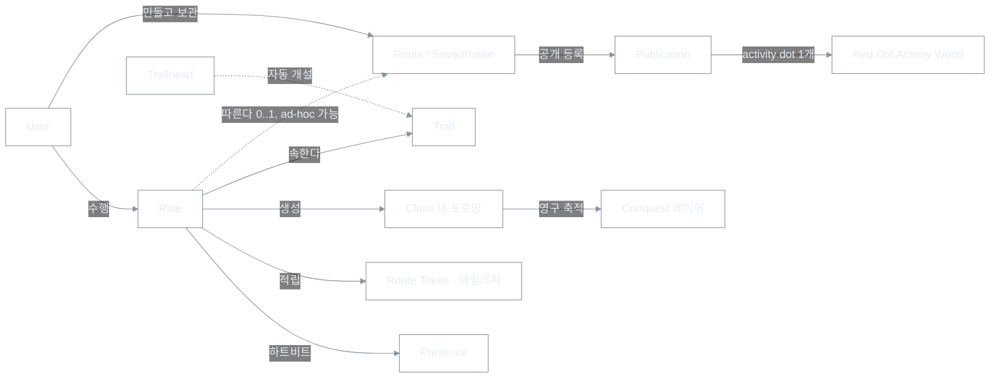

# RTW Ontology — 무엇이 존재하고, 무엇이라 부르는가

| 항목 | 내용 |
|------|------|
| 문서 유형 | **product** — RTW에 존재하는 개념(정의·관계·금지어)의 **단일 진실(SoT)** |
| 최초 작성 | 2026-07-14 |
| 상태 | **채택** — UI·카피·신규 문서·신규 코드 식별자는 본 문서를 따른다 |
| 연결 문서 | [마스터 비전](260511-RTW-마스터-비전-및-종합계획.md), [Conquest 설계](260703-Conquest-정복-레이어-설계.md), [Trail·Trailhead 상세](260517-제품-용어-Trailhead-Trail.md), [tier·진입 정책](260519-사용자-tier-및-진입-정책.md), [Route Token 경제](260518-Route-Token-경제-설계.md), [World Activity Presence](260523-World-Activity-Presence-설계.md), [결정 로그](260707-RTW-결정-로그.md), [문서 지침 §6.1](260509-BOXCYCLE-문서-생성-및-수정-지침.md) |

---

## 0. 이 문서의 경계

**담는 것** — 각 개념이 ① 무엇인가 ② 무엇이 아닌가 ③ 서로 어떤 관계인가 ④ 무엇이라 부르고, 무엇이라 부르지 않는가.

**담지 않는 것** — 아래는 다른 문서 소관이며, 여기 쓰지 않는다.

| 질문 | 답이 있는 곳 |
|------|--------------|
| 왜·언제 그렇게 결정했나 | [결정 로그](260707-RTW-결정-로그.md) |
| 어디까지 구현됐나 | [상태보드](260707-RTW-기능-인벤토리-상태보드.md) |
| 어떻게 동작하나 (메커닉·수치·스키마) | 각 도메인 SoT (연결 문서) |
| 용어를 바꾸려면 | [지침 §6.1](260509-BOXCYCLE-문서-생성-및-수정-지침.md) |

### 0.1 레이어 스코프 — 이 문서의 구속력 (중요)

| 레이어 | 구속력 |
|--------|--------|
| UI 문자열·카피·`aria-label` | **지배** — 즉시 적용 |
| 신규 문서·회의·커밋 메시지 | **지배** |
| **신규** 코드 식별자(변수·파일·훅) | **지배** — 새로 짓는 이름은 본 문서 용어를 쓴다 |
| **기존** 코드 식별자·파일명 | 참고 — rename은 [결정 로그](260707-RTW-결정-로그.md)를 거쳐 점진(레거시 별칭 유지) |
| Firestore 컬렉션·필드 | 참고 — 변경은 반드시 별도 마이그레이션 계획 |

> **AI 작업 지시 해석 규칙:** "Ontology 기준으로 작업해" = 사용자 노출 문자열·문서·**신규** 식별자에 본 문서를 적용하라는 뜻이다. **기존 코드·데이터의 일괄 rename 지시가 아니다.**

---

## 1. 개념 지도

관계 문장(요약):

- **User**는 Route를 **소유**하고, Ride를 **수행**하고, Tier(계정)·Trust Tier(입력 신뢰)를 **가진다**.
- **Ride**는 Route를 **따르거나**(0..1, ad-hoc 가능) Trail에 **속하며**, Claim을 **생성**하고 Route Token·마일리지를 **적립**한다.
- **Route**는 Publication으로 **공개될 수 있고**, 여러 번 Ride **될 수 있다**.
- **Publication**은 월드 맵에 Red Dot **1개로 표시**된다.
- **Trail**은 Trailhead에서 ▶로 **자동 개설**된다. 사용자는 "방을 만들지" 않는다.
- **Claim**(휘발 아님·영구)과 **Red Dot / Presence**(휘발)는 **보완 관계**다 — "역사적으로 누가" vs "지금 누가".

---

## 2. 용어 사전

### 2.1 계정·신뢰

| 용어 | 무엇인가 | 무엇이 아닌가 | 현행 코드·데이터 |
|------|----------|---------------|-------------------|
| **User** (사용자) | `uid`를 가진 인증 주체. 모든 활동은 uid에 귀속 | `user === null`(세션 없음)은 사용자가 아니라 **서비스 밖** | `users/{uid}` |
| **Tier** (계정 등급) | 권한·쿼터의 축: `anonymous`(Guest) → `registered_free` → `registered_paid`, 별도 `admin` | 입력 신뢰 등급이 아님(아래 Trust Tier와 독립 축) | `users.tier` — SoT: [tier 정책](260519-사용자-tier-및-진입-정책.md) |
| **Guest** | **익명 인증을 마친** 사용자 (`tier: anonymous`) | "비로그인 사용자" 아님 — 비로그인 개념은 존재하지 않는다 | `isAnonymous === true` |
| **Trust Tier** (입력 신뢰 등급) | 정복 인정에만 관여하는 입력 검증 축: T0 no-sensor(체험) / T1 케이던스 / T2 트레이너·파워 | 계정 Tier와 무관(곱집합). 주행 자체를 제한하지 않음 — 제한은 오직 정복 **인정** | SoT: [Conquest §3.2](260703-Conquest-정복-레이어-설계.md) |

### 2.2 경로 — 지도 위의 설계도

| 용어 | 무엇인가 | 무엇이 아닌가 | 현행 코드·데이터 |
|------|----------|---------------|-------------------|
| **Route** (경로) | 지도 위에 설계된 주행 경로 — **설계도이자 저장 가능한 자산**. 여러 번 Ride할 수 있다 | 운동 기록이 아님(그건 Ride). 공개 카탈로그 항목도 아님(그건 Publication) | `savedRoutes`, RouteDock |
| **SavedRoute** (저장 경로) | 사용자가 보관하는 Route 문서. 진행률·완주 여부를 가지며 쿼터(보유·미완료)의 대상 | — | `savedRoutes/{id}`, `lastProgressRatio` — 수치 SoT: [tier quota](260519-tier-quota-정책.md)·[Conquest §9.5](260703-Conquest-정복-레이어-설계.md) |
| **Publication** (공개 경로) | Route가 공개 카탈로그에 등록된 **불변 스냅샷 인스턴스**. 월드 dot·동승·입문 코스의 단위 | Route 원본과 별개 문서. geometry가 바뀌면 새 Publication | `routePublications/{id}` — SoT: [Presence 설계](260523-World-Activity-Presence-설계.md) |
| **코스** (한국어 UI) | "탈 수 있게 공개된 경로(Publication)"의 한국어 제품 표기 — 입문 코스·퍼블릭 코스 | 영문·코드의 `course`/`courseId`는 **퇴역**(Phase 7) — 신규 코드 사용 금지 | UI 문자열만. 장기 지위는 §4 미결 |
| **Journey** (여정) 💭 | (구상) 미완주 SavedRoute를 장기 프로젝트로 부르는 **표면명 후보** — "서울 한 바퀴 42%" | 새 데이터 모델이 아님(그릇 = SavedRoute + 진행률, 기구현) | 미확정 — [상태보드 §5](260707-RTW-기능-인벤토리-상태보드.md) |

### 2.3 주행·세션

| 용어 | 무엇인가 | 무엇이 아닌가 | 현행 코드·데이터 |
|------|----------|---------------|-------------------|
| **Ride** (주행) | 한 번의 실제 운동 기록(불변 로그). Route를 따르거나 ad-hoc. 운동·Claim·Pioneer는 **즉시 인정**, Route 완주 격상만 ≥98% 게이트 | 지도 경로가 아님(그건 Route) | `rides/{id}` — 인정 규칙 SoT: [Conquest §9.5](260703-Conquest-정복-레이어-설계.md) |
| **Trail** | **같이 달리는 한 판** — 동시 접속·관전·진행률 공유의 라이브 세션 인스턴스. ▶ 시 자동 개설, 사람에게는 3자리 `displayNumber`(`Trail 035`) | 채팅방·게임방·대기실이 아님. 코스(설계도)도 아님 — `○○ 코스 · Trail 3`처럼 병기 | `trails/{id}` — 상세: [260517](260517-제품-용어-Trailhead-Trail.md) |
| **Trailhead** | 길로 나가기 **전** 모이는 허브 — 코스·Trail 선택, MENU, 계정, 설정. presence상 `trailId=default` | "방 목록 로비"가 아님. 사용자는 방을 만들지 않는다 | `trailId=default` — 상세: [260517](260517-제품-용어-Trailhead-Trail.md) |
| **Presence** | 실시간 존재·위치·하트비트 — **휘발성**. Trail 스코프(같은 Trail만 관전) | 영구 기록이 아님(그건 Conquest). 전역 GPS 트래킹 아님 | `trails/{id}/members`, `livePublicationRides` |

### 2.4 정복 (Conquest)

| 용어 | 무엇인가 | 무엇이 아닌가 | 현행 코드·데이터 |
|------|----------|---------------|-------------------|
| **Conquest** (정복) | 주행 흔적을 **영구 자산**으로 축적하는 레이어 전체. 핵심 판타지 「Ride = Claim」의 구현 | 휘발성 presence가 아님 — red dot과 보완 관계 | SoT: [Conquest 설계](260703-Conquest-정복-레이어-설계.md) |
| **Claim** | 달린 도로가 영구히 내 것으로 기록되는 것. 관대 판정(달리면 인정), Trust Tier 한도 내 | 배타적 소유가 아님(남의 Claim을 뺏지 않음). 면적 점령이 아님 — 자산은 **도로(선)** | `conquest/{uid}`, `rides.conquest` |
| **내 도로망** | Claim 자산의 사용자 표기 — 달린 도로 궤적의 영구 렌더. 지표 = **신규 도로 km** | 내부 단위(z20 셀·청크·타일)는 UI에 노출하지 않는다 | `traces`, 「새 도로 +N km」·「🏴 +N km」 |
| **Pioneer** (개척자) | 구간(교차로~교차로·IC~JC)을 자격 조건으로 **최초 완주**한 라이더의 write-once 기록 | 공정 제도가 아니라 **역사 기록**(등기 원칙). 셀 단위 pioneer는 폐기됨 | Phase B 설계 과제(OQ-13) — [Conquest §3.4](260703-Conquest-정복-레이어-설계.md) |

### 2.5 경제

| 용어 | 무엇인가 | 무엇이 아닌가 | 현행 코드·데이터 |
|------|----------|---------------|-------------------|
| **Route Token** | 운동 활동 **보상 포인트** — 완주·습관에 소량 지급, 동기·시각·개인화에 소비 | Mapbox/Firebase **API 토큰과 무관**. "세계 조작 자원"·MMO 재화 아님 | `routeTokenLedger`, `users.routeTokenBalance` — SoT: [Token 경제](260518-Route-Token-경제-설계.md) |
| **마일리지** | **절대 줄지 않는** 누적 운동 이력(총 km·시간·연속일) | 소비 재화가 아님 — 토큰과 분리, 원장 혼합 금지 | 미구현 — [Token 경제 §4](260518-Route-Token-경제-설계.md) |
| **Quota** (쿼터) | tier별 생성·저장 **수량 한도** — 차별화는 기능 잠금이 아니라 수량으로 | 기능 잠금이 아님. 코어 루프(주행·정복·개척)는 전 tier 무료 | `tierQuotaCore.ts` — SoT: [tier quota](260519-tier-quota-정책.md) |

### 2.6 표시 레이어 (지도 위)

| 용어 | 무엇인가 | 무엇이 아닌가 | 현행 코드·데이터 |
|------|----------|---------------|-------------------|
| **Activity World / Red Dot** | Publication당 **1개 dot**로 "지금·최근 어디서 달렸나"를 알리는 전역 **휘발성** 레이어. active=진한 red, closed=경과일 fade | 실시간 GPS 트래커 아님(dot는 midpoint 고정). 영구 기록 아님(24h~fade — 회귀 의심 전에 윈도우 확인) | `publicationPresence` — SoT: [Presence 설계](260523-World-Activity-Presence-설계.md) |
| **관전 점** (같은 Trail) | 같은 Trail 주행자의 실시간 진행 표시 | 전역이 아님 — Trail 스코프. Activity World와 혼동 금지 | `livePublicationRides` — [260517 §2](260517-제품-용어-Trailhead-Trail.md) |

---

## 3. 금지·지양 용어

| 쓰지 않음 | 대신 쓸 말 | 적용 범위 | 근거 |
|-----------|------------|-----------|------|
| Room·방, Lobby·로비 | **Trail**, **Trailhead** | UI·문서·구어 | [260517 §5](260517-제품-용어-Trailhead-Trail.md) |
| Party, Arena, Match | Trail | UI | [260517 §5.2](260517-제품-용어-Trailhead-Trail.md) |
| Session (사용자 노출 라벨) | 이 Trail·Trail 3 (Session은 코드 내부만) | UI·HUD | [260517 §5.2](260517-제품-용어-Trailhead-Trail.md) |
| 비로그인 (사용자) | **인증 전·세션 없음**(기능 불가) / **Guest**(익명 인증 완료) | 전 레이어 | [tier 정책 §1.2](260519-사용자-tier-및-진입-정책.md) |
| `course`·`courseId` (신규 코드) | `route`·`publication` 계열 | 코드·데이터 | Phase 7 퇴역 — [체크리스트](archive/260616-Phase7-Firestore-필드-terminology-체크리스트.md) |
| z16·z20·블록·타일·셀·청크 | **내 도로망**·**새 도로 +N km** | UI | [Conquest §6](260703-Conquest-정복-레이어-설계.md) |
| 세계 확장권·세계 조작 (토큰 카피) | 운동 보상 / 경로 계산 쿼터 | UI 카피 | [Token 경제 §3.1](260518-Route-Token-경제-설계.md) |

---

## 4. 미결 용어 ⚠️

결정되지 않은 표기 — 확정 시 본 문서를 먼저 고치고 [결정 로그](260707-RTW-결정-로그.md)에 남긴다([지침 §6.1](260509-BOXCYCLE-문서-생성-및-수정-지침.md)).

| 항목 | 현황 |
|------|------|
| 「새 영토 +N」 카피 | v1 타일 시절 언어가 주행 요약 등에 잔존 ↔ v2 자산 언어는 도로(내 도로망·신규 km). 통일 여부·시점 미결 — [상태보드 §3.2](260707-RTW-기능-인벤토리-상태보드.md) |
| Journey(여정) 표면명 | SavedRoute 장기 프로젝트의 사용자 명칭 후보(§2.2) — UI 네이밍 미확정 |
| 코스(한국어)의 장기 지위 | Publication의 제품 표기로 유지 vs 경로(Route)로 통일 — 현행은 유지 |

---

## 5. 개정 이력

| 날짜 | 내용 |
|------|------|
| 2026-07-14 | 최초 작성 — 흩어져 있던 용어 정의를 단일 문서로 통합(자문 4층 구조 제안 수용). [260517](260517-제품-용어-Trailhead-Trail.md)의 온톨로지 역할 이관, 레이어 스코프·AI 해석 규칙 명시 |
