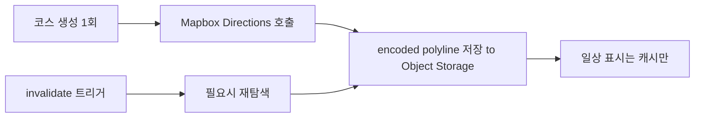
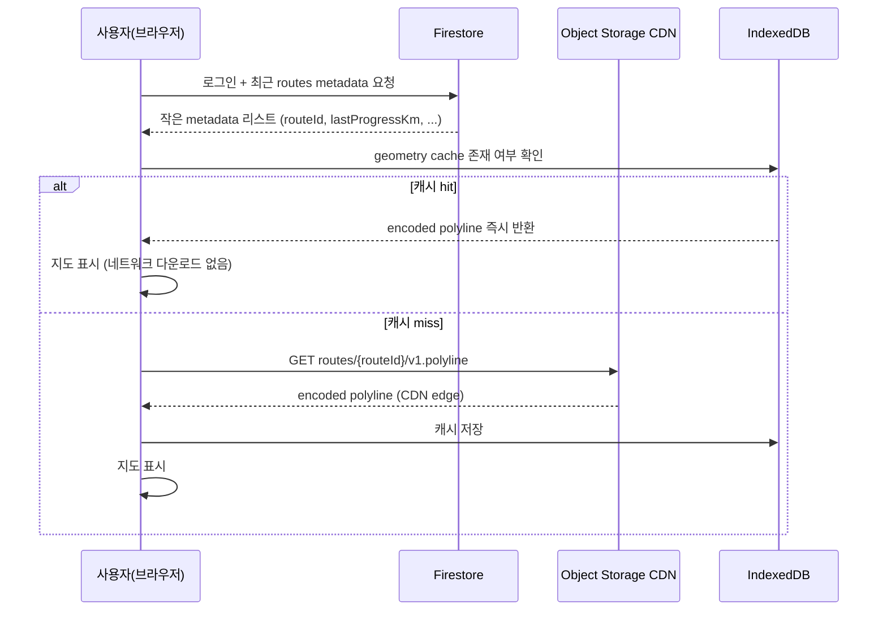

# RTW — 경로 저장 계층화 · Frozen Route · Segment

| 항목 | 내용 |
|------|------|
| 문서 유형 | **architecture** — 경로 데이터 저장·캐시·재계산의 단일 진실 |
| 최초 작성 | 2026-05-11 |
| 상태 | **초안** — 자문 4·5단계 결론 종합. Object Storage 선택은 [RTW 마스터 §7 Q5](../260511-RTW-마스터-비전-및-종합계획.md). |
| 연결 문서 | [RTW 마스터](../260511-RTW-마스터-비전-및-종합계획.md), [코스 수명·UGC 품질 정책](260511-코스-수명-UGC-품질-정책.md), [Firestore Rules 일반화](260511-Firestore-Rules-일반화-방안.md), [Phase별 실행 체크리스트](260511-Phase별-실행-체크리스트-Course-Session-Presence.md), [Firestore 스키마 초안](260509-Firestore-컬렉션-스키마-초안.md), [Firestore→Postgres 체크리스트](260509-Firestore-Postgres-이전-체크리스트.md) |

---

## 0. 본 문서의 위치

- 본 문서는 **경로(geometry) 저장·캐시·재계산 전략**의 단일 진실이다.
- 코스 수명·승격 규칙은 [코스 수명·UGC 품질 정책](260511-코스-수명-UGC-품질-정책.md)이, Firestore 컬렉션 필드 정의는 [Firestore 스키마 초안](260509-Firestore-컬렉션-스키마-초안.md)이 단일 진실이다.

---

## 1. 저장 계층(Storage Tiering)

### 1.1 3계층 분리

| 계층 | 위치 | 역할 | 데이터 |
|------|------|------|--------|
| **Metadata** | Firestore | 검색·권한·수명 관리 | `routeId`, `start/waypoints/end`, `profile`, `distanceMeters`, `bbox`, `geometryRef`(Storage 포인터), `lifecycleStage` 등 |
| **Geometry blob** | Object Storage(R2 / S3 / Firebase Storage) | 큰 폴리라인·압축 캐시 | encoded polyline 파일(`routes/{routeId}-{version}.polyline`) |
| **Client cache** | Browser IndexedDB(`idb` 라이브러리 권장) | 즉시 표시·오프라인 재생 | geometry, elevation summary, thumbnail |

### 1.2 왜 분리하는가

- Firestore에 큰 geometry blob을 두면 **단일 문서 크기 한계 + 고비용 읽기 + 이전 어려움**이 발생한다([Firestore→Postgres 체크리스트](260509-Firestore-Postgres-이전-체크리스트.md) "지리·경로 데이터" 절).
- Object Storage는 **CDN 캐시가 잘 됨** + **immutable asset 모델**이 잘 맞음.
- IndexedDB는 헤비 유저(매일 50km 이어 달리기) **즉시 표시**를 가능하게 함 — 자문 4단계 핵심 통찰.

### 1.3 비교(현재 코드)

[`apps/web/src/lib/firestoreCourses.ts`](../apps/web/src/lib/firestoreCourses.ts)는 입문 허브 코스(좌표 4~7개)를 Firestore 문서 내부 `geometry: { type: "LineString", coordinates: [...] }` 로 저장한다.

| 코스 종류 | 정책 |
|-----------|------|
| 입문 허브(좌표 ≤ 50개, 5km급) | **Firestore 본문 저장 유지** — 너무 작아 분리 비용이 더 큼 |
| 사용자 코스(임의 길이, 가능한 수천 좌표) | **§2~§3 분리 정책 적용** |

---

## 2. Route Parameter vs Geometry 분리

### 2.1 영구 저장(metadata)

| 필드 | 역할 |
|------|------|
| `start: LngLat` | 출발지 좌표 |
| `waypoints: LngLat[]` | 경유지 좌표 |
| `end: LngLat` | 도착지 좌표 |
| `profile: "cycling" \| "driving" \| "walking"` | 라우팅 프로파일 |
| `distanceMeters: number` | 요약 거리 |
| `durationSec: number` | 요약 시간 |
| `bbox: { minLng, minLat, maxLng, maxLat }` | 검색·필터 |
| `elevationSummary: { gainM: number, lossM: number, sections: GradientSection[] }` | §6 |

**원칙:** 위 필드는 **불변 또는 거의 불변**. 같은 routing engine·같은 profile이면 같은 결과가 나오도록 입력을 영구 보존.

### 2.2 압축 저장(geometry blob)

| 필드 | 역할 |
|------|------|
| `geometryRef: { storagePath: string, encoding: "polyline6", version: number, sizeBytes: number } \| null` | Storage 포인터 |

**압축 형식:** Encoded Polyline (Google/Mapbox 계열, polyline6 정밀도). 일반 GeoJSON 대비 크기 5~10배 절감.

**파일 경로 규약:** `routes/{routeId}/{version}.polyline` (예: `routes/abc123/v1.polyline`).

### 2.3 왜 둘 다 저장하는가

- **Route parameter만으로 충분한가?** 이론적으로는 가능하지만, **routing engine이 시간이 지나면 다른 결과를 낸다** (도로 폐쇄·OSM 수정·Mapbox routing 업데이트). 헤비 유저의 "내가 달렸던 그 코스"의 재현성이 깨진다.
- **Geometry만으로 충분한가?** 새 routing engine이 더 좋은 경로를 줘도 반영 불가. 또한 segment 추출(§4·§5)·shape similarity(§3 [수명 정책 §2.3](260511-코스-수명-UGC-품질-정책.md))가 어려워진다.
- 따라서 **둘 다 저장 + version으로 추적**.

---

## 3. Frozen Route + Lazy Rebuild

### 3.1 핵심 원칙

> **전체 경로를 매번 다시 계산하지 않는다.**



### 3.2 Lazy Rebuild 트리거

캐시는 다음 경우에만 무효화된다.

| 트리거 | 설명 |
|--------|------|
| 사용자 명시 "재탐색" 버튼 | 도로 변경 인지 시 |
| Routing engine major upgrade | 운영자 일괄 트리거(`geometryVersion` 증가) |
| 경로 좌표 수정 | waypoint 추가·이동 → 새 routeId 또는 새 version |
| 정합성 검증 실패 | distance·bbox 메타와 geometry가 어긋나면 자동 재탐색 |

### 3.3 절대 금지 패턴

- ❌ 앱 시작 시 모든 코스 자동 재탐색 (장거리 1000개 코스 → API quota·비용 폭발)
- ❌ 1000km 코스 단일 blob 저장 (메모리·다운로드 비용 폭발 — §4 segment 분할로 해결)
- ❌ Firestore 단일 문서에 1000+ 좌표 저장 (문서 크기 한계 + 이전 어려움)

---

## 4. Segment 분할

### 4.1 언제 분할하는가

| 코스 거리 | 정책 |
|-----------|------|
| ~50km | 단일 geometry blob (분할 불필요) |
| 50~200km | 단일 blob 또는 segment 1~2개(Phase 5 검토) |
| 200km+ | **반드시 segment 분할** (권장 100~200km 단위) |

### 4.2 Segment 구조

```text
routes/{routeId}/metadata.json     # 영구 metadata + segment 리스트
segments/{segmentId}/{version}.polyline  # 공유 가능한 segment blob
```

`route.segments: SegmentRef[]` 필드로 routeId가 segment 리스트를 참조한다.

### 4.3 장점

| 장점 | 설명 |
|------|------|
| 부분 로딩 | 현재 위치 근처 segment만 다운로드 |
| 메모리 절약 | 1000km 전체를 메모리에 로드하지 않음 |
| 재사용 가능 | 같은 segment를 여러 route가 공유 (§5) |
| analytics | "가장 많이 달린 구간" 분석 가능 |

### 4.4 어디까지 segment화할지

**자문 핵심 결론:** "모든 route를 segment화하지 말 것."

- Phase 5 도입 시점에도 **인기 경로만** segment 추출(예: 알프스, 한강, 로마-피렌체).
- 일반 사용자 1회성 코스는 **route 단일 blob 유지**.
- segment 추출 자동화는 GIS급 문제 — 운영자 검수 + 반자동.

---

## 5. Shared Geometry (장기)

### 5.1 개념

수천 명이 "로마 → 피렌체" 변형을 저장해도, 실제 도로망은 대부분 공유된다.

→ **공통 segment 단일 저장 + 사용자별 metadata 다중 저장.**

### 5.2 구조

```text
RouteA: { segments: [seg_101, seg_102, seg_551] }   ← 사용자 A
RouteB: { segments: [seg_551, seg_999] }             ← 사용자 B
                            ↑
              seg_551 single blob in storage (둘이 공유)
```

### 5.3 도입 시점

- Phase 5 (장기). 인기 segment만 자동 추출.
- 도입 전까지는 **route 단위 중복 저장 허용**(자문 결론: 저장 비용 자체보다 검색 품질·추천 시스템 붕괴가 더 큰 문제).

---

## 6. Elevation 처리

### 6.1 절대 금지

- ❌ 모든 좌표 점에 elevation 저장 (저장 폭증).

### 6.2 권장 방식

| 데이터 | 저장 방식 |
|--------|-----------|
| Raw elevation samples | 20~50m 간격 샘플링만 (전체 X) |
| Elevation summary | `gainM`, `lossM`, `gradientSections: { startKm, endKm, avgGrade }[]` 만 metadata에 저장 |
| 차트 표시 | 클라이언트가 샘플 + summary로 재생 |

### 6.3 외부 API 의존(Open-Meteo)

레거시는 Open-Meteo 직접 호출(`app.js`). 본 개발에서는 **Cloud Functions 프록시** ([app.js 분리 1차 리팩터링](260509-app-js-프론트백엔드-분리-1차리팩터링.md) Phase 1-C와 정렬).

---

## 7. 헤비 유저 데이터 시퀀스

자문 핵심 시나리오: **매일 저녁 자신이 달려온 루트를 확인하고 다음 50km를 이어 달리는 프리미엄 사용자**.



### 7.1 비용 효과

| 항목 | Naive (모든 route 매번 Mapbox 재호출) | Frozen + CDN + IndexedDB |
|------|---------------------------------------|--------------------------|
| Mapbox API 비용 | 매일 N개 route × 거리 | 0(invalidate 시만) |
| 다운로드 latency | 수 초~수십 초 | <50ms (캐시 hit) |
| 모바일 데이터 사용 | route × 매일 | 1회/route(캐시 만료 전까지 0) |

---

## 8. 현재 코드 갭 (작업 후보)

본 절은 [Phase별 실행 체크리스트 Phase 3](260511-Phase별-실행-체크리스트-Course-Session-Presence.md)가 추적할 작업 목록이다.

### 8.1 [`apps/web/src/lib/firestoreCourses.ts`](../apps/web/src/lib/firestoreCourses.ts)

| 갭 | 대응 |
|----|------|
| 모든 코스 geometry를 Firestore 본문 저장 | 입문 허브(소형) 유지, **사용자 코스만 분리** |
| `CourseDoc.geometry` 단일 필드 | `geometry`(소형 inline) + `geometryRef`(대형 Storage 포인터) 둘 다 정의 |
| `BASIC_COURSES` 시드 좌표가 코드에 박힘 | 입문 허브는 유지(시드 단순). 사용자 코스 시작·끝·waypoints는 metadata로만 저장 |

### 8.2 신설 필요 모듈(Phase 3)

| 모듈 | 역할 |
|------|------|
| `apps/web/src/lib/polyline.ts` | encoded polyline encode/decode (예: `@mapbox/polyline`) |
| `apps/web/src/lib/storageGeometry.ts` | Firebase Storage 업로드/다운로드 + geometryRef 갱신 |
| `apps/web/src/lib/idbCache.ts` | IndexedDB 캐시 (라이브러리: `idb`) |
| Cloud Function `routes-rebuild` | 명시 재탐색 트리거 (사용자 또는 운영자 호출) |

### 8.3 데이터 마이그레이션

기존 데이터가 거의 없으므로(`temporary` 상태 입문 허브 시드만), 마이그레이션은 **새 사용자 코스부터 새 모델 적용**으로 충분. 기존 시드는 그대로 둔다.

---

## 9. 핵심 결론

- **저장은 Asset이 아니라 Stream** — 살아남는 콘텐츠만 유지.
- **Firestore = metadata, Object Storage = geometry blob, IndexedDB = client cache** 3계층 분리.
- **Frozen Route + Lazy Rebuild** — 매번 재계산 금지.
- 장거리는 **Segment 분할**, 인기 segment는 **Shared Geometry**로 중복 비용 감소.
- Elevation은 **샘플링 + summary**, 전체 점 저장 ❌.

---

## 10. 개정 이력

| 날짜 | 내용 |
|------|------|
| 2026-05-11 | 최초 작성 — 자문 Q&A 4·5단계(저장 비용·헤비 유저·중복 비용) 결론 종합. |
