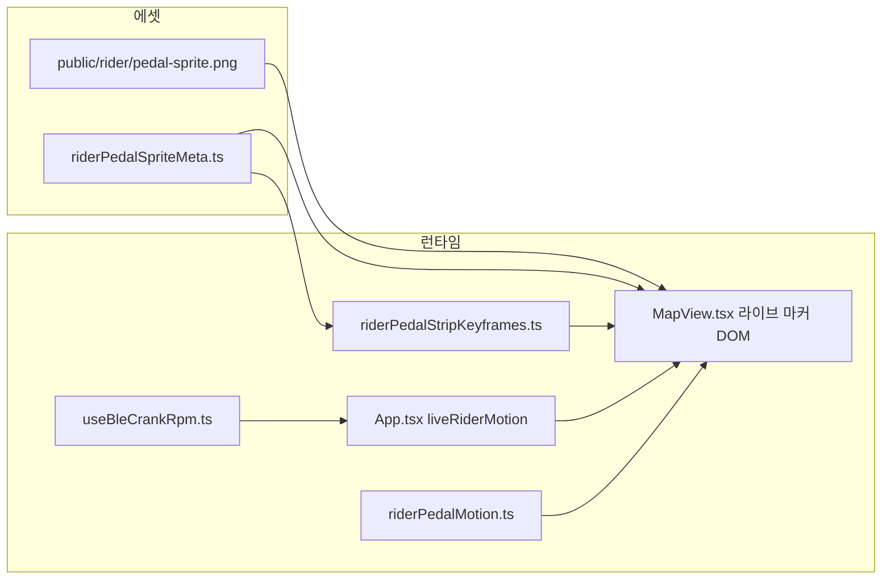

# 260512-주행 마커(라이더) 애니메이션 작업 과정 및 로직 보고서

> **(cycle) 스냅샷:** **2026-05-12~14** 코드 기준. 현재 제품·Firestore 용어는 [제품 용어 Trailhead·Trail](../260517-제품-용어-Trailhead-Trail.md) 우선.

**최초 작성:** 2026-05-12  
**갱신:** 2026-05-14 — 런타임 위치(`MapView`), 에셋 경로(`public/rider`), RPM 해석(`riderPedalMotion`), Web Bluetooth CSC, 동행 마커 GeoJSON 반영  
**대상:** 가상 주행 중 지도 위 **내 라이더** Mapbox HTML 마커의 페달링 애니메이션 및 주변 **동행** 표시 방식  

**관련 경로(웹 `apps/web`):**

| 구분 | 경로 |
|------|------|
| 스프라이트(배포) | `public/rider/pedal-sprite.png` |
| 프레임·셀·리비전 상수 | `src/lib/riderPedalSpriteMeta.ts` |
| CSS 키프레임 주입 | `src/lib/riderPedalStripKeyframes.ts` |
| RPM(속도 추정·센서) | `src/lib/riderPedalMotion.ts` |
| 마커 DOM·페달 effect·동행 레이어 | `src/components/MapView.tsx`, `MapView.css` |
| 세션·속도·BLE → 지도 | `src/App.tsx`, `src/hooks/useBleCrankRpm.ts` |
| 메뉴에서 BLE 연결 UI | `src/components/RideRoutePanel.tsx` |

> 과거 초안은 `public/riding/`·`ridingPedal*`·`App.tsx` 내 직접 마커를 가리켰다. **현재 웹앱 기준은 위 표**를 따른다.

---

## 1. 목적

- 주행 중 지도 위 **내** 라이더가 정지 이미지가 아니라 **페달링하는 느낌**으로 보이게 한다.
- **속도(km/h)** 및 **가능 시 BLE CSC 크랭크 RPM**에 맞춰 루프 주기를 바꾼다.
- **투명 배경**이 지도에 올바르게 합성되도록 한다(흰 사각형·캐시 이슈 방지).
- **동행(다른 라이더)** 는 DOM 마커 대신 **GeoJSON + circle + symbol** 로 그려 부하를 줄인다.

---

## 2. 전체 데이터 흐름(내 라이더)



1. 가로 스프라이트 PNG와 `RIDER_PEDAL_FRAME_COUNT` / `RIDER_PEDAL_CELL_PX` / `RIDER_PEDAL_SPRITE_REVISION` 이 일치해야 한다.  
2. `ensureRiderPedalStripKeyframes()` 가 `steps(N)` 과 키프레임을 `<style>` 로 한 번만 주입한다.  
3. `MapView` 가 내 라이브 위치용 `mapboxgl.Marker` 루트를 만들고, `liveRiderMotion` 에 따라 **방향 플립**과 **페달 `animation-duration` / `animation-play-state`** 를 갱신한다.

---

## 3. 스프라이트·메타 규칙

| 항목 | 내용 |
|------|------|
| 배포 경로 | `public/rider/pedal-sprite.png` |
| 메타 | `src/lib/riderPedalSpriteMeta.ts` — `RIDER_PEDAL_FRAME_COUNT`, `RIDER_PEDAL_CELL_PX`, `RIDER_PEDAL_SPRITE_REVISION` |
| 셀 크기 | 코드와 일치하는 **120×120** px 뷰(스프라이트 한 칸) |
| 캐시 | 스프라이트 URL에 `?v=RIDER_PEDAL_SPRITE_REVISION` 쿼리 |

(과거 문서의 `public/riding/`·`npm run build:riding-sprite` 등은 **다른 브랜치/레포** 일 수 있으니, 스프라이트 재생성 파이프라인이 있으면 그에 맞춰 표와 스크립트명을 맞출 것.)

---

## 4. 투명 배경·빌드(참고)

스프라이트를 **sharp 등으로 자동 합성**하는 경우, 가장자리 BFS로 밝은 배경을 제거하는 방식(과거 `RIDING_EDGE_WHITE_THRESHOLD` 설명)은 여전히 유효한 패턴이다. 현재 저장소에 해당 `mjs` 가 없다면, **디자인 툴에서 RGBA PNG** 로보내 `pedal-sprite.png` 를 직접 교체하고 `RIDER_PEDAL_FRAME_COUNT` 를 수동 동기한다.

---

## 5. 런타임: 내 라이더 Mapbox 마커 DOM (`MapView.tsx`)

```
div.cycling-sim-marker-host.map-view__live-rider-host.mapboxgl-marker
  ├── div.map-view__rider-nametag--live (선택)
  └── div.cycling-sim-marker-flip
        └── div.cycling-sim-marker-stack
              └── div.cycling-sim-marker-pedal-sprite
                    background-image: …/rider/pedal-sprite.png?v=…
```

- **`flip`**: 직전 좌표·경로 기준 bearing 으로 `scaleX(-1)` 여부 결정.  
- **`pitchAlignment` / `rotationAlignment`**: 핀과 동일하게 `viewport` (3D 피치에서도 읽기 쉽게).  
- **스프라이트 URL**: `import.meta.env.BASE_URL` + `rider/pedal-sprite.png` + 리비전 쿼리.

---

## 6. 애니메이션(CSS) — `riderPedalStripKeyframes.ts`

프레임 수 `N` 이 바뀔 수 있으므로 `main.css` 가 아니라 **`ensureRiderPedalStripKeyframes()`** 가 주입한다.

- `@keyframes cycling-marker-riding-pedal-cycle` — `background-position` 0 → `-(N×CELL)` px  
- `.cycling-sim-marker-pedal-sprite` — `steps(N, end)`, 무한 반복, 기본 `animation-play-state: paused`  

`MapView.css` 에서 마커 호스트 투명·z-index 등을 보조한다.

---

## 7. 속도·센서 RPM과 루프 주기

### 7.1 로직 위치

- **RPM 숫자 결정**: `src/lib/riderPedalMotion.ts` 의 `resolvePedalCrankRpm`  
  - `crankRpmFromSensor` 가 숫자이고 **`>= SENSOR_PEDALING_RPM_THRESHOLD` (8)** 이면 센서 값을 `CRANK_RPM_MIN`–`CRANK_RPM_MAX`(14–128) 로 클램프해 사용.  
  - 그렇지 않으면 **`estimateCrankRpmFromSpeedKmh(speedKmh)`** (km/h 상한 95, 식 `22 + speed×2.85` 등 기존 보고서와 동일 계열).  
- **지도 적용**: `MapView.tsx` 내 effect — `liveRiderMotion.speedKmh`, `liveRiderMotion.crankRpmFromSensor`, `sessionStatus`, 경로·좌표로 bearing 갱신 후 `animationDuration` / `animationPlayState` 설정.

### 7.2 한 루프 시간(초)

- `pedalLoopSec = 60 / rpm`  
- 안전 클램프: **0.22 ~ 5.5** 초  

### 7.3 재생/정지

- `sessionStatus === "running"` 이고 **속도 > 0.35 km/h** 일 때 페달 애니 `running`, 아니면 `paused`.  
- **`prefers-reduced-motion: reduce`** 이면 접근성 우선으로 애니는 일시정지(지속 시간은 갱신해 해제 시 바로 반영).

### 7.4 BLE(Web Bluetooth CSC)

- `src/hooks/useBleCrankRpm.ts` — 서비스 `0x1816`, 특성 `0x2A5B` 알림으로 크랭크 회전·시간 차로 RPM 추정, EMA·스테일 타임아웃.  
- `App.tsx` 가 `liveRiderMotion.crankRpmFromSensor` 에 훅의 `crankRpm` 을 넘김.  
- `RideRoutePanel` 에서 Chromium·HTTPS 환경에서 **센서 연결 / 해제** (세션 `idle` 전환 시 자동 끊김 등은 훅 주석·코드 참고).

> 과거 문서의 `useSensorCadence` / `sensorHubConnected` 등은 **본 저장소 웹 클라이언트 기준으로는 CSC 훅으로 대체**되었다.

---

## 8. 동행(다른 라이더) — 부하 최소화

- **소스 ID**: `boxcycle-peer-riders` (GeoJSON)  
- **레이어**: `boxcycle-peer-riders-circle`(원), `boxcycle-peer-riders-label`(닉네임 텍스트)  
- `peerMarkers` prop 변경 시 `setData` 로 갱신. 스타일 `style.load` 후에도 `latestPeerMarkersRef` 로 재동기.  
- 경로 `route` 레이어 추가 뒤 **`moveLayer`** 로 동행 레이어를 위로 올려 선에 가리지 않게 한다.

---

## 9. 운영 체크리스트

| 단계 | 작업 |
|------|------|
| 1 | `public/rider/pedal-sprite.png` 교체 시 **가로 스트립·셀 120px** 및 `riderPedalSpriteMeta.ts` 의 **프레임 수** 일치 확인 |
| 2 | 캐시 이슈 시 **`RIDER_PEDAL_SPRITE_REVISION` 증가** |
| 3 | BLE: **HTTPS 또는 localhost**, Chromium 계열, 사용자 제스처로 연결 |
| 4 | `npm run build` (웹), Capacitor 시 **`npx cap sync`** |

---

## 10. 요약

- **내 라이더:** HTML `Marker` + 스프라이트 CSS 스텝 + **`resolvePedalCrankRpm`** (속도 + 선택 BLE).  
- **동행:** DOM 마커 N개 대신 **Mapbox GeoJSON circle + symbol**.  
- **접근성:** `prefers-reduced-motion` 시 페달 애니 정지.  
- **유지보수:** 메타·리비전·RPM 상수를 한곳(`riderPedalSpriteMeta`, `riderPedalMotion`)에 모아 변경을 단순화한다.

---

*본 문서 갱신은 `apps/web` 기준 코드(2026-05-14 전후)에 맞추었다.*
