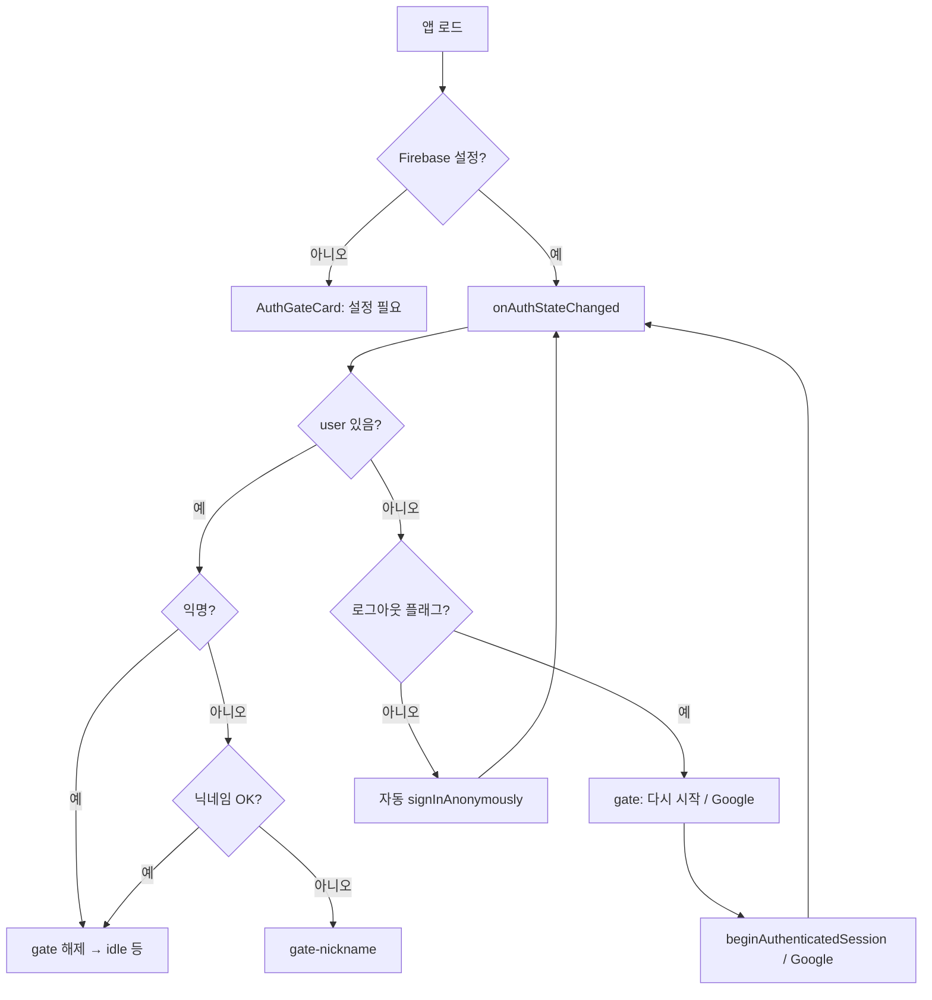
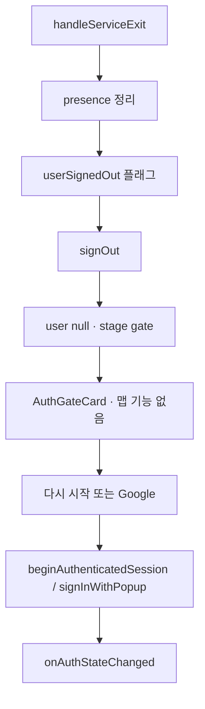

# 로그인·인증 코드 위치 및 흐름 보고서

| 항목 | 내용 |
|------|------|
| 문서 유형 | **architecture** (인증 스택·코드 위치) + **record** (2026-05-15 시점 코드 기준 스냅샷) |
| 최초 작성 | 2026-05-15 |
| 상태 | **코드 반영 완료(2026-05-15)** — `apps/web` Firebase Auth, `functions`, `firestore.rules` 기준 |
| 연결 문서 | [아키텍처 DB 설계](260509-아키텍쳐-DB설계.md), [Firestore Rules 일반화 방안](260511-Firestore-Rules-일반화-방안.md), [BOXCYCLE 문서 생성 및 수정 지침](../260509-BOXCYCLE-문서-생성-및-수정-지침.md), [제품 용어 Trailhead·Trail](../260517-제품-용어-Trailhead-Trail.md) |

> **제품 용어(2026-05-17):** 본문 「로비」→ **Trailhead** 정리 권장. 코드·경로 `deleteLobbyPresence` 등은 레거시 명칭.

---

## 1. 목적과 범위

### 1.1 목적

- BOXCYCLE 웹 앱의 **로그인·인증**이 어디에 구현되어 있는지, **어떤 흐름**으로 동작하는지 한 문서에 정리한다.
- 신규 개발·디버깅 시 **진입 파일**과 **Firebase Console / 환경 변수** 설정 지점을 빠르게 찾을 수 있게 한다.

### 1.2 범위

| 포함 | 제외 |
|------|------|
| Firebase Authentication (익명·Google) | 커스텀 JWT·자체 백엔드 세션 |
| 클라이언트 `App.tsx` 중심 로그인/로그아웃 | 레거시 정적 `index.html` / `app.js` POC |
| 로그인 UI (`AuthGateCard` 등) | Mapbox·Mapillary 토큰 자체(지도 전용) |
| Firestore Rules의 `request.auth` | Postgres 이전 후 인증 설계(미구현) |
| Cloud Functions ID 토큰 검증 (`getMapboxDirections`) | Firebase Admin 전용 배치 작업 |

### 1.3 기술 요약

- **인증 제공자:** [Firebase Authentication](https://firebase.google.com/docs/auth)
- **지원 방식:** 익명(게스트), Google OAuth(팝업)
- **세션:** 브라우저에 Firebase Auth 영속 세션 — `onAuthStateChanged`로 복원
- **로그인 후 데이터:** Google 사용자는 Firestore `users` 문서·닉네임 클레임; 게스트는 Firestore 프로필 동기화 생략

---

## 2. 코드 위치 맵

### 2.1 클라이언트 (`apps/web`)

| 경로 | 역할 |
|------|------|
| `src/lib/firebase.ts` | Firebase 앱·Auth 초기화, `getFirebaseAuth()`, `isFirebaseConfigured()` |
| `src/App.tsx` | **핵심** — 세션 구독, 게스트/Google 로그인, 로그아웃, 인증 UI 마운트, 로그인 후 닉네임 동기화 |
| `src/components/AuthGateCard.tsx` | 인증 풀스크린 오버레이 카드, `AuthGoogleMark` |
| `src/components/AuthGateCard.css` | 인증 게이트 스타일 |
| `src/components/SignUpNicknameCard.tsx` | Google 로그인 직후 닉네임 입력 카드 |
| `src/hooks/useRideUiStage.ts` | UI 단계 `gate` / `gate-nickname` 정의 |
| `src/lib/authDisplay.ts` | presence 표시명·`guest` / `user` 구분 |
| `src/lib/firestoreUser.ts` | 로그인 후 사용자 프로필·닉네임(Firestore) |
| `src/lib/guestNametag.ts` | 게스트 네임태그 관련 |
| `src/components/UserInfoSheet.tsx` | 계정 시트(로그아웃·Google 연동 등 UI 진입) |
| `src/services/mapboxDirections.ts` | 로그인 사용자 ID 토큰을 Functions 호출에 첨부 |
| `apps/web/.env` / `.env.example` | `VITE_FIREBASE_*` 등 환경 변수 |

### 2.2 서버·규칙

| 경로 | 역할 |
|------|------|
| `functions/src/index.ts` | HTTP `getMapboxDirections` — `Authorization: Bearer` ID 토큰 `verifyIdToken` |
| `firestore.rules` | `isSignedIn()`, `isSelf(userId)` 등 Firestore 접근 시 `request.auth` 검사 |
| 루트 `README.md` | Google 로그인·승인된 도메인·LAN 개발 접속 안내 |

---

## 3. Firebase Auth 초기화

**파일:** `apps/web/src/lib/firebase.ts`

- `readConfig()`가 `import.meta.env`의 `VITE_FIREBASE_*`를 읽는다.
- `isFirebaseConfigured()` — `apiKey`, `authDomain`, `projectId`, `appId` 존재 여부.
- `getFirebaseApp()` — 싱글톤 `initializeApp`.
- `getFirebaseAuth()` — `getAuth(getFirebaseApp())` 싱글톤.

설정이 없으면 앱은 인증 게이트에서 **「Firebase 설정 필요」** 메시지를 표시한다(`App.tsx`).

**환경 변수 예시** (`apps/web/.env.example`):

- `VITE_FIREBASE_API_KEY`
- `VITE_FIREBASE_AUTH_DOMAIN`
- `VITE_FIREBASE_PROJECT_ID`
- `VITE_FIREBASE_STORAGE_BUCKET`
- `VITE_FIREBASE_MESSAGING_SENDER_ID`
- `VITE_FIREBASE_APP_ID`

**Console 설정:**

- Authentication → Sign-in method → **익명**, **Google** 사용
- Authentication → 설정 → **승인된 도메인** (`localhost`, `127.0.0.1`, 배포 도메인 등)

---

## 4. 인증 상태 관리 (`useAppAuth` + `App.tsx`)

**파일:** `apps/web/src/hooks/useAppAuth.ts` (Auth·FsSync·자동 익명·Google·로그아웃)

### 4.1 주요 state

| state | 의미 |
|-------|------|
| `user` | `firebase/auth`의 `User \| null` |
| `authInitialized` | 첫 `onAuthStateChanged` 수신 여부 |
| `authSigningIn` | 부트 시 자동 `signInAnonymously` 진행 중 |
| `userSignedOut` | 명시적 로그아웃 후 자동 익명 재진입 **억제** (`sessionStorage` `boxcycle_user_signed_out_v1`) |
| `configured` | `isFirebaseConfigured()` (`App.tsx`) |
| `busy` | 로그인/로그아웃 처리 중 |
| `fsSync` | Google 사용자 Firestore 닉네임 동기화 상태 |

**폐기(2026-05):** `postSignoutMapSession` — 로그아웃 후 맵만 보기. 레거시 키 `boxcycle_post_signout_map_v1` 는 `userSignedOut` 플래그로 이관(`appSessionKeys.ts`).

### 4.2 세션 구독·자동 익명

```ts
// useAppAuth.ts (요약)
onAuthStateChanged(auth, (nextUser) => { setAuthInitialized(true); setUser(nextUser); });

// user === null && !readUserSignedOutSessionFlag() → signInAnonymously() (1회)
```

- **(2026-05-19)** 앱 기동 시 **자동 익명** — [사용자 tier 및 진입 정책](../260519-사용자-tier-및-진입-정책.md) D1 반영.
- `user` 생기면 `clearUserSignedOutSessionFlag()` · Trail presence 등은 `App.tsx` effect.

### 4.3 UI 단계 (`useRideUiStage`)

**파일:** `apps/web/src/hooks/useRideUiStage.ts`

| `RideUiStage` | 조건 |
|---------------|------|
| `gate` | `needsAuthCard` — 미설정·부트·`!user`(로그아웃 포함) |
| `gate-nickname` | `needsNicknameCard` — Google 로그인 후 닉네임 미완료 |
| `idle` ~ `summary` | 인증 통과 후 라이딩 UI |

`needsAuthCard` (`App.tsx`):

- `!configured` 또는 `!authInitialized` 또는 **`!user`**
- 로그아웃 후에도 `user === null` 이면 **맵 뒤 `AuthGateCard`** — 「다시 시작」/`beginAuthenticatedSession` 또는 Google

---

## 5. 로그인 흐름

### 5.1 게스트(익명) — 자동 + `beginAuthenticatedSession()`

**위치:** `useAppAuth.ts`

1. **부트:** `configured` + `authInitialized` + `!user` + 로그아웃 플래그 없음 → `signInAnonymously()` 자동 1회 (`authSigningIn`)
2. **로그아웃 후:** `AuthGateCard` 「다시 시작」→ `beginAuthenticatedSession()` — 플래그 해제 후 익명 로그인
3. 실패 시 `익명 로그인 실패: …` · gate 유지

### 5.2 Google — `handleGoogleSignIn()`

**위치:** `useAppAuth.ts` (`App.tsx`에서 호출)  
**import:** `GoogleAuthProvider`, `signInWithPopup`, `linkWithPopup`, `signInWithCredential`

| 현재 사용자 | 동작 |
|-------------|------|
| 없음 | `signInWithPopup(auth, provider)` |
| 익명 | `linkWithPopup(current, provider)` — 게스트 계정에 Google 연동 시도 |
| 이미 Google 등 | `signInWithPopup` |

**익명 → Google 연동 실패 시 특수 처리:**

- `auth/credential-already-in-use` 또는 `auth/account-exists-with-different-credential`
- → `GoogleAuthProvider.credentialFromError`로 credential 추출 후 `signInWithCredential` (또는 재팝업)

**팝업 취소:** `isBenignAuthPopupCancel()` — `auth/popup-closed-by-user`, `auth/cancelled-popup-request`는 에러로 노출하지 않고 카드/시트만 복원.

**provider 옵션:** `prompt: "select_account"` (계정 선택 강제).

### 5.3 Google 로그인 후 닉네임

- `user.isAnonymous`가 아니면 Firestore에서 닉네임 조회·`claimNicknameTransaction`.
- 미설정·중복 시 `fsSync.state === "awaiting_nickname"` → `stage === "gate-nickname"` → `SignUpNicknameCard`.

### 5.4 로그아웃 — `handleServiceExit()` → `completeFirebaseSignOut()`

**위치:** `App.tsx` (정리) + `useAppAuth.completeFirebaseSignOut`  
**UI:** `UserInfoSheet` 「로그아웃」

1. `App.tsx` `handleServiceExit`: 주행 종료·Trail presence 삭제 등
2. `setUserSignedOutSessionFlag()` — **자동 익명 재진입 방지**
3. `signOut(getFirebaseAuth())` → `user === null` · `stage === gate` · **맵·Firestore 기능 없음**
4. 재진입: gate 「다시 시작」(`beginAuthenticatedSession`) 또는 Google

**폐기:** 로그아웃 후 맵만 보기·`authSheetOpen` 우측 「로그인」 (`postSignoutMapSession`).

---

## 6. 로그인 UI

### 6.1 `AuthGateCard`

**파일:** `apps/web/src/components/AuthGateCard.tsx`

- `role="dialog"`, `aria-modal` 풀스크린 오버레이.
- 선택적 `title`, `onDismiss`(X 닫기).

### 6.2 마운트 조건 (`App.tsx` JSX)

| 조건 | UI |
|------|-----|
| `stage === "gate"` | `AuthGateCard` — 연결 중 / 로그아웃 후 「다시 시작」·Google / 재시도 |
| `stage === "gate-nickname" && user` | `SignUpNicknameCard` |

핸들러: `beginAuthenticatedSession`, `handleGoogleSignIn` (`useAppAuth`).

---

## 7. 인증 이후 연동

### 7.1 표시·presence

**파일:** `apps/web/src/lib/authDisplay.ts`

- `getPresenceDisplayName(user)` — 익명: `guest-{uid 6자}`, 그 외: `displayName` / `email` / `uid`
- `getPresenceMemberType(user)` — `"guest"` \| `"user"`

로비·코스 presence, HUD 등에서 사용.

### 7.2 API 호출 시 토큰

**파일:** `apps/web/src/services/mapboxDirections.ts`

- 기본: Cloud Functions `getMapboxDirections` 호출 시 Firebase **ID 토큰**을 `Authorization: Bearer`로 전달.
- 서버가 미인증 요청을 거부한다(게스트 포함 — 익명도 Firebase Auth 사용자).

**파일:** `functions/src/index.ts`

```ts
// 요약: Bearer 토큰 없음 → unauthenticated
// verifyIdToken 실패 → unauthenticated
await getAuth().verifyIdToken(tokenMatch[1]);
```

### 7.3 Firestore Rules

**파일:** `firestore.rules`

- `isSignedIn()` → `request.auth != null`
- `isSelf(userId)` → 로그인 + `request.auth.uid == userId`
- `users`, `rooms/.../members`, `courses/.../presence` 등 컬렉션별로 위 헬퍼 조합

자세한 컬렉션별 규칙은 [Firestore Rules 일반화 방안](260511-Firestore-Rules-일반화-방안.md) 및 `firestore.rules` 본문 참고.

---

## 8. 흐름 다이어그램

### 8.1 최초 방문



### 8.2 로그아웃



---

## 9. 개발·운영 시 유의사항

| 항목 | 내용 |
|------|------|
| `localhost` vs `127.0.0.1` | 서로 다른 출처 — Console 승인 도메인에 둘 다 추가하거나 하나로 통일 |
| `.env` 변경 후 | Vite dev 서버 **재시작** 필요 |
| Google 로그인 테스트 | Cursor 내장 브라우저보다 **Chrome/Edge** 권장(팝업·리디렉션 이슈) |
| LAN 접속 | IP별 승인 도메인 등록 또는 ngrok 등 HTTPS 터널 |
| 익명 자동 로그인 | **있음** — 로그아웃 플래그 없을 때 부트 시 1회 (`useAppAuth`) |

---

## 10. 빠른 참조 — 함수·심볼

| 심볼 | 파일 | 설명 |
|------|------|------|
| `getFirebaseAuth()` | `lib/firebase.ts` | Auth 인스턴스 |
| `useAppAuth` | `hooks/useAppAuth.ts` | Auth state·자동 익명·Google·로그아웃 |
| `beginAuthenticatedSession` | `useAppAuth.ts` | 로그아웃 후 익명 재진입 |
| `completeFirebaseSignOut` | `useAppAuth.ts` | signOut + 로그아웃 플래그 |
| `handleGoogleSignIn` | `useAppAuth.ts` | Google 로그인·연동 |
| `handleServiceExit` | `App.tsx` | 주행·presence 정리 후 signOut |
| `isBenignAuthPopupCancel` | `lib/firebaseAuthPopup.ts` | 팝업 취소 무시 |
| `useRideUiStage` | `hooks/useRideUiStage.ts` | `gate` / `gate-nickname` |
| `AuthGateCard` | `components/AuthGateCard.tsx` | 인증 UI 셸 |
| `getMapboxDirections` | `functions/src/index.ts` | 서버 토큰 검증 |

---

## 11. 개정 이력

| 날짜 | 내용 |
|------|------|
| 2026-05-15 | 최초 작성 — 코드베이스 조사·대화 기반 위치·흐름 정리 |
| 2026-05-19 | `useAppAuth`·자동 익명·`userSignedOut` gate — `postSignoutMapSession` 폐기 반영 |
