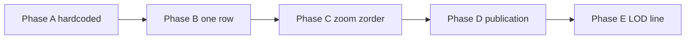

# Map 표현 계층 — 최소 복구 플랜 (Phase A–E)

| 항목 | 내용 |
|------|------|
| 문서 유형 | **execution** + **architecture** — Mapbox 표현 계층 원인 분리·단계 복구 |
| 작성일 | 2026-05-27 |
| 상태 | **초안** — Builder 작업지시 SoT (Phase 순서 엄수) |
| 연결 문서 | [World Activity Presence 설계](../260523-World-Activity-Presence-설계.md), [Activity World LOD](260517-Activity-World-지도-LOD-설계.md), [자문단 정렬 보고](260526-World-Activity-Presence-자문단-정렬-보고.md), [Trail 관전 보고](260514-(cycle)로비_코스주행자_맵관전_구현_보고서.md) |

---

## 1. 목적

dot/trail 표시 문제가 **정책·데이터·렌더링·realtime**에 동시에 얽혀 원인 분리가 불가능한 상태다.

**이 문서의 목표는 기능 추가가 아니다.** Mapbox **표현 계층(minimal rendering path)** 을 Phase A→E로 한 겹씩만 되살려, 각 변수를 분리·판정 가능하게 만든다.

**PM 정책(고정)** 은 Phase D·E에서만 연결한다. Phase A–C는 **맵 레이어 생존**만 검증한다.

---

## 2. PM 정책 고정 (복구 완료 후 목표)

| # | 영역 | 정책 |
|---|------|------|
| W1 | World map | trail(publication)당 **aggregate light(dot) 1개**만. **user live position은 world에 표시하지 않음** |
| W2 | Trail 내부 | **같은 trail 참가자끼리만** rider live position 표시 |
| Z1 | Zoom | **저축척:** dot/light 중심 · **고축척:** route polyline 표시 가능 |

설계 SoT: [260523](../260523-World-Activity-Presence-설계.md) (publication 1 dot, heartbeat 분리). 본 문서는 **디버그·복구 절차** SoT.

---

## 3. 현재 문제

- dot가 **보였다 안 보였다** 반복
- z-level / Mapbox expression / source / visibility / realtime / Firestore / LOD / merge가 **동시에** 작동
- b6bf33c 이후 publication-only 경로에서 **데이터 0건이면 화면 0** — 렌더 버그와 데이터 부재 구분 불가

---

## 4. Source / Layer 소유권 (MapView 단일 소유)

overlay hook·`useAppMapOverlays`는 **feature/view model만** 반환한다. `addSource` / `addLayer` / `setData`는 **`MapView.tsx`만**.

| 계층 ID | sync 함수 | Source ID | Layer ID (대표) | 데이터 |
|---------|-----------|-----------|-----------------|--------|
| **WORLD_LIGHT** | `syncActivityWorldDotLayers` | `boxcycle-activity-pulse-dots`, `boxcycle-activity-heat-dots` | `boxcycle-activity-pulse-dots-layer`, `boxcycle-activity-heat-dots-layer` | aggregate light (Phase D) |
| **WORLD_LINE** | `syncCourseActivityLayers` | `boxcycle-activity-pulse-routes`, `boxcycle-activity-heat-routes` | `boxcycle-activity-pulse-routes-line`, … | polyline (Phase E) |
| **TRAIL_SESSION** | `syncTrailSpectatorLayers` | `boxcycle-lobby-spectator-dots` | `boxcycle-lobby-spectator-dots-circle` | trail 내 uid live (정책 W2) |
| **DEBUG_GLOBAL** | `syncGlobalLivePresenceLayers` | `boxcycle-global-live-presence` | `boxcycle-global-live-presence-dot` | world **금지** (debug만) |
| **ROUTE_UI** | route effect | `route` | route line | 본인 워크스페이스 코스 |

**z-order:** `moveActivityWorldLayersToTop` — WORLD_LIGHT/WORLD_LINE을 `route` 위로. Phase C에서만 검증·조정.

---

## 5. Style reload 재등록 정책

| 이벤트 | 동작 |
|--------|------|
| `map.on("style.load")` | WORLD_LIGHT / WORLD_LINE / TRAIL_SESSION / DEBUG 각각 **idempotent ensure + setData** |
| source 있음, layer 없음 | `addActivityPulseDotLayers` 등 재호출 (heat dot 패턴) |
| Phase A–B | `moveActivityWorldLayersToTop` **호출 금지** (z-order 변수 제거) |
| Phase C 이후 | moveToTop ON, style.load 후 `idle` 1회 내 dot 복구 확인 |

**구현 앵커:** `MapView.tsx` — `syncActivityWorldLayersOnMapRef`, `useEffect` + `style.load` / `idle` (activityWorldRaw 의존).

---

## 6. Phase Kill Switch (환경 변수)

| Phase | `VITE_MAP_DEBUG_PHASE` | 효과 |
|-------|------------------------|------|
| A | `A` | 하드코딩 GeoJSON 1 dot만. Firestore·LOD·merge·trail·global sync NO-OP |
| B | `B` | WORLD_LIGHT = 실데이터 1건. LOD·merge 없음 |
| C | `C` | B + 프로덕션 paint expr + moveToTop |
| D | (unset) | `useAppMapOverlays` 정상. WORLD_LINE 빈 FC. LOD는 `VITE_MAP_DEBUG_SKIP_LOD=true` 권장 |
| E | (unset) | `resolveActivityWorldRender` + publication geometry line |

| 보조 | 변수 | 용도 |
|------|------|------|
| DEV | `VITE_DEBUG_ACTIVITY_PULSE_DOT_STYLE` | radius 12 / #ff0000 고정 paint (기존) |
| DEV | `VITE_MAP_DEBUG_SKIP_LOD` | Phase D에서 raw dot 직접 MapView |
| DEV | `VITE_SHOW_ACTIVITY_LOD_DEBUG` | overlay 통계 패널 |

**prod:** `VITE_MAP_DEBUG_PHASE` 미설정. debug global dot: `VITE_DEBUG_GLOBAL_LIVE_PRESENCE_ON_MAP` (기존).

---

## 7. Phase별 플랜

### Phase A — 하드코딩 GeoJSON 1 dot (맵 생존)

**목적:** realtime / Firestore / aggregate / zoom / merge **전부 제거**. 레이어가 그려지는지만 확인.

**제거 (이 Phase만)**

| 끔 | 유지 |
|----|------|
| `activityWorldRaw` → sync | MapView·map style |
| `syncLiveOverlayLayersOnMap` | — |
| `resolveActivityWorldRender` | — |
| `useAppMapOverlays` publication poll | — |

**구현 요약**

1. `VITE_MAP_DEBUG_PHASE=A` 시 `syncActivityWorldLayersOnMapRef`가 **고정 좌표 1점**만 `ACTIVITY_PULSE_DOTS_SRC`에 setData (`courseId: debug-hardcoded`, 권장 `[127.035, 37.505]`).
2. `ensureActivityPulseDotLayers` + `applyActivityPulseDotPaint` (고정 빨강·radius 12).
3. heat dot / pulse line / trail / global sync **호출 안 함**.
4. `App.tsx` 또는 MapView 내부에서 Phase A 시 overlay props **무시**.

**디버그 로그**

| 태그 | 시점 | 필드 |
|------|------|------|
| `[MapDebug:A] sync` | 매 sync | `hasLayer`, `hasSource`, `featureCount: 1` |
| `[MapDebug:A] idle` | `map.once("idle")` | `queryRenderedFeatures` count ≥ 1 |
| `[MapView] pulse dot style inspect` | idle | `queryRenderedCount`, `inBounds` |

**성공 판정**

- [ ] zoom 3–18 어디서나 빨간 원 1개 보임
- [ ] `queryRenderedFeatures(ACTIVITY_PULSE_DOTS_LAYER)` ≥ 1
- [ ] `querySourceFeatures(ACTIVITY_PULSE_DOTS_SRC)` ≥ 1
- [ ] map style 전환 후 idle 1회 내 동일

**실패 분기**

| 증상 | 다음 |
|------|------|
| source O, rendered 0 | paint / expr → Phase C 선행 검토 |
| layer 없음 | style.load 핸들러 |
| setData 예외 | token / style |

---

### Phase B — Source = 실데이터 1건

**목적:** 데이터가 **source까지** 오는지. LOD·merge·zoom 없음.

**제거**

| 끔 | 유지 |
|----|------|
| `resolveActivityWorldRender` | Phase A 레이어 |
| catalog / liveCourseRides merge | — |
| trail spectator, global live on map | — |

**구현 요약**

1. `VITE_MAP_DEBUG_PHASE=B`
2. 단일 소스 (PR에 B1/B2 명시):
   - **B1:** `fetchPublicPublicationPresences()` 첫 1건 `representativePoint`
   - **B2:** 고정 `publicationId` `onSnapshot` 1 doc
3. pulse dot source에 **1점만** setData. fetch 실패 시 DEV `console.warn("[MapDebug:B] fetch", err)` — **빈 배열로만 삼키지 말 것**.
4. 매 sync 후 `inspectActivityPulseDotLayer` (idle).

**성공 판정**

- [ ] Firestore public active ≥1 → dot 1개
- [ ] Firestore 0건 → dot 0 + 로그 `rowCount: 0`
- [ ] fetch error → 콘솔에 index/permission 명시

**실패 분기**

| rowCount | rendered | 다음 |
|----------|----------|------|
| >0 | 0 | Phase C |
| 0 | 0 | CF / deploy / visibility |
| err | — | index / rules |

---

### Phase C — Zoom / visibility / z-order

**목적:** **보였다 안 보였다**가 zoom·LOD·moveToTop 때문인지 분리.

**구현 요약**

1. `VITE_MAP_DEBUG_PHASE=C` — Phase B와 동일 1 dot + 프로덕션 `ACTIVITY_PULSE_DOT_RADIUS_EXPR`
2. `moveActivityWorldLayersToTop` **ON**
3. `resolveActivityWorldRender` **아직 OFF** (feed는 1 dot 고정)
4. 수동 줌 스윕 z=6,10,13,16 — 각 zoom별 `queryRenderedCount` 로그
5. `route` effect vs dot z-order — moveToTop 전후 비교 (DEV 1회)

**성공 판정**

- [ ] z=6–16 모든 구간 rendered ≥ 1 (데이터 1건 고정)
- [ ] style.load → 2초 내 dot 복구
- [ ] `isValidActivityDotLngLat` drop 시 warn 로그 확인

---

### Phase D — Aggregate trail light (정책 W1)

**목적:** WORLD_LIGHT = `publicationPresence` (publication/trail당 1 dot). uid GPS는 world에 없음.

**제거 (world)**

| 끔 | 유지 |
|----|------|
| `globalPresenceDots` → MapView | `useWorldPublicationPresenceOverlay` |
| catalog dot merge | publication-only `resolveWorldMapOverlay` |
| world `liveCourseRides` overlay | — |
| trail spectator on **idle** | spectator on running/paused + same trail |

**구현 요약**

1. `VITE_MAP_DEBUG_PHASE` unset
2. `useAppMapOverlays` → `activityWorldRaw` 정상
3. Phase D 안정화: `VITE_MAP_DEBUG_SKIP_LOD=true` 로 **raw dot 직접** MapView (LOD는 Phase E)
4. WORLD_LINE `setData` 빈 FC

**디버그 로그**

| 태그 | 필드 |
|------|------|
| `[MapDebug:D] overlay` | `rawPulse`, `rawHeat`, `anchorMissing`, `publicationRows` |
| `[MapView] activity world dots` | `rawPulse`, `render pulse`, `zoom` |

**성공 판정 (PM AC)**

- [ ] Trailhead idle: publication dot만. global livePresence layer 0
- [ ] 동일 publication 2인 → dot 1
- [ ] private publication → world dot 0

---

### Phase E — Route / dot 전환 (정책 Z1)

**목적:** 저축척 dot, 고축척 polyline. [260517 LOD](260517-Activity-World-지도-LOD-설계.md) 연결.

**구현 요약**

1. `resolveActivityWorldRender` + `useWorldPublicationPresenceOverlay` geometry (zoom ≥ 13)
2. line ready 시 dot 숨김 — **line 미ready면 dot 유지** (`activityWorldLod.ts` 149–158행 회귀)
3. `runActivityWorldLodP0Checks()` 통과

**성공 판정**

- [ ] z < 13: dot visible (geometry 없어도)
- [ ] z ≥ 13 + geometry ready: line visible
- [ ] z ≥ 13 + geometry missing: dot 유지 (blank 금지)

---

### TRAIL_SESSION (정책 W2) — 별 트랙

World Phase와 **병렬 가능**하나 **소스 분리** 필수.

| 단계 | 내용 |
|------|------|
| B-Trail | spectator 1 dot 하드코딩 (`TRAIL_SPEC_DOTS_SRC`) |
| C-Trail | `liveCourseRides` realtime, same trail only |
| 성공 | running/paused + 동일 trail에서만 moving dot. idle world에는 spectator 0 |

---

## 8. Phase 순서 (병행 금지)

```
A 완료 → B 완료 → C 완료 → D 완료 → E 완료
```

- **한 PR에 Phase 2개 섞지 않음**
- PM 인수: Phase마다 **스크린샷 1장 + 로그 블록 1개**



---

## 9. 복구 완료 후 기능 유지·제거

| 기능 | World | Trail |
|------|-------|-------|
| publication aggregate light | 유지 | — |
| catalog courseActivity dot | 제거 | — |
| global livePresence map dot | 제거 (debug만) | — |
| liveCourseRides world overlay | 제거 | — |
| trail spectator live | — | 유지 |
| course peer sprite | — | 유지 (고줌) |
| publication geometry line | 유지 (E) | — |

---

## 10. Builder 작업지시 요약 (PM → Builder)

1. **오늘 할 일:** Phase A만. `VITE_MAP_DEBUG_PHASE=A` 로 고정 1 dot + `queryRenderedFeatures≥1` 스크린샷·로그 PR 첨부.
2. **금지:** dot 없을 때 catalog/global dot 다시 켜기 (정책·감사 역행).
3. **분리 보고:** `Firestore rowCount` vs `raw dot count` vs `queryRenderedCount` 표 필수.
4. **코드 앵커:** `apps/web/src/components/map/MapView.tsx`, `features/map-overlays/useAppMapOverlays.ts`, `lib/firestorePublicationPresence.ts`.

**PR 템플릿**

```markdown
## Phase X (260527)

### Env
VITE_MAP_DEBUG_PHASE=

### Result table
| Firestore rows | raw pulse | raw heat | rendered | querySource | queryRendered |
|----------------|-----------|----------|----------|-------------|---------------|

### Success criteria (from 260527 doc)
- [ ] ...

### Next phase
(only if all checkboxes pass)
```

---

## 11. 관련 코드·상수 (참고)

| 항목 | 위치 |
|------|------|
| pulse dot sync rev | `ACTIVITY_PULSE_DOT_SYNC_REV` in MapView |
| inspect | `inspectActivityPulseDotLayer` |
| merge 단일 진실 | `features/map-overlays/worldMapOverlayCore.ts` |
| hook 계층 규칙 | `.cursor/rules/hook-layers.mdc` |
| publication fetch | `lib/firestorePublicationPresence.ts` → `fetchPublicPublicationPresences` |

---

## 12. 개정 이력

| 날짜 | 내용 |
|------|------|
| 2026-05-27 | 최초 작성 — Phase A–E, 소유권·style reload·kill switch·Builder WO |
