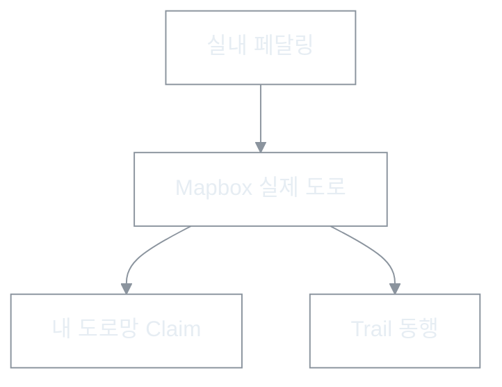
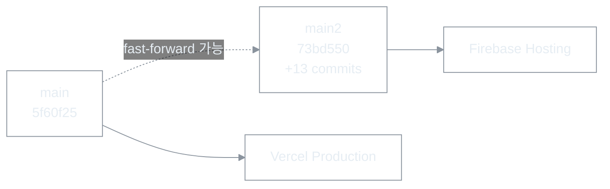

# RTW 개발 중간 점검 보고서

| 항목 | 내용 |
|------|------|
| 문서 유형 | **기록(record)** — 2026-09-22 시점 제품 개요·진전·분기·리스크 스냅샷 |
| 최초 작성 | 2026-09-22 |
| 상태 | **검토됨** — 코드·브랜치·배포 실측 기준(로컬 `main2` tip `73bd550`, `main` tip `5f60f25`) |
| 연결 문서 | [상태보드](../260707-RTW-기능-인벤토리-상태보드.md) · [마스터 비전](../260511-RTW-마스터-비전-및-종합계획.md) · [Ontology](../260714-RTW-Ontology.md) · [결정 로그](../260707-RTW-결정-로그.md) · [1차 마일스톤](../260509-BOXCYCLE-현재단계-범위-스택-및-1차마일스톤.md) · [라이더 교체 완료 보고](../260922-RTW-라이더-신구모델-교체-완료보고.md) |

> **이 문서의 역할:** 중간 점검용 한 장. 세부 메커닉·체크리스트의 SoT가 아니다. 상태 기호·수치의 권위는 [상태보드](../260707-RTW-기능-인벤토리-상태보드.md)·각 도메인 SoT에 둔다.

---

## 0. 한 장 요약

**RTW(Ride The World)** 는 실내 자전거로 **실제 지구 도로**를 달리고, 달린 도로가 **영구 자산(내 도로망)** 으로 쌓이는 웹앱이다. 판매 문장: **Ride = Claim**. 코드·리포·Firebase projectId는 `boxcycle` 유지.

2026-05 본개발 선언 이후, **코어 루프(게스트 진입 → 경로 → 센서/체험 → 주행 → 정복 궤적 → 이어 달리기)** 는 동작하는 제품 형태까지 올라왔다. 2026-08~09에는 **폰 가로 HUD 다이어트·터치 계약**, **이어 달리기·다음 주행 카드**, **표고 API 쿼터 방어**, **라이더 3D(preserved DQS) 교체**가 집중 반영됐다.

점검 시점의 **운영 분기**가 가장 큰 실무 리스크다.

| 표면 | 브랜치·배포 | 라이더 | 표고 공유 저장소 |
|------|-------------|--------|------------------|
| [boxcycle.vercel.app](https://boxcycle.vercel.app/) (repo homepage) | Production ≈ `main` (`5f60f25`, 09-18) | **legacy(버전1)** `pedal-sprite` | 없음 |
| [boxcycle-dc2df.web.app](https://boxcycle-dc2df.web.app/) | Hosting 수동 배포 ≈ `main2` 계열 | **preserved(버전3)** | 있음 |
| 로컬 / `origin/main2` | tip `73bd550` | preserved | 있음 |

`main2`는 `main`을 조상으로 **+13 / −0**(fast-forward 가능). Vercel Production은 `main`만 따라가므로 homepage와 Firebase·로컬이 **다른 제품 스냅샷**을 보여 준다.

---

## 1. 제품 개요

### 1.1 무엇이 되는가

- **코어 판타지:** 달릴수록 지구 위 영토(도로망)가 영구히 늘어난다. Zwift류 그래픽·와트 전장은 회피하고, 벡터 지도의 **행성 규모·한계비용 ~0**을 해자로 삼는다. → [마스터 비전](../260511-RTW-마스터-비전-및-종합계획.md) · [Conquest](../260703-Conquest-정복-레이어-설계.md)
- **용어:** Room/Lobby ❌ → **Trail** / **Trailhead**. UI에 z20·셀 ❌ → **내 도로망**·**새 도로 +N km**. → [Ontology](../260714-RTW-Ontology.md)
- **타겟:** 케이던스 이상 센서 보유 캐주얼 실내 라이더가 코어. no-sensor(속도 슬라이더)는 체험 티어(정복 Trust 제한).

### 1.2 기술 골격

| 층 | 선택 |
|----|------|
| 클라이언트 | Vite · TypeScript · React (`apps/web`) |
| 지도 | Mapbox GL (스타일 3종, 주행 기본 Outdoors + 상공 카메라) |
| 백엔드 | Firebase Auth · Firestore · RTDB · Cloud Functions |
| 입력 | BLE CSC 케이던스 + 체험 속도 슬라이더(게이트) |
| 배포 | Firebase Hosting(`boxcycle-dc2df`) · Vercel(`boxcycle.vercel.app`, Production=`main`) |

1차 마일스톤(멀티 유저 인증·Trail 공유)의 코드 조건은 대체로 충족. PM 스테이징 데모 체크(E)는 문서상 미완 표시가 남아 있다. → [1차 마일스톤](../260509-BOXCYCLE-현재단계-범위-스택-및-1차마일스톤.md)

---

## 2. 영역별 진전 (중간 점검용)

상태 기호: ✅ 구현 · 🔶 부분 · 💭 구상 · ⚠️ 충돌/재검토 · ❌ 폐기. 상세 표는 [상태보드](../260707-RTW-기능-인벤토리-상태보드.md).

| 영역 | 성숙도 | 중간 점검 한 줄 |
|------|--------|----------------|
| **코어 라이딩·지도** | 높음 | Mapbox·상공 카메라·폰 가로 HUD·슬로우 램핑·BLE/체험 게이트·표고 오버레이 터치 통과·계기판 키라인 — **실사용 가능** |
| **Conquest(내 도로망)** | 높음 | 영구 궤적·3색 위계·라이브 칠하기·새 도로 km·줌아웃 LOD — **도시 커버리지%·구간 챌린지는 💭** |
| **Trail·동행** | 중간 | Trail 합류·동행 HUD 진실(4D) ✅. peer 싱크는 🔶(발행 수명주기는 진전, 읽기 증폭·heartbeat 등 잔여) |
| **경제·티어** | 중간~높음 | quota·Stripe·마일리지·이어 달리기 ✅. Route Token은 🔶⚠️(quota와 이중 체계, §4-1 정리 과제) |
| **경로·자동 Route** | 높음 | 거리·방향 자동 Route(3F-C-R1) main2 반영. 표고는 **경로당 1회** 공유 저장소로 쿼터 구조 변경(`main2`) |
| **성장 루프** | 낮음 | 입문 3경로 ✅. 온보딩 연출·미션·일일 챌린지는 💭 |
| **표현(라이더)** | 전환점 | **버전3 preserved** 코드·자산 완료(`main2`·Firebase). Vercel/`main`은 여전히 버전1 legacy |
| **콘텐츠 퍼블릭** | 중간 | 자동 심사·즉시 등록 ✅. 최소 거리 등 **출시 전 완화값** 잔존 |

### 2.1 2026-08~09에 실제로 밀린 축

1. **폰 가로 우선 UI** — MENU/Dock/계기판/결과 시트/터치 44px·표고 면 통과. 「스크롤 강요 금지」「공간을 아껴 써라」가 결정 로그에 반복.
2. **이어 달리기·다음 주행** — 실제 종료 anchor, 진행률 단조 보존, idle 복귀 후 카드, 결과 시트 4줄 압축.
3. **센서·Go 게이트** — 전역 SENSOR 칩·준비 상태 없이는 Go 잠금. CYCPLUS 실물 다수 PASS, 단절 시나리오 일부 미확인.
4. **표고 쿼터** — e2e가 실 Open-Meteo를 태우던 구조 차단 + Firestore `routeElevations` write-once(`main2`).
5. **라이더 교체** — 절차적 lowpoly(버전2/`glb`) 경로를 유지한 채, Blender 형상보존 모델(버전3/`preserved` + Custom Layer·DQS)을 기본값으로 승격. → [완료 보고](../260922-RTW-라이더-신구모델-교체-완료보고.md)

### 2.2 라이더 버전 대응 (혼동 방지)

| 호칭 | 모드 | 자산 | 어디에 있나 |
|------|------|------|-------------|
| 버전1 | `legacy` | `pedal-sprite.png` 2D | Vercel Production / `main` 기본 |
| 버전2 | `glb` | `rider-lowpoly.glb` | 자산은 양쪽에 존재, 기본값은 아님 |
| 버전3 | `preserved` | `…/20260921-041426-cd81398e/rider.glb` | `main2` · Firebase Hosting |

코칭 문구의 **R3**는 라이더 버전이 아니라 코칭 등급 라벨이다.

---

## 3. 브랜치·배포 분기 (점검 핵심)

**`main2`에만 있는 13커밋 묶음**

| 묶음 | 내용 |
|------|------|
| 표고 | Open-Meteo 스텁·429 분리·경로당 1회 `routeElevations` |
| 라이더 | shape-preserving harness → preserved promote → 완료 보고·Blender 스크립트 |
| 기타 | Modelling/map-relay 문서, ride-verify 증빙 |

파일 규모: **101 files, +8838 / −61** (`origin/main...origin/main2`). 충돌 없이 `main` ← `main2` FF 병합 가능.

**실측(2026-09-22):** Vercel 번들은 `preserved` 미포함·모드 폴백 `legacy`. Firebase 번들은 `preserved` 인라인·후보 ID 존재·신형 GLB 해시 일치.

---

## 4. 열린 과제·리스크 (우선순위 감각)

| 우선 | 항목 | 왜 지금인가 |
|------|------|-------------|
| P0 | **배포 표면 통일** — `main`←`main2` 또는 Vercel Production 브랜치 정리 | homepage가 버전1을 보여 「교체 실패」로 오인됨 |
| P0 | **출시 전 완화값 복원** — 고정속도 상한 50, 퍼블릭 최소 거리 100m 등 | [출시 전 확인사항](../출시%20전%20확인사항.md) |
| P1 | peer 싱크 잔여(S4-2·heartbeat 등) | 동행 체감의 미완 |
| P1 | Route Token ↔ quota 이중 체계(§4-1) | 경제 SoT 정리 |
| P2 | 온보딩·일일 챌린지·도시 커버리지 | 성장 루프·정복 분모 |
| P2 | 위성지도 노출 방침·3D 측면 가림 | 맵 정책 미결 |
| 관찰 | Node20 런타임 만료 경고, hybrid DB 💭 | 인프라 시계 |

---

## 5. 중간 점검 판정

| 질문 | 판정 |
|------|------|
| 「달리고 도로가 쌓이는」코어가 동작하는가 | **예** — Guest·입문·센서/체험·Claim·이어 달리기까지 닫힘 |
| 폰 가로 실사용에 가까운가 | **대체로 예** — 08~09 UI 집중 반영. 표고 시각 잠식·일부 터치 폭은 잔여 |
| 제품이 한 갈래로 보이는가 | **아니오** — `main`/Vercel vs `main2`/Firebase 분기 |
| 다음 스프린트의 병목 | 기능 발명보다 **브랜치·배포 정렬 + 출시 완화 복원 + peer/경제 잔여** |

---

## 6. 읽는 순서 (이 보고 다음)

1. [상태보드](../260707-RTW-기능-인벤토리-상태보드.md) — 기능별 ✅🔶💭  
2. [결정 로그](../260707-RTW-결정-로그.md) — 최근 「왜」  
3. [라이더 교체 완료 보고](../260922-RTW-라이더-신구모델-교체-완료보고.md) — 버전3 재교체 시  
4. [UI/UX 인수인계](../260917-UI-UX-개선-작업-인수인계.md) — 화면 작업 재개 시  

---

## 개정

| 날짜 | 내용 |
|------|------|
| 2026-09-22 | 최초 작성 — 개요·영역 진전·main/main2·Vercel/Firebase 분기·P0~P2 |
