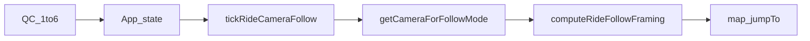

# 카메라 미세조정 HUD 방법

| 항목 | 내용 |
|------|------|
| 문서 유형 | **기록** — 주행 QC 1–6 카메라 튜닝용 임시 HUD 접근 방법(구현 전) |
| 최초 작성 | 2026-10-02 |
| 상태 | **코드 반영 중** — camlab 유지 · QC2·QC3 제품 튜닝 반영(2026-10-02) · 확정 후 camlab 제거 예정 |
| 독자 | chief · AI |
| 출처 | Cursor Plan `카메라 튜닝 HUD` (`~/.cursor/plans/`, `isProject: false`) — IDE View Plan이 워크스페이스 밖 파일을 열지 못해 `document/archive/` 로 옮김 |
| 연결 문서 | [UI 공간밀도](../260924-RTW-UI-공간밀도-원칙.md) D8 · [rideCameraFollow](../../apps/web/src/components/map/rideCameraFollow.ts) · [mapGlobeView](../../apps/web/src/lib/map/mapGlobeView.ts) · [rideCameraFraming](../../apps/web/src/lib/camera/rideCameraFraming.ts) |

---

## 이해 확인

목표: 주행 중 QC 1–6 고정 시점이 어색하니, **임시 HUD로 라이더 기준 위치·각도를 미세 조정** → 수치를 확보 → **현재 고정값을 그 수치로 교체**.

## 중요: 현재 카메라는 XYZ 리그가 아니다

화면의 1–6은 자유 카메라 pose가 아니라 **FollowMode + 거리(m) + pitch + bearing**으로 Mapbox `jumpTo({center, bearing, pitch, zoom})`를 돌리는 밀착 팔로우다.

| UI | 실체 |
|----|------|
| 1 | routeFit → aerial 200/60/5m (pitch 0) 순환 |
| 2 | `forward` + ~6m + pitch≈80 |
| 3 | `backward` |
| 4 | `left` |
| 5 | `right` |
| 6 | `forward` + 북향 고정(`lockBaseHeading=0`) |

핵심 경로:

- 모드·pitch·거리: [`rideCameraFollow.ts`](../../apps/web/src/components/map/rideCameraFollow.ts), [`mapGlobeView.ts`](../../apps/web/src/lib/map/mapGlobeView.ts)
- 지면 offset·zoom: [`rideCameraFraming.ts`](../../apps/web/src/lib/camera/rideCameraFraming.ts)
- QC UI: [`MapHud.tsx`](../../apps/web/src/components/maphud/MapHud.tsx) → [`App.tsx`](../../apps/web/src/App.tsx)

**수직 Z(m)는 팔로우 write 경로에 1급 파라미터가 없다.** “높이감”은 pitch + zoom(거리 프레이밍)으로만 나온다. 순수 XYZ+Roll 리그를 새로 만들면 기존 QC·스무딩·줌 역산과 충돌한다.

## 권장 방법 (팔로우 파라미터 오버레이)

의도(앞뒤좌우·상하 각도)를 **현재 스키마에 매핑**하고, free-camera로 갈아타지 않는다.

| 사용자가 원하는 손잡이 | 실제 튜닝 축 | 반영 대상 |
|------------------------|--------------|-----------|
| 앞/뒤 거리 | `distanceM` | QC 2–5 하한·aerial 거리 |
| 좌/우 시점 | FollowMode(`left`/`right`) + bearing Δ | `getCameraForFollowMode` |
| 상/하 각도 | Mapbox `pitch` | `RIDE_CAMERA_PITCH_CLOSE`(현재 80) |
| 좌/우 각도(yaw) | bearing 오프셋(°) | 모드별 bearing 식 |
| 화면 안 라이더 위치 | look-at along / screen anchor | `computeRideFollowFraming` |
| 높이(Z) | 별도 Z 슬라이더 없음 → pitch·거리로 대체 | 동일 |

### 1) 게이트·UI 패턴

기존 [`RiderLightLabPanel`](../../apps/web/src/components/riderLightLab/RiderLightLabPanel.tsx) / `?lightlab=1` 을 그대로 따른다.

- URL: `?camlab=1` (가칭)일 때만 마운트 — 일반 사용자 흔적 없음
- **기본 접힘**(공간밀도 D8: QC·텔레메트리·하단 프로필을 가리지 않음)
- 패널 위치: 우상단 QC 아래가 아니라 **라이더를 가리지 않는 여백**(좌측 중상 또는 접이식 칩)
- 슬라이더 조작은 `pointer` stopPropagation — 지도 드래그와 충돌 방지
- rAF마다 `URLSearchParams` 파싱 금지(이미 `?ridePitch=`가 모듈 로드 1회 캐시 패턴)

### 2) 런타임 주입 지점

`tickRideCameraFollow` 안에서 `getCameraForFollowMode` **직후** / `computeRideFollowFraming` **직전**에 오버라이드 ref를 읽는다.

- pitch, bearing(+Δ), `distanceM`, (필요 시) framing의 along/lateral look-at
- QC 1–6을 누르면 **그 모드의 현재 제품 기본값으로 슬라이더를 리셋**한 뒤, 그 위에서 미세조정
- 오버라이드는 “활성 QC 슬롯별”로 보관하면, 슬롯 전환 후에도 비교·확정이 쉽다

### 3) HUD에 넣을 최소 컨트롤

밀착(QC 2–5·6) 우선:

- 거리(m)
- pitch(°)
- bearing Δ(°)
- look-at along(m) — 라이더가 화면 어디쯤인지
- **Copy** — 활성 슬롯의 확정 수치를 한 줄 텍스트로 복사(LightLab의 code paste와 동일 역할)
- Reset — 해당 QC 기본값으로 복귀

Aerial(QC 1)은 pitch=0 고정 유지 + 거리만 튜닝하면 충분하다.

### 4) 수치 획득 → 고정값 반영 절차

1. `?camlab=1`로 진입, 주행 시작, QC n 선택
2. 슬라이더로 구도 확정 → Copy
3. 복사값을 아래 상수/분기에 반영 (제품 경로만, HUD는 제거 또는 게이트 유지)
   - pitch → `RIDE_CAMERA_PITCH_CLOSE` / `resolveRideCameraPitchClose`
   - 밀착 거리 → QC 핸들러의 `max(5, MIN)`·`rideCameraDistanceM` 초기값
   - aerial 거리 → `camera1Mode` 순환 값
   - bearing/모드 식 → `getCameraForFollowMode`
   - look-at → `rideCameraFraming` 상수
4. HUD 없이 동일 구도가 재현되는지 QC 1–6만으로 회귀 확인
5. 임시 HUD·오버라이드 경로가 제품 빌드에 남지 않게 정리(또는 `?camlab=1`만 남김)

### 5) 하지 말 것

- 매 프레임 `setFreeCameraOptions`로 QC를 대체 (기존 framing·스무딩과 이중 제어)
- lil-gui/dat.gui 신규 도입 (레포는 커스텀 React + URL 게이트)
- “XYZ + Roll”을 제품 스키마로 승격한 뒤 나중에 다시 jumpTo로 환산 (이중 SoT)
- 임시 패널을 펼친 채로 QC·맵 컨트롤을 가리기

## 성공 기준

- camlab 없이 기존 동작 동일
- camlab에서 QC별로 거리·pitch·bearing·look-at을 실시간 반영
- Copy 한 줄이 상수 반영에 바로 쓸 수 있는 단위(°, m)로 나옴
- 상수 반영 후 HUD 없이도 동일 구도 재현

## 왜 IDE View Plan이 안 열렸나

Cursor `CreatePlan`은 워크스페이스가 아니라 **사용자 홈의** `~/.cursor/plans/*.plan.md`에 쓰고, 이 플랜은 `isProject: false`였다.  
채팅의 **View Plan**은 그 내부 경로를 연다. 경로·한글 파일명·프로젝트 밖 저장 때문에 에디터에 안 뜨는 경우가 있다.  
이 문서는 그 내용을 저장소 [`document/archive/261002-카메라-미세조정-HUD-방법.md`](261002-카메라-미세조정-HUD-방법.md)로 옮겨 둔 것이다.

## 제품 bake (2026-10-02)

SoT: [`apps/web/src/lib/camera/quickCameraProductTune.ts`](../../apps/web/src/lib/camera/quickCameraProductTune.ts)

| QC | distanceM | pitchDeg | bearingOffsetDeg | lookAtAlongExtraM | screenAnchor |
|----|-----------|----------|------------------|-------------------|--------------|
| 2 | 6 | 83.5 | 7.5 | -0.8 | 0.63 |
| 3 | 7 | 83.5 | -6.5 | -0.4 | 0.60 |
| 1·4·5·6 | (표 없음 → 기존 Follow 기본) | | | | |

적용 순서: `getCameraForFollowMode` → **제품 QC 튜닝** → `?camlab=1` 오버라이드(있으면 최우선).

## camlab 임시 코드 관리 (브랜치·워크트리 아님)

**별도 브랜치/워크트리를 쓰지 않았다.** 같은 트리에 두고 URL 게이트로 격리한다.

| 수단 | 역할 |
|------|------|
| `?camlab=1` | 쿼리 없으면 패널·오버라이드 미적용(일반 사용자 흔적 없음) |
| `lib/debug/rideCameraLab.ts` + `components/rideCameraLab/` | 임시 HUD — 확정 후 **삭제** |
| `lib/camera/quickCameraProductTune.ts` | **남는** 제품 값 SoT |
| localStorage `rtw:rideCameraLab:v1` | 슬롯별 작업 중 기억 — 제거 시 키도 버림 |

제거 체크리스트(전 QC bake 완료 후):

1. `RideCameraLabPanel` 마운트·폴더 삭제
2. `rideCameraLab.ts` 삭제 · `dep-layers.json` 한 줄 제거
3. `tickRideCameraFollow` 의 `getRideCameraLabOverride` / snapLab 분기 제거(제품 튜닝만 유지)
4. 이 archive 문서에 「camlab 제거 완료」 한 줄 append
