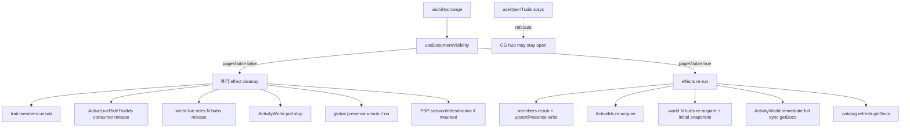

# Result 01 — foreground 복귀 Firestore read spike 원인 감사

| 항목 | 내용 |
|---|---|
| 상태 | DONE (read-only) |
| 지시 | [01-task-root-cause-audit.md](01-task-root-cause-audit.md) |
| 날짜 | 2026-10-03 |
| Owner | Cursor CLI Developer |
| 제약 | 제품 코드·테스트·설정·Git 변경 없음. commit/push/deploy 없음 |

---

## 결론 요약

가장 가능성 높은 원인 (코드로 확정 가능한 것과 가설을 분리):

| # | 원인 | 확신도 | 근거 종류 |
|---|---|---|---|
| 1 | **앱이 `visibilitychange` → `pageVisible=false` 때 discovery/UI 리스너·폴링을 의도적으로 해제하고, 복귀 시 재구독·즉시 full poll을 다시 연다.** 초기 snapshot + N×getDoc 배치가 화면 수 × 전환 횟수로 곱해진다. | **높음 (코드 확정)** | `useDocumentVisibility` → `pageVisible` 의존 effect 다수 |
| 2 | **Trailhead idle에서 world multi-Trail `livePublicationRides` 허브 N개 + Activity World adaptive poll(즉시 tick) + published catalog refresh가 복귀마다 다시 돈다.** Console «리스너 최대 41 / 연결 최대 8»은 4화면 × 클라이언트당 ~10개 전후와 정성적으로 맞는다. | **중~높음 (정적 모델)** | 라이브 billed 귀속은 미측정 |
| 3 | **유지 리스너에 대한 Firebase SDK WebChannel 재연결 시 초기 결과 재전달** (앱 unsubscribe 없이도 발생 가능). `useOpenTrails` listing/CG는 hide 중에도 앱이 유지한다. | **중간 (SDK 가설)** | 앱 코드에 reconnect 핸들러 없음; 계측 전 billed 확정 불가 |

**하지 말 것:** Console 1.2만 reads를 특정 한 줄의 billed 합으로 승격하지 말 것. 구현은 Supervisor 최소 지시 후에만.

이전 묶음([20260929-public-trail-traffic](../20260929-public-trail-traffic/10-result-listener-scope.md))과의 차이: 그때는 **주행 중** listing/CG/world overlay를 끄는 게이트였다. 이번 현상은 **idle Trailhead에서 그 discovery 리스너가 켜진 채** foreground 전환만으로 `pageVisible` 게이트가 open/close를 반복하는 축이다.

---

## Git / working tree (읽기만)

| 항목 | 사실 |
|---|---|
| 브랜치 | `main2` @ `ae498b7` (`origin/main2` ahead 6) |
| 작업 트리 | `document/ops/PROGRESS.md`, `document/ops/README.md` 수정 / `document/ops/20261003-focus-read-spike/` untracked |
| 제품 소스 변경 | 본 감사에서 **없음** |

---

## 1. Trailhead idle — 리스너/조회 인벤토리

가정: Firebase 설정됨 · Guest/로그인 완료 · `trailId === default` · `rideStatus === idle` · 메뉴 닫힘 · 입문 허브/`activeOfficialCourseId` 없음 · `pageVisible === true`.

### 1-A. onSnapshot (실시간)

| # | 호출 지점 | hook / component | repo | 컬렉션·query | pageVisible 게이트 | hub |
|---|---|---|---|---|---|---|
| L1 | `subscribeOpenTrailListings` | `useOpenTrails` ← `App` (`resolveOpenTrailsListenerEnabled` = true) | `firestoreOpenTrailListings.ts` ~352 | `openTrailListings` orderBy `updatedAt` desc **limit 40** | **아니오** (enabled만) | 없음 |
| L2 | `subscribeTrailIdsWithActiveLiveRides` | `useOpenTrails` + `useActiveLiveRideTrailIds` ← overlays | `firestoreTrailLivePublicationRides.ts` ~244–262 | **CG** `livePublicationRides` where `lastSeenAt`>cutoff orderBy desc **limit 80** | OpenTrails: 아니오 / ActiveIds: **예** (`listenerScopePolicy` L38–47) | `activeLiveRideTrailIdsSubscriptionHub` refcount |
| L3 | `subscribeTrailMembers` | `useTrailSession` ← `App` | `firestoreTrail.ts` ~106–126 | `trails/{default}/members` | **예** (`useTrailSession.ts` L50) | 없음 |
| L4 | `onSnapshot(users/{uid})` | `useUserTier` ← `App` | hook 직접 | `users/{uid}` 문서 1 | 아니오 | 없음 (**L5와 중복**) |
| L5 | `subscribeRouteTokenBalance` | `useRouteTokenBalance` ← `App` | `firestoreRouteToken.ts` ~13 | `users/{uid}` 문서 1 | 아니오 | 없음 (**L4와 동일 문서 이중 구독**) |
| L6 | `subscribeRouteTokenGenerateCostBase` | `useRouteTokenGenerateCostBase` ← `App` | `firestoreRouteTokenEconomy.ts` ~33 | `config/routeTokenEconomy` | 아니오 | 없음 (지도 팝업 열릴 때만 `mountRouteTokenPopupFeedback`이 **추가** 구독 가능) |
| L7 | `subscribeConquestSummary` | `useConquest` ← `App` | `firestoreConquest.ts` ~28–47 | `conquest/{uid}` 문서 1 | 아니오 | 없음 |
| L8 | `acquireTrailLivePublicationRidesSubscription` × N | `useWorldLivePublicationRideMapOverlay` ← `useAppMapOverlays` | hub → `subscribeTrailLivePublicationRides` | `trails/{trailId}/livePublicationRides` (N = listing∪CG live trail ids, default 제외) | **예** (`resolveWorldLivePublicationRideOverlayEnabled` + `pageVisible`) | `livePublicationRidesSubscriptionHub` trailId당 1 |
| L9 | `subscribeGlobalLivePresence` | `useGlobalLivePresence` | `firestoreGlobalLivePresence.ts` ~60 | `livePresence` 컬렉션 | **예** — 단 **idle 기본 Trailhead에서는 보통 OFF** (`activeCourseIdForGlobalPresence` 없음, `App.tsx` ~1504–1508) | 없음 |
| L10 | `subscribePublicationSessionMembers` | `PublicationSharedPresence` | `firestorePublicationSessionPresence.ts` ~125 | `publicationSessions/{scope}/members` | **예** — 단 **sharedPresenceCourseId 있을 때만 마운트** | 없음 |
| L11 | hub live rides (PSP) | `PublicationSharedPresence` | 동일 hub as L8 | `trails/{tid}/livePublicationRides` | **예** — dedicated Trail + courseId 있을 때 | hub 공유 |

### 1-B. getDoc / getDocs (폴링·원샷, idle visible)

| # | 경로 | 트리거 | repo | 비고 |
|---|---|---|---|---|
| G1 | Activity World full sync | `useActivityWorldAdaptivePoll` — `enabled` 시 **즉시 1회** 후 idle 10분 / active 60초 | `useActivityWorldDataSync` → `fetchWorldPresenceSummary` (`appMeta/worldPresence` getDoc) · `fetchWorldActivityGlobal` · `fetchLiveRouteActivityIds` (getDocs liveNow) · `fetchRouteActivitiesBatch` (publicationId당 getDoc, 캐시 TTL=60s) | `worldMapActivityEnabled = configured && user && pageVisible` (`useAppMapOverlays.ts` L243) |
| G2 | published catalog | `App` effect: `pageVisible` true마다 `refreshPublishedPublicCourseCatalog` | `listPublishedPublicCourses` → publications getDocs(≤50) + uid 라벨 getDoc들 | `App.tsx` ~948–951 |
| G3 | OpenTrails enrich | CG에 있는데 listing에 없는 trail | `fetchTrailInstance` getDoc + `countTrailLiveRidersFresh` getDocs(limit 48) | hide 중 OpenTrails가 유지되면 복귀만으로 재실행되지 않음(새 CG 스냅샷 시) |
| G4 | Conquest cells/traces | `totalMeters` 변화 시 | `loadConquestCellIds` / `loadConquestTraces` getDocs | visibility와 무관 |
| G5 | Route geometry gap-fill | world live overlay aggregates | `fetchCourseRoutePayload` (세션 캐시) | 복귀 후 N trails 재구독 → 새 publication이면 getDoc |

### 1-C. RTDB (구분)

| 경로 | idle Trailhead |
|---|---|
| `acquireTrailMotionSubscription` / `rtdbMotionSubscriptionHub` | PSP가 dedicated Trail일 때만. **default Trailhead에서는 OFF** (`PublicationSharedPresence.tsx` ~264–273) |

### 1-D. 쓰기 (읽기 spike와 동시 관측 가능)

| 경로 | visibility 복귀 시 |
|---|---|
| `upsertTrailPresence` | `useTrailSession` visible 재진입마다 1회 + 30s heartbeat (`trailLivePolicy.ts` L12–13 주석: 탭 숨김 시 구독 해제로 백그라운드 쓰기 억제 **의도**) |
| `upsertPublicationSessionMember` / touch | PSP 마운트 시에만 |
| `scheduleOpenTrailListingRefresh` | listing 스냅샷 stale/createdAt 백필 시 getDoc·setDoc/updateDoc (클라이언트 listing 유지 중 SDK 재전달이어도 스케줄 가능) |

---

## 2. foreground 전환 이벤트 흐름

### 앱이 듣는 것

| 이벤트 | Firestore 구독 open/close와 연결? | 위치 |
|---|---|---|
| `visibilitychange` | **예** — `useDocumentVisibility`만. `document.visibilityState === "visible"` → `pageVisible` | `hooks/useDocumentVisibility.ts` L9–12 |
| `focus` / `blur` | **아니오** (맵 UI focus 등과 무관) | Firestore 경로 검색 0건 |
| `pageshow` / `pagehide` | **아니오** (BLE만) | `useBleCrankRpm.ts` |
| `online` / `offline` | **아니오** | 검색 0건 |
| `onAuthStateChanged` | 초기/로그인 시에만 구독 트리 구성. focus 복귀와 무관 | `useAppAuth.ts` L67–71 |
| React StrictMode | DEV 마운트 이중 effect만. visibility 루프와 무관 | `main.tsx` StrictMode |
| Firebase `enableNetwork`/`disableNetwork` | 앱 코드 **없음** | — |

### `pageVisible` false → true 때 앱이 하는 일 (코드 확정)

**앱 unsubscribe/resubscribe vs SDK 재연결 (분리)**

| 구분 | 내용 |
|---|---|
| **코드 확정** | `pageVisible` deps로 cleanup → 새 `onSnapshot` / 새 poll effect. world overlay·trail session·activity world·(조건부) global/PSP. |
| **코드 확정 — 유지** | `useOpenTrails` listing + CG consumer는 hide에도 유지 → ActiveIds가 빠져도 hub refcount>0이면 **underlying CG는 닫히지 않음**. |
| **SDK 가설** | 유지 리스너도 백그라운드 탭 스로틀로 연결이 끊기면 복귀 시 초기 query 결과를 다시 받을 수 있음. billed 배수·빈도는 **미계측**. |
| **비확정** | «비활성 앱 클릭»만으로 `visibilityState`가 안 바뀌는 OS/브라우저 조합이면 앱 게이트는 안 돌고 SDK만 해당할 수 있음 — 재현 시 `document.visibilityState` 로그 필요. |

---

## 3. hub / 중복 구독

| Hub | 적용 범위 | 빠지는 곳 |
|---|---|---|
| `livePublicationRidesSubscriptionHub` | spectator · world overlay · PSP — trailId당 underlying 1 | 직접 `subscribeTrailLivePublicationRides`를 hub 밖에서 쓰는 idle 경로 없음(제품) |
| `activeLiveRideTrailIdsSubscriptionHub` | OpenTrails + ActiveLiveRideTrailIds → CG 1 | hide 시 ActiveIds만 내려도 OpenTrails가 잡아 두면 CG 유지 |
| `rtdbMotionSubscriptionHub` | PSP motion | idle default Trail 해당 없음 |
| **없음** | `users/{uid}` | `useUserTier` + `useRouteTokenBalance` **이중 onSnapshot** |
| **없음** | `openTrailListings`, members, conquest, economy, global presence, publication session | 각 1 consumer 가정이나 문서 단위 dedup 없음 |
| **없음** | Activity World getDoc | poll은 단일 sync이나 visibility마다 effect 재시작으로 **즉시 tick 재실행** |

---

## 4. 4화면 예상 listener / read fanout 모델

기호: \(C=4\) 클라이언트, \(N\) = live trail id 집합 크기(default 제외), \(P\) = catalog publication id 수(입문 4 + published + openTrail pubs), \(V\) = hidden→visible 횟수/화면(관측 구간).

### 4-A. 정상 underlying listener (한 화면, idle Trailhead, visible, course 없음)

| 경로 | 개수 | 근거 |
|---|---|---|
| openTrailListings | 1 | `useOpenTrails` + limit 40 |
| CG livePublicationRides | 1 | hub |
| trails/default/members | 1 | `useTrailSession` |
| users/{uid} | **2** | tier + token |
| config/routeTokenEconomy | 1 | economy hook |
| conquest/{uid} | 1 | summary |
| trails/{id}/livePublicationRides | **N** | world overlay |
| **합계 (대략)** | **7 + N** | N=3 → 10, N=8 → 15 |

\(C \times (7+N)\): N=3 → **40**, N=4 → **44**. Console 스냅샷 리스너 최대 **41**과 같은 자리수. 활성 연결 최대 **8**은 클라이언트/탭·SDK 연결 상한과 병치 가능(직접 증명 아님).

이전 emulator 모델([14-result-emulator-listeners](../20260929-public-trail-traffic/14-result-emulator-listeners.md)): trailheadIdle에서 **계측된** `collectionGroup.open=1`, `trailOnSnapshot.open=0` — 그때는 world overlay meter가 없거나 빈 월드로 trail hubs=0일 수 있음. **현재 코드**는 idle에서도 world overlay가 N개 trail hub를 연다(`resolveWorldLivePublicationRideOverlayEnabled` + `!isRideSessionActive`).

### 4-B. 복귀 1회당 추가 read fanout (정적 상한 모델, billed 아님)

| 소스 | 앱 동작 | 대략 doc 상한/화면/복귀 |
|---|---|---|
| World N hubs 재구독 | unsub→sub, 초기 snapshot | ≤ Σ docs in those subcollections (라이더 수에 비례) |
| Activity World immediate tick | enabled false→true | 2 getDoc meta + liveIds getDocs(≤32) + ≤P routeActivity getDoc (캐시 miss 시) |
| Catalog refresh | pageVisible effect | publications ≤50 + label getDocs |
| members 재구독 | unsub→sub | members 문서 수 |
| users/economy/conquest | **앱은 안 닫음** | SDK 재전달 시만 (가설) |
| CG / listings | OpenTrails 유지 시 앱 재open 없음 | SDK 재전달 시만 (가설) |
| Presence write | upsertTrailPresence | write 1/화면/복귀 (+ later heartbeats) |

**스케치:** reads ≈ \(C \times V \times (R_{world}(N) + R_{poll}(P) + R_{catalog} + R_{members} + R_{sdk\_kept})\).
\(C=4\), \(V\)가 수십, \(P\)가 수십, \(N\)이 수~십이면 Console **~1.2만 reads / 60분** 자리수는 **가능**하나, **어느 항이 지배적인지는 계측 전 미확정**.

쓰기 302: 복귀당 presence upsert ×4 + (구간 내) 30s heartbeat + listing refresh/setDoc 후보. 주행 없이도 설명 가능. CF 연쇄는 listing refresh·presence 경로에 달림(본 감사는 functions 미추적).

---

## 5. 재현·계측 계획 (production 접속 없이 우선)

### 5-A. 순수 계약 테스트 (1차, 빠름)

1. **pageVisible 게이트 계약** — `listenerScopePolicy` / overlay wiring처럼 소스 계약:
   - `useTrailSession` effect deps에 `pageVisible`
   - `resolveActiveLiveRideTrailIdsListenerEnabled` / world overlay에 `pageVisible`
   - `useOpenTrails` enabled에 `pageVisible` **없음**
   - `App` catalog refresh가 `pageVisible`에 묶임
2. **허브 refcount 단위 테스트** (기존 hub test 패턴 확장):
   - consumer A(OpenTrails) 유지 + B(ActiveIds) release → underlying CG closeTotal 증가 **0**
   - world overlay N acquire/release → `trailOnSnapshot` open/close +N

기존: `scripts/ride-hierarchy/listener-scope-gate-contract.test.ts`, hub debug API, `trackUnderlyingReadSubscription`.

### 5-B. Emulator + DEV meter 시나리오 (2차, 필수)

이미 있는 도구:

- `window.__rtwReadSubs` / `__rtwReadSubsApi` (`installReadSubscriptionDebug.ts`)
- `snapshotUnderlyingReadSubscriptions()` open/close totals
- E2E 선례: `test:e2e:listener-scope` (주행 게이트용) → **visibility 시나리오 신설**

제안 시나리오 `hidden→visible × N` (Playwright `page.hide()` / CDP `Page.setWebLifecycleState` 또는 `document.visibilityState` mock이 불가하면 확장 스크립트로 `useDocumentVisibility`에 test seam — **구현은 후속 지시**):

| 스텝 | 기록 |
|---|---|
| trailhead idle settle | `underlying.*.open`, hub slotCount, ActiveIds refCount |
| hide | open deltas: world trailOnSnapshot close +N, members close, ActiveIds consumer−1, **CG open 유지?** |
| show | open +N, ActivityWorld tick proxy(getDoc counters — 기존 `hudCompanionDiag` / routeActivity access meters 확장), catalog call count |
| repeat N=10 | open/close/delivery totals ≈ linear in N? |

계수 목표: **subscribe/open/close/delivery** (billed 대체 proxy). Emulator rules/데이터에 라이더 N개 seed.

### 5-C. 금지 / 후순위

- production Console만으로 코드 귀속
- 계측 없이 world overlay를 끄거나 presence 게이트를 제거하는 넓은 패치

---

## 6. 저감 후보 (위험도·예상 효과)

| 우선 | 후보 | 예상 효과 | 위험 | 비고 |
|---|---|---|---|---|
| A | **hide 시 world multi-Trail overlay·Activity World poll·catalog refresh는 끄되, 복귀 시 debounce/캐시 hit로 즉시 full fanout 완화** (예: 짧은 grace, TTL 내 skip catalog) | 복귀 read 큰 폭 ↓ | 복귀 직후 월드 펄스/목록 수 초 stale | discovery — 백그라운드 해제 **가능** |
| B | **hide 중에도 world/CG를 유지** (pageVisible 게이트 제거) — SDK 재전달만 남김 | 앱 재구독 fanout ↓, 백그라운드 리스너 비용 ↑ | 모바일 백그라운드 배터리·읽기; 이전 «백그라운드 쓰기 억제»와 충돌 가능 | tradeoff — 측정 후 선택 |
| C | **`users/{uid}` tier+token 단일 구독 hub** | 리스너 −1/클라이언트 (상시) | 낮음 | spike과 독립, 작은 승리 |
| D | Trail presence: hide 시 unsub 유지하되 **복귀 upsert를 throttle** / members 스냅샷만 지연 | write ↓, 복귀 members read는 남음 | Trail MENU 접속자 잠깐 빔 | 세션 — **유지 필요**에 가깝지만 write 완화 가능 |
| E | OpenTrails에도 pageVisible 게이트 | hide 시 listing+CG 완전 해제 → 복귀 재구독 비용 **증가** 가능 | 복귀 목록 빈 깜빡임 | **성급히 넣지 말 것** — CG를 오히려 더 자주 열 수 있음 |
| F | live trail N 상한 / viewport 기반 구독 | N↓ | 먼 Trail 활동 누락 | 제품 의미 — Chief/Supervisor |

**백그라운드 해제해도 되는 것 (후보):** world livePublicationRides overlay, Activity World poll, published catalog refresh, (조건부) global livePresence, ActiveLiveRideTrailIds **추가** consumer.

**유지해야 하는 것:** 주행 중 current-Trail peer hub / RTDB motion / (제품 결정에 따라) 본인 presence·session. Idle에서 members를 hide에 끊는 현재 동작은 write 절감 의도(`trailLivePolicy` 주석) — 읽기 spike과 tradeoff.

**금지해야 할 성급한 수정**

- Console 숫자를 맞추려 Rules/데이터 모델/Public Trail 동기화 의미 변경
- hub 없는 전면 `enableNetwork`/`disableNetwork` 토글
- OpenTrails에 pageVisible을 맹목적으로 추가 (E)
- billed 귀속 없이 N trail hub를 제거해 동행 발견 UX를 깨기

---

## 7. 확인한 명령과 사실 / 미확인

### 확인한 명령

| 명령 | 결과 |
|---|---|
| `git status` / `git branch -vv` / `git log -5` | `main2` ahead 6; ops 문서만 dirty/untracked |
| ripgrep: `onSnapshot`/`getDoc`/`getDocs`, `pageVisible`, hubs, visibility/focus/online | 위 표로 정리 |
| 문서 대조: `10-result-listener-scope`, `14-result-emulator-listeners`, `27-result-remaining-traffic-audit` | 주행 게이트 vs 이번 focus 축 차이 확인 |

### 실행하지 않은 것 (의도)

- Emulator / Playwright / production Firebase
- 제품 코드·테스트 수정
- commit / push / deploy

### 미확인 (계측 필요)

1. 실제 관측 구간 \(V\), \(N\), \(P\), 탭이 모두 Guest Trailhead idle이었는지(입문 허브 잔류 여부).
2. hide 시 CG underlying이 정말 유지되는지 (refcount 런타임 스냅샷).
3. SDK 재연결이 유지 리스너에 주는 billed 배수.
4. listing refresh가 write 302에 기여한 비율.
5. «앱 클릭 활성화»가 항상 `visibilitychange`인지.

---

## 완료 조건 대비

| 조사 질문 | 상태 |
|---|---|
| 1 idle 경로 표 | 본문 §1 |
| 2 이벤트별 재구독 경로 | 본문 §2 |
| 3 앱 resub vs SDK | 본문 §2 표 |
| 4 hub/중복 | 본문 §3 |
| 5 4화면 모델 | 본문 §4 |
| 6 재현·계측 | 본문 §5 |
| 7 저감 후보 | 본문 §6 |

**다음 행동 (Developer 제안, Supervisor 지시 대기):** §5-A 계약 테스트 + §5-B visibility E2E meter를 최소 구현 범위로 두고, 측정 전 넓은 제품 패치는 하지 않는다.
